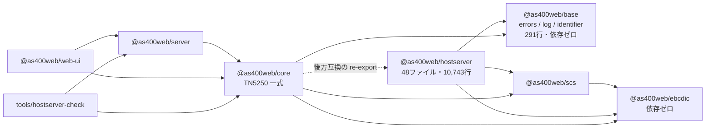

# 仕様: ホストサーバー層のパッケージ分割

`requirement.md` の未確定事項を実装可能な形まで落とす。

## 0. 分割前ベースライン（2026-08-01・`main` 相当の作業ブランチ先頭で実測）

受け入れ基準の比較対象。**変更前に測っておく**（後から測ると意味がない）。

### テスト

| package | test files | tests |
|---|---|---|
| `@as400web/ebcdic` | 8 | 83 |
| `@as400web/scs` | 1 | 13 |
| `@as400web/core` | 89 | 1,092 |
| `@as400web/server` | 59 | 801（うち **4 失敗**。下記） |
| `@as400web/web-ui` | 107 | 1,249 |
| `@as400web/gen-tables` | 1 | 10 |
| `@as400web/hostserver-check` | 0 | 0 |
| **合計** | **265** | **3,248** |

**既存の失敗 4 件は本作業と無関係の環境要因**——`packages/server/test/zip-writer.test.ts` の
「外部の unzip が受け付けること」4 件が `spawnSync unzip ENOENT` で落ちる（この devcontainer に
`unzip` コマンドが入っていない）。**分割前から落ちている**ので、本作業の合否判定では
「この 4 件以外がすべて通ること」を基準にする。捏造して緑にしない。

### ビルド成果物

- `npm run build`（`tsc -b`）: 成功
- web-ui 本番バンドル: `dist/assets/index-Yi-vsfnB.js` = **359,853 バイト**（gzip 122.91 kB）、
  `index-C3KFUBOA.css` = **89,097 バイト**、167 modules transformed

## 1. 方式の決定

### D-A. 共有基盤パッケージ `@as400web/base` を新設する

requirement の未確定事項「共有層 `errors.ts` / `log.ts` / `identifier.ts` の置き場所」に対する結論。
案 (a)（共有基盤パッケージ）を採る。**これは美観の話ではなく、複製すると機能が壊れるという機械的な制約**による。

1. **`log.ts` はモジュールスコープの可変状態を持つ**（`let factory: LoggerFactory`）。
   `setLogSink` はこの束縛を書き換える。**複製すると `packages/server` が起動時に呼ぶ
   `setLogSink` が片方にしか効かず、hostserver 側のログが黙って消える。**
   ロガーを注入式にした `20260719-core-debt-payoff` の成果を無に帰す形になる。
2. **`errors.ts` の `As400Error` は `instanceof` で判定される**。クラスが 2 つになると
   パッケージ境界を跨いだ `instanceof` が false になる。実際に `test/errors-compat.test.ts` が
   `SqlError`（hostserver 側）が `As400Error`（core 側）の `instanceof` を通ることを検査しており、
   **分割後はこれがそのままパッケージ跨ぎの単一インスタンス検査になる**。

複製が使えない以上、選択肢は「core に残す」か「共有パッケージを作る」かの 2 つ。
前者は hostserver → core の依存を生み**切り出しの目的そのものを損なう**ため退ける。

- **名前**: `@as400web/base`
- **中身**: `errors.ts`(182) / `log.ts`(76) / `identifier.ts`(33) ＝ 291 行、`index.ts` を追加
- **依存**: なし（外部ランタイム依存ゼロ）
- **`tsconfig.json` の `types` は `[]` にする**。3 ファイルとも `node:*` に触れないので、
  Node の型を入れなければ Node API は**そもそも書けない**（`@as400web/scs` と同じ手で、
  lint より手前・型検査の段階で塞ぐ）
- `identifier.ts` を base に入れる理由: `errors.ts` に依存し、hostserver（`ddm/column-meta.ts`）と
  web-ui（`browser.ts` 経由）の**両方**が使う。定義上まさに共有語彙である

### D-B. パッケージ名は `@as400web/hostserver`

ディレクトリ名・既存の `tools/hostserver-check` と一致し、リポジトリ内の呼び名を変えずに済む。
`@as400web/ibmi-client` 等の別案は**公開時の商品名の話**であり、publish を対象外にした本作業で
先に決める理由がない（decisions.md D5）。

### D-C. 入口は単一（`.` のみ）

`@as400web/scs` と同じく `exports` は `.` だけにする。`./db` / `./ifs` のようなサブパス分割は、
**外から要求している利用者が現時点で 0 件**であり、必要になってから足せる（`exports` への追加は
後方互換を壊さない）。`@as400web/ebcdic` がサブパスを持つのは「表を引き込まない入口が要る」という
実測された理由があったため（`20260726-ccsid-table-bundling`）で、hostserver に同種の事情はない。

### D-D. 後方互換は `@as400web/core` からの re-export で保つ

`packages/server` の 37 ファイル・`packages/web-ui` の 22 ファイル・`tools/hostserver-check` を
**1 行も変えない**ことを本作業の成功条件にする。そのため `@as400web/core` は
`@as400web/hostserver` に依存し、既存の export 面をそのまま提供し続ける。

- **`export *` は使わない。** 公開面は列挙する（`codec.ts` ファサードの JSDoc にある方針をそのまま踏襲。
  `As400Error` 改名時に一括置換で旧名が外へ出なくなった事故の再発防止）
- `src/index.ts` の hostserver 由来 35 行は、参照先を相対パスから `@as400web/hostserver` に
  差し替えるだけで**列挙の中身は変えない**
- `src/browser.ts` の hostserver 由来 3 箇所は **`export type` のまま**にする
  （型は消えるのでブラウザのバンドルに `node:net` / `node:tls` は入らない）

**引き換えに認めること**: `@as400web/core` を import する側は、従来どおりホストサーバー一式も
引き取ることになる（＝「TN5250 だけ欲しい」は本作業では改善しない）。改善されるのは
**「ホストサーバーだけ欲しい」側**で、backlog 項目 3 が求めていたのはこちら。
`packages/server` を `@as400web/hostserver` 直参照へ移す作業は follow-up とする（decisions.md D6）。

## 2. 分割後の依存グラフ

点線が本作業で新設する依存。**逆向き（`hostserver → core`）の辺は 1 本も引かない**——
これが「切り出せた」ことの機械的な定義であり、受け入れ基準で検査する。

## 3. 移動するファイル

### 3.1 `packages/base/`（新設）

| 移動元 | 移動先 |
|---|---|
| `packages/core/src/errors.ts` | `packages/base/src/errors.ts` |
| `packages/core/src/log.ts` | `packages/base/src/log.ts` |
| `packages/core/src/identifier.ts` | `packages/base/src/identifier.ts` |
| （新規） | `packages/base/src/index.ts`（3 モジュールを列挙 re-export） |
| （新規） | `packages/base/package.json` / `tsconfig.json` / `vitest.config.ts` |

`packages/core/test/errors-compat.test.ts` は **core に残す**（core の re-export 面と、
パッケージ跨ぎの `instanceof` を検査する役目に変わるため）。

### 3.2 `packages/hostserver/`（新設）

| 移動元 | 移動先 | 規模 |
|---|---|---|
| `packages/core/src/hostserver/**`（46 ファイル） | `packages/hostserver/src/**`（同じ木構造） | 10,290 行 |
| `packages/core/src/transport/host-connection.ts` | `packages/hostserver/src/transport/host-connection.ts` | 316 行 |
| `packages/core/src/transport/ddm-transport.ts` | `packages/hostserver/src/transport/ddm-transport.ts` | 137 行 |
| （新規） | `packages/hostserver/src/index.ts` | — |
| `packages/core/test/` の 43 ファイル | `packages/hostserver/test/` | — |

**移設対象テスト 43 本の import は素性が良い**（実測）。`vitest` 以外に外へ張っているのは
`../src/errors.js`(22) / `node:net`(3) / `../src/codec/codec.js`(3) / `@as400web/ebcdic`(1) だけで、
`test/helpers/fake-transport.ts` や `test/fixtures/*.jsonl` は**1 本も使っていない**。
付け替えは機械的:

- `../src/errors.js` → `@as400web/base`
- `../src/codec/codec.js` → `@as400web/ebcdic/codec`（core のファサードを経由しない）
- `../src/hostserver/X.js` → `../src/X.js`
- `../src/transport/host-connection.js` → `../src/transport/host-connection.js`（相対位置は不変）

### 3.3 移動しないもの

- `packages/core/src/sql/split-statements.ts`（hostserver から参照 0 件。decisions.md D2）
- `packages/core/src/transport/tcp.ts` / `types.ts`（TN5250 側専用）
- `packages/core/src/codec/codec.ts`（`@as400web/core/codec` 互換ファサード。現状維持）
- `packages/core/test/codec-reexport.test.ts` / `errors-compat.test.ts`（core の re-export 面の番人）

## 4. `packages/core` 側の書き換え

| ファイル | 変更 |
|---|---|
| `src/index.ts` | hostserver 由来 35 行の参照先を `@as400web/hostserver` へ。`errors`/`log`/`identifier` 由来を `@as400web/base` へ。**列挙の中身は変えない** |
| `src/browser.ts` | `identifier` 由来 → `@as400web/base`。hostserver 由来 3 箇所 → `@as400web/hostserver`（`export type` を維持） |
| `src/transport/`（残る 2 ファイル） | `../errors.js` → `@as400web/base` |
| `src/protocol/` `src/screen/` `src/session/` `src/csv-parse.ts` | `./errors.js` → `@as400web/base`（11 ファイル） |
| `package.json` | `dependencies` に `@as400web/base` と `@as400web/hostserver` を追加 |
| `tsconfig.json` | `references` に `../base` と `../hostserver` を追加 |

## 5. ビルド構成

- root `tsconfig.json` の `references` に `packages/base` と `packages/hostserver` を追加する。
  **順序は `base` → `ebcdic` → `scs` → `hostserver` → `core` → `server`**
- root `package.json` の `workspaces` は `packages/*` のグロブなので**変更不要**
- 各新パッケージの `package.json` は `@as400web/scs` の形に揃える
  （`type: module` / `exports` / `files: ["dist"]` / `build: tsc -b` / `test: vitest run --passWithNoTests`）

## 6. 新設するガードテスト

分割の不変条件を、散文ではなくテストで固定する（codec 分割時に `codec-reexport.test.ts` を
置いたのと同じ方針）。

| テスト | 置き場所 | 検査すること |
|---|---|---|
| `hostserver-reexport.test.ts` | `packages/core/test/` | `@as400web/core` の hostserver 由来 export が**実行時に到達可能**（列挙漏れの検出） |
| `no-core-dependency.test.ts` | `packages/hostserver/test/` | `packages/hostserver/src` 全体を走査し `@as400web/core` の import が **0 件**。**列挙ではなく走査**にする（新しいファイルが素通りしないため） |
| `errors-compat.test.ts`（既存を拡張） | `packages/core/test/` | `SqlError`（hostserver）が `As400Error`（base）の `instanceof` を通る＝**単一インスタンスの実証** |
| `log-sink-single-instance.test.ts` | `packages/core/test/` | `setLogSink` を 1 度呼ぶと **hostserver 側の `childLog` にも効く**＝D-A の根拠を実行時に固定 |

## 7. 受け入れ基準

requirement の完了条件を、検証コマンド付きに具体化したもの。

- [ ] `packages/core/src/hostserver/` と `packages/core/src/transport/host-connection.ts` /
      `ddm-transport.ts` が存在しない
      → `test ! -e packages/core/src/hostserver`
- [ ] `packages/hostserver/package.json` の `dependencies` が
      `@as400web/base` / `@as400web/ebcdic` / `@as400web/scs` の 3 つだけ
- [ ] `packages/base/package.json` に `dependencies` が無い
- [ ] `packages/hostserver/src` から `@as400web/core` への import が 0 件
      → `no-core-dependency.test.ts`
- [ ] `packages/hostserver/src` から `protocol` / `screen` / `session` / `telnet` / `trace` への
      参照が 0 件 → 同テストで併せて走査
- [ ] `npm run build` が成功する
- [ ] `npm test` が **265 test files / 3,248 tests** 以上で、失敗は
      **`zip-writer.test.ts` の 4 件（`unzip` 未インストール）のみ**
- [ ] `npm run lint` が成功する
- [ ] `packages/server/src`・`packages/web-ui/src`・`tools/hostserver-check/src` の
      **git diff が空**（後方互換の実証）→ `git diff --stat -- packages/server/src packages/web-ui packages/hostserver-check`
- [ ] web-ui 本番バンドルの JS が **359,853 バイト以下**
- [ ] web-ui 本番バンドルに `node:net` / `node:tls` が現れない
      → `grep -c 'node:net\|node:tls' packages/web-ui/dist/assets/index-*.js` が 0
- [ ] `tools/hostserver-check` がビルドできる

## 8. 残る未確定事項（plan で判定）

- **1 PR に収めるか、subtask に割るか**（protocol「2.8」）。
  `@as400web/base` の切り出しと `@as400web/hostserver` の切り出しは**順序依存の 2 段**であり、
  前者だけでも単体で成立する（core 内の全レイヤが恩恵を受ける）。
  plan 工程で `01-base` / `02-hostserver` の 2 subtask に割るかを判定する。
