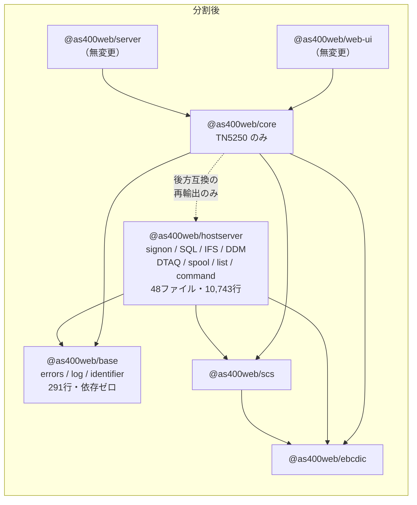
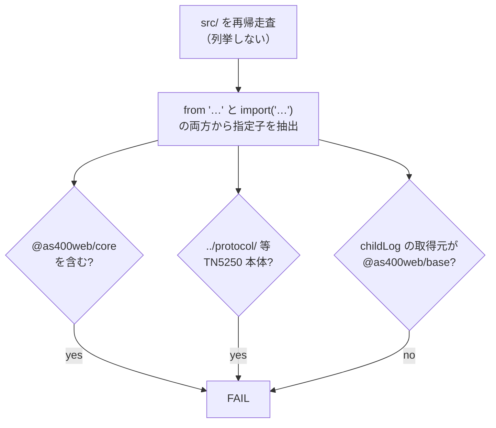

# レビューガイド: ホストサーバー層のパッケージ分割

**126 ファイルの差分だが、読むべきは 11 ファイル。** 残りはすべて機械的な移動と
import パスの付け替えである。

| 種別 | 件数 | 読み方 |
|---|---|---|
| **A**（新規） | 11 | ★**ここを読む** |
| **R**（移動） | 93 | 中身は不変。`git log --follow` が繋がる |
| **M**（変更） | 22 | ほぼ import 指定子の 1 行置換 |

## 1. 何をしたか

`.aidev/backlog/library-extraction.md` の切り出し候補 **3. ホストサーバー**。
`packages/core` から 2 つのパッケージを切り出した。

**点線が今回の肝**。`core → hostserver` は既存利用者を壊さないためだけに在り、
**逆向きは禁止**（テストで固定）。これにより「IBM i に SQL を投げたいが 5250 の画面
エミュレーションは要らない」利用者が、`@as400web/hostserver` を直接取れるようになった。

## 2. 読むべき 11 ファイル

### 2.1 判断の中心 —— なぜ `@as400web/base` を作ったのか

**`packages/base/src/index.ts`**（新規）と **`packages/base/tsconfig.json`**（新規）。

`errors.ts` / `log.ts` / `identifier.ts` は core と hostserver の両方が使う。
選択肢は「core に残す（＝ hostserver が core に依存）」「両方に複製する」「共有パッケージ」の 3 つで、
**複製は成立しない**——これが設計判断の核心であり、美観の話ではない。

| ファイル | 複製すると起きること |
|---|---|
| `log.ts` | モジュールスコープの `let factory` を `setLogSink` が書き換える。実体が 2 つだと注入が片方にしか効かず、**もう片方のログが黙って消える** |
| `errors.ts` | `As400Error` は `instanceof` で判定される。クラスが 2 つだと**パッケージ跨ぎの判定が false** になり、`catch` している利用側が壊れる |

どちらも**型検査でもビルドでも捕まらない**。実際に確かめてある——`log.ts` を複製した状態で
`tsc -b` は通り、実行時テストだけが落ちた（`test.md`「4.」）。

`tsconfig.json` の `types: []` は、Node の型を入れなければ Node API は**そもそも書けない**
という型レベルの防壁（`@as400web/scs` と同じ手）。

### 2.2 新パッケージの公開面

**`packages/hostserver/src/index.ts`**（新規・163 行）。
分割前に core の `index.ts` が出していた 35 行の列挙をそのまま引き継いでいる。
`export *` は使わない——公開面が目視できなくなると、`As400Error` 改名時に旧名が外へ出なく
なった事故（`errors-compat.test.ts` の由来）と同じ轍を踏む。

**`packages/hostserver/package.json`** / **`tsconfig.json`**（新規）。
`dependencies` は base / ebcdic / scs の 3 つだけ。`types: ["node"]` が要るのは
`src/transport/` が `node:net` / `node:tls` を使うためで、残りは eslint 側で塞いでいる。

### 2.3 不変条件を固定する 3 本（★ここが本体）

散文の約束ではなくテストで固定した。**3 本とも、わざと壊して落ちることを確認済み**。

**`packages/hostserver/test/no-core-dependency.test.ts`**（新規・5 テスト）

**列挙ではなく走査**にしてある——「このファイルを検査する」と書くと、後から足された
ファイルが素通りする。`import(…)` も拾うのは、実際にこの作業で
`await import("…")` を一括置換から取りこぼした経験による（decisions.md D10）。

**`packages/core/test/hostserver-reexport.test.ts`**（新規・6 テスト）

再輸出の列挙を 1 つ落としても、**core 内部は何も壊れず型検査もビルドも通る**。
壊れるのは外の利用者だけ。だから 2 段構えにした:

1. `index.ts` から export 名を**読み取って**到達可能性を確かめる（指定子の壊れを検出）
2. `@as400web/hostserver` **自身の公開面**と突き合わせる（**行ごと削除**を検出）

1 だけでは足りない——検査対象を `index.ts` から取っているので、行を消せば検査対象からも
消えて緑のままになる。実際に `listJobs` の行を消して 2 が落ちることを確認した。

**`packages/core/test/log-sink-single-instance.test.ts`**（新規・2 テスト）

`setLogSink` が hostserver 側の `childLog` に届くことを、**実際にログが出る経路**で確かめる。
`insertRows` の部分失敗（応答を差し替えれば接続なしで再現できる）が `log.warn` を通る。
引数でロガーを受け取る関数を選ぶと差し込み口の検査にならないので、
**hostserver のモジュールが自前の `childLog` で出している**経路であることが要件。

## 3. 機械的な部分（流し読みでよい）

- **93 個の R**: `git mv` による移動。`hostserver/**` 46 ファイル、
  `transport/host-connection.ts` / `ddm-transport.ts`、テスト 41 本、
  `errors.ts` / `log.ts` / `identifier.ts`、`socket-error-hint.test.ts`。中身は変えていない
- **22 個の M**: ほぼ import 指定子の置換。`../../errors.js` → `@as400web/base`、
  `./hostserver/db/query.js` → `@as400web/hostserver` など
- 例外的に中身を読む価値がある M:
  - **`eslint.config.js`** — ピュアロジック層ガードの glob。移設で**保護が黙って消える**
    ところだった（設定ファイル自身のコメントが警告していた失敗様式）。
    `files` に base / hostserver を追加し、`ignores` を新レイアウトへ
  - **`AGENTS.md`** — 5 パッケージの表に書き換え。依存の向きと「base に置くのは複製すると
    壊れるものだけ」という判断基準を明記
  - **`packages/core/src/index.ts`** — 113 行目のコメントが
    「第1段階として signon の認証のみ。SQL・データ転送は未実装」のままだった（実態と正反対）

## 4. 検証のポイント

| 見るところ | 値 |
|---|---|
| `packages/server` / `packages/web-ui` / `tools` の差分 | **0**（利用側 59 ファイルを 1 行も変えていない） |
| web-ui 本番バンドル | **359,853 バイト**（前後で完全一致）。`node:net` / `node:tls` は 0 件 |
| テスト | **3,248 → 3,263 件**（+15 はすべて新設ガード）。1 件も減っていない |
| 既知の失敗 | `zip-writer.test.ts` の 4 件のみ。**分割前から**落ちている（`unzip` 未インストール） |

`packages/core/dist/browser.js` に `hostserver` の文字列が **0 件**であることも確認済み
——`export type` が完全に消え、ブラウザ入口が汚染されていない。

## 5. あえてやらなかったこと

- **`packages/server` の 37 ファイルを直参照へ移す**。後方互換の再輸出を残す以上
  `core → hostserver` の辺は残り、`@as400web/core` の利用者はホストサーバーも引き取り続ける。
  改善されるのは「ホストサーバーだけ欲しい」側で、backlog 項目 3 が求めていたのはこちら。
  直参照化は follow-up として backlog に起票する（decisions.md D6）
- **npm publish**。項目 1・2 と同じく「公開の判断を後回しにできる状態」までがゴール
- **`sql/split-statements.ts` の移動**。名前は紛らわしいが hostserver からの参照は 0 件で、
  実体は web-ui 向けの SQL 文字列ユーティリティ（decisions.md D2）
- **`CoreLogger` の改名**。公開 API の破壊で requirement の対象外
