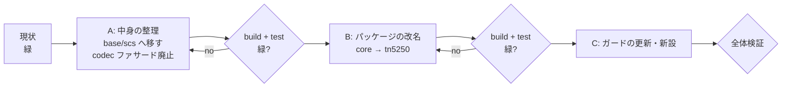

# 計画: `@as400web/core` → `@as400web/tn5250`

## 1. split 判定

**subtask には割らない。** 190 ファイルだが大半は `@as400web/core` → `@as400web/tn5250` の
単純置換で、性質は機械的。

## 2. 段の切り方 —— 今回は途中で緑にできる

`20260801-library-extraction-drop-core-reexport` は「利用側を移す」と「再輸出を消す」の間で
一度も緑にならなかった。今回は **中身の整理と改名が独立**なので刻める。

**A を先にやる理由**: 改名で 190 ファイルが動いたあとに中身を整理すると、
どちらの変更で壊れたのか切り分けられなくなる。**移動を先に済ませて緑にしてから、
名前だけを一括で変える。**

## 3. タスク

| 段 | 内容 | 終了条件 |
|---|---|---|
| T1 | `csv-parse` / `split-statements` / `east-asian-width` を base へ | `tsc -b` 緑 |
| T2 | `spool-html` を scs へ | `tsc -b` 緑 |
| T3 | tn5250 内の整理（`util/emitter` → `session/`、`html/` を畳む）＋ codec ファサード廃止 | `tsc -b` 緑 |
| T4 | **A の検証**（build / test / bundle） | ベースラインと一致 |
| T5 | `packages/core` → `packages/tn5250` の改名（`git mv` ＋ 190 ファイルの置換） | `tsc -b` 緑 |
| T6 | ガードの更新と新設（依存の向きの走査） | わざと壊して落ちることを確認 |
| T7 | 全体検証 | 受け入れ基準すべて |

## 4. 手作業にしない部分・する部分

- **機械的にやる**: `@as400web/core` → `@as400web/tn5250` の置換（190 ファイル）。
  ただし**宛先が変わる名前**（`parseCsv` / `splitSqlStatements` / `isFullWidth` /
  `renderSpoolHtml` / `codecForCcsid`）は分類走査で振り分ける
- **必ず走査で裏を取る**: 過去 3 回、`grep` ベースの確認で**3 回とも取りこぼした**
  （動的 import / 複数行 import / `vi.spyOn` の対象）。
  **Node で書いた走査を一次情報にする**（`grep` の結果を報告に使わない）

## 5. リスクと対処

| リスク | 兆候 | 対処 |
|---|---|---|
| **root の `tsc -b` が web-ui を見ていない** | root 緑のまま web-ui が落ちる | 各段で `npm run build -w @as400web/web-ui` も回す（前作業で踏んだ。AGENTS.md に記載済み） |
| 置換が文字列・コメント・README を巻き込む | 意味は壊れないが差分が汚れる | 置換後に `@as400web/core` の残存を走査し、意図的に残す箇所（履歴の記述）だけかを確認 |
| **未追跡の `scripts/*.mjs` 6 本**が壊れる | 利用者が次に走らせたとき失敗 | コミットはしないが**作業ディレクトリでは直す**。報告で明示する |
| `vi.mock` / 動的 import の対象が置換から漏れる | テストが「モックしたつもりで実物が動く」 | 走査を `from "…"` と `import("…")` の**両方**に掛ける（前作業の教訓） |
| base が物置になる | 次に何かを足すとき基準が無い | AGENTS.md に**2 つの基準**と歯止めを明記する（decisions.md D2） |

## 6. 対象外の確認

publish・別リポジトリ化・`protocol ⇄ screen` の分割・公開 API の設計変更・振る舞いの変更。
