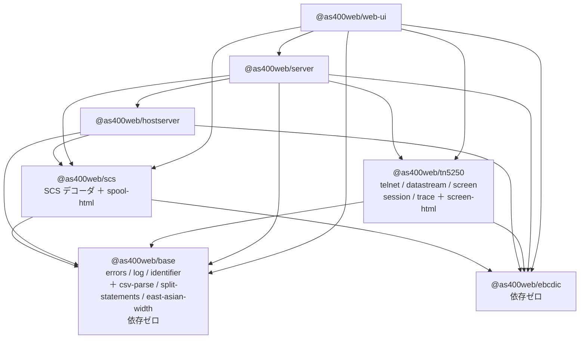

# 仕様: `@as400web/core` → `@as400web/tn5250`

## 0. 着手前ベースライン（2026-08-01 実測）

| package | files / tests |
|---|---|
| base | 1 / 8 |
| ebcdic | 8 / 83 |
| scs | 1 / 13 |
| hostserver | 42 / 643 |
| **core** | **49 / 457** |
| server | 60 / 805（4 skipped） |
| web-ui | 107 / 1,249 |
| gen-tables | 1 / 10 |
| **合計** | **269 / 3,268** |

web-ui 本番バンドル JS **359,853 バイト** / CSS 89,097 バイト。

## 1. 分割後のパッケージ構成



**`tn5250` の依存は base と ebcdic の 2 つだけ**になる（現在は base / ebcdic / scs）。
`scs` は `spool-html` が `east-asian-width` を使うので base への辺が増える。

## 2. ファイルの移動

### 2.1 `packages/core` → `packages/tn5250`（`git mv`）

ディレクトリごと移す。中身のうち下記だけが他所へ出る。

### 2.2 `@as400web/base` へ

| 移動元 | 移動先 | 行 |
|---|---|---|
| `core/src/csv-parse.ts` | `base/src/csv-parse.ts` | 128 |
| `core/src/sql/split-statements.ts` | `base/src/split-statements.ts` | 158 |
| `core/src/text/east-asian-width.ts` | `base/src/east-asian-width.ts` | 109 |
| `core/test/csv-parse.test.ts` ほか該当テスト | `base/test/` | — |

`base/src/index.ts` に列挙で追加（`export *` は使わない）。
`sql/` と `text/` のディレクトリは**平坦化する**（base は小さいので階層を作らない）。

### 2.3 `@as400web/scs` へ

| 移動元 | 移動先 | 行 |
|---|---|---|
| `core/src/html/spool-html.ts` | `scs/src/spool-html.ts` | 217 |
| 該当テスト | `scs/test/` | — |

`scs/package.json` の `dependencies` に `@as400web/base` を追加。
**`types: []` は保つ**（`document.*` は生成する HTML 文字列の中身であって TS のコードではない）。

### 2.4 tn5250 内での移動

| 移動元 | 移動先 | 理由 |
|---|---|---|
| `src/util/emitter.ts` | `src/session/emitter.ts` | `session` 専用（利用は 2 箇所） |
| `src/html/screen-html.ts` | `src/screen-html.ts` | `html/` に 1 ファイルだけ残るのでディレクトリを畳む |

### 2.5 削除

- `core/src/codec/codec.ts`（34 行）——`@as400web/core/codec` 互換ファサード。
  利用者 `packages/server/src/host-dtaq.ts` を `@as400web/ebcdic/codec` 直参照へ（decisions.md D3）

## 3. 入口（`exports`）の変更

| 変更前 | 変更後 |
|---|---|
| `@as400web/core` | `@as400web/tn5250` |
| `@as400web/core/browser` | `@as400web/tn5250/browser` |
| `@as400web/core/codec` | **廃止** |

## 4. 利用側の書き換え（追跡 190 ファイル）

| 場所 | ファイル |
|---|---|
| `packages/web-ui/test` | 56 |
| `scripts`（追跡分） | 46 |
| `packages/server/src` | 20 |
| `packages/server/test` | 19 |
| `packages/web-ui/src`（全階層） | 21 |
| その他（tools / 各 package.json / tsconfig / AGENTS.md ほか） | 28 |

**大半は `@as400web/core` → `@as400web/tn5250` の単純置換**。ただし
`parseCsv` / `splitSqlStatements` / `isFullWidth` / `renderSpoolHtml` / `codecForCcsid` を
取っているファイルは**宛先が変わる**ので、3b で使った分類走査と同じやり方で機械的に振り分ける。

## 5. ガードの更新

| テスト | 変更 |
|---|---|
| `core/test/codec-reexport.test.ts` | **`/codec` サブパスの検査を削除**（廃止するため）。ebcdic / scs の再輸出の検査は残す |
| `core/test/hostserver-not-reexported.test.ts` | パス（`packages/core` → `packages/tn5250`）と web-ui の検査を追随 |
| `server/test/import-from-owner.test.ts` | `@as400web/core` → `@as400web/tn5250`。**base の名前が増える**ので検査対象が自然に広がる |
| **新設** `tn5250/test/dependency-direction.test.ts` | **逆向きの辺が 0 本**であることを走査で固定（下記） |

### 5.1 新設ガード —— 依存の向きを一方通行に保つ

3 回の作業で「逆向きの辺を作らない」を積み上げてきたが、**検査は個別**だった
（`no-core-dependency` は hostserver→core だけ、`hostserver-not-reexported` は core→hostserver だけ）。
パッケージが 6 つになったので、**層の順序を 1 か所で宣言し、全パッケージを走査する**形にする。

```
base < ebcdic < scs < hostserver < tn5250
```

各 `src` を走査し、**自分より上位のパッケージを import していたら落とす**。
新しいパッケージが増えても、この表に足すだけで全組み合わせが検査される
（個別テストを 6×5 通り書く必要がない）。

## 6. 受け入れ基準

- [ ] `packages/core` が無く `packages/tn5250` がある。`name` が `@as400web/tn5250`
- [ ] 追跡ファイルの `@as400web/core` が **0 件**
- [ ] `packages/tn5250/src` に `csv-parse.ts` / `sql/` / `text/` / `codec/` / `html/spool-html.ts` が無い
- [ ] `@as400web/base` から `parseCsv` / `splitSqlStatements` / `isFullWidth` が取れる
- [ ] `@as400web/scs` から `renderSpoolHtml` が取れる
- [ ] `packages/base/package.json` に外部 `dependencies` が無い
- [ ] `packages/scs/tsconfig.json` の `types` が `[]`
- [ ] `packages/tn5250/package.json` の `dependencies` が **base / ebcdic の 2 つだけ**
- [ ] **逆向きの辺が 0 本**（新設ガードが検査）
- [ ] `npm run build` / `npm run build -w @as400web/web-ui` が成功
- [ ] `npm test` が **269 files / 3,268 tests 以上**、失敗 0
- [ ] `npx eslint packages tools` が成功
- [ ] web-ui 本番バンドル JS が **359,853 バイト以下**
- [ ] `tools/hostserver-check` と `tools/gen-tables` がビルドできる

## 7. plan で判定する

- subtask に割るか（190 ファイルだが大半は単純置換）
- **段の切り方**——今回は「移動」と「改名」が独立なので、
  `中身の整理 → 緑 → 改名 → 緑` と刻める見込み
