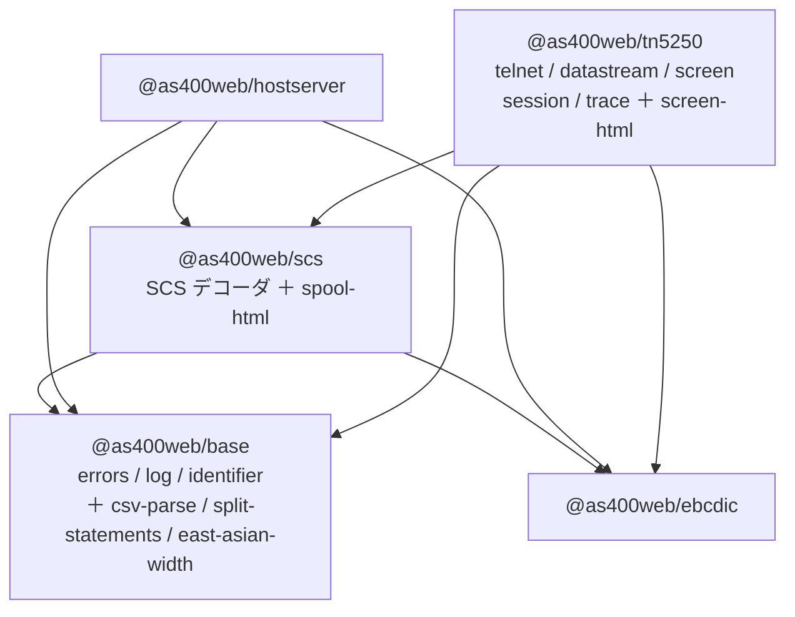

# レビューガイド: `@as400web/core` → `@as400web/tn5250`

**303 ファイルの差分だが、読むべきは 5 ファイル。** 内訳:

| 種別 | 件数 | 読み方 |
|---|---|---|
| **R**（移動） | 85 | `packages/core` → `packages/tn5250`。中身は不変 |
| **M**（変更） | 188 | 大半は `@as400web/core` → `@as400web/tn5250` の 1 語置換（190 ファイル / 223 箇所） |
| **A**（新規） | 30 | 移設したファイル＋新設ガード 1 本 |

backlog「ライブラリ切り出し」の**最後の項目**。これで 1〜4 が揃う。

## 1. なぜ改名なのか

項目 4 は前 3 回と性質が違う——「core から出す」のではなく **core そのもの**が対象。
6 ディレクトリだけ出すと、残った core が新パッケージに依存し返す（`html/` が `screen` に依存）。
**3b / 3c で消したばかりの形に逆戻り**する。

そして「core」という名前自体が問題の一部だった。**何が入っているのか名前が語らない**ので、
実際この袋には TN5250・ホストサーバー・EBCDIC・SCS・CSV 解析・SQL 文分割が同居していた。



`tn5250 → scs` は**プリンターセッションが SCS を復号する**ため（正当な辺）。
`hostserver` と `tn5250` は**同位**で互いに依存しない。

## 2. 読むべき 5 ファイル

### 2.1 ★ `packages/tn5250/test/dependency-direction.test.ts`（新設）

4 回の切り出しで「逆向きの辺を作らない」を積み上げてきたが、**検査は個別だった**——
`no-core-dependency` は hostserver→core だけ、`hostserver-not-reexported` は core→hostserver だけ。
パッケージが 5 つになると組み合わせは 15 通りあり、**書き忘れた辺が素通りする**。

**層の順序を 1 か所で宣言し、全パッケージを走査する。** 新しいパッケージが増えても
表に足すだけで全組み合わせが効く。宣言（`package.json`）と実際の import の一致も
**両方向**で検査する（「宣言だけ残る」と「宣言せず hoisting で動く」の両方を塞ぐ）。

> **このガードは 1 回目、効いていなかった。** 正規表現が `@as400web/[a-z-]+` で
> **数字を含まず**、`@as400web/tn5250` を `tn` として拾っていた。
> わざと逆向きの辺を作る検証をしていなければ、緑のまま残していた。

### 2.2 `packages/base/src/index.ts` —— base の役割を 2 基準で明文化

`east-asian-width` は **tn5250 の `screen/`（桁を数える）と scs の `spool-html`（描く）の
両方**が使うので、どちらにも置けない。base の基準を広げる必要があった:

1. **複製すると壊れるもの**（`As400Error` の `instanceof` / `log.ts` の可変状態）
2. **複数のパッケージが要るが、どれにも属さないもの**（今回追加した 3 本）

**物置にしないための歯止め**も書いた——「片方しか使わないものは、使う側に置く」。
これを書かないと、core が袋になったのと同じことが base で起きる。

### 2.3 `packages/scs/package.json` —— 狭い入口 `./spool-html`

**ここが今回いちばん危なかった。** `spool-html` を scs へ移し、web-ui が
`@as400web/scs`（**バレル**）から `renderSpoolHtml` を取るようにしたところ、

```
バンドル 359,853 → 1,458,480 バイト（約 4 倍）
```

バレル経由で `ScsDecoder` → `scs.ts` → `@as400web/ebcdic`（バレル）→ **変換表 5 つ**に
到達していた。`20260726-ccsid-table-bundling` が塞いだのと同じ失敗様式で、
AGENTS.md にも「バレル経由だと bundler の解析が及ばず要らない部分が残る」と書いてある。

`spool-html.ts` が `scs.ts` から取るのは `LogicalPage`（**型のみ**）なので実行時依存は無い。
**狭い入口を新設**して 359,857 バイトに戻した（`ebcdic` の `./codec` / `./katakana` /
`./catalog` と同じ手）。

### 2.4 `packages/tn5250/src/index.ts` / `browser.ts`

移した 5 モジュールの export を削除。**再輸出ファサードは作らない**（3b / 3c の方針）ので、
利用側は `@as400web/base` / `@as400web/scs` から直接取る。
`ScsDecoder` の再輸出も削除した——利用者が実測 0 件だった。

### 2.5 `AGENTS.md`

パッケージ表を 5 つに更新し、base の 2 基準・依存の向き・改名の理由を明記。
旧名 `core` が現在形で残っていた 5 箇所も直した
（**改名の目的が「名が体を表すこと」なのに、規約自身が旧名では意味がない**）。

## 3. 機械的な部分（流し読みでよい）

- `packages/core` → `packages/tn5250` の移動（rename 85 件）
- `@as400web/core` → `@as400web/tn5250` の置換（190 ファイル / 223 箇所）
- **フィルシステムのパス参照も直した**——`packages/server/test` と `packages/web-ui/test` が
  `join(here, "..", "..", "core", "test", "fixtures")` でフィクスチャを読んでおり、
  **パッケージ名の置換だけでは直らなかった**（42 件のテストが落ちて気づいた）
- `package-lock.json` は**再生成せずキーの改名だけ**にした——再生成すると
  `resolved` 374 行・`integrity` 373 行が消え、サプライチェーン検証が弱くなる（差分は +19/−18 に収まった）

## 4. 検証のポイント

| 見るところ | 値 |
|---|---|
| 追跡ファイルの `@as400web/core` | **0 件** |
| `tn5250` の `dependencies` | base / ebcdic / scs |
| 逆向きの辺 | **0 本**（15 通りを走査） |
| テスト | 3,268 → **3,269**（失敗 0） |
| web-ui バンドル | 359,853 → **359,857**（+4 バイト） |
| バンドル内の DBCS 表 | **0 件**（SBCS の 930/939 のみ＝従来どおり） |

**+4 バイトは基準（359,853 以下）を厳密には超える**が、表の再混入でないことを
modules 数（169→169）と表の直接検査で確認している。

## 5. あえてやらなかったこと

- **npm publish**（項目 1〜3 と同じく「公開の判断を後回しにできる状態」までがゴール）
- **`protocol ⇄ screen` の分割**（相互依存のため分割不可。backlog の記述どおり）
- **`@as400web/tn5250` の ebcdic 再輸出の撤去**（外部利用者はほぼ居ないが、スコープ外。follow-up）
- **未追跡の `scripts/*.mjs` 29 本のコミット**（作業ディレクトリでは改名に追随させたが、
  元から未追跡なのでコミットしない）
