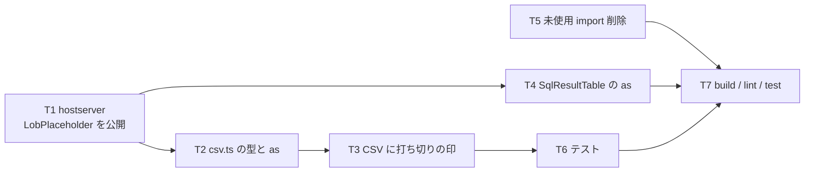

# 計画: LOB 表示まわりの follow-up 3 件

## subtask 分割の判定

**分割しない**。5 ファイル・数十行、1 PR に収まる。

## 実装方針

**型 → 消費側 → 振る舞い**の順。型を先に正すと `as` が要らなくなり、
`escapeField` の中で「`too-large` を扱っていない」ことが**分岐として見える**ようになる。
逆順（先に CSV の印を足す）だと、キャスト越しに書くことになり、
今回直そうとしている歪みを再生産する。

## 作業順序と依存関係

1. **T1** `LobPlaceholder` を hostserver の型 export に追加（依存: なし）
2. **T2** `csv.ts` の述語型と `as` 除去（依存: T1）
3. **T3** CSV に打ち切りの印（依存: T2）
4. **T4** `SqlResultTable.vue` の `as` 除去（依存: T1）
5. **T5** `SqlPane.vue` の未使用 import 削除（依存: なし）
6. **T6** `csv.test.ts` に打ち切りのテスト（依存: T3）
7. **T7** `npm run build` / `npm run lint` / `npm test`（依存: 全部）

## リスク / 留意点

- **画面の表示を変えてしまわない**。T4 は `as` を外すだけで、文言・分岐の順序は
  1 文字も変えない。PR #240 で入れた `sql-pane.test.ts` の 2 件と、
  既存の `not-requested` の 1 件が**そのまま通る**ことが実質の回帰網
- **`import type` を `dependencies` に昇格させない**。`package.json` は触らない
  （AGENTS.md: バンドルに `node:net` を引き込んだ前例がある）。
  型検査が通っても、`vue-tsc` / vite のビルドで実行時 import が混ざっていないかを見る
- **打ち切りの印で本文を捨てない**。`(LOB: 大きすぎます)` に置き換える誘惑があるが、
  CSV の目的は中身の持ち出し。取れた分は必ず残す
- **`escapeField` の再帰**。印を付けた文字列を渡すので、
  本文に `,` や `"` があっても正しく囲まれること（T6 で固定する）

## テスト方針

- `csv.test.ts`: `too-large`＋中身 → `中身…（以降省略）`。
  **本文がクォートを要する場合**（`,` を含む）に、印まで含めて 1 つのフィールドとして
  囲まれること。既存 5 件（取得済み / エスケープ / `not-requested` / `failed` / 空欄にしない）が通ること
- `sql-pane.test.ts`: 既存 3 件が**無変更で通る**ことをもって「画面を変えていない」を担保
- `npm run lint`: 未使用 import の削除を機械的に確認
- `npm run build`（`tsc -b`）: 型を実体に寄せたことで**新たな型エラーが出ないこと**
  ——ここが D1 の実質的な検証（食い違いが残っていれば落ちる）
- 実機は使わない（型と表示の変更のみ）
