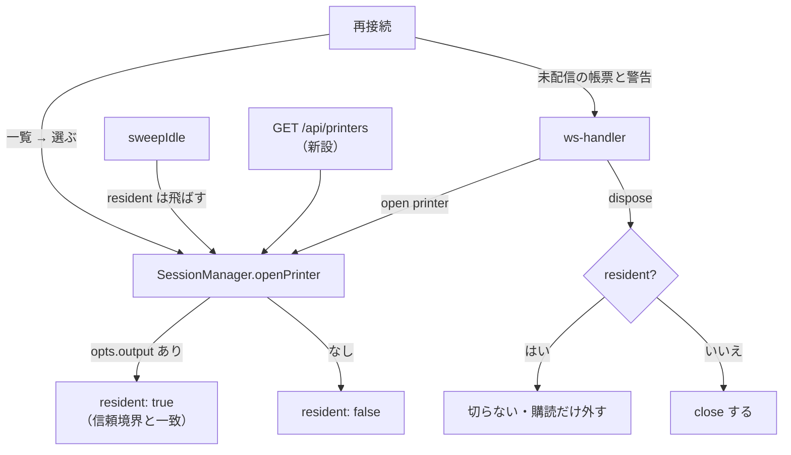

# 設計: プリンターの常駐

requirement の未確定 3 件（置き場・通知・上限）をここで決める。

## D1. 常駐は `SessionManager` に印を付ける（`WatchRegistry` へは移さない）

### 決定

`PrinterEntry` に **`resident: boolean`** を持たせ、`SessionManager` の中で
「WS 切断で切らない・アイドル掃除で消さない」を実現する。`WatchRegistry` は触らない。

### 理由

**プリンターは「寿命だけが違うセッション」であって、別種のジョブではない。**

`WatchRegistry` が `SessionManager` から分かれたのは、監視が

- 何も来ない状態が正常（アイドルの概念が合わない）
- **装置名も画面も持たない**

からだった（`watch-registry.ts` 冒頭）。プリンターは**逆**——

- 装置名を持ち、ホストから見て 5250 の装置である
- `PrinterSession`（tn5250）の接続で、`Session5250` と同じ層にいる
- 帳票の受信・救出（`startRescue`）・出力（PDF/印刷）という**セッション固有の機構**を持つ

これを `WatchRegistry` に移すと、`DtaqConnection` 前提の実装に
**プリンター専用の分岐を全面的に生やす**ことになる（F3）。
「寿命の異なるものを同じ箱に入れない」原則は守れるが、
**「役割の異なるものを同じ箱に入れる」新しい違反**を作る。

### 採らなかった案

- **`WatchRegistry` に `kind: "printer"` を足す**（backlog の示唆）。
  受け皿は名前だけで、実装は dtaq 密着（F3）。移すコストが大きく、
  得られるのは「常駐は 1 か所」という見た目の統一だけ
- **第 3 のレジストリを作る**。箱が増えるだけで、寿命の規則は
  `SessionManager` 側にも書かざるを得ない

### 代わりに守ること

「寿命の規則に例外を生やさない」ためには、**例外を条件分岐ではなく型で持つ**。
`resident` は `openPrinter` の入口で **`opts.output` の有無から自動で決まる**
（F2 のとおり信頼境界と重なる）ので、呼び出し側が指定するフラグにはしない。

## D2. 通知の置き場は「一覧 API ＋ 再接続時の配り直し ＋ ログ」の 3 層

### 決定

新しい通知基盤は作らない。**既にあるものを届く場所に出す**。

| 層 | 誰が見るか | 実装 |
|---|---|---|
| **サーバーのログ**（`warn`） | 運用者 | **既にある**（`session-manager.ts:685`）。変えない |
| **一覧 API** | 運用者・利用者（ブラウザ不要） | **新設**。常駐プリンターと直近の警告・出力結果を返す |
| **再接続時の配り直し** | 利用者 | **土台はある**（`reports` / `delivered` / `outputWarnings`）。開き直したときに載せる |

### 理由

backlog の懸念は「**ブラウザが居ないと誰も見ない**」。
だが F4 のとおりログには出ている——足りないのは

1. **ブラウザを開かずに確かめる手段**（＝一覧 API）
2. **開いたときに気づく形**（＝再接続時に警告が載る）

外部通知（メール等）は**この製品の他の機能が一つも持っていない**ので、
ここだけ作ると運用の前提が増える。**まず見える場所に出す**のが順序。

### 一覧 API の形

`GET /api/printers` — 常駐中を含むプリンターの一覧。
**信頼境界**: `outputWarnings` は出力設定（＝サーバー設定由来）に紐づく情報なので、
`assertOwner` / `listForUser` と同じ規則で絞る（他人の常駐は見せない）。

## D3. 上限は「常駐を別枠にする」

### 決定

`maxSessions` の判定から**常駐プリンターを除く**。常駐には
**別の上限 `maxResidentPrinters`（既定 4）** を設ける。

### 理由

上限 8 は「**同時に人が使う席**」の数として決まっている。常駐は人が座っていないので、
同じ枠を食うと「帳票を待たせておくと画面が開けない」という**説明しにくい失敗**になる。

別枠にすると、常駐が増えても表示セッションは常に 8 枠使える。
**常駐にも上限を置く**のは、無制限に張らせない（`WatchRegistry` の `maxWatches` と同じ考え）ため。

## 変更の見取り図

## 段階

1. **常駐そのもの**（`resident` / dispose / sweep / 上限）——ここまでで
   「ブラウザを閉じても帳票が届く」が成立する
2. **見える化**（一覧 API・再接続時の配り直し）——前提条件の解消
3. **実機での通し確認**

1 が入らないと 2 に意味が無いので、この順で進める。
