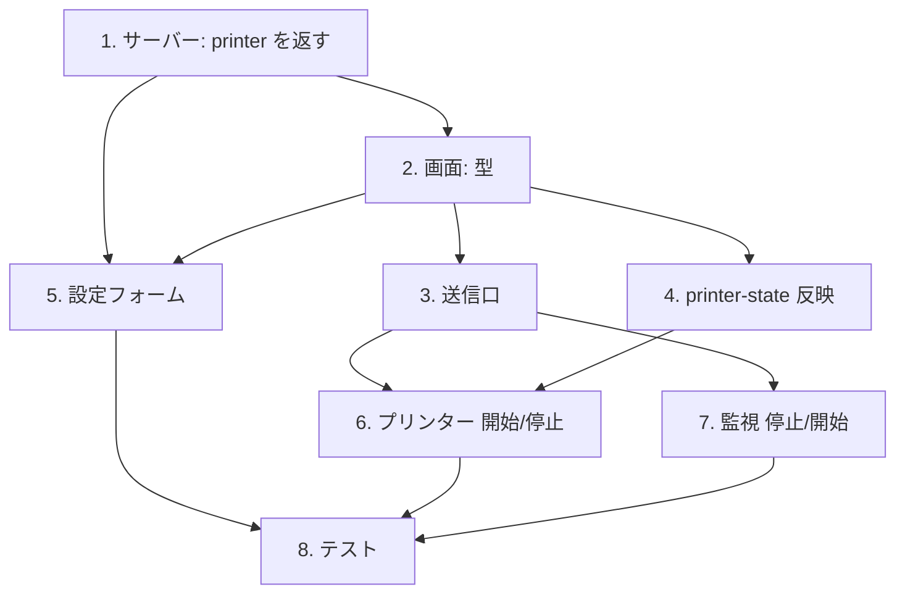

# 計画: サービスの操作を画面から行う

## 実装方針

**下から積む。** 型 → ストア → 送信口 → 画面の順に固め、各段でビルドを通す。
画面から先に書くと、型が無いところに `as any` を挟みたくなる。

**printer 設定の往復を最初に直す。** ✅ を足す前に直さないと、
「✅ を入れて保存したら PDF 保存先が消えた」を自分で作り込むことになる。

## 作業順序と依存関係

1. **サーバー: printer を編集者に返す**（依存: なし）
   `PublicSession.printer?` ＋ `publicSession` の `includeTrusted` 分岐。
   ここだけでテストが書ける（「編集者には返る / 非編集者には返らない」）。
2. **画面: 型**（依存: 1）
   `SessionConfigForm.autoStart` / `printer.service`、`SessionState.state` / `serviceError`。
3. **画面: 送信口**（依存: 2）
   `startPrinter` / `stopPrinter`（`session-controller`）、`watchesStore.resume`。
4. **画面: `printer-state` の反映**（依存: 2）
   `printer-opened` で `state` を持ち、`printer-state` で更新する。
5. **設定フォーム**（依存: 1, 2）
   `loadPrinter`、✅ 2 つ、保存時の送り返し、詳細（ⓘ）行。
6. **プリンターの開始/停止**（依存: 3, 4）
7. **監視の停止/開始**（依存: 3）
8. **テスト**（依存: 1〜7）

## リスク / 留意点

- **`vue-tsc` を忘れない。** `tsc -b` は SFC のテンプレートを型検査しない。
  `npm run build` に含まれているか確認し、含まれていなければ別に走らせる。
- **信頼設定を広げすぎない。** `printer` を返すのは `includeTrusted`＝`canEditServer` だけ。
  定義の一覧（`host-printers.ts`）は `includeTrusted` を渡していないので影響しない——**確認する**。
- **既存の printer 保存経路を壊さない。** `canEditPrinter` が false のときは `form.printer` を
  送らない、という現在の挙動を保つ（非編集者が保存しても信頼設定に触れない）。
- **`Object.keys(p).length > 0` の条件**。`service: false` だけになったとき、
  ブロックごと落とすか `false` を書くかで意味が変わる。**落とす**（既定＝サービスでない）。

## テスト方針

- **サーバー**（vitest）: `publicSession` が `includeTrusted` の有無で `printer` を出し分ける。
  `GET /api/sessions-config` が編集権限に応じて返す/返さない。
- **画面**: このリポジトリの web-ui はコンポーネントテストを持たない。
  型（`vue-tsc`）とビルドで担保し、**振る舞いは手で確認**して `test-result.md` に残す。
- **実機**: サーバー側の開始/停止は #254 で実機確認済み。ここは画面の配線なので重ねて測らない。
