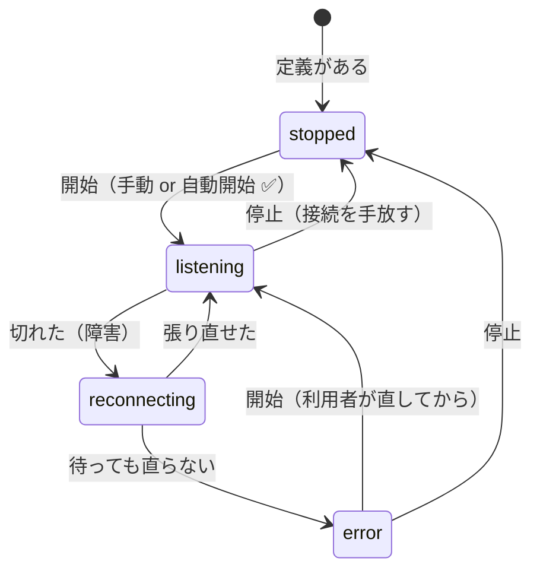

# 設計: 待ち受けの状態機械

requirement の未確定 2 件は利用者の判断で確定した。

- **停止中のエントリは定義を消すまで残す**（時間で捨てない・破棄ボタンも作らない）
- **待ち行列のセッション（能動的な送信・参照）に定義は持たせない**（現行のまま）

## D1. 状態は 4 つ。`stopped` を「実体を持たない」状態にする

**`stopped` は接続を持たない**。装置・ホスト接続を手放すので、

- 他の人が同じ装置を使える（実機で「残骸が装置を掴んで何も届かない」を踏んでいる）
- **上限を「待ち受け中の数」で数えられる**——停止中は資源ゼロなので枠を占めない

仕事は失われない（スプールは OUTQ に、エントリはキューに残る）。

**`stopped` と `reconnecting` を混ぜない。** 前者は利用者の意思、後者は障害。
`WatchRegistry` は既に `stopping` フラグで内部的に区別しているので、
それを**状態として昇格させる**形になる。

## D2. 「定義」と「実行中の実体」を分ける

停止中も一覧に残すには、**定義そのものが一覧の行**でなければならない。

| いま | これから |
|---|---|
| `printers: Map<id, PrinterEntry>`（実体だけ） | 定義（`ref`）が行。実体は `state === "listening"` のときだけ持つ |
| `watches: Map<id, Watch>`（実体だけ。`stop` で削除） | 同上。`stop` は**削除しない** |

型としては **`PrinterEntry.session` を省略可能**にする（`stopped` のときは無い）。
`WatchRegistry` の `Watch.conn` は既に省略可能なので、そちらは `stop` の
`delete` を外すだけで足りる。

**捨てる契機は定義の削除だけ**（利用者の判断）。時間で捨てない——
「後で見よう」と思っていた帳票が消えるのは、溜まって困るより悪い。

## D3. フラグは 2 つ。意味を混ぜない

| フラグ | 置き場 | 意味 |
|---|---|---|
| **サービス ✅**（`service`） | `printer` 定義 | **WS が切れても止めない**。admin 限定 |
| **自動で待ち受け開始**（`autoStart`） | `printer` / `dtaqwatch` 定義 | **開いた直後／サーバー起動直後**に待ち受けを始めるか |

`dtaqwatch` は**種別自体がサービス型**（`config-types.ts:19` のコメント）なので
`service` は持たせない。**設定の encode 方法は統一せず、実行時のモデルだけ統一する**。

### 既定値

**`autoStart` の既定は `true`。** そうしないと、いまある定義がアップグレードで
「開いても何も起きない」に変わる。**既定の挙動を変えない**のが原則。

`service` の既定は `false`（常駐は明示的に選ぶもの）。

### `20260801-printer-session-residency` の作り直し

PR #252 は `resident = (output !== undefined)` と**導出**していた。これを
**`service` フラグに置き換える**。導出をやめる理由は利用者との整理どおり:

- 「開いている間だけ PDF に落とす」が表現できない
- 「常駐して溜めるだけ（出力なし）」も表現できない

**意図（サービス）と能力（出力設定）を別の軸にする。**

## D4. 開始/停止の権限

| 対象 | 誰が操作できるか |
|---|---|
| **サービス**（共有物） | 定義を編集できる人＝`canEditProfiles`（認証オフ or admin ＋ ファイル由来） |
| **セッション**（個人の作業） | 所有者（`assertOwner`。既存の規則） |

サービス ✅ 自体が admin 限定なので、**操作も同じ線で揃う**。
「自分が作れないものを止められる」も「作れるのに止められない」も起きない。

## D5. 状態の語彙は 1 か所で定義する

`SessionManager` と `WatchRegistry` が別々の文字列を持つと、UI が二重になる。
**共有の型**（`ServiceState`）を置き、両者がそれを使う。

`WatchRegistry.WatchState`（`watching | reconnecting | error`）は
`listening | reconnecting | error | stopped` に**寄せる**——`watching` → `listening`。
外向き（WS / API）の文字列が変わるので、**そこは破壊的変更**として扱う。

## この work の範囲

1〜2 のみ（状態機械と開始/停止）。**一覧 API・起動時の自動開始・attach は後続**。
ただし**フラグは今回入れる**——`autoStart` は「開いた直後に待ち受けるか」を
決めるので、開始/停止と同じ work でないと意味が閉じない。
