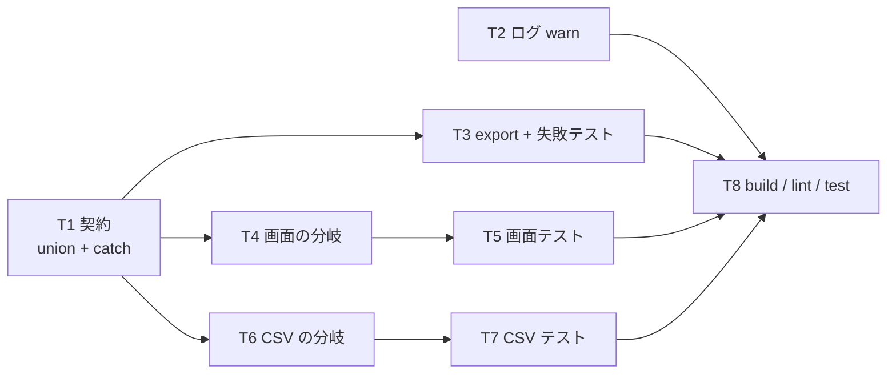

# 計画: LOB の未取得理由に `failed` を足す

## subtask 分割の判定

**分割しない**（単一 tasks.md ＋ 1 PR）。

protocol「2.8」/ DESIGN「5.」の決定木で見ると、この work は**不可分**に当たる。
`unavailable` の union に値を足す変更と、それを読む 3 か所（画面セル・ツールチップ・CSV）は
**同じ 1 つの契約**を共有しており、片方だけ入れると「`failed` を出す側と読む側が食い違う」
中間状態を作る。分けても単独では検証できない。

規模も小さい（実装 5 ファイル・数十行）ので、漸進レビューの価値より過剰分割の害が上回る。

## 実装方針

**生産側（hostserver）→ 消費側（web-ui）** の順で組む。逆順だと「まだ誰も出さない値」への
分岐を先に書くことになり、テストで踏めない。

hostserver 側は 3 つの独立した変更に割る。

1. **契約の変更**（union に `"failed"` ／ catch が入れる値）——これが本体
2. **ログの引き上げ**（`debug` → `warn`）——decisions D3。requirement のスコープを 1 行だけ超えるので**独立させる**
3. **テストの取っ手**（`fillLobs` の export）＋回帰テスト

web-ui 側は表示（`SqlResultTable.vue`）と CSV（`csv.ts`）が互いに独立なので、
それぞれ「実装 → テスト」の対で並べる。

## 作業順序と依存関係

1. **T1** hostserver の契約変更（依存: なし）
2. **T2** 失敗ログを `warn` へ（依存: なし。T1 と同じ catch を触るので T1 の直後が楽）
3. **T3** `fillLobs` を export ＋ 失敗ケースの回帰テスト（依存: T1）
4. **T4** 画面の `failed` 分岐（依存: T1）
5. **T5** 画面のテスト（依存: T4）
6. **T6** CSV の `failed` 分岐（依存: T1）
7. **T7** CSV のテスト（依存: T6）
8. **T8** リポジトリ全体の build / lint / test（依存: 全部）

T4〜T7 は T3 と並行してよい（別パッケージ・別ファイル）。

## リスク / 留意点

- **`(LOB)` に落ちる既存分岐を壊さない**。`csv.ts` の `escapeField` も `SqlResultTable.vue` の
  `lobText` も「値が文字列ならそれを返す」を**先に**通る。`failed` の判定はその**後ろ**に置く
  ——前に置くと、将来 `failed` と部分値が同居したときに値を捨てる。
- **`not-requested` の案内文を消さない**。`failed` を足すのが目的で、
  「左のチェックで取得」は `not-requested` のときには**正しい案内**。既存テスト
  （`sql-pane.test.ts:349`）が通ったままであることを確認する。
- **`fillLobs` の export がパッケージの公開面を広げていないか**。`packages/hostserver/src/index.ts` は
  `query.js` の export を列挙している（`export *` ではない）ので広がらないはずだが、
  coding 後に index.ts を読み直して確認する。
- **偽 conn の型合わせ**。`DbConnection` はクラスなので、テストでは必要な口
  （`request`）だけ持つオブジェクトを型アサーションで通す。`retrieveLob` が
  他の口を使っていないことは spec で確認済み（`lob.ts:70` の `conn.request` のみ）。
- **ログの引き上げが騒がしくならないか**。`fillLobs` は既定では呼ばれない
  （`lobMaxBytes` を明示したときだけ）。要求したときの失敗だけが `warn` になるので、
  通常運用でログが増えることはない。

## テスト方針

test 工程では次を確認する。

- **hostserver**: `fillLobs` に「`request` が reject する偽 conn」を渡し、
  対象セルの `unavailable` が `"failed"` になること。`locator` / `maxSize` が保持されること。
  同じ行の**他のセルは巻き込まれない**こと（1 セルごとの try/catch）。
- **web-ui（画面）**: `failed` のセルが `(LOB: 取得失敗)` と表示され、
  ツールチップに**「左のチェックで取得」を含まない**こと。
  併せて `not-requested` の既存テストが通り続けること。
- **web-ui（CSV）**: `failed` が `(LOB: 取得失敗)`、`not-requested` が `(LOB)` になり、
  **どちらも空欄でない**こと（空欄は SQL の NULL と混ざる）。取得済みは中身が出ること。
- **全体**: `npm run build`（tsc -b）/ `npm run lint` / `npm test` が通ること。
- **実機は使わない**。プロトコルの新規解釈を含まず、catch がどの値を書くかだけの変更のため。
