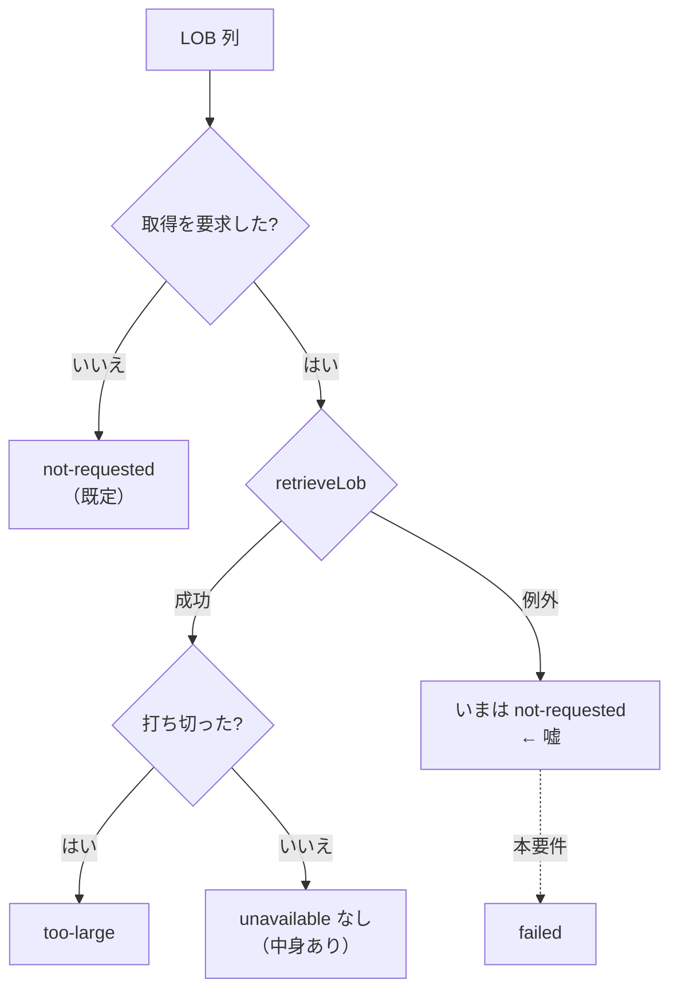

# 要件: LOB の未取得理由に「取りに行って失敗した」を足す

## 背景 / 課題

SQL 結果表の LOB 列は、既定では中身を取りに行かず**ロケーターだけ**で返る。
その状態は `LobPlaceholder.unavailable` で表しており、現在は 2 値しかない。

| 値 | 意味 |
|---|---|
| `not-requested` | 要求していない（既定。取りに行っていない） |
| `too-large` | 取れたが上限で打ち切った |

ところが `fillLobs` は、**取りに行って例外で落ちたときにも `not-requested` を入れている**
（`packages/hostserver/src/db/query.ts:457-460`）。

```ts
} catch (e) {
  log.debug(`LOB ${value.locator} の取得に失敗: ${String(e)}`);
  row[key] = { ...value, unavailable: "not-requested" };
}
```

結果として画面には「LOB の中身は取得していません（**左のチェックで取得**）」と出る
（`packages/web-ui/src/components/SqlResultTable.vue:87`）。**利用者は既にそのチェックを入れている**——
案内どおりに操作しても同じ失敗を繰り返すだけで、失敗したという事実がどこにも出ない
（失敗の記録は `log.debug` のみ）。

`20260720-sql-lob-locator` の review で挙がり、backlog（`hostserver.md`）に
「**`unavailable` に `"failed"` を足す**……**嘘に近い**。型を 1 つ足すだけだが server / web-ui / CSV に波及する」
として積まれていた項目。



## 目的 / ゴール

LOB セルの状態を**実態どおり 3 つに区別**し、画面と CSV がそれを正しく伝える状態にする。

- 要求していない（`not-requested`）
- 取りに行ったが失敗した（`failed` ← **新設**）
- 取れたが打ち切った（`too-large`）

「取得を促す案内」は、**本当に要求していないときだけ**出す。

## スコープ

### 対象

- `LobPlaceholder.unavailable` に `"failed"` を追加する（`packages/hostserver/src/db/db-decode.ts:39`）
- `fillLobs` の catch 分岐が `"failed"` を入れるようにする（`packages/hostserver/src/db/query.ts:459`）
- web-ui の LOB セル表示（`lobText`）とツールチップ（`lobTitle`）に失敗を反映する
  （`packages/web-ui/src/components/SqlResultTable.vue:76-90`）
- CSV 出力（`packages/web-ui/src/csv.ts:11,19`）の LOB 表現に失敗を反映する
- 失敗ケースの回帰テストを足し、`not-requested` を固定している既存テストを実態に合わせる
  （`packages/web-ui/test/sql-pane.test.ts:353` ほか）

### 対象外

- **失敗の自動リトライ**（同じ失敗を繰り返すだけになりうる。利用者の判断に委ねる）
- **LOB 取得経路そのものの見直し**（往復数の削減は backlog の別項目
  「LOB をまとめて取る要求形式があるか原典で確認する」）
- **ロケーターの明示的な解放**（backlog の別項目）
- **BLOB / 中身のある DBCLOB での実機検証**（backlog の別項目。本件は実機不要）
- MCP `host_sql` の LOB 取得可否そのものの方針変更

## 機能要件

- `retrieveLob` が例外を投げたセルは、`unavailable: "failed"` を持つ。
  ロケーターと `maxSize` は従来どおり保持する（再試行の手がかりを消さない）。
- 画面の LOB セルは、`failed` のときに**取得を促す案内を出さない**。
  失敗したと分かる文言を、セル本文かツールチップの少なくとも一方で示す。
- CSV は `failed` と `not-requested` を区別できる。**空欄にはしない**
  （既存規約: 空欄は SQL の NULL と混ざる。`csv.ts:19-24`）。
- 既存 2 値（`not-requested` / `too-large`）の表示・CSV 表現は変えない。
- `unavailable` を持たない（＝取得成功）セルの扱いも変えない。

## 非機能要件 / 制約

- **後方互換**: `unavailable` は optional な文字列 union であり、値の追加は JSON 表現として後方互換。
  web-ui 側は既知値との等値比較で分岐しているため、古いクライアントに `failed` が届いても
  「取得済みでない LOB」として無難に落ちる（クラッシュしない）ことを確認する。
- **失敗理由の粒度**: 現在 catch は `log.debug` に握り潰している。ログの情報量は減らさない。
- 型検査・lint・既存テストが通ること。
- 実機（IBM i）は不要。単体テストで完結させる。

## 完了条件 (受け入れ基準)

- [ ] `LobPlaceholder.unavailable` の型に `"failed"` が含まれる
- [ ] `retrieveLob` が失敗したとき、そのセルの `unavailable` が `"failed"` になる（hostserver の単体テストで固定）
- [ ] 失敗したセルの画面表示に「左のチェックで取得」という案内が**出ない**（web-ui のテストで固定）
- [ ] 失敗したセルが CSV で `not-requested` と区別でき、かつ空欄にならない（`csv.ts` のテストで固定）
- [ ] `not-requested` / `too-large` / 取得成功の既存挙動が変わらない（既存テストが通る）
- [ ] リポジトリの型検査・lint・テスト一式が通る
- [ ] `.aidev/backlog/hostserver.md` の該当行が `[x]` になり、根拠に本 work の slug が併記されている

## 未確定事項 / 確認したいこと

- **失敗の理由文字列を利用者に見せるか**。`unavailable: "failed"` だけにするか、
  短い理由（例外メッセージ）を別フィールドで運ぶか。ホスト由来の文字列をそのまま画面に出す是非を含め **spec で決める**。
- **CSV の失敗表現の文言**（例 `(LOB: 取得失敗)`）。既存は取得済み以外を一律 `(LOB)` にしている。
  `too-large` を CSV でどう扱っているかの現状も含めて **spec で棚卸しする**。
- **サーバー／MCP 経路にこの状態が漏れるか**。`/api/host/sql` と `host_sql` は
  `DbValue` をそのまま JSON にしているように見えるが、LOB 取得を要求する経路が
  画面以外にもあるかは未確認（spec で確認する）。
