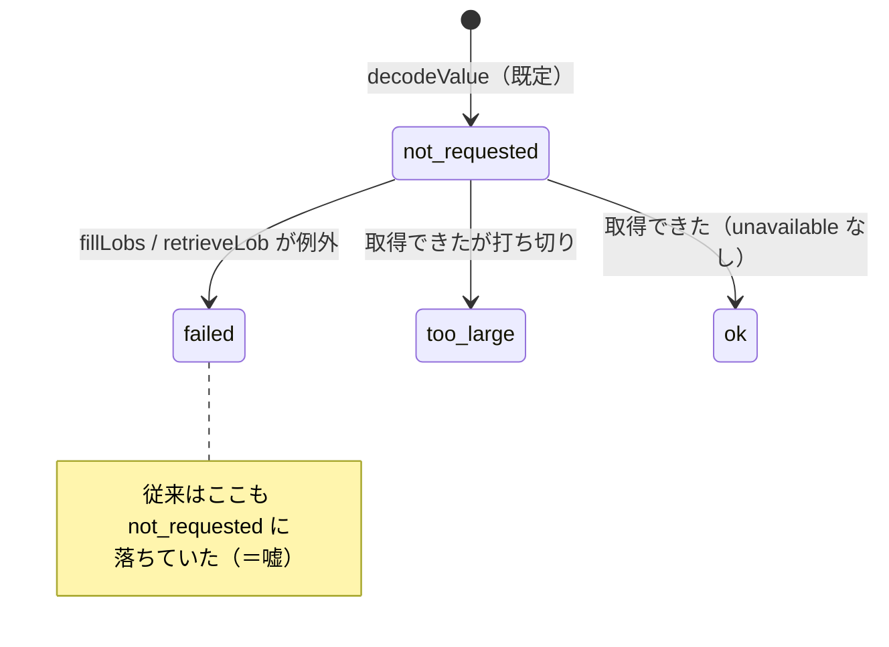

# 仕様: LOB の未取得理由に `failed` を足す

## 概要

`LobPlaceholder.unavailable` の文字列 union に `"failed"` を 1 つ足し、
`fillLobs` の catch 分岐がそれを入れるようにする。表示側（web-ui のセル・ツールチップ・CSV）は
`failed` を `not-requested` と区別して出す。

サーバー（`/api/host/sql`）と MCP（`host_sql`）は行をそのまま JSON にしているため、
**この 2 経路には変更が要らない**（下記「対象範囲」で裏を取った）。

## 設計方針

### D1: 状態は `unavailable` の 1 フィールドで表す（フラグを増やさない）

既に `not-requested` / `too-large` を持つ union なので、3 つ目の値として足す。
別フィールド（`failed: boolean` 等）にすると**同時に立ちうる組み合わせ**が生まれ、
「要求していないのに失敗した」のような表現不能な状態を型が許してしまう。
union のままなら**排他であることが型で保証される**。



### D2: 失敗の理由文字列は JSON に載せない。代わりにログを `warn` へ上げる

**採らなかった案**: `failureReason?: string` を足して例外メッセージを運ぶ。

退けた理由は、`retrieveLob` が投げる `As400Error` の本文が**利用者向けの文言ではない**ため
（`lob.ts:88-96`: `LOB の取得に失敗しました（locator=…, rcClass=…, code=…）`）。
ロケーター番号や `rcClass` を画面に出しても利用者に打つ手が増えない。
ホスト由来の文字列をそのまま画面へ通す経路を新設する判断は、必要になってからでよい。

一方で**理由がどこにも残らない**のは requirement が挙げた課題そのものなので、
catch のログを `log.debug` → `log.warn` に上げる（`query.ts:458`）。

- `debug` は既定の sink 設定で消えるため、**利用者が要求した操作の失敗が黙って落ちていた**
- `CoreLogger` は `warn` を持つ（`packages/base/src/log.ts:28`）。ライブラリ側は sink 経由なので
  ロガーの強制にはならない（AGENTS.md「ログは stderr のみ」の規約どおり）
- 画面のツールチップは「サーバーのログに理由が出る」と案内する——**上げたことで初めて本当になる**

### D3: `fillLobs` を export してテストの取っ手にする

catch 分岐を `query()` / `queryLimited()` 越しに踏ませるには、prepare / describe / fetch の
応答を丸ごと偽装する必要があり、**テストが失敗の再現ではなくプロトコル模写になる**。

`retrieveLob` が使う接続の口は `conn.request(...)` **1 つだけ**なので（`lob.ts:70`）、
`fillLobs(conn, rows, opts)` を直接呼べば「request が reject する偽 conn」1 つで足りる。

パッケージの公開面は広がらない——`packages/hostserver/src/index.ts` は
`query.js` からの export を**列挙**しており（`openQuery` / `query` / `stream` / `queryLimited` ほか）、
`export *` ではない。テストは `lob.test.ts` と同じく `../src/db/query.js` を直接 import する。

### D4: 表示の文言は既存の形に揃える

| 状態 | セル本文 | ツールチップ |
|---|---|---|
| 取得成功 | 中身 | `LOB（N バイト）` |
| `too-large` | `中身…（以降省略）` | `全体 N バイトのうち先頭のみ` |
| `not-requested` | `(LOB)` | `LOB の中身は取得していません（左のチェックで取得）` |
| **`failed`（新）** | **`(LOB: 取得失敗)`** | **`LOB の取得に失敗しました（サーバーのログに理由が出ます）`** |

セル本文は既存の `(LOB: 大きすぎます)` と同じ `(LOB: …)` の形に合わせる。
**「左のチェックで取得」の案内は `not-requested` のときだけ**に戻る
（コードの分岐は元からそう書かれていて、`failed` が `not-requested` に化けていたために出ていた）。

### D5: CSV は `failed` だけ表現を足し、既存 2 値は触らない

`escapeField` の LOB 分岐は現在「値が文字列ならそれ、でなければ `(LOB)`」の 2 択
（`csv.ts:19-24`）。`failed` は `value` を持たないので今は `(LOB)` に落ちる。

`(LOB: 取得失敗)` を返す分岐を 1 つ足す。**空欄にはしない**（既存規約: 空欄は SQL の NULL と混ざる）。
`too-large`（部分文字列がそのまま出る）と `not-requested`（`(LOB)`）は**現状のまま**
——requirement の対象外。

## 対象範囲

| ファイル | 変更 |
|---|---|
| `packages/hostserver/src/db/db-decode.ts:39` | `unavailable` の union に `"failed"` を追加＋コメント更新 |
| `packages/hostserver/src/db/query.ts:436` | `fillLobs` を `export` にする |
| `packages/hostserver/src/db/query.ts:457-460` | catch の `unavailable` を `"failed"` に。`log.debug` → `log.warn` |
| `packages/web-ui/src/components/SqlResultTable.vue:76-90` | `lobText` / `lobTitle` に `failed` の分岐 |
| `packages/web-ui/src/csv.ts:19-24` | `escapeField` の LOB 分岐に `failed` |
| `packages/hostserver/test/lob.test.ts` （または新規） | `fillLobs` の失敗ケース |
| `packages/web-ui/test/sql-pane.test.ts` | 失敗セルの表示・案内が出ないこと |
| `packages/web-ui/test/csv.test.ts` | 失敗セルの CSV 表現（現在 LOB の網羅はゼロ） |

**変更しないと確認した箇所**（requirement の未確定事項 3 の回答）:

- `packages/server/src/host-sql.ts:265-270` — 行は `bigint → string` の変換だけで JSON 化。LOB 固有の整形なし
- `packages/server/src/host-server-tools.ts:172-177` — MCP `host_sql` も同じ。`lobMaxBytes` を受けて `queryLimited` に渡すだけ

→ **`failed` は両経路に自動で届く**。サーバー側の追加変更は不要。

## インターフェース / データ構造

```ts
// packages/hostserver/src/db/db-decode.ts
export interface LobPlaceholder {
  kind: "lob";
  locator: number;
  maxSize: number;
  value?: string | Uint8Array;
  byteLength?: number;
  /**
   * 未取得の理由。取得できたときは undefined。
   * **空文字で埋めない**——空の LOB と「取っていない」が区別できなくなる。
   * `failed` は**取りに行って失敗した**（要求していない `not-requested` と区別する）
   */
  unavailable?: "not-requested" | "too-large" | "failed";
}
```

```ts
// packages/hostserver/src/db/query.ts —— export を足すだけでシグネチャは変えない
export async function fillLobs(
  conn: DbConnection,
  rows: readonly Record<string, DbValue>[],
  opts: LobOptions
): Promise<void>
```

## 振る舞いの詳細

- `retrieveLob` が例外を投げたセルは `{ ...value, unavailable: "failed" }` になる。
  **`locator` / `maxSize` は保持する**（再試行の手がかりを消さない。現状の spread を維持）。
  `value` / `byteLength` は付かない。
- 1 行の中に複数の LOB があり一部だけ失敗した場合、**失敗したセルだけ** `failed` になる
  （ループは 1 セルごとに try/catch しており、この性質は現状のまま）。
- 取得成功・`too-large`・`not-requested` の値と表示は変わらない。

## ドメイン固有の考慮

- **AGENTS.md「ログは stderr のみ / ライブラリは sink 経由」**: `childLog` の `warn` を使う。
  `console.*` は使わない（lint で禁止）。
- **AGENTS.md「コメントは why」**: 型のコメントに「`failed` は取りに行って失敗した」という
  区別の意図を書く。catch 側には「`not-requested` に落とすと『左のチェックで取得』と
  案内してしまう」という**踏んだ落とし穴**を残す。
- **AGENTS.md「使うものは在り処から取る」**: 新規 import は増やさない
  （`childLog` は `query.ts:12` で既に `@as400web/base` から取っている）。
- **web-ui は hostserver の型を実体から `import type`** する規約があるが、
  `csv.ts` / `SqlResultTable.vue` は LOB を**構造的な inline 型**で受けており
  （`unavailable?: string` と緩い）、型の追加は web-ui へ伝播しない。
  したがって web-ui 側の変更は**型ではなく分岐の追加**になる。
- **実機不要**。AGENTS.md「実機検証を単体テストの代替にしない」は逆方向の戒めであり、
  ここはプロトコルの新規解釈を含まない（既存の catch がどの値を書くかだけの変更）。

## エラー処理 / 異常系

- `retrieveLob` が投げる例外の**型は問わない**（`As400Error` / `SqlError` / 通信断のいずれでも `failed`）。
  現状の `catch (e)` の広さを維持する——ここで型を絞ると、絞り漏れた例外が
  `fillLobs` を貫通して**クエリ全体を落とす**（今より悪化する）。
- ログは `warn` 1 行。例外は握り潰したまま（1 セルの失敗で結果セット全体を捨てない）。
- **後方互換**: `unavailable` は optional な文字列で、値の追加は JSON として後方互換。
  古いキャッシュの web-ui に `failed` が届いても等値比較のみなので落ちない
  （`(LOB)` ＋ `LOB（? バイト）` と表示され、従来と同程度に不正確だが安全側）。

## 受け入れ基準との対応

| requirement の完了条件 | 満たし方 |
|---|---|
| 型に `"failed"` が含まれる | D1。`db-decode.ts:39` の union |
| 失敗時に `unavailable` が `"failed"` | D3 で export した `fillLobs` を、`request` が reject する偽 conn で呼ぶ hostserver テスト |
| 失敗セルに「左のチェックで取得」が出ない | D4。`sql-pane.test.ts` で `.lob` の title を検査（既存の `not-requested` テストと対で置く） |
| CSV で `not-requested` と区別でき、空欄でない | D5。`csv.test.ts` に LOB の 3 状態を足す（現在 LOB の網羅はゼロ） |
| 既存挙動が変わらない | 既存テストを変更しない。`sql-pane.test.ts:349` の `not-requested` テストはそのまま通る |
| 型検査・lint・テストが通る | `npm run build` / `npm run lint` / `npm test` |
| backlog の該当行が `[x]`＋slug 併記 | deliver 工程（`hostserver.md:341`） |

## 未確定事項

なし。requirement の未確定 3 件は本 spec で解消した（D2 / D5 / 「対象範囲」の変更しない箇所）。
