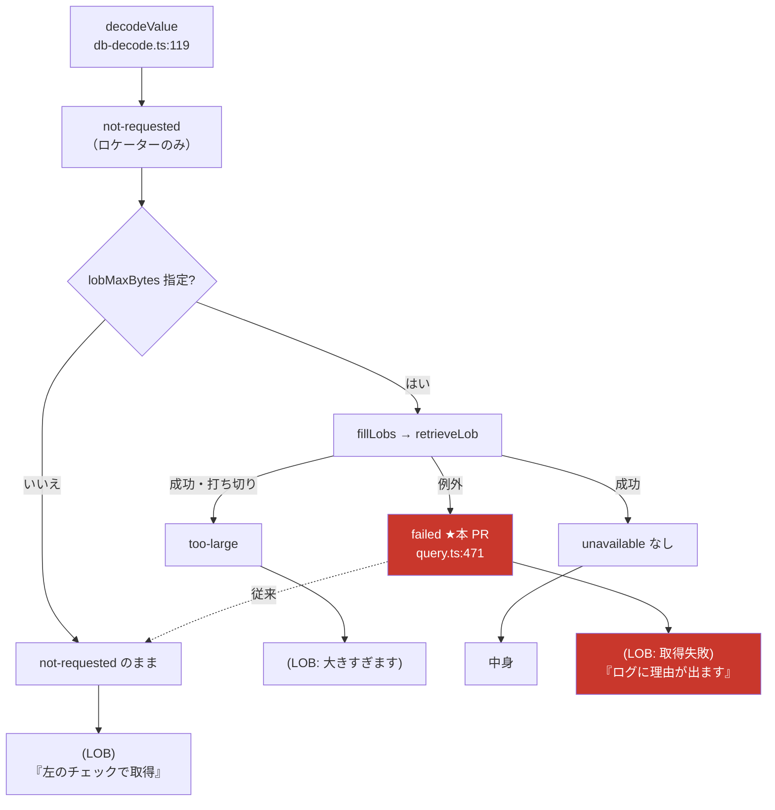

# レビューガイド: LOB の未取得理由に `failed` を足す

## 変更概要 / 目的

SQL 結果表の LOB セルが**取得に失敗したときも「要求していない」と表示していた**のを直す。

`fillLobs` は `retrieveLob` が例外で落ちたときに `unavailable: "not-requested"` を入れていた。
画面はその値を見て「LOB の中身は取得していません（**左のチェックで取得**）」と案内するので、
**既にそのチェックを入れている利用者に、同じ操作をもう一度勧めていた**。
失敗の記録は `log.debug` だけで、既定の sink 設定では消えていた。

`unavailable` に 3 つ目の値 `"failed"` を足し、画面・CSV・README をそれに合わせる。

backlog `hostserver.md`「**`unavailable` に `"failed"` を足す**……**嘘に近い**」の消化。
元は `20260720-sql-lob-locator` の review で挙がった項目。

## 重要ポイント（特に見てほしい所）

### 1. なぜフラグではなく union に足したか（spec D1）

`failed: boolean` のような別フィールドにすると「要求していないのに失敗した」という
**表現不能な状態を型が許す**。3 状態は排他なので 1 つの union で表した。
→ `packages/hostserver/src/db/db-decode.ts:50`

### 2. 分岐を足す**位置**（両方の消費側で同じ落とし穴）

`lobText` も `escapeField` も「**値が文字列なら先に返す**」を保っている。
`failed` の判定を前に置くと、**部分値を持つ状態（`too-large`）で値を捨てる**。
→ `packages/web-ui/src/components/SqlResultTable.vue:78`・`packages/web-ui/src/csv.ts:22`

### 3. ログを `debug` → `warn` に上げた（decisions D3・requirement の範囲を 1 行だけ超える）

失敗の**理由**は JSON に載せない判断（ホスト由来のデバッグ文字列 `locator=…, rcClass=…` は
利用者に打つ手を与えない）。するとログが唯一の手掛かりになるが、`debug` は既定の sink で消える。
画面のツールチップが「サーバーのログに理由が出ます」と案内する以上、
**上げないとその案内が嘘になる**。
→ `packages/hostserver/src/db/query.ts:467`

### 4. `fillLobs` の `export` はテストの取っ手（spec D3）

`query()` 越しに失敗を踏ませるには prepare / describe / fetch の応答を丸ごと偽装することになり、
**テストが失敗の再現ではなくプロトコルの模写になる**。`retrieveLob` が使う接続の口は
`conn.request` 1 つだけなので、直接呼べば偽 conn 1 つで足りる。
`packages/hostserver/src/index.ts` は `query.js` の export を**列挙**している（`export *` ではない）ので、
**パッケージの公開面は広がっていない**。
→ `packages/hostserver/src/db/query.ts:443`

## 処理フロー

**`H -.-> D` の点線が本件の不具合**——失敗が未要求に合流し、
「取得すればよい」という**やり直しようのない案内**に化けていた。

## 主要な変更箇所

| 場所 | 要点 |
|---|---|
| `packages/hostserver/src/db/db-decode.ts:50` | union に `"failed"`。3 状態の意図をコメント化 |
| `packages/hostserver/src/db/query.ts:443` | `fillLobs` を export（テストの取っ手。公開面は不変） |
| `packages/hostserver/src/db/query.ts:467` | `log.debug` → `log.warn` |
| `packages/hostserver/src/db/query.ts:471` | catch が `"failed"` を入れる。**`{ ...value }` でロケーターと `maxSize` を残す**（取り直す手がかり） |
| `packages/web-ui/src/components/SqlResultTable.vue:83,95` | セル本文 `(LOB: 取得失敗)` とツールチップ |
| `packages/web-ui/src/csv.ts:25` | CSV `(LOB: 取得失敗)`。**空欄にしない**（SQL の NULL と混ざる） |
| `README.md:386-390` | 利用者向けに 3 状態を明記。**打ち切りも書かれていなかったので併せて追記** |
| `packages/hostserver/test/lob-fill-failure.test.ts` | 新規 5 件（下記） |

### テストが固定していること

- 失敗 → `failed`（`not-requested` に混ぜない）
- ロケーターと `maxSize` は残る／`value`・`byteLength` は付かない
- **1 セルの失敗で残りを捨てない**（行内の他セル・後続の行も処理する）
- **例外の型は問わない**（素の `Error` でも `failed`）——型を絞ると貫通してクエリ全体が落ちる
- **`warn` で 1 件だけ**出る（`setLogSink` で捕捉。`debug` に戻したら落ちる）

## リスク / 確認してほしい点

- **`failed` を新たに見る側**: サーバー（`/api/host/sql`）と MCP（`host_sql`）は行を
  `bigint → string` だけで JSON にしており、LOB 固有の整形は無い。よって**両経路に自動で届く**。
  MCP の `outputSchema` は `rows: z.array(z.record(z.string(), z.unknown()))`
  （`packages/server/src/host-server-tools.ts:151`）で値を制約していないので**zod 検証は落ちない**。
  → AI から見える文字列が 1 つ増えることの是非は、レビューで判断してほしい。
- **後方互換はコード読解で判断した**（実行では確かめていない）。変更前の
  `lobText` / `lobTitle` / `escapeField` は `unavailable` を**等値比較しかしていない**ので、
  古いキャッシュのクライアントに `failed` が届いても例外にはならず、
  `(LOB)` ＋ `LOB（? バイト）` と従来と同程度に不正確な表示に落ちるだけ。
- **実機（IBM i）では確認していない**。LOB 取得の失敗を実機で誘発する必要があり、かつ本変更は
  「catch がどの値を書くか」だけでプロトコルの解釈を変えない。
  backlog の「BLOB（バイナリ）と中身のある DBCLOB での検証」は**別項目のまま残る**。
- **`npm run lint` はリポジトリ全体では落ちる**。エラー 6 件はすべて**未追跡の
  `scripts/*.mjs`**（別件の実機調査スクリプト。着手前から作業ツリーにあった）で、
  本 PR には含めていない。変更ファイルを名指しで掛けるとエラー 0（decisions D4）。

### follow-up（本 PR では直さない・review ラウンド 1 の nit）

いずれも**本 work の変更前から存在**し、直すと差分の焦点がぼやけるため見送った。

- `packages/web-ui/src/components/SqlPane.vue:8` — `isLob` を import しているが未使用
- `packages/web-ui/src/csv.ts` — CSV は `too-large` を**無印**で出すため、打ち切られた LOB が
  完全な値のように見える（画面は `…（以降省略）` を付ける）
- `packages/web-ui/src/csv.ts:11` — `isLob` の型宣言が `value?: string` だが実態は
  `string | Uint8Array`。この食い違いのせいで隣の行が `as` キャストを強いられている
