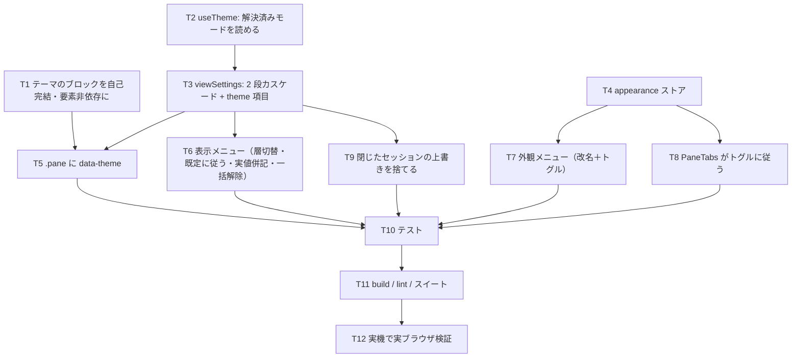

# 計画: 「外観」と「表示」／表示設定の 2 段カスケード

## 実装方針

**土台（CSS のトークン構造 → ストア）→ 適用（ペイン）→ 画面（メニュー）** の順。

CSS を先にやるのは、**テーマのブロックが自己完結していない**という前提を直さないと、
ペインに属性を流しても正しく効かないため（spec の「調査で判明した前提」）。
ここを後回しにすると、メニューを作ってから「効かない」に気づくことになる。

## 作業順序と依存関係

## リスク / 留意点

- **CSS の書き換えが全画面に響く。** 選択子から `:root` を外すので、**特定度が変わる**
  （(0,2,0) → (0,1,0)）。`:root` と同じになるが記述順が後なので勝つ——**そこを実際に確かめる**。
  jsdom は CSS を計算しないので、**実ブラウザで見る**しかない。
- **移行で見え方を変えない**のが最優先。既存の保存値は `defaults` に載せ、上書きは空で始める。
  「移行前後で同じ」を実機で寸法・配色まで見る。
- **`set()` の意味**（キー設定からの順送りが使う）は「全体の既定への変更」のまま。
  ここをセッション上書きに変えると、キー 1 つで挙動が分岐して分かりにくくなる。
- テーマをペインに流すと、**スキン適用中は端末パレットが表示モード側の値になる**。
  スキンのセッション個別は対象外なので、これは受け入れる（制限として記録する）。

## テスト方針

- **カスケードはストアで固定する**——既定の変更が上書きしていないセッションに効き、
  上書きしたセッションには効かない。`clearOverride` で追従が戻る。
- **移行**: 旧形式（単一の設定）を読み込んだら `defaults` になり、`effective` が同じ値を返す。
- **トグル**: OFF で 2 システム開いていてもシステム名が出ない（**色帯は残る**）。
- メニューは**層の切替**と**実値の併記**を見る（文字列で確認できる）。
- 実ブラウザ（実機）: **移行前後で見え方が変わらない**こと、
  **セッション個別のテーマがペインの中だけに効く**こと（タブ帯・ヘッダーは変わらない）を
  実際の配色で測る。jsdom では見えない。
