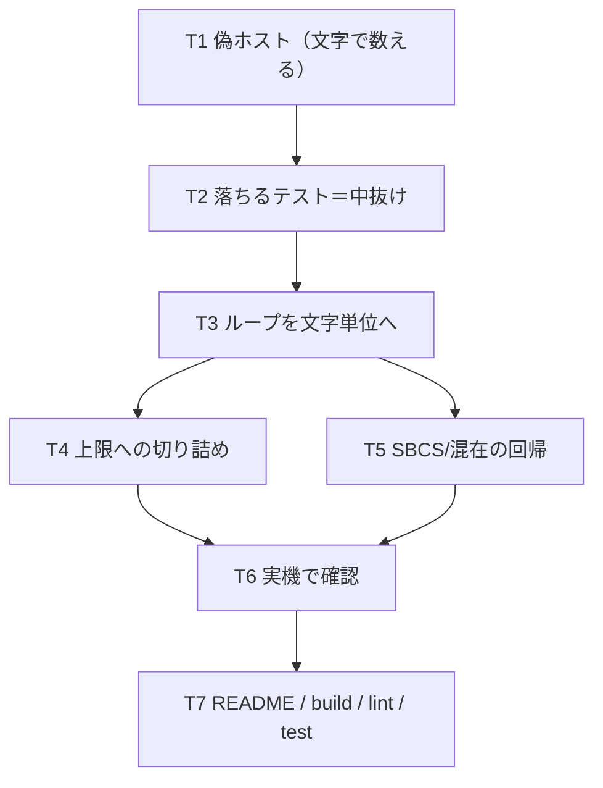

# 計画: LOB の分割受信をホストの単位（文字）で回す

## 実装方針

**テストを先に書く。** 実機で症状は確定しているが、**実機なしで再現できる形**に
落とさないと回帰を止められない（この不具合は 3 度目の同じ罠で、いずれも
「SBCS で通ったから良し」としてすり抜けている）。

偽の `conn` で**文字単位で数えるホスト**を模す。`retrieveLob` が使う接続の口は
`conn.request` 1 つだけなので、そこだけ作れば足りる（`query.ts` の `fillLobs` が
テスト用に export されているのと同じ考え）。

分割は subtask にしない。変更は 1 関数の中で、単独デリバリ可能な切れ目が無い。

## 作業順序と依存関係

1. **偽ホストを書く**（文字で数える／バイトで数えるを切り替えられる）。依存: なし
2. **落ちるテストを書く**（2 バイト CCSID・2 セグメント → 中抜けを検出）。依存: 1
3. `retrieveLob` を文字単位に直す。依存: 2
4. 上限への切り詰め（`perChar` 倍数・孤立サロゲート回避）。依存: 3
5. SBCS・混在の回帰（**元から正しいものを壊していない**）。依存: 3
6. 実機の確認スクリプト。依存: 5
7. `scripts/README.md`・build / lint / test。依存: 6

## リスク / 留意点

- **元から正しい経路を壊しやすい。** `perChar=1`（SBCS・混在）では
  「文字＝バイト」なので、直した式が**両方で同じ値になること**を確かめる。
  混在 CCSID の CLOB は SO/SI 込みのバイト数で数えるので `perChar=1` が正しい
  （`20260801-dbclob-locator-decode` で確認済み）。
- **申告値で進めない。** 応答が途中で切れたときに `lenField` で進めると、
  届いていない分を飛ばす。**実際に届いたバイト数から割る。**
- **切り詰めで末尾を壊さない。** UTF-16 を奇数バイトで切ると化ける。
  サロゲート対の途中で切ると孤立サロゲート（U+FFFD 表示）になる。
- **`startOffset` の意味が変わる**（バイト → 文字）。呼び出し元は `query.ts` の
  1 か所だけで常に省略しているので影響は無いが、**doc に単位を明記**する。
- 実機は共用の本番機。表は `finally` で消す。

## テスト方針

### 単体（`packages/hostserver/test/lob-multi-segment.test.ts`）

**文字で数える偽ホスト**を作り、`retrieveLob` を直接呼ぶ。

- **2 バイト CCSID・2 セグメント → 先頭から連続**（中抜けが無い）。これが芯。
- 送った `lobStartOffset` が**文字**で進んでいる（要求を記録して検査）。
- 上限を超えない（`bytes.length <= maxBytes`）。
- 上限が奇数のときに**偶数バイトで切る**。
- サロゲート対の途中で切らない。
- SBCS（`perChar=1`）は**従来どおり**——バイト＝文字で往復も結果も変わらない。
- 応答が申告より短い → 届いた分だけ進む。
- 進まなくなったら止まる（無限ループにしない）。
- `truncated` が全部取れたときは false、切れたときは true。

### 実機（`scripts/verify-lob-multi-segment.mjs`）

`research` と同じフィクスチャで、**直った後の値**を検査する:

- DBCLOB(1200) 524,288B / `maxBytes` 200,000 → **200,000B ちょうど**・先頭から連続。
- 同 `maxBytes` 40,000 → **40,000B**（従来は 80,000B）。
- CLOB（混在）は**変化なし**。
- 全部収まる小さい LOB は `truncated=false`・完全一致。
