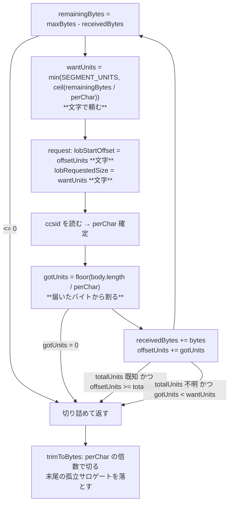

# レビューガイド: LOB の分割受信をホストの単位（文字）で回す

## 変更概要 / 目的

**64KB を超える LOB を UTF-16 で取ると、真ん中が丸ごと抜けていた。**

ホストは LOB の位置も要求量も**文字**で数える。`retrieveLob` はそこに**バイト**を
入れていたので、2 バイト CCSID（UTF-16 / 純 DBCS）で分割が 2 周目に入ると
**位置が 2 倍に飛ぶ**。実機で 524,288 バイトの DBCLOB を取ると、
**文字 65,535〜131,069 の 65,535 文字が欠落**した。

**しかも穴の空いた値に `too-large` が付く。** あの印は「先頭から順に取れて末尾で切れた」
と読ませるので、**利用者は中抜けに気づけない**。

`.aidev/backlog/hostserver.md` では「未検証」扱いだったが、現物を読んだ時点で疑いが濃く、
research で実測して**バグと確定させてから**直した。

## 重要ポイント（特に見てほしい所）

1. **ループの単位を揃えた**のが芯（`lob.ts` の `retrieveLob`）。
   位置は文字（`offsetUnits`）、上限判定はバイト（`receivedBytes`）と**変数名で分けてある**。
   換算するのは上限を当てるときだけ。

2. **`offsetUnits += gotUnits` の `gotUnits` は「届いたバイト数 ÷ perChar」**。
   申告値（`lenField`）で進めると、応答が途中で切れたときに**届いていない分を飛ばす**
   ——今回直したのと同じ形の穴が別経路で開く。

3. **短い応答を終端と決めつけない**（`totalUnits > 0` のときは止めない）。
   従来の `body.length < want` は 2 バイト CCSID で成立しえない**死んだ歯止め**だった。
   総長が分かっているなら短い応答は「ホストが返せた分」でしかない。

4. **`SEGMENT_BYTES` → `SEGMENT_UNITS`。** この誤名がバグの入口なので、
   直したあとに同じ名前を残さない。

5. **上限は最後に切り詰めて守る。** `perChar` は最初の応答まで分からないので
   1 周目だけ超えうる。切るのは `perChar` の倍数で、**末尾が上位サロゲート単独なら
   もう 1 単位落とす**（孤立サロゲートは「壊れた」ように見える）。

## 処理フロー



## 主要な変更箇所

- `packages/hostserver/src/db/lob.ts:47` — `SEGMENT_UNITS`（改名＋単位の説明）。
- `packages/hostserver/src/db/lob.ts:68` — `retrieveLob` の doc に
  **「ホストは位置も要求量も文字で数える」**を明記（実機の根拠つき）。
- `packages/hostserver/src/db/lob.ts` ループ本体 — 単位を揃えた。
- `packages/hostserver/src/db/lob.ts` `trimToBytes` — 上限への切り詰め。
- `packages/hostserver/test/lob-multi-segment.test.ts` — **文字で数える偽ホスト**（15 件）。
- `scripts/research-lob-multi-segment.mjs` — 事実の採取（往復を生で覗く）。
- `scripts/verify-lob-multi-segment.mjs` — 直ったことの確認（14/14）。

## 実機の往復（直す前 / 直した後）

```
直す前（NG）
  want=65535 offset=0      → body=131070B   文字 0〜65534
  want=65535 offset=131070 → body=131070B   文字 131070〜196604  ← **65,535 文字が飛んだ**
  → 262,140 バイト保持（上限 200,000 の 1.31 倍）＋ too-large

直した後（OK）
  want=65535 offset=0      → body=131070B   文字 0〜65534
  want=34465 offset=65535  → body=68930B    文字 65535〜99999
  → 200,000 バイトちょうど・先頭から連続・too-large
```

## リスク / 確認してほしい点

- **`opts.startOffset` の意味がバイト→文字に変わった。** 呼び出し元（`fillLobs`）は
  常に省略しているので影響は無いが、外から使う人が現れたら単位に注意が要る（doc に明記）。
- **純 DBCS（CCSID 300）の 64KB 超は実機で作れなかった。** `isTwoByteCcsid` は
  1200 と同じ枝なので同じ道を通る、という判断で押している。
- **既定値では分割経路を通らない**（`SEGMENT_UNITS` 65,535 に対し既定上限 65,536）。
  今後 LOB を実機で測る人が同じ穴に落ちないよう `scripts/README.md` に注意書きを入れた。
