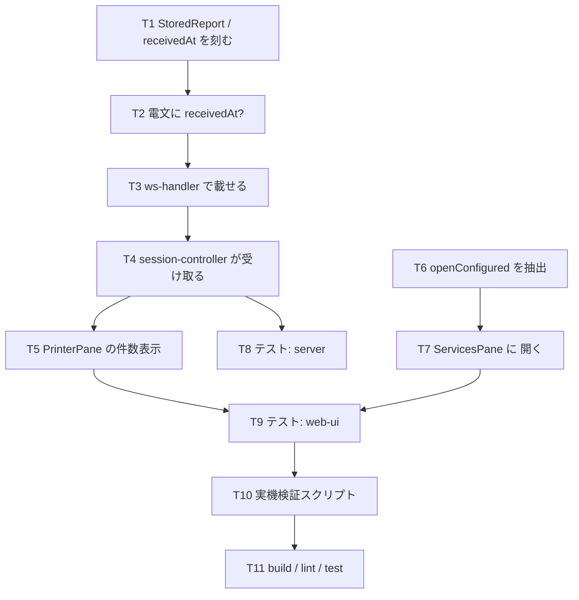

# 計画: 常駐プリンターが受け取った帳票を画面から読めるようにする

## 実装方針

**下から上へ**（サーバー → 電文 → 受け手 → 画面）。電文の形が決まらないと
受け手のテストが書けず、受け手が入らないと画面の件数表示が確かめられない。

分割（subtask）は**しない**。3 レイヤに跨るが芯は「捨てている 1 ホップを繋ぐ」1 点で、
サーバーだけ・UI だけでは受け入れ基準を検証できない（高結合・単独デリバリ不可）。
1 PR に収まる規模。

`openConfigured` の抽出だけは性格が違う（振る舞い不変のリファクタ）。**先に単独で入れ、
ランチャーの既存テストが緑のままであることを確かめてから**、`ServicesPane` を足す
——そうしないと「ボタンを足したら壊れた」のか「抽出で壊した」のか切り分けられない。

## 作業順序と依存関係

1. サーバー: 受信時刻を刻む（依存: なし）
2. 電文: `receivedAt?` を足す（依存: 1）
3. `ws-handler`: 両電文に載せる（依存: 2）
4. `session-controller`: 捨てずに受け取る（依存: 3）
5. `PrinterPane`: 累計と保持（依存: 4）
6. `openConfigured` 抽出（依存: なし。**単独で緑を確認**）
7. `ServicesPane` に `開く`（依存: 6）
8〜11. テストと検証

## リスク / 留意点

- **`onReport` の型を変えると呼び出し側が漏れる**。`entry.onReport?.(report)` に
  古い（時刻の無い）`report` を渡したままだと、live だけ時刻が落ちる。
  `deliverReport` の中で `stored` を作り、**push も出力も配列も同じ 1 個**を使う。
- **`openConfigured` の抽出は振る舞いを変えやすい**。`meta.host` の出所だけは意図的に
  変える（選択中システム → そのセッション自身のシステム）。ランチャーでは同値なので、
  既存テストが緑ならこの変更は安全側。
- **未読の扱い**。`addReport` を再利用すると未読が件数ぶん上がる。使わない。
- **`exactOptionalPropertyTypes`**。`receivedAt` を素で入れると型エラーになる。
  `...(x !== undefined ? { receivedAt: x } : {})` で組む。
- **web-ui は `vue-tsc` まで回す**。`tsc -b` は SFC テンプレートを見ない。
- **実機は共用の本番機**。既存 `PRT_TEST` を借り、`finally` で `ENDWTR`、
  作ったスプールは消す。

## テスト方針

### server（vitest）

- `deliverReport` が `receivedAt` を刻む（注入クロックで固定値を確認）。
- `printer-opened` 相当の投影（`ws-handler`）で `reports[].receivedAt` が載る。
- live の `onReport` にも `receivedAt` が渡る（**restore だけ直して live を忘れる**のを塞ぐ）。
- 既存 `printer-residency.test.ts` が緑のまま（attach 4 件・上限 3 件）。

### web-ui（vitest + jsdom）

- **`printer-opened` で 3 件届く → 一覧 3 件・先頭が選択・未読 0・`receivedTotal` 反映**
  （受け入れ基準の芯。`FakeSocket` で `openPrinterSession` を実際に走らせる）。
- `receivedAt` を**送らない** `printer-opened` → 時刻欄が壊れない（後方互換）。
- `PrinterPane`: 累計 > 保持で `受信 62 件（保持 50）`、同値なら括弧を出さない。
- `ServicesPane`: `開く` を押すとそのプリンターが開く／既に開いていればタブへ移る／
  定義が引けなければボタンが出ない。
- ランチャーの既存テスト（`launcher-open-existing` / `launcher-watch`）が緑のまま
  ＝抽出で壊していない。

### 実機（）

`scripts/verify-printer-report-history.mjs`:
待ち受け開始 → **WS を切る** → 帳票を出す → **開き直して読める・時刻が出す前の時刻**
を確認する。`finally` で `ENDWTR` と後片付け。
