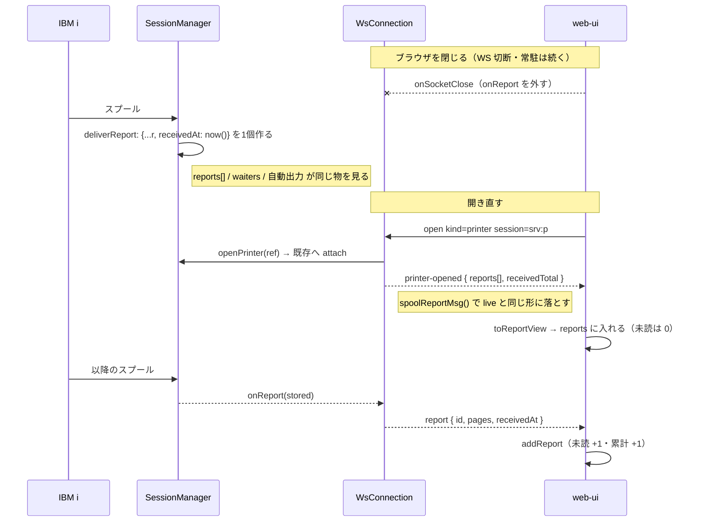

# レビューガイド: 常駐プリンターが受け取った帳票を画面から読めるようにする

## 変更概要 / 目的

**サーバーは送っていた。画面が捨てていた。**

常駐プリンターはブラウザを閉じても帳票を受け取り続ける。開き直したときに渡す仕組み
（`printer-opened.reports`）は `20260801-printer-attach-by-ref` でサーバー側に入っている。
ところが受け手の `session-controller.ts` が `reports: []` と書いて**その場で捨てていた**ため、
常駐が夜のうちに受け取った帳票は、朝ブラウザを開くと 1 件も無かった。

その 1 ホップを繋ぎ、ついでに**受信時刻**（クライアントが現在時刻で押していた）と
**サービス一覧からの導線**（`帳票 12 件（保持 10）` と出すのに開けなかった）を直す。

## 重要ポイント（特に見てほしい所）

1. **`deliverReport` で作った 1 個を全経路が共有する**（`session-manager.ts:833`）。
   `{...incoming, receivedAt: this.now()}` を作り、push・待機者・自動出力・バッファが**同じ物**を見る。
   `onReport` にだけ元の `incoming` を渡すと、**live で届いた帳票にだけ時刻が無い**という
   説明しにくい差が生える。テストで「同一オブジェクトであること」まで見ている。

2. **配り直しでは時刻を押さない**（`session-controller.ts` の `toReportView`）。
   `receivedAt` が無ければ**空のまま**。live は `addReport` が `Date.now()` を押す
   （届いたばかりなので正しい）。この非対称が意図的であることを確認してほしい。

3. **未読は 0 のまま**。`addReport` を再利用したくなるが、通すと件数ぶんバッジが光り
   「新着 50 件」と嘘をつく。開いて見ている既存分なので直接入れている。

4. **`receivedTotal` はサーバー値から始めて +1 する**。`reports.length` で数え直すと、
   サーバー側の上限（50 件）で落ちた分がクライアントで消える。

5. **`openConfigured` の抽出は振る舞い不変**（意図的な変更は `meta.host` の出所だけ）。
   `ServicesPane` を足す前に単独で入れ、ランチャーの既存 13 件が緑であることを確かめてある。

## 処理フロー

## 主要な変更箇所

- `packages/server/src/session-manager.ts:217` — `StoredReport`（`SpoolReport` ＋ 受信時刻）。
  プロトコル層（`@as400web/tn5250`）は時計を持たないので、**サーバー側の派生型**にした。
- `packages/server/src/session-manager.ts:833` — `deliverReport`。**刻む場所はここ 1 か所**。
- `packages/server/src/ws-handler.ts:45` — `spoolReportMsg()`。
  **live と配り直しで同じ関数を通す**（片方だけ載る形にしない）。生バイトは載せない。
- `packages/server/src/ws-messages.ts` — `SpoolReportMsg`。`receivedAt` は**任意**（後方互換）。
- `packages/web-ui/src/session-controller.ts` — `msg.reports` / `msg.receivedTotal` を使う。
  **ここが今回の芯**（`reports: []` を消した行）。
- `packages/web-ui/src/composables/openConfigured.ts` — 開く処理の唯一の経路。
  ランチャーとサービス一覧が共用する。
- `packages/web-ui/src/components/ServicesPane.vue` — `開く` ボタン。
  **`editable`（admin）で隠さない**——読むだけなので開始/停止とは条件が違う。
- `packages/web-ui/src/components/PrinterPane.vue:23` — `countLabel`。
  累計 > 保持のときだけ括弧を出す。

## リスク / 確認してほしい点

- **`onReport` の型を `StoredReport` に変えた。** 呼び出し側は `ws-handler` の 1 か所だが、
  今後フックを足す人が「元の `report` を渡す」形に戻すと live だけ時刻が落ちる。
  テスト（`printer-report-received-at.test.ts` の「live の push にも同じ 1 個が渡る」）が門番。
- **`openConfigured` の `connecting` / `error` はモジュール共有**。
  「いま 1 本開いている最中」はアプリに 1 つしかない状態なので意図的だが、
  `error` は持ち越すと無関係な画面に出る。`ServicesPane` は見えるようになった時点で捨てている。
- **50 件を超えて落ちた状態は実機で作っていない**（1 件流すのに 1 往復かかる）。
  単体テストでは押さえてある。
- **常駐はプロセス再起動で消える**性質を今回変えていない。消えるのは溜まっていた帳票で、
  待ち受け自体は `boot-autostart` が上げ直す。
