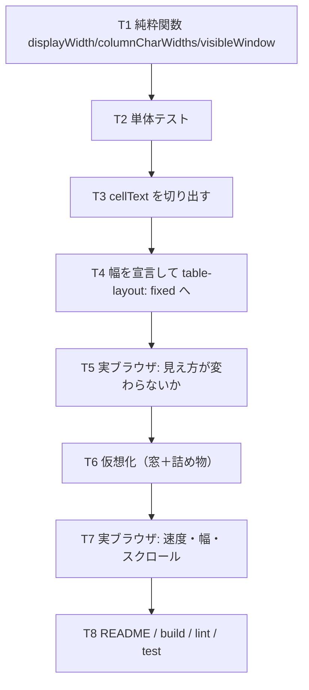

# 計画: SQL 結果表を仮想化し、列幅を文字数から決める

## 実装方針

**純粋な部分を先に**（窓の計算・幅の計算）。DOM を触る部分は実ブラウザでしか確かめられないので、
そこへ持ち込む前に**論理を単体で固めておく**。

順番も大事: **幅を先に**入れて `table-layout: fixed` へ移し、
**それだけで見え方が変わらないこと**を確かめてから間引く。逆にすると、
幅が動いたのか間引きが壊れたのかを切り分けられない。

## 作業順序と依存関係

## リスク / 留意点

- **幅と中身が食い違う。** 表示に使う文字と幅計算に使う文字が別々だと、
  LOB や NULL の列だけ幅が合わない。**`cellText` を 1 本にして両方が使う。**
- **全角を 1 幅で数える。** 日本語の列が半分になる。`isFullWidth` を使う
  （この repo で繰り返し踏んでいる形）。
- **`table-layout: fixed` は溢れを吸収しない。** `auto` は列を広げるが `fixed` は
  隣へはみ出す。`overflow: hidden` ＋ `text-overflow: ellipsis` を同時に入れる。
- **sticky な見出しのぶんを引き忘れる。** 窓の位置が見出しの高さだけずれる。
- **詰め物が hover で光る。** `tbody tr:hover` を `:not(.spacer)` に絞る。
- **`onActivated` の復帰で窓を再計算し忘れる。** 位置だけ戻して中身が先頭のままになる。
- **読み足しで幅を計算し直し忘れる。** 後から来た行に長い値があると切れたままになる。
- 実機は共用の本番機。**表を作らない**（`QSYS2.SYSCOLUMNS` から取る）。

## テスト方針

### 単体（jsdom・`test/sql-table-virtual.test.ts`）

- `displayWidth`: ASCII / 全角 / 混在 / 空。
- `columnCharWidths`: 見出しのほうが長い場合 / 後ろの行に最長がある場合 /
  上限で切る / 全角が 2 幅 / LOB・NULL の表示文字を使う。
- `visibleWindow`: 先頭 / 途中 / 末尾 / 全部入る / 負や過大な `scrollTop` /
  `overscan` の効き / 見出しの高さを引く。
- 行番号が `start + i + 1` になること（コンポーネントを描いて確かめる）。

### 実ブラウザ（`scripts/verify-sql-table-virtualize.mjs`）

- **描画時間**（200 行 / 1000 行）を research と同じ計測器で測り、**前後を並べる**。
- **DOM の行数が総行数より少ない**（間引けている）。
- **スクロールしても列幅が変わらない**（先頭と最下部で比較）。
- **スクロールバーの高さが全行ぶん**ある。
- 下端まで送ると**読み足しが起きる**。
- 手動リサイズが効く（ドラッグして幅が変わる）。
