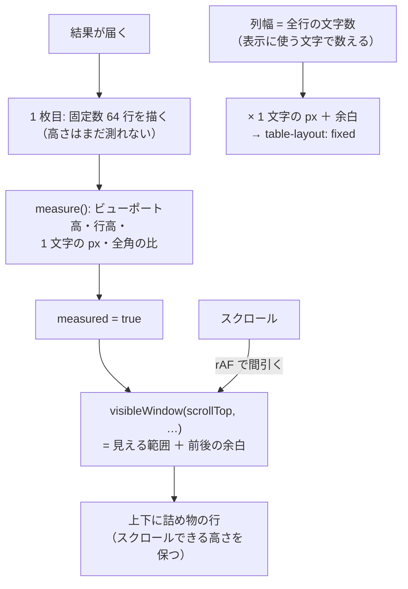

# レビューガイド: SQL 結果表を仮想化し、列幅を文字数から決める

## 変更概要 / 目的

1000 行を選ぶと**初回描画で 582ms 固まる**（40 列 ＝ 40,000 セル。実ブラウザ＋実機で実測）。
`pageSize` は画面から 1000 を選べるので、利用者が普通に踏む。

**表示範囲だけ描く**ようにして **112ms** にした（DOM に載る行は 33 / 1000）。

## なぜ仮想化なのか（ここが分岐点）

行数を固定して列だけ減らして測ると:

| | セル数 | 描画 | 1 セルあたり |
|---|---:|---:|---:|
| 1000 行 × 8 列 | 8,000 | 117 ms | 14.6 µs |
| 1000 行 × 40 列 | 40,000 | 547 ms | 13.7 µs |

**1 セルあたりがほぼ一定**——律速は行数でもレイアウトでもなく「セルを 1 つ作る仕事」。
つまり **`table-layout: fixed` にするだけでは速くならない**。効くのは
**セルを作らない**ことだけ。ここを測らずに始めると、幅を直しただけで満足しかねない。

## 重要ポイント（特に見てほしい所）

1. **幅は全行の文字数から計算して宣言する**（`tableVirtual.ts`）。
   行を間引くと `auto` は「いま描いている行」だけで幅を決めるので表が横に踊る。
   **標本にしない**——先頭 N 行で決めると後ろの長い値で列が足りなくなる。

2. **`cellText` は 1 本**（`SqlResultTable.vue`）。表示と幅計算が同じ関数を使う。
   別々だと LOB や NULL の列だけ幅と中身が食い違う。

3. **「まだ測っていない」と「測れない」を分ける**（`measured`）。
   ビューポートの高さは描いた後でないと測れない。0 を「測れない＝全行描く」に倒すと
   **1 枚目で全行を描いてから間引く**ことになり、**仮想化前より遅くなった**（876ms）。
   1 枚目は固定数（`INITIAL_ROWS` 64）で始める。jsdom では測っても 0 のままなので、
   従来どおり全行に倒れる（行が消えない）。

4. **全角は半角の 2 倍ではない**（実測 1.625 倍）。`IBM Plex Mono` は CJK の字形を持たず
   代替フォントが描く。`displayWidth` に重みを渡し、**実測した比**を使う。

5. **レコード番号の列も幅を宣言する。** `fixed` は窓の先頭行で幅を決めるので、
   宣言しないと `1` と `968` で桁数が変わり、スクロールで表が横に動く。

## 処理フロー

## 主要な変更箇所

- `packages/web-ui/src/composables/tableVirtual.ts` — 純粋な計算（窓・幅・送り幅）。
- `packages/web-ui/src/components/SqlResultTable.vue:84` — `measured`（1 枚目の扱い）。
- 同 `measure()` — 実測 4 点（ビューポート・行高・1 文字の px・全角の比）。
- 同 `cellText` / `autoChars` / `colStyle` / `rownumStyle` — 幅の決め方。
- 同 template — 詰め物の行と `win.start + i + 1`。
- `scripts/research-sql-table-render.mjs` — 基準線。
- `scripts/verify-sql-table-virtualize.mjs` — 前後の比較（16 項目）。

## リスク / 確認してほしい点

- **列幅に上限（120 文字）を入れた**——今回唯一の意図的な見え方の変更。
  超えた列は `…` で切れる（ドラッグで広げられる）。
- **選択・コピーが画面外の行に及ばない**（仮想化の代償）。CSV は別経路なので無事。
- **`npm run build`（root）では web-ui の `dist` が作られない。**
  実ブラウザで測るときは `npm run build -w @as400web/web-ui` が要る
  （これで 1 度、古いバンドルを測った）。
