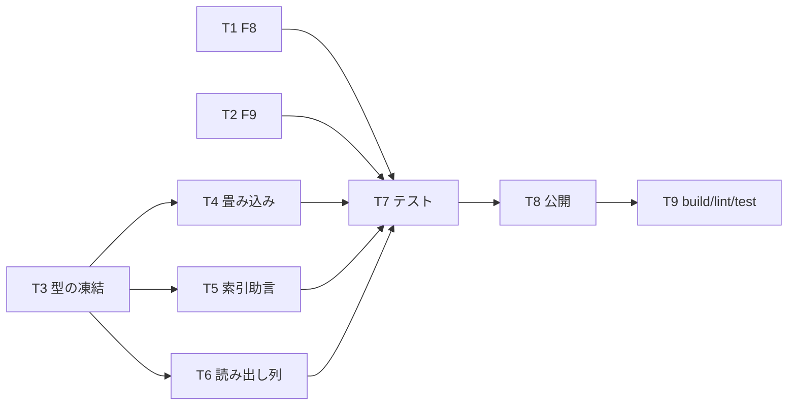

# 計画: 01-foundation（既存欠陥の修正＋計画モデル）

親の `spec.md` / `design.md` を継承する。**scope は親 plan が凍結済み**——ここでは分解だけ行う。

## この subtask の役割

後段（`02-capture` / `03-ui`）が乗る土台を作る。

1. **既存欠陥 2 件を直す**。どちらも `02-capture` が必ず踏む。
   - **F8**: CCSID 65535 の文字列列で `decodeText` が `RangeError` を投げる
     （`db-decode.ts:217` が `isBinaryCcsid` を見ていない。同ファイル `:259` に定義済みなのに）。
   - **F9**: `openQuery` のジェネレータを 1 度も回さずに `return()` すると `finally` が走らず、
     カーソルと接続ロックが残る。`no-rows` モードがまさにこれを踏む。
2. **`QueryPlan` 型を凍結する**。これが唯一の seam で、`03-ui` は実機なしでここに乗る。
3. **モニター記録 → `QueryPlan` の畳み込みを純関数で書く**（`node:*` 非依存。AGENTS.md の層規約）。

## F8 の直し方（16 進文字列で返す）

`DbValue` は `string | number | bigint | null | LobPlaceholder` で **`Uint8Array` を含まない**。

- **`Uint8Array` を足さない**——web-ui の描画・CSV 出力・MCP の JSON 直列化まで波及する
  （`Uint8Array` は `JSON.stringify` で `{"0":..,"1":..}` に化ける）。
- **16 進の大文字文字列**で返す。`FOR BIT DATA` の慣習表現で、既存の描画・出力がそのまま通る。
- `LobPlaceholder` は使わない——ロケーター・`maxSize`・未取得理由を持つ **LOB 専用の型**で、
  ただのバイナリ列に流用すると意味が壊れる。

## F9 の直し方（冪等な close）

`openQuery` の戻り値に **冪等な `close()`** を足し、`iterate()` の `finally` も同じ `close()` を呼ぶ。
既存呼び出し側の契約（`columns` / `rows`）は変えない＝**追加のみ**。

## 作業順序と依存関係

## リスク / 留意点

- **F8 の 16 進化が既存の挙動を変えないか**——CCSID 65535 の文字列列は**これまで例外だった**ので、
  「壊れていたものが動くようになる」だけ。既存の成功経路には触れない。回帰テストで固定する。
- **F9 の `close` 追加で既存呼び出しが壊れないか**——`host-sql.ts` と `result-set-store.ts` が
  `openQuery` を使う。**返り値の形を増やすだけ**にして、既存フィールドは変えない。
- **記録種別に推測でラベルを付けない**（`design.md` A2）。命名は実測した 3 種のみ。

## テスト方針

すべて**実機不要**の単体テストで閉じる（子 test の範囲。protocol「2.8」）。

- F8: CCSID 65535 の CHAR / VARCHAR を含む行を組み立て、16 進文字列が返り例外が出ないこと。
  **既存の CCSID（5035 等）が従来どおり文字列で返ることも併せて固定**する。
- F9: 偽の接続で `openQuery` → 1 行も読まずに `close()` → **カーソルが閉じられ、接続が解放される**こと。
  ジェネレータを回してから閉じる従来経路でも二重解放にならないこと（冪等）。
- 畳み込み: design で実測した記録（`3000`×2 / `3001` / `3020`×2 / UNION の `dtn=1,2` など）を
  固定値の配列にして、ブロック分け・種別の写像・`unknownRecordTypes`・要約を検証。
