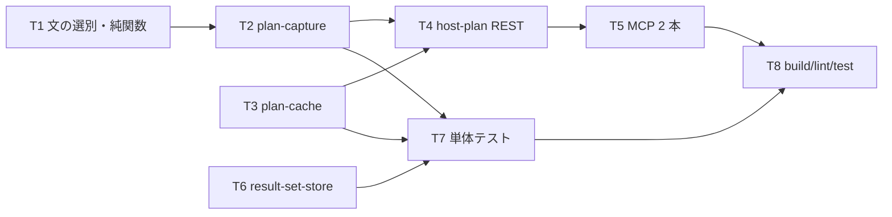

# 計画: 02-capture（採取・一覧・REST・MCP）

親の `spec.md` / `design.md` を継承する。**scope は親 plan が凍結済み**。
依存: `01-foundation`（`QueryPlan` 型・`OpenedQuery.close()`・F8 修正）。

## この subtask の役割

**実機に触る唯一の層**。ホストから計画を採り、REST と MCP に出す。

## 設計の要点（design から引き継ぐ）

- **explain 専用のプールキー**（`design.md` A4）。`poolKey(...)` に `"explain"` を足すだけで、
  既存プールの実装には手を入れない。モニター中に通常の SQL が同じ接続へ流れないようにする。
- **後始末を `finally` で必ず通す**（`ENDDBMON` / `DROP TABLE`）。開始前にも `ENDDBMON` を投げて
  前回の残骸を掃除する（動いていなければエラーになるので**無視する**）。
- **読み出しは列を明示**（`MONITOR_COLUMNS`）。`SELECT *` を使わない（`design.md` A6）。
- **一覧は TOPN ダンプ 1 回で完結**（`design.md` A5）。`PLAN_IDENTIFIER` を使わない。
- **権限拒否は `-443 / 38501` で判定**（research F15 の実測値）。それ以外を権限と決めつけない。

## 01 のレビューから引き継いだ指摘

- **[should]** `result-set-store.close()` が `rows.return()` に依存しており、
  `OpenedQuery.close()` を使っていない。**`no-rows` を足すここで顕在化する**ので、この subtask で直す。
- **[nit]** 文テキストの抽出（一番長い `QQ1000`）が実機記録で妥当か確かめる。

## どの文の記録かを選ぶ

モニターは**ジョブ全体**を採るので、ダンプ表には対象文以外の記録も混ざる
（`STRDBMON` / `ENDDBMON` の `CALL` 自体など）。

- **`QQ1000` が対象の文と一致する記録の `QQUCNT`** を採る。
- 一致が無ければ、**計画記録（`QQQDTN` を持つもの）が最も多い `QQUCNT`** に落とす。
- **どちらも純関数**（`plan-model.ts` に置く）にして単体テストで固定する。

## 作業順序と依存関係

## リスク / 留意点

| リスク | 対応 |
|---|---|
| モニターが残る | `finally` ＋ 開始前の掃除。**偽の接続で「必ず呼ばれる」ことをテストで固定** |
| QTEMP 表名の衝突 | 採取ごとに一意な名前（**10 文字以内**＝システム名の上限） |
| 一覧の再ダンプで id が消える | キャッシュは変わりうる。**見つからないことを明示して返す**（黙って空にしない） |
| 対象文の取り違え | `QQ1000` 一致 → 計画記録数、の 2 段で選ぶ。両方テストする |
| MCP のトークン量 | ノード 50 件上限＋`truncated`、`attributes` は `detail:true` のときだけ |

## テスト方針

**この subtask は実機不要の単体検証に限る**（結合は親の統合 test）。

- 偽の接続（`sql-execute.test.ts` の作り方に倣う）で、
  - `STRDBMON` → 文 → `ENDDBMON` → 読み出し → `DROP` の**順序と回数**
  - 文の実行が失敗しても `ENDDBMON` と `DROP` が通ること
  - `STRDBMON` が失敗したら**文を実行しないこと**
- 権限拒否（`-443/38501`）が `available:false`＋理由になること。**他の SQLCODE は権限と言わないこと**
- 文の選別（`QQ1000` 一致 / 落ちたときの代替）
- `result-set-store` が `close()` を使うこと（1 度も反復せず閉じても解放される）
