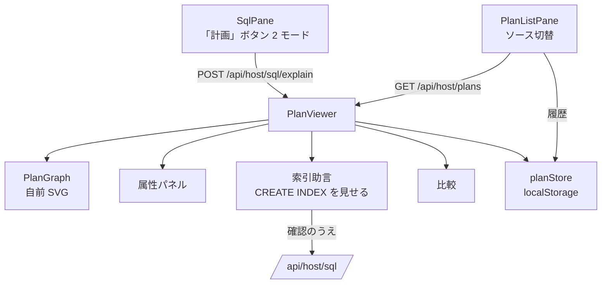
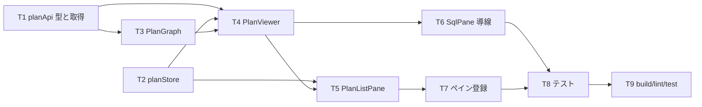

# 計画: 03-ui（ビューア・一覧・保存・比較）

親の `spec.md` / `design.md` を継承する。**scope は親 plan が凍結済み**。
依存: `01-foundation`（`QueryPlan` 型）、`02-capture`（REST 3 本）。

## この subtask の役割

`02-capture` の REST に乗って、人が見る面を作る。**新しいホスト経路は作らない**。

## 既存の作りに合わせる

- **ペインは既存の枠組みに乗せる**。`paneLabels.ts` の `PANE_PREFIXES` に `plan:` を足し、
  `PanePool.vue` の `APP_PANES` に登録する（**足し忘れると型エラーになる**仕掛けがある）。
  `LauncherPane.vue` にも項目を足す。
- **文言は `composables/opMessages.ts` に集約**（AGENTS.md）。テストは定数を参照する。
- **配色は CSS 変数**（`docs/UI-DESIGN.md`）。生色を使わない。
- **依存を足さない**（`design.md` A8）。グラフは自前 SVG。

## 画面の構成

## レイアウトは純関数に切る

グラフの座標計算（`layoutPlan`）は **`PlanGraph.vue` から切り離した純関数**にする。
Vue のマウント無しで単体テストできるようにするため（描画そのものはテストしにくい）。

## 「実行しない」と書かない

`no-rows` は**行を返さないだけで文はホストで実行される**（research F7）。
ボタン文言・説明文で「実行しない」と読める書き方をしない。文言は `opMessages.ts` に置く。

## 作業順序と依存関係

## リスク / 留意点

| リスク | 対応 |
|---|---|
| ノードが多い計画で描画が破綻 | 上位 60 件で畳み、「他 n 件」を出す（`design.md` A8） |
| 未対応の記録種別の見せ方 | **警告にしない**。「この計画に含まれる未対応の記録種別」として淡々と出す。 毎回出ると信号が埋もれる（02 の実機疎通で学んだ） |
| 索引作成の誤操作 | **文を見せて確認を取ってから**既存の `/api/host/sql` へ。既定では実行しない |
| localStorage の肥大 | 保存件数に上限（20 件）を設け、超過は古い順に落とす。**落としたことを黙らない** |
| `vue-tsc` の型漏れ | `npm run build` に含まれる（root の `tsc -b` は web-ui を見ない） |

## テスト方針

`@vue/test-utils` ＋ jsdom（既存 web-ui テストと同じ）。

- **レイアウトの純関数**: ブロック・ノード数に応じた座標、上限で畳む挙動
- **`planStore`**: 履歴の追加・上限・保存・JSON 入出力・不正な JSON の拒否
- **`PlanViewer`**: グラフ／ツリー切替、ノード選択で属性が出る、助言が出る、比較の差分
- **`PlanListPane`**: `available:false` のとき**理由が出て**履歴側へ切り替えられる
- **`SqlPane`**: 2 モードのボタンが出る／非クエリ文では `no-rows` を出さない
