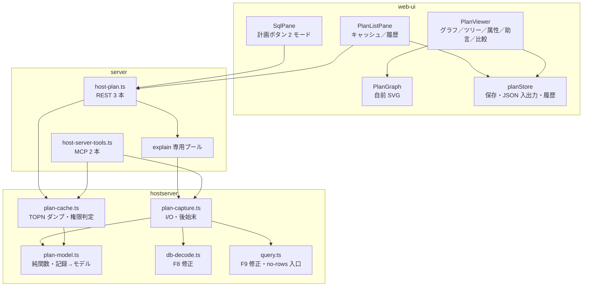
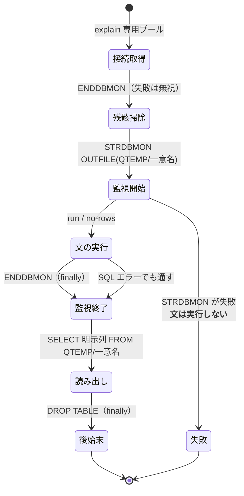
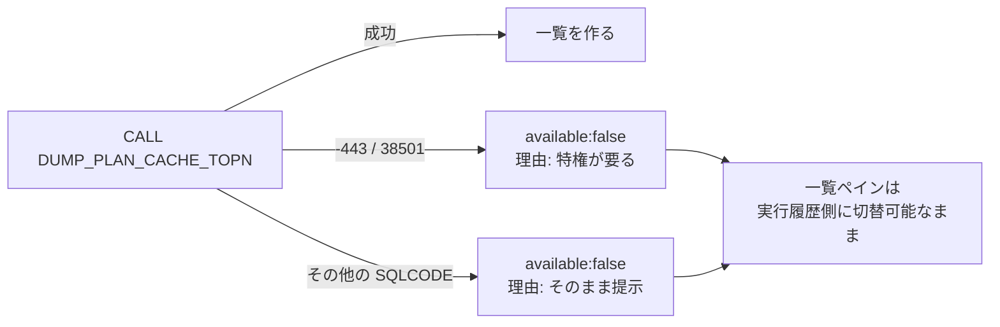

# 設計: SQL 実行計画の可視化

前提: `spec.md`、`research.md`（F1〜F17）。
本工程で **spec に残っていた「未確定」を実測で潰した**（`scripts/research-visual-explain-shapes.mjs`）。

## design で確定させた事実（実機 7.3・QTEMP 上の検証表で実測）

結合・集約・副問合せ・UNION を監視下で流し、階層を表しうる列を全て見た。

| 流した形 | `QQQDTN` | `QQQDTL` | 出た記録種別（3000 番台） |
|---|---|---|---|
| 単純走査 | `1` | `1`（3019 のみ `0`） | 3000, 3006, 3014, 3019, 3020, 3028 |
| 結合 | `1` | 同上 | 3000×2（**表ごと**）, 3006, 3014, 3019, 3020×2, 3023, 3028 |
| 集約＋整列 | `1` | 同上 | 3000, **3003**, 3006, 3014, 3019, 3020×2, 3023, 3028 |
| 副問合せ | `1` | 同上 | 3000×2, 3006, 3014, 3019, 3020×3, 3023×2, 3028×2 |
| **UNION** | **`1` と `2`** | 同上 | 3000×2（各ブロック）, **3026**（`dtn=2`）, 3023×3, 3028×3 |

**確定した 3 点:**

1. **`QQQDTN` は「クエリブロック」の番号**。UNION で `1`/`2` に割れ、集合演算の記録（`3026`）が
   後続ブロックに付いた。**演算子の親子ではない。**
   副問合せ（`K IN (SELECT …)`）は `dtn=1` のまま＝**オプティマイザが平坦化**しており、
   ブロックは増えなかった。
2. **`QQQDTL` は階層に使えない**。ほぼ全て `1` で、`3019` だけ `0`。
   → `3019` は**文レベルの要約であってノードではない**、という区別にだけ使う。
3. **`3000` は「表ごと」に出る**（結合で 2 件、対象表が `QVQTBL` に入る）。
   → 走査対象の一覧は `3000` から作れる。

**結論: 真の演算子木は組めない。** spec の「取れたら使う、取れなければ 2 階層」は、
**「文 → クエリブロック（`QQQDTN`）→ ノード」の 3 層**に確定する（実測に根拠がある形）。
推定で親子をでっち上げない。

## アーキテクチャ概要



**依存の向きは AGENTS.md の層順に従う**（`web-ui → server → hostserver → base/ebcdic`）。
`plan-model.ts` は**純関数のみ**で `node:*` を触らない（AGENTS.md「ピュアロジック層は Node API 非依存」）。

## コンポーネント / モジュール

| モジュール | 責務 | 依存 | 備考 |
|---|---|---|---|
| `hostserver/db/plan-model.ts` | モニター記録の配列 → `QueryPlan`。記録種別の写像・ブロック分け・要約 | なし（純関数） | **テストはここに厚く置く**（実機不要） |
| `hostserver/db/plan-capture.ts` | `STRDBMON` → 文 → `ENDDBMON` → 読み出し → `DROP`。接続専有と後始末 | `plan-model`, `query`, `execute` | 例外時も後始末を通す |
| `hostserver/db/plan-cache.ts` | `DUMP_PLAN_CACHE_TOPN` の実行、一覧化、`-443/38501` の判定 | `plan-model`, `query`, `execute` | 2 段目の CALL はしない |
| `server/host-plan.ts` | REST 3 本・explain 専用プール・認可・監査 | 上記 | 既存 `host-sql.ts` のプール実装を再利用 |
| `web-ui/planStore.ts` | 実行履歴・保存（ブラウザ）・JSON 入出力 | なし | サーバーに保存領域を作らない |
| `web-ui/PlanViewer.vue` | 表示の器（グラフ／ツリー切替・属性・助言・比較） | `PlanGraph` | |
| `web-ui/PlanGraph.vue` | SVG 描画のみ（レイアウト計算＋描画） | なし | 依存を足さない |
| `web-ui/PlanListPane.vue` | 一覧ペイン（ソース切替・絞り込み・選択） | `planStore` | 既存 pane 構成に乗る |

## インターフェース / データモデル

### 3 層モデル（design で確定）

```ts
export interface QueryPlan {
  statement: string;
  captured: "run" | "no-rows" | "plan-cache";
  at: string;
  job?: string;
  /** クエリブロック（QQQDTN 単位）。UNION 等で複数になる */
  blocks: PlanBlock[];
  /** 索引助言（3020 由来。ブロックをまたいで集約） */
  advice: IndexAdvice[];
  summary: PlanSummary;
  /** 畳めなかった記録種別（版数差の可視化。7.5 の 3015 等） */
  unknownRecordTypes: number[];
}

export interface PlanBlock {
  /** QQQDTN の値 */
  number: number;
  nodes: PlanNode[];
}

export interface PlanNode {
  id: string;                 // `${block}-${index}`
  kind: PlanNodeKind;
  /** 元の記録種別（QQRID）。未知でも必ず持つ */
  recordType: number;
  label: string;
  table?: { schema: string; name: string };
  index?: { schema?: string; name: string };
  totalRows?: number;         // QQTOTR
  estimatedRows?: number;     // QQREST
  estimatedMs?: number;       // QQEPT
  /** QQRCOD。オプティマイザの理由コード（T1/T3/I1/I2/F7/A0 を実測） */
  reasonCode?: string;
  /** 属性パネル用。**値が入っていた列だけ**を並べる */
  attributes: PlanAttribute[];
}

/** **実測で中身を確かめた種別だけ名前を持つ。** それ以外は "other" */
export type PlanNodeKind = "table-access" | "access-method" | "advice" | "other";
```

### 記録種別の写像（`planNodeKind`）

**名前を与えてよいのは、この作業で中身を実測した種別だけ**とする。
推測でラベルを付けない（AGENTS.md「仕様・決定・標準を参照する」＝出所の無い断定を書かない）。

| QQRID | 実測した中身 | `kind` | 表示 |
|---|---|---|---|
| `3000` | 対象表（`QVQTBL`）・総行数・推定行数・理由コード。**表ごとに 1 件** | `table-access` | 「表アクセス: `<表>`」 |
| `3001` | 対象表＋**使った索引**（`QVINAM`。実測 `QADBILLB`）・総行数・推定行数 | `access-method` | 索引あり=「索引使用: `<索引>`」／なし=「表全体の走査」 |
| `3020` | 対象表・`QQIDXA='Y'`・`QQIDXD`＝助言キー列 | `advice` | 「索引の助言」 |
| 上記以外 | 未実測 | `other` | 「記録 `<QQRID>`」＋理由コード＋埋まっていた列 |

- `3019`（`QQQDTL=0`）は**ノードにしない**（文レベルの要約）。`summary.rowsReturned` 等に使う。
- **`other` でも情報は落とさない**——`attributes` に値の入っていた列を全部載せる。
- **観測した種別の記録**: 3003（集約時）/ 3006（常時 `A0`）/ 3010（ホスト変数）/ 3014 / 3018 /
  3023（集約・副問合せ・UNION）/ 3026（**UNION のみ**）/ 3028 / 5002 / 5005、7.5 のみ 3015。
  → **どれも `other`。** 意味を足すのは、実測で中身を確かめてからにする（後続作業でよい）。

### 一覧・比較

```ts
export interface PlanListItem {
  id: string;            // QQUCNT
  statement: string;
  runtimeMs?: number;
  lastRunAt?: string;
  tables: string[];
}

/** 比較結果。ノードは (kind, 表名) で対応付ける */
export interface PlanDiff {
  summary: { label: string; left?: string; right?: string; changed: boolean }[];
  nodes: { key: string; left?: PlanNode; right?: PlanNode; state: "same" | "changed" | "left-only" | "right-only" }[];
}
```

## 処理フロー / シーケンス

### 採取と後始末（`plan-capture.ts`）



**不変条件（回帰テストで固定する）**

- `STRDBMON` が成功したら、**どの経路を通っても `ENDDBMON` が 1 回呼ばれる**。
- 作った QTEMP 表は、**どの経路を通っても `DROP` される**。
- `no-rows` で **1 行も読まなくても、カーソルと接続が解放される**（research F9 の修正）。
- **`SELECT *` を使わない**——読み出しは常に列を明示する（research F8 の CCSID 65535 を踏まないため。
  F8 自体も直すが、明示列は「必要な列だけ運ぶ」意味でも正しい）。

### F8 / F9 の直し方

- **F8**: `db-decode.ts` の `decodeText` を `isBinaryCcsid` 経由にする。
  CCSID 65535 の CHAR / VARCHAR / LONGVARCHAR は **BLOB と同じくバイト列**で返す
  （同ファイルの `:275` が既にその扱い＝**片側だけ取り残されていた**のを揃える）。
  `RangeError` を投げない。
- **F9**: `openQuery` の戻り値に**冪等な `close()`** を足し、`iterate()` の `finally` も同じ `close()` を呼ぶ。
  ジェネレータを 1 度も回さずに捨てても解放されるようにする。
  `no-rows` はこの `close()` を使う（`openQuery` → 即 `close()`）。
  **既存呼び出し側の契約は変えない**（`columns` / `rows` はそのまま。`close` は追加）。

### 権限が無いときの分岐



**`38501` 以外を「権限」と決めつけない**——原因を取り違えると利用者が無駄に権限を探しに行く。

## 設計判断

| # | 判断 | 理由 | 退けた案 |
|---|---|---|---|
| A1 | 木ではなく**文 → ブロック → ノード**の 3 層 | `QQQDTN` がブロック番号だと実測（UNION で割れた）。`QQQDTL` は階層に使えない | 演算子木の推定復元——**根拠が無く、誤った依存関係を見せる**ほうが害が大きい |
| A2 | 名前付きノードは**実測した 3 種のみ** | 出所の無いラベルは、そのまま利用者の判断材料になってしまう | 一般的な DB モニター知識でラベルを埋める——検証していない断定になる |
| A3 | `plan-model.ts` を**純関数**に切る | 実機なしでテストできる。層の規約にも合う | 採取と一体化——テストが実機依存になる |
| A4 | **explain 専用プール**（キーに `"explain"`） | 既存プールは共有され、モニターが他文を巻き込む。毎回新規は PUB400 で 4〜7 秒 | 既存プール流用（混線）／都度接続（遅い） |
| A5 | 一覧は **TOPN ダンプ 1 回**で完結 | ダンプ表が一覧と詳細を両方持つ（F16）。`PLAN_IDENTIFIER` 不明と版数差（F13）を同時に回避 | 一覧→`DUMP_PLAN_CACHE` の 2 段——識別子が不明で、かつ引数が版数で違う |
| A6 | 読み出しは**列を明示**（`SELECT *` 禁止） | 282 列のうち CCSID 65535 が 3 列（F8）。必要列だけ運ぶ意味でも正しい | `SELECT *`——落ちるうえ重い |
| A7 | 索引作成は**既存 `/api/host/sql` へ投げる** | SQL ペインに同じ文を打てば通る＝新しい権限を増やさない。監査・エラー処理を再利用 | 専用エンドポイント——認可面が増えるだけ |
| A8 | グラフは**自前 SVG** | AGENTS.md のバンドル規律（`scs` バレルで 4 倍になった実例） | d3 / dagre 等の追加 |
| A9 | 保存は**ブラウザ＋JSON 入出力** | サーバー側に保存領域・認可・容量管理を新設しない | サーバー保存——面が増える |

## plan への申し送り

**subtask 分割を推奨する**（protocol「2.8」）。1 PR は保ったまま、内部を 4 つに割る。
依存は producer → consumer の順で、`dependsOn` に兄弟名を書く。

| # | subtask | 内容 | 依存 |
|---|---|---|---|
| 01 | `foundation` | F8・F9 の修正＋`plan-model.ts`（純関数・写像・ブロック分け）＋単体テスト | なし |
| 02 | `capture` | `plan-capture.ts`（採取・後始末の不変条件）＋`plan-cache.ts`（TOPN・権限判定）＋`host-plan.ts`（REST） | 01 |
| 03 | `viewer` | `PlanViewer.vue` / `PlanGraph.vue` ＋ SqlPane への 2 モードボタン | 02 |
| 04 | `list-and-tools` | `PlanListPane.vue` / `planStore.ts`（履歴・保存・JSON・比較）＋ MCP 2 本 | 02, 03 |

**分割の根拠**: 01 が純関数でテスト可能な土台、02 が実機に触る唯一の層、03/04 は 02 の REST に乗るだけ。
**01 と 02 の境界（`QueryPlan` 型）を先に凍結**すれば、03/04 は実機なしで進められる。

**統合 test で必ず見ること**（親工程）:

- 実機(7.3) と PUB400(7.5) の**両方**で採取・一覧・助言を通す。
- **PUB400 では一覧が `-443/38501` で無効化される**ことを確認する（＝ FR-9 の受け入れ）。
- 7.5 の `3015`（と場合により `3006`）が `unknownRecordTypes` に載ることを確認する。
- 既存 SQL 経路の非退行（`/api/host/sql` の通常実行・ページング・結果表の描画）。
