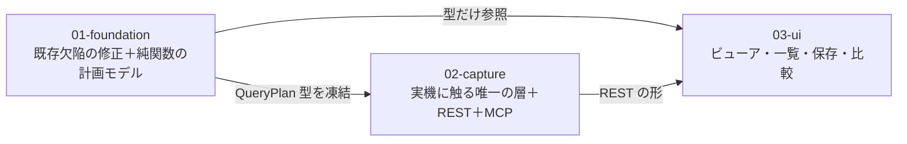

# 計画: SQL 実行計画の可視化（メタ plan / subtask 分割）

前提: `spec.md`（design で確定済み）、`design.md`。

## split 判定

`aidev-docs/DESIGN.md`「5.」の決定木に沿って判定した。判定軸は
**「そのピースは単独で検証・デリバリ可能か」**。

- **単独でデリバリ可能ではない**——REST だけ作っても使う画面が無く、画面だけ作っても計画が採れない。
  `QueryPlan` 型を共有する 1 つの機能で、**分けて出すと片方が意味をなさない**。
- **規模は大きい**——新規 8 ファイル・変更 6 ファイル・実機 2 台での検証。
- **漸進レビューの価値がある**——採取層（実機に触る唯一の層）と描画層はレビューの観点が別物。

→ **subtask 分割する**（1 PR は保ったまま、内部を漸進的に実装・レビュー）。

### design の 4 分割から 3 分割に変更した

`design.md`「plan への申し送り」は 4 分割（foundation / capture / viewer / list-and-tools）だったが、
**3 分割にする**。理由:

- **MCP は REST と同じ層の薄いラッパ**（`plan-capture` / `plan-cache` を呼ぶだけ）。
  別 subtask にすると、同じ関数の呼び出し規約を 2 回レビューすることになる。
- **UI を viewer と list に割ると、同じ Vue コンポーネント木（`PlanViewer` ↔ `PlanListPane`）が
  subtask を跨ぐ**。比較機能は両方に触るので、割れ目が汚い。
- 過剰分割の禁止（protocol「2.8」）に照らしても、3 で十分に漸進的。

## 割れ目（seam）

**`QueryPlan` 型が唯一の seam。** これを `01` で凍結すれば、`03`（UI）は実機なしで進められる。

## subtask と順序

| # | subtask | 内容 | dependsOn |
|---|---|---|---|
| 01 | `foundation` | F8（CCSID 65535）・F9（接続ロック漏れ）の修正、`plan-model.ts`（純関数）、`QueryPlan` 型の確定、単体テスト | — |
| 02 | `capture` | `plan-capture.ts`（採取と後始末）、`plan-cache.ts`（TOPN・権限判定）、`host-plan.ts`（REST 3 本）、MCP 2 本 | `01-foundation` |
| 03 | `ui` | `PlanViewer` / `PlanGraph` / `PlanListPane` / `planStore`、SqlPane への 2 モード導線、保存・JSON 入出力・比較 | `01-foundation`, `02-capture` |

各 subtask は `plan → coding → test → review` の独立サイクルを回す。
**子 test は単独検証可能な範囲に限定**し、実機をまたぐ結合検証は親の統合 test に集約する（protocol「2.8」）。

## 実装方針

1. **`01` で型を先に凍結する。** `plan-model.ts` は純関数（記録の配列 → `QueryPlan`）にし、
   実機なしで単体テストを書く。ここが厚いほど後段が楽になる。
2. **`02` は実機に触る唯一の層**。後始末（`ENDDBMON` / `DROP`）の不変条件をテストで固定する。
3. **`03` は `02` の REST に乗るだけ**。描画は自前 SVG（依存を足さない）。
4. F8・F9 は `01` の先頭に置く。**`02` の採取が両方を踏む**ため（`SELECT` する列に CCSID 65535 が
   混ざりうる／`no-rows` が `openQuery` の解放漏れを踏む）。

## リスク / 留意点

| リスク | 対応 |
|---|---|
| モニターが残る（`ENDDBMON` 漏れ） | `finally` で必ず通す＋開始前に残骸掃除。**不変条件をテストで固定** |
| explain 用接続に通常 SQL が混線 | プールキーに `"explain"` を足して分離（`design.md` A4） |
| 282 列・CCSID 65535 | 読み出しは**列を明示**（`SELECT *` 禁止）。F8 も直す |
| 版数差（7.5 の `3015`/`3006`） | 未知種別は `other` として素通し＋`unknownRecordTypes` に積む |
| 記録種別に推測でラベルを付けてしまう | **実測した 3 種（3000/3001/3020）だけ命名**（`design.md` A2） |
| web-ui のバンドル肥大 | 依存を足さない。`vue-tsc` を通す |
| PUB400 が遅い（1 往復 4〜7 秒） | 実機検証は親の統合 test にまとめ、往復回数を抑える |

## テスト方針

**子 subtask（単独検証）**

- `01`: `plan-model` の純関数テスト（記録の配列を固定値で与えてモデルを検証）、
  F8（CCSID 65535 の列がバイト列で返る）、F9（1 行も読まずに閉じても解放される）の回帰テスト。
- `02`: 採取手順の不変条件（`ENDDBMON`・`DROP` が必ず通る）を偽の接続で検証。
  権限拒否（`-443/38501`）の判定を単体で検証。
- `03`: コンポーネントテスト（`@vue/test-utils`）。グラフのレイアウト計算は純関数に切って単体で。

**親（統合 test・実機 2 台）**

- 実機(7.3) と PUB400(7.5) の両方で、`run` / `no-rows` の採取・索引助言を通す。
- **PUB400 で一覧が `-443/38501` により理由付きで無効化される**ことを確認（FR-9 の受け入れ）。
- 7.5 の `3015` が `unknownRecordTypes` に載ることを確認（版数差の可視化）。
- 既存 SQL 経路の非退行（通常実行・ページング・結果表の描画性能）。
- **索引の作成は実機で 1 回だけ試し、作った索引は必ず削除する**（破壊的操作。QTEMP の表に対して行う）。
