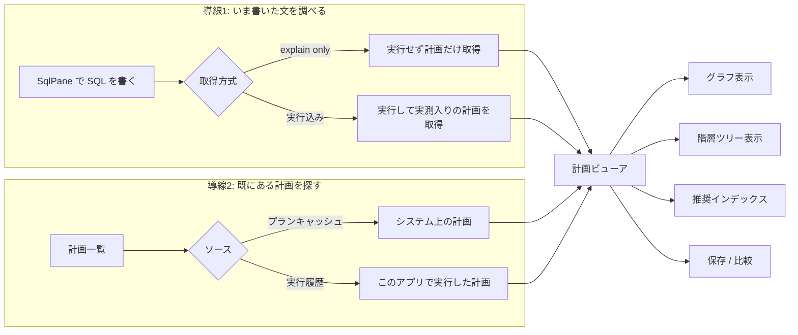

# 要件: SQL の実行計画を可視化する（ACS Visual Explain 相当）

## 背景 / 課題

本アプリの SQL 機能は「文を投げて結果表を返す」ところで止まっている
（`packages/web-ui/src/components/SqlPane.vue` / `/api/host/sql` / MCP `host_sql`）。
結果は見えるが、**遅いときに「なぜ遅いか」を知る手段がアプリ内に無い**。
全表走査なのか、索引が効いていないのか、結合方式が悪いのか、一時表を作っているのか——
それを見るには IBM i Access Client Solutions (ACS) の Run SQL Scripts に切り替えるしかない。

ACS には次の 2 つがあり、チューニングの起点になっている。

- **Visual Explain**: 1 つの SQL の実行計画をノードのグラフで表示し、各ノードの属性
  （推定行数・推定時間・使用した索引など）とオプティマイザの助言を見せる。
- **Performance Center**: システム上の計画（プランキャッシュ等）を一覧し、そこから
  個別の計画を開く。自分が書いた文だけでなく、**他が流した遅い SQL** にも辿り着ける。

ts5250 に SQL を書く導線がある以上、チューニングもここで完結させたい。

## 目的 / ゴール

- アプリ内で SQL の実行計画を取得・可視化し、**遅い SQL の原因を特定できる**状態にする。
- 単発の文の計画だけでなく、**計画の一覧から選んで見る**導線も持つ。
- 人間（web-ui）と AI（MCP）の両方から使えるようにする。

## スコープ

### 対象

1. **計画の取得**——`explain only`（文を実行しない）と `実行込み`（実行して実測を伴う）を
   ユーザーが切り替えられる。
2. **計画の可視化**——**グラフ表示**と**階層ツリー表示**を切り替えられる。ノードを選ぶと
   そのノードの属性が見える。
3. **推奨インデックスの表示**——オプティマイザが助言した索引（キー項目・期待効果）を出す。
4. **推奨インデックスの作成実行**——画面から `CREATE INDEX` まで踏める。
5. **計画の一覧**——**プランキャッシュ**（システム上の計画）と**このアプリの実行履歴**を
   ソース切替で一覧し、選んだ計画をビューアで開く。
6. **計画の保存と再表示**——取得した計画を保存し、あとから開ける。
7. **2 つの計画の比較**——チューニング前後など 2 つを並べて差分が分かる。
8. **出口**——web-ui の SQL ペインに統合し、加えて MCP ツールからも計画を取得できる。
9. **実機 2 台での検証**——実機（IBM i 7.3）と PUB400（7.5 とされる。要実測）。

### 対象外

- **ACS Performance Center の全体移植**。SQL パフォーマンスモニターの開始/停止、
  インデックス・アドバイザーの一覧画面、システム全体の健全性ダッシュボード等は含めない。
  今回は「**計画**」に閉じる。
- **ACS の見た目の再現**（ノードのアイコン・配色・レイアウトアルゴリズムの一致）。
  意味が伝わればよい。
- **計画に基づく自動チューニング提案**（AI による診断・書き換え提案）。
  MCP で計画を渡せるようにするところまでで、診断ロジックは持たない。
- **5250 画面（tn5250）側からの導線**。SQL ペインと MCP に閉じる。
- **既存 SQL 実行経路の仕様変更**。Visual Explain は追加であって、
  いまの `/api/host/sql` / `host_sql` の挙動は変えない。

## 機能要件

- **FR-1**（**2026-08-02 改訂**）SqlPane で対象の文を選び、**`実行して計画` / `行を返さず計画`** を
  選んで計画を取得できる。`行を返さず計画` は **SELECT 系のみ**。
  > 当初は `explain only`（文を実行しない）としていたが、research F7 の実測で実現不能と判明した
  > （prepare だけでは最適化記録が 0 件。完全実行では 18 件。最適化は `open` 時に起きる）。
  > `QSYS2.PROCESS_DETAILED_MONITOR` も 7 通りすべて `-443/42815`。詳細は `spec.md`「requirement からの変更点」。
- **FR-2** 取得した計画を、**グラフ**と**階層ツリー**で切り替えて表示できる。
- **FR-3** 計画のノードを選ぶと、そのノードの属性（種別・対象表/索引・推定行数・推定時間・
  実測値があればそれも）が読める。
- **FR-4** 計画に付随するオプティマイザの情報（なぜその方式を選んだか／索引を使わなかった理由等）を
  参照できる。
- **FR-5** 推奨インデックスがあれば一覧で示し、キー項目と期待効果を読める。
- **FR-6** 推奨インデックスを画面から作成できる。**破壊的操作**として確認を挟み、
  実行した事実を監査に残す。
- **FR-7** 計画の一覧画面を持ち、ソースを**プランキャッシュ**と**実行履歴**で切り替えられる。
- **FR-8** 一覧から計画を選ぶとビューアで開ける。
- **FR-9** プランキャッシュを参照できない接続では、**理由を明示して無効化**する
  （権限不足なら「要 \*JOBCTL 等」と出す。黙って空一覧にしない）。
- **FR-10** 計画を保存でき、あとから開き直せる。
- **FR-11** 2 つの計画を選んで並べ、差分が分かる形で比較できる。
- **FR-12** MCP ツールから、指定した SQL の計画を**構造化データ**で取得できる。
- **FR-13** 対応できない条件（版数・権限・文の種類）では、**何が理由でできないか**を返す。

## 非機能要件 / 制約

- **版数**: 実機 = **IBM i 7.3**（2026-08-01 に VRM と累積 PTF の 2 経路で実測済み。
  `.aidev/works/20260801-realhost-version-and-pwdlevel/test-result.md`）、PUB400 = **7.5 とされる**
  （過去記録からの引き写しで未実測。同 work の `review.md` に確度の違いが記録されている）。
  **7.3 と 7.5 の両方で動く経路**を選ぶ。片方でしか動かないなら、動かない側で理由を出す（FR-13）。
- **権限**: プランキャッシュ参照は特権（\*JOBCTL 等）を要する見込み。PUB400 は共用機のため
  取れない可能性が高い。**権限不足を fail-open にしない**（見えてはいけないものが見える／
  黙って空になる、のどちらも不可）。
- **信頼境界**: 推奨インデックスの作成はサーバー上の**破壊的操作**。AGENTS.md「3. 信頼境界」に
  照らし、誰に許すかを spec で決める。一般ユーザーに無条件で許さない。
- **監査**: ホストへの操作は既存の `withAudit` に乗せる（`packages/server/src/host-server-tools.ts`）。
- **MCP のトークン量**: 計画は木構造で量が出る。MCP は構造化データを返しつつ、
  丸ごと吐いて文脈を潰さないよう量を抑える。
- **既存機能の非退行**: 既存の SQL 実行の挙動・性能を変えない
  （`20260802-sql-table-virtualize` で 1000 行 582ms → 112ms にした結果表の性能も落とさない）。
- **秘密の非露出**: 計画やその一覧に他人の資格情報・秘密が混ざらないこと（AGENTS.md「4. 秘密の扱い」）。

## 完了条件 (受け入れ基準)

- [ ] SqlPane で書いた SELECT について、**`実行して計画` と `行を返さず計画` の両方**で計画が取得できる
      （**2026-08-02 改訂**。理由は FR-1 の注記）
- [ ] 同じ計画を**グラフ**と**階層ツリー**で切り替えて表示でき、ノード選択で属性が読める
- [ ] 推奨インデックスが一覧表示され、権限のある接続からは作成まで実行できる
      （実行前に確認があり、監査に残る）
- [ ] 計画一覧でソース（プランキャッシュ / 実行履歴）を切り替えられ、選んだ計画を開ける
- [ ] プランキャッシュを読めない接続では、**理由付きで無効化**される（空一覧で黙らない）
- [ ] 計画を保存し、あとから開き直せる
- [ ] 2 つの計画を並べて差分が分かる
- [ ] MCP ツールから計画を構造化データで取得できる
- [ ] **実機 (7.3) と PUB400 (7.5) の両実機**で上記を実測し、
      **版数差・権限差で挙動が分かれた点を記録**した
- [ ] 既存の SQL 実行（`/api/host/sql` / `host_sql` / 結果表の描画性能）が退行していない

## 未確定事項 / 確認したいこと

**research で潰すもの（実現性に直結。この工程の最大リスク）**

- **計画データの取得経路が未確定**。候補は複数あり、どれがこの実装の SQL ホストサーバ経路から、
  かつ 7.3 と 7.5 の両方で使えるかが分かっていない。
  - プランキャッシュ系の SQL サービス（`QSYS2.DUMP_PLAN_CACHE` 等）
  - データベースモニター（`STRDBMON` → `QQQ3000` 系テーブルを SQL で読む）
  - `QAQQINI` / デバッグモード＋ジョブログのオプティマイザメッセージ
  - いずれも本アプリの `packages/hostserver/src/db/` の経路（既存の `host_sql` 相当）で
    完結するか、`host_command` 併用が要るかを含めて確認する。
- **`explain only` の実現手段**。文を実行せずに計画だけ得る仕組みが上記経路で使えるか。
- **計画の構造**（ノードの種別・属性の項目）。ここが決まらないと表示もデータモデルも決まらない。
- **PUB400 の版数**。7.5 は伝聞なので**まず実測する**。
- **PUB400 で必要権限が取れるか**。取れないなら 7.5 側の検証範囲が狭まる（何を検証できないかを明示する）。

**spec で決めるもの**

- 計画の保存先。サーバー設定 / 個人設定 / 別ファイル のどれか（AGENTS.md「2. 保存先」の軸に照らす）。
- 推奨インデックス作成を許す権限境界（admin 限定か、接続の所有者に許すか）。
- 一覧の絞り込み軸（実行時間・スキーマ・ジョブ・最終実行時刻 など）と既定の並び。
- 比較の粒度（ノード単位の対応付けまで取るか、要約値の並置に留めるか）。
- MCP ツールの分割（1 ツールで計画取得か、一覧・取得・比較を分けるか）。

**進め方について（要相談）**

- 上記 9 項目は**1 PR に収めるには大きい**。計画の取得基盤（1〜2）ができて初めて
  4〜7 が意味を持つという依存もある。plan 工程で**サブタスク分割または複数作業への分割**を
  判定する前提で進める。
