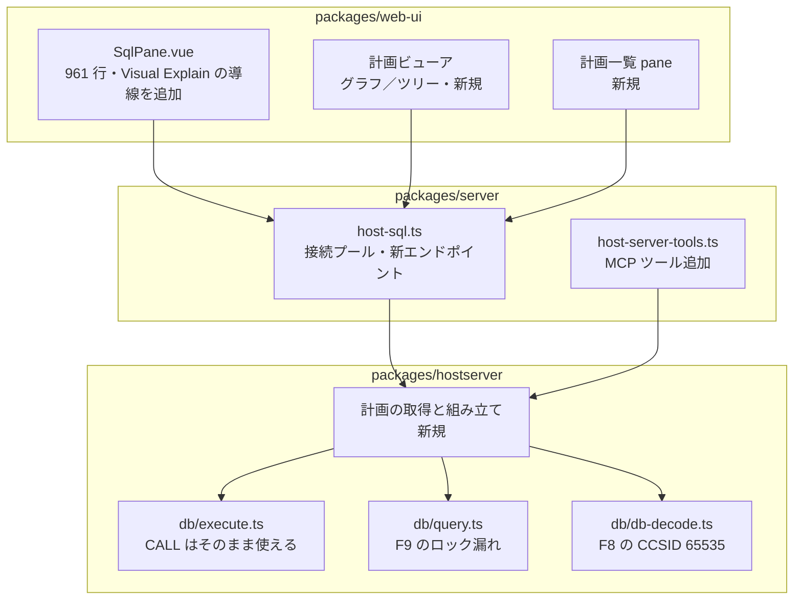

# 調査: SQL 実行計画の可視化（Visual Explain 相当）

実施 2026-08-02（UTC）。実機 **2 台**で測った。

| 機 | 版数 | 権限 | 接続 | 再現スクリプト |
|---|---|---|---|---|
| **実機** `192.0.2.1` | **V7R3M0** | `USER` = `*ALLOBJ *JOBCTL *SPLCTL *SAVSYS *AUDIT *IOSYSCFG`（全特権） | 平文 | `scripts/research-visual-explain{,2,3,4,5}.mjs` |
| **PUB400** `pub400.com` | **V7R5M0**（本調査で実測） | `USER` = **特殊権限なし**（`SPECIAL_AUTHORITIES` が NULL） | TLS / パスワードレベル 3 | `scripts/research-visual-explain-pub400.mjs` |

> **PUB400 の版数を実測した。** これまで `scripts/README.md` の表は過去記録からの引き写しだったが、
> サインオンサーバの VRM で **`V7R5M0`** を確認（`password level : 3` / `job 972895/QUSER/QZSOSIGN`）。
> 裏付けとして `DUMP_PLAN_CACHE` の引数が 7.3 の 3 個に対し PUB400 では 7 個（F13）＝別リリースであることも一致する。
> `QSYS2.GROUP_PTF_INFO` は PUB400 では権限不足（`-443/42501`）、`QSYS2.ENV_SYS_INFO` は
> **7.5 でも存在しない**（`-204`）ため、版数確認に使えたのは VRM 経路だけだった。

**この 2 台は「版数」と「権限」の両方が異なるため、片方だけでは切り分けられない差が両方測れた。**

## 調査の問い

- **Q1** 計画データをどの経路で取れるか。7.3 で使えるものは何か。
- **Q2** `explain only`（文を実行せずに計画だけ）は実現できるか。
- **Q3** 計画の構造（ノード種別・属性）はどうなっているか。
- **Q4** 「計画の一覧」の出所（プランキャッシュ）に何が使えるか。特権要件は。
- **Q5** 推奨インデックスはどこから取れるか。
- **Q6** 出力先（既存 SQL 経路 / pane / MCP）の仕様はどうなっているか。
- **Q7** PUB400（7.5）での差異と、特権の無いユーザーでの挙動は。

## 判明した事実

### F1: プランキャッシュ系の SQL サービスは 7.3 に揃っている

`QSYS2.SYSROUTINES` / `QSYS2.SYSPARMS` を実機で照会して確認（実機が一次ソース。
IBM Documentation は WebFetch が 403 で読めなかった）。

| ルーチン | 引数 |
|---|---|
| `QSYS2.DUMP_PLAN_CACHE` | `FILESCHEMA VARCHAR(10)`, `FILENAME VARCHAR(10)`, `PLAN_IDENTIFIER DECIMAL(20)` |
| `QSYS2.DUMP_PLAN_CACHE_TOPN` | `FILESCHEMA`, `FILENAME`, `TOPN INT`, `CATEGORY VARCHAR(20)` |
| `QSYS2.DUMP_PLAN_CACHE_PROPERTIES` | `FILESCHEMA`, `FILENAME` |
| `QSYS2.LIST_EXPLAINABLE_DETAILED` | 28 引数（`MSCHEMA`,`MNAME`,`MINIMUM_RUNTIME`,`QUERY_TIMESTAMP`,`SQL_STATEMENT`, 表参照 10 組, `TOP_N_RUN`,`TOP_N_TOTAL_TIME`,`QRO_HASH`） |
| `QSYS2.PROCESS_DETAILED_MONITOR` | `MONITOR_OPTION VARCHAR(264)`, `ARCHIVE_OPTION INT`, `ACTION_VALUE_1 VARCHAR(32740)`, `ACTION_VALUE_2/3`, `TARGET_SCHEMA`, `TARGET_NAME`, `MSCHEMA`, `MNAME` |
| その他 | `CLEAR_PLAN_CACHE` / `MODIFY_PLAN_CACHE(_PROPERTIES)` / `START,END_PLAN_CACHE_EVENT_MONITOR` / `IMPORT_PC_EVENT_MONITOR` / `COMPARE_MONITOR`,`COMPARE_MONITOR2` / `DATABASE_MONITOR_INFORMATION` / `PLAN_CACHE_TO_MEMORY_MONITOR` |

`DUMP_PLAN_CACHE_TOPN` の `CATEGORY` は **`'RUNTIME'` が有効**（実測）。
`DUMP_PLAN_CACHE` に `PLAN_IDENTIFIER = -1`（全件のつもり）は **`SQLCODE -438 / 22023` で拒否**される。

### F2: `CALL` は既存の非クエリ経路にそのまま乗る

`CALL QSYS2.DUMP_PLAN_CACHE_PROPERTIES('QTEMP','PCP')` が成功し、`QTEMP.PCP` に 53 行できた。
`statement-kind.ts:16` の `QUERY_HEADS` に `CALL` が無いため非クエリ扱いになり、
`execute.ts` の `prepareAndDescribe → execute` を通る。**新しいプロトコル実装は要らない。**

- ただし `hasParameterMarker`（`statement-kind.ts:94`）が `?` を弾くので、
  **引数はリテラルで埋める**必要がある（マーカーは使えない）。

### F3: `CALL` の結果セットは取得できない

`query(conn, "CALL QSYS2.LIST_EXPLAINABLE_DETAILED(...)")` は
`この結果セットは取得できません（rcClass=0, code=0）` で失敗する。
→ **結果セットを返すプロシージャは現状使えない。表を作る系（`DUMP_*`）だけが使える。**

なお `LIST_EXPLAINABLE_DETAILED` 自体も `CALL` で `SQLCODE -443 / 42815` になった
（28 引数の型・NULL の渡し方の問題と思われるが、F3 により結果セットを読めないので追わなかった）。

### F4: QTEMP は 1 接続の中で持続する

`CREATE TABLE QTEMP.PROBE0` → `INSERT` → `SELECT` が同一接続で通った。
1 接続 = 1 `QZDASOINIT` ジョブ（実測ジョブ名 `082044/QUSER/QZDASOINIT`）。
**複数文をまたぐ手順は、同じ接続を握り続ける必要がある。**

### F5: 自ジョブ DB モニター経路が、既存の SQL 接続だけで完結する（最重要）

```sql
CALL QSYS2.QCMDEXC('STRDBMON OUTFILE(QTEMP/VEMON) JOB(*) TYPE(*DETAIL)');
-- 調べたい文をここで実行
CALL QSYS2.QCMDEXC('ENDDBMON JOB(*)');
SELECT ... FROM QTEMP.VEMON WHERE ...;
```

`JOB(*)` は **その SQL 接続のジョブ自身**を指すため、他ジョブを監視する必要がない。
実測で、監視下に流した文の記録が `QTEMP.VEMON` に載った（記録種別 14 種）。

**プランキャッシュ（システム全体）を読む特権が無くても、自分の文の計画は採れる可能性が高い経路。**
ただし非特権ユーザーで `STRDBMON` が通るかは未検証（「未解決」参照）。

### F6: 計画ノードの実データが取れる

`SELECT C.COLUMN_NAME, T.TABLE_TEXT FROM QSYS2.SYSCOLUMNS C, QSYS2.SYSTABLES T WHERE …` を
監視下で実行したときの記録（抜粋・実測値）:

```
3001 tbl=QSYS2/SYSCOLUMNS idx=QSYS/QADBILLB  rows=669107 est=5716 ms=1 idxadv=N rc=I1
3001 tbl=QSYS2/SYSCOLUMNS idx=QSYS/QADBXSFKEY rows=15    est=0    ms=1 idxadv=N rc=I1
3001 tbl=QSYS2/SYSTABLES  idx=QSYS/QADBXLFN   rows=18695 est=2    ms=1 idxadv=N rc=I1
3020 tbl=QSYS2/SYSCOLUMNS                     rows=669107          ms=1 idxadv=Y rc=I1
3020 tbl=QSYS2/SYSTABLES                      rows=18695           ms=1 idxadv=Y rc=I1
```

- 出た記録種別: `1000, 3000, 3001, 3003, 3006, 3007, 3010, 3014, 3018, 3019, 3020, 3021, 3023, 3028, 5002, 5005`
- 使える主な列: `QQRID`(記録種別) / `QVQLIB`,`QVQTBL`(対象表) / `QVILIB`,`QVINAM`(使った索引) /
  `QQTOTR`(総行数) / `QQREST`(推定行数) / `QQEPT`(推定処理時間) / `QQIDXA`(索引助言の有無) /
  `QQIDXD`(助言キー) / `QQRCOD`(理由コード) / `QQ1000`(文テキスト) / `QQUCNT`(文の識別子＝**同一文の記録をまとめる鍵**)
- **ダンプ表は 282 列**。1 表に全記録種別が入り、種別ごとに意味を持つ列が変わる横持ち構造。

### F7: `explain only` は prepare では実現できない（測定で確定）

同一モニター下で 2 ケースを比べた:

| ケース | 経路 | 記録された件数 |
|---|---|---|
| A: 完全実行 | `query()`＝prepare + open + fetch | **18 件** |
| C: prepare のみ | `executeStatement()` に SELECT（prepare は成功し execute が `-518` で落ちる） | **0 件** |

→ **最適化記録は `open` の時点で出る。prepare だけでは 1 件も出ない。**

`QSYS2.PROCESS_DETAILED_MONITOR` の `MONITOR_OPTION` に
`EXPLAIN` / `*EXPLAIN` / `explain` / `EXPLAIN_STATEMENT` / `VISUAL_EXPLAIN` / `?` / 空 を試したが、
**7 通りすべて `SQLCODE -443 / 42815`**（一律なので、値の当てずっぽうでは進めない。文書化もされていない）。

→ **ACS の「Explain（実行しない）」と同義の経路は、SQL ホストサーバ経由では見つからなかった。**
代替は「未解決」と「spec への申し送り」に書く。

### F8: CCSID 65535 の文字列列で既存 SQL 経路が `RangeError` を投げる（既存欠陥）

`SELECT * FROM QTEMP.PCT` が
`RangeError: unsupported CCSID 65535 (supported: 37, 273, …)` で落ちる。

- 原因: `db-decode.ts:217` の `decodeText` が `isBinaryCcsid`（同ファイル `:259` に**定義済み**）を見ずに
  `codecForCcsid(ccsid)` を呼ぶ。CHAR / VARCHAR / LONGVARCHAR がこの経路。
  BLOB 側は `isBinaryCcsid` を通しており（`:275`）、**文字列列だけが取り残されている**。
- ダンプ表 282 列のうち該当は 3 列（`QQJFLD:CHAR` / `QQBLOB1:BLOB_LOCATOR` / `QXC43:CHAR`）。
- **`As400Error` ではなく `RangeError` が素通りする**ため、API では分類不能なエラーになる。
- 回避は可能（列を明示して `SELECT` する）だが、`SELECT *` を投げる利用者は普通にいる。

### F9: `openQuery` は「一度も回さずに閉じる」と接続ロックが残る（既存欠陥）

`openQuery()` の戻り値のジェネレータを **1 度も `next()` せずに `return()`** すると、
`query.ts:253-260` の `iterate()` の `finally`（`closeCursor` ＋ `release()`）が走らない
（ジェネレータ本体が開始していないため）。実測で、以降その接続のすべての要求が
`another query is in progress on this connection` になった。

- 本調査で「開くだけ開いて行を取らない」を試そうとして踏んだ。
- `explain only` の代替として「open して fetch せず閉じる」を実装するなら、**ここを直さないと踏む**。

### F10: 索引助言はシステム表からも取れる

`QSYS2.SYSIXADV`（実機で **2297 行**）。列:
`TABLE_NAME, TABLE_SCHEMA, KEY_COLUMNS_ADVISED, LEADING_COLUMN_KEYS, INDEX_TYPE, LAST_ADVISED,
TIMES_ADVISED, ESTIMATED_CREATION_TIME, REASON_ADVISED, MOST_EXPENSIVE_QUERY, AVERAGE_QUERY_ESTIMATE,
TABLE_SIZE, MTI_USED, MTI_CREATED, INCLUDE_COLUMNS, FIRST_ADVISED, …`

→ **文単位の助言**は DB モニターの `QQIDXA`/`QQIDXD`（F6）、**システム全体の助言**は `SYSIXADV`、と 2 経路ある。

### F11: 権限の差は 2 台で確保できた

- 実機の `USER`: `*ALLOBJ *JOBCTL *SPLCTL *SAVSYS *AUDIT *IOSYSCFG`（全特権）
- PUB400 の `USER`: **`SPECIAL_AUTHORITIES` が NULL ＝ 特殊権限なし**

→ 以下の F14・F15 は「特権なしの実利用者」での実測値。

### F13: 7.5 では `DUMP_PLAN_CACHE` の引数が増えている（版数差・実測）

| 機 | `QSYS2.DUMP_PLAN_CACHE` の引数 |
|---|---|
| 実機 (7.3) | `FILESCHEMA`, `FILENAME`, `PLAN_IDENTIFIER` の **3 個** |
| PUB400 (7.5) | 上記＋ `SQL_STATEMENT_TEXT_FILTER`, `INCLUDE_SYSTEM_QUERIES`, `IASP_NAME`, `QRO_HASH` の **7 個** |

- **同じ `CALL` 文が両方では書けない**（7.3 に 7 引数で投げれば引数個数違いで落ちる）。
  版数を見て呼び分けるか、両方に在る 3 引数形だけを使うかを spec で決める必要がある。
- サービスの**存在**自体は 7.5 にも 5 つとも在る
  （`DUMP_PLAN_CACHE` / `DUMP_PLAN_CACHE_TOPN` / `DUMP_PLAN_CACHE_PROPERTIES` /
  `LIST_EXPLAINABLE_DETAILED` / `PROCESS_DETAILED_MONITOR`）。

### F14: 自ジョブ DB モニター経路は「特権なし」でも通る（本作業の土台が確定）

PUB400 の `USER`（特殊権限なし）で、実機と**同じ手順がそのまま通った**:

```
STRDBMON OUTFILE(QTEMP/VEP) JOB(*) TYPE(*DETAIL)  → OK
（監視下で SELECT を実行）                          → OK
ENDDBMON JOB(*)                                    → OK
```

採れた記録種別: `1000 x4, 3000 x2, 3001 x1, 3006 x1, 3007 x2, 3010 x1, 3014 x1, 3015 x4,
3019 x1, 3020 x1, 3021 x1, 3023 x1, 3028 x1, 5002 x1, 5005 x1`

計画ノードの中身（自分の文のみ。共用機なので他者の文は一切見ていない）:

```
3000 tbl=QSYS2/SYSCOLUMNS rows=9923347 idxadv=Y
3001 tbl=QSYS2/SYSCOLUMNS idx=QADBILLB rows=9923347 idxadv=N
3020 tbl=QSYS2/SYSCOLUMNS rows=9923347 idxadv=Y
```

→ **主経路は特権を要求しない。**「自分が書いた SQL の計画を見る」は、どちらの機でも全利用者に提供できる。
ダンプ表が **282 列**である点と、CCSID 65535 の列が **`QQJFLD` / `QQBLOB1` / `QXC43` の 3 つ**である点も
7.5 で一致した（F8 の影響範囲は版数によらない）。

### F15: プランキャッシュ経路は特権なしで拒否される。拒否は検出できる（FR-9 の実装根拠）

PUB400 の `USER` で `CALL QSYS2.DUMP_PLAN_CACHE_TOPN('QTEMP','PCT400',5,'RUNTIME')` は
**`SQLCODE -443 / SQLSTATE 38501`** で失敗した（表は作られない。続く `SELECT` は `-204`）。

- **`38501` は「外部ルーチンの呼び出しが認可されなかった」**を示す。実機（全特権）では同じ呼び出しが成功する。
- → FR-9「理由を明示して無効化する」は、**この SQLCODE/SQLSTATE を掴んで文言に変換すれば実装できる**。
  推測に頼らず機械的に判定できる。
- 一方 `QSYS2.SYSIXADV` は **特権なしでも読めた**（PUB400 で 38052 行）。
  索引助言の一覧はプランキャッシュとは権限要件が違う。

### F12: 出力先（既存実装）の仕様

- **REST**: `packages/server/src/host-sql.ts` が `/api/host/sql` を持つ。**接続プール**
  （`deps.pool.acquire(key, open)`。key は `ユーザー名 + 接続先`）を使い、`pageSize` 指定時は
  `openQuery` ＋ `result-set-store` で結果セットを保持する。
- **MCP**: `packages/server/src/host-server-tools.ts` に `host_*` が 17 個
  （`host_sql` / `host_command` / `host_list_objects` …）。`withAudit({op})` で監査に載せる。
- **web-ui**: pane 構成（`PanePool.vue` / `PaneTabs.vue` / `WorkspaceNode.vue` ＋ `*Pane.vue` 12 種）。
  新しい一覧画面は既存の pane パターンに乗せられる。
- **web-ui にグラフ描画ライブラリは無い**（`packages/web-ui/package.json` の依存は `vue` と
  自社パッケージのみ）。グラフ表示は**自前 SVG か新規依存の追加**になる。

### F16: `PLAN_IDENTIFIER` の在りかは特定できなかった。ただし**2 段呼び出しは要らない**

`DUMP_PLAN_CACHE_TOPN` が作った表の数値列（`QQBGINT1`,`QQBGINT2`,`QQI5`,`QQI6`,`QQI7`,
`QQINT01`,`QQINT02`,`QQINT05`）を順に `PLAN_IDENTIFIER` として `DUMP_PLAN_CACHE` に渡したが、
**どれも当たらなかった**。

**対照実験で「当たった」と読み違えるのを防いだ**:

| 渡した id | 結果 |
|---|---|
| `999999999999`（あり得ない値） | 2 行・**すべて `QQRID=3018`** |
| `QQI6` の値 `149895072` | 2 行・文テキスト**不一致** |
| `QQI7` の値 `30` | 2 行・文テキスト**不一致** |

→ **「`QQRID 3018` が 2 行」＝見つからなかったときの空応答**。行が返ることを成功の判定に使ってはいけない。
（最初 `QQI5` で「2 行返った」のを成功と読みかけたが、文テキストの照合を入れて誤りと分かった。）

**しかし、これは設計上の問題にならない。** `DUMP_PLAN_CACHE_TOPN` が作る表は
**一覧と計画詳細の両方を含む**（TOPN=5 の実測で `QQUCNT` の異なり **6 文**、記録種別
`1000:5 3000:7 3003:1 3006:5 3007:1 3010:4 3014:5 3018:2 3019:5 3028:2 5002:5 5005:5`）。

→ **一覧から計画を開く導線（FR-8）は、同じ表を `QQUCNT` で絞るだけで実現できる。**
`PLAN_IDENTIFIER` を突き止めて 2 段目を呼ぶ必要がない（＝ F13 の版数差＝
`DUMP_PLAN_CACHE` の引数違いも回避できる）。

### F17: 同一 SQL で突き合わせた 7.3 / 7.5 差分（版数差の確定）

**まったく同じ文**（`SELECT COUNT(*) AS N FROM QSYS2.SYSCOLUMNS WHERE TABLE_SCHEMA = 'QSYS2'`）を
両機の監視下で流して比べた。前回は流した SQL が違ったため断定できなかった点を潰した。

| | 実機 (7.3) | PUB400 (7.5) |
|---|---|---|
| 記録種別 | `1000:6 3000:2 3001:1 ____ 3007:2 3010:1 3014:1 ____ 3018:2 3019:1 3020:1 3021:1 3023:1 3028:1 5002:1 5005:1` | `1000:6 3000:2 3001:1 **3006:1** 3007:2 3010:1 3014:1 **3015:4** 3018:2 3019:1 3020:1 3021:1 3023:1 3028:1 5002:1 5005:1` |
| 差分 | — | **`3006` と `3015` が 7.5 にだけ出る** |

計画ノードの中身（同一 SQL）:

```
7.3: 3000 tbl=QSYS2/SYSCOLUMNS rows=669108   est=5681 idxadv=Y rc=T3
     3000 tbl=QSYS2/SYSCOLUMNS rows=15       est=15   idxadv=N rc=T3
     3001 tbl=QSYS2/SYSCOLUMNS idx=QADBILLB  rows=669108 est=5716 idxadv=N rc=I1
     3020 tbl=QSYS2/SYSCOLUMNS rows=669108            idxadv=Y rc=I1

7.5: 3000 tbl=QSYS2/SYSCOLUMNS rows=9923353  est=6755 idxadv=Y rc=T3
     3000 tbl=QSYS2/SYSCOLUMNS rows=5242     est=5242 idxadv=N rc=T3
     3001 tbl=QSYS2/SYSCOLUMNS idx=QADBILLB  rows=9923353 est=7086 idxadv=N rc=I1
     3006 （一時ファイル。rc=A0）
     3020 tbl=QSYS2/SYSCOLUMNS rows=9923353            idxadv=Y rc=I1
```

→ **中核（`3000` / `3001` / `3020`）は版数をまたいで同じ形**。使う索引（`QADBILLB`）も理由コード
（`T3` / `I1`）も一致した。**単一のデータモデルで両版を扱える。**
7.5 だけに出る `3006`（一時ファイル）・`3015` は**未知種別として捨てずに保持し、
知らない種別は「その他ノード」として素通しする**設計にすれば版数差を吸収できる。

## 影響範囲



## 実現性 / リスク

**実現できる見込みが立ったもの**

- 実行込みの計画取得（F5 の自ジョブ DB モニター経路）。**2 台とも成功。特権不要**（F14）
- 計画ノードのグラフ／ツリー表示（F6 のデータが揃う。描画は自前 SVG）
- 推奨インデックスの表示（F6 の `QQIDXD` ＋ F10 の `SYSIXADV`。**どちらも特権不要**）
- 推奨インデックスの作成（`CREATE INDEX` は既存の非クエリ経路で通る。実機未試行）
- 計画の一覧（プランキャッシュ＝ F1 の `DUMP_PLAN_CACHE_TOPN`）。**ただし要特権**——
  PUB400 では `-443/38501` で拒否された（F15）
- 計画の保存・比較（ダンプ表をこちら側で保持すればよい。ホスト側の `COMPARE_MONITOR` に頼らなくてよい）

**実現できないもの / 大きく形が変わるもの**

- **`explain only`（ACS と同義の「実行しない」）は経路が見つからなかった**（F7）。
  取りうるのは次のいずれかで、いずれも要件どおりではない:
  1. **open して fetch せずに閉じる**——最適化記録は出る（F7 の A/C 比較より `open` が境目）が、
     **クエリは開始される**（行を返さないだけ）。UPDATE/DELETE には使えない。F9 の修正が前提。
  2. **プランキャッシュを引く**——既に誰かが流した文なら計画がある。新規の文には効かない。要特権。
  3. 実装しない（`実行込み` のみにする）。

**リスク**

- **特権（確定）**: 自ジョブ DB モニターは**特権不要**（F14）。プランキャッシュ一覧は**特権が要り、
  無ければ `-443/38501` で拒否される**（F15）。→ 機能ごとに提供可否が分かれる前提で設計する。
- **版数差（確定）**: `DUMP_PLAN_CACHE` の引数が 7.3 と 7.5 で違う（F13）。呼び分けが要る。
- **後始末**: `STRDBMON` を開始したまま落ちるとモニターが残り続ける。`ENDDBMON` を必ず通す設計が要る
  （接続が切れたときも含む）。
- **接続プールとの相性**: F4 より手順は同一接続を握り続ける必要がある。`host-sql.ts` のプールは
  ユーザー＋接続先で共有されるため、**モニター中に別の SQL が同じ接続へ流れると混ざる**。
- **CCSID 65535**（F8）と **接続ロック漏れ**（F9）は、この機能を作る過程で必ず踏む既存欠陥。
- **282 列の横持ち**（F6）をそのまま画面や MCP に流すと破綻する。記録種別ごとの射影が要る。

## 未解決

requirement で挙げた調査項目は埋まった。残っているのは次の 2 つで、いずれも
**spec の決定事項であって調査事項ではない**（測っても答えが出ない類）。

- **`explain only` をどう名乗るか**（F7）。「実行しない」は提供できないため、
  代替案 1（open して fetch しない）を採るなら UI の文言と適用範囲（SELECT 限定）を決める必要がある。
- **`DUMP_PLAN_CACHE` の版数差（F13）をどう吸収するか**。3 引数形に揃えるか、版数判定して使い分けるか。

**測っていないこと（正直に残す）**

- **`PLAN_IDENTIFIER` の在りかは分からないまま**（F16）。候補列 8 つを対照実験つきで潰したが特定できなかった。
  ただし F16 のとおり**この経路は使わなくてよい**ので、実装の障害にはならない。
  （`LIST_EXPLAINABLE_DETAILED` が結果セットを返す＝ F3 で読めない、という制約が根にある。）
- 索引の**作成**（FR-6）は実機で試していない（破壊的操作のため research では踏まない判断）。
  `CREATE INDEX` が既存の非クエリ経路を通ること自体は F2 から言えるが、**実行はしていない**。
- 7.5 だけに出る `3006` / `3015` の**中身は解析していない**（種別が出ることまで確認。
  どの列に何が入るかは未調査）。F17 の「未知種別は素通し」方針なら spec では困らない。

## spec への申し送り

1. **計画取得の主経路は「自ジョブ DB モニター」にする**（F5・F14）。**特権不要が実測で確定**しているので、
   これを土台にすれば全利用者に提供できる。プランキャッシュは一覧（他人の文を含む）専用と位置づけると、
   特権の要否が機能ごとにきれいに分かれる:
   - 自分の文の計画・索引助言 → **誰でも可**
   - システム全体の計画一覧 → **要特権**（無ければ `-443/38501`。F15）
   - 索引助言の一覧（`SYSIXADV`） → **誰でも可**（PUB400 で実測）
1a. **一覧は `DUMP_PLAN_CACHE_TOPN` 1 回で完結させる**（F16）。作られた表が一覧と計画詳細の
   両方を持つので、行を選んだら**同じ表を `QQUCNT` で絞る**だけでよい。
   これにより `DUMP_PLAN_CACHE` を呼ばずに済み、**F13 の版数差（3 引数 / 7 引数）を回避できる**。
1b. **記録種別は「知らないものを捨てない」**（F17）。中核（`3000`/`3001`/`3020`）は両版で同形だが、
   7.5 は `3006`/`3015` を追加で出す。未知種別は「その他ノード」として素通しする設計にする。
2. **`explain only` の扱いを決める**（F7）。要件どおりの「実行しない」は出せない。
   上記 1/2/3 のどれを採るか、UI の文言をどうするか（「実行しない」と書けない）を決める必要がある。
   → **要件の FR-1 と受け入れ基準の 1 つ目は書き換えが要る。**
3. **モニターの後始末を設計に入れる**（例外時・切断時にも `ENDDBMON` が走ること）。
4. **接続の占有方針を決める**（プールから借りた接続をモニター中は専有する／専用接続を張る）。
5. **F8・F9 を本作業で直すか、別作業に切り出すか決める**。どちらも既存欠陥で、
   この機能の前提になる（特に F9 は `explain only` の代替案 1 を採るなら必須）。
6. **282 列をどう畳むか**——記録種別（`QQRID`）ごとのノード型を定義し、
   `QQUCNT` で 1 文にまとめるデータモデルを spec で定義する。
7. **グラフ描画の手段**（自前 SVG か依存追加か）を決める。web-ui は現状 `vue` のみ（F12）。
8. **MCP は表を丸ごと返さない**。ノードの木＋要約に畳んで返す形を定義する。
