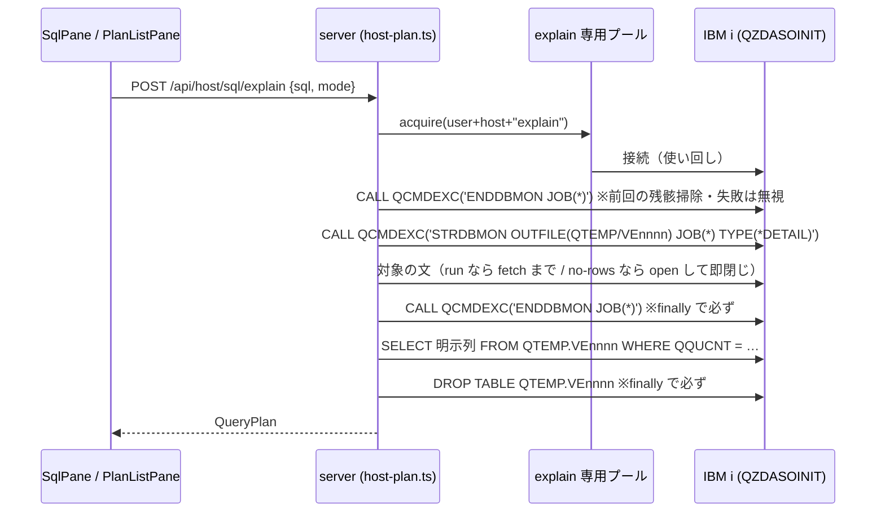

# 仕様: SQL 実行計画の可視化（ACS Visual Explain 相当）

前提: `requirement.md`（FR-1 は本 spec で改訂。下記「requirement からの変更点」）、`research.md`（F1〜F17）。

## 概要

SQL の実行計画を **自ジョブ DB モニター**で採取し、グラフ／ツリーで見せる。
計画の一覧は **プランキャッシュ**（要特権）と**このアプリの実行履歴**（特権不要）の 2 ソースから引く。
出口は web-ui の SQL ペイン＋新規の計画一覧ペイン、および MCP ツール 2 本。

**設計の柱は「特権の要否で機能を分ける」こと**（research F14/F15 が実測で裏付け）。

| 機能 | 経路 | 特権 |
|---|---|---|
| 自分が書いた SQL の計画 | `STRDBMON JOB(*)` → 文を実行 → `ENDDBMON` → QTEMP を読む | **不要** |
| 索引助言（その文について） | 同上（`QQIDXA`/`QQIDXD`） | **不要** |
| 索引助言（システム全体） | `QSYS2.SYSIXADV` を SELECT | **不要** |
| システム全体の計画一覧 | `QSYS2.DUMP_PLAN_CACHE_TOPN` | **要**（無ければ `-443/38501`） |

## requirement からの変更点（FR-1 の改訂）

**`explain only`（文を実行せずに計画だけ取る）は提供しない。** research F7 で、
prepare だけでは最適化記録が 1 件も出ず（完全実行では 18 件）、最適化は `open` の時点で起きると測れた。
ACS 内部と思われる `QSYS2.PROCESS_DETAILED_MONITOR` も 7 通りの引数すべてが `-443/42815` で、
SQL ホストサーバ経由に「実行しない explain」の道は見つからなかった。

代わりに **2 つの取得モード**を提供する。

| モード | 実体 | 文の種類 |
|---|---|---|
| `run`（実行して計画） | 文を最後まで実行し、結果行も返す | すべて |
| `no-rows`（行を返さず計画） | prepare + open して**1 行も fetch せずに閉じる** | **SELECT 系のみ** |

- **UI に「実行しない」とは書かない。** 文言は「行を返さずに計画だけ取る（**文はホストで実行されます**）」。
  できないことを匂わせないための明示的な判断（AGENTS.md「利用者に見えるメッセージは日本語で、文体を揃える」）。
- `no-rows` は非 SELECT では選べない（`isNonQueryStatement` が真なら選択肢を出さない）。

→ **`requirement.md` の FR-1 と受け入れ基準 1 つ目は、この 2 モードに読み替える**（requirement.md 側も改訂済み）。

## 設計方針

### 1. 採取は「explain 専用の接続プール」で行う



**なぜ専用プールか**（`host-sql.ts` の既存プールを使わない理由）:

- 既存プールは `(ユーザー, 接続先)` で共有される。**モニター中に別の SQL が同じ接続へ流れると、
  他人の文まで採取してしまう**（研究 F4 のとおり QTEMP と監視はジョブ単位）。
- 一方で毎回新規接続にすると PUB400 で 4〜7 秒かかる（`scripts/README.md`）。
- → **キーに `"explain"` を足した別プール**にして、使い回しつつ explain 以外を流さない。
  同一キーの同時要求は `conn.acquire()` が直列化するので取り違えは起きない。

**後始末の不変条件**:

- `ENDDBMON` と `DROP TABLE` は **`finally` で必ず通す**。
- 開始前にも `ENDDBMON` を投げて**前回の残骸を掃除する**（動いていなければエラーになるので**無視する**）。
- QTEMP の表名は**採取ごとに一意**にする（残骸と衝突させない）。
- 接続を捨てるときは QTEMP ごと消えるので、最悪でもホストに残らない。

### 2. 一覧は `DUMP_PLAN_CACHE_TOPN` 1 回で完結させる

research F16 のとおり、TOPN ダンプが作る表は**一覧と計画詳細の両方**を含む
（TOPN=5 で `QQUCNT` の異なり 6 文、`3000`/`3003`/`3006`/`3019` 等の詳細記録つき）。

- 一覧 = その表を `QQUCNT` で集約したもの。
- 行を選ぶ = **同じ表を `QQUCNT` で絞る**だけ。**2 段目の `DUMP_PLAN_CACHE` を呼ばない。**
- → `PLAN_IDENTIFIER` の在りかが不明である問題（F16）と、
  **7.3=3 引数 / 7.5=7 引数という版数差（F13）を両方回避できる。**
- `CATEGORY` は実測で有効だった **`'RUNTIME'`** 固定。`TOPN` は既定 20（UI で 10/20/50/100）。
- ダンプ表は**その要求の間だけ**保持し、`finally` で `DROP`。ページングはしない（TOPN が上限）。
- **7.5 の `SQL_STATEMENT_TEXT_FILTER` は使わない**（版数分岐を持ち込まない）。
  文テキストでの絞り込みは**取得後にこちら側**で行う。

### 3. 記録種別 → ノード種別の写像は 1 か所に置き、知らない種別は捨てない

research F17 で、中核（`3000`/`3001`/`3020`）は 7.3 と 7.5 で同形と確認できた一方、
**7.5 だけが `3006`/`3015` を出す**。

- 写像は **`planNodeKind(qqrid)` の 1 関数**に閉じる。
- **測って裏を取った種別だけを名前付きノードにする。** 現時点で裏が取れているのは:

  | QQRID | 実測した中身 | ノード種別 |
  |---|---|---|
  | `3000` | 対象表・総行数・推定行数・理由コード（`T1`/`T3`）。**表ごとに 1 件**（結合で 2 件出た） | `table-access` |
  | `3001` | 対象表＋**使った索引**（`QADBILLB`）・総行数・推定行数・理由コード（`I1`） | `access-method` |
  | `3020` | 対象表・`QQIDXA='Y'`・`QQIDXD`＝助言キー列 | `advice` |

- **それ以外（`3003`,`3006`,`3007`,`3010`,`3014`,`3015`,`3018`,`3019`,`3021`,`3023`,`3026`,`3028`,
  `5002`,`5005` …）は `other` として、値の入っていた列を属性一覧で見せる。推測でラベルを付けない。**
- design 工程で**種別の出現条件までは実測した**（`3003`=集約時 / `3026`=UNION のみ / `3023`=集約・
  副問合せ・UNION / `3015`=7.5 のみ）。**ただし中身は未確認なので名前は与えない。**
  意味を足すのは、列の中身を実測で確かめてからにする（後続作業でよい）。
  **IBM の記録レイアウト文書を根拠にする場合は出典をコメントに書く**
  （AGENTS.md「仕様・決定・標準を参照する」）。

### 4. 階層は「文 → クエリブロック → ノード」の 3 層（design で確定）

> ⚠ **2026-08-08 訂正**: 結合があるときは**ダイヤル（`QQJNP`）が 1 層挟まる**——
> 「文 → クエリブロック → ダイヤル → ノード」。この節の結論「真の演算子木は組まない」は
> **結合については誤り**だった（`design.md` の 4. と A1 の訂正に実測表がある）。
> 見た列が `QQQDTN` / `QQQDTL` の 2 列だけで、282 列を見ていなかったのが原因。
> 結合していない計画は下のとおり 3 層のままで正しい。

- **`QQQDTN` はクエリブロックの番号**。UNION を流すと `1` / `2` に割れ、集合演算の記録（`3026`）が
  後続ブロックに付いた。**演算子の親子ではない。** 副問合せは平坦化されてブロックが増えなかった。
- **`QQQDTL` は階層に使えない**（ほぼ全て `1`、`3019` だけ `0`）。
  `3019` を「文レベルの要約でノードではない」と切り分けるためだけに使う。
- **`3000` は表ごとに 1 件**（結合で 2 件出て、`QVQTBL` に対象表が入る）。

→ ~~**真の演算子木は組まない。推定で親子をでっち上げない**~~（`design.md` 判断 A1 の訂正）。
**結合は `QQJNP` に順位が記録されているので左深の木に組む**（推定ではない）。
それ以外は従来どおり並べる——**でっち上げない**方針そのものは変えていない。
モデルは `QueryPlan → PlanBlock[]（+ joinTree）→ PlanNode[]`。詳細は `design.md`。

### 5. グラフ描画は自前 SVG（依存を足さない）

AGENTS.md「パッケージ分割と入口（バンドルサイズ）」に、`@ts5250/scs` のバレル参照で
**359,853 → 1,458,480 バイト（約 4 倍）**にした実例が明記されている。web-ui の依存は現在 `vue` のみ。
→ **描画ライブラリ（d3 / dagre / cytoscape 等）は追加しない。**

- レイアウトは**層ごとの単純な整列**（深さ = 段、同じ深さは縦に並べる）。総当たりの力学配置はしない。
- ノードは `<rect>`＋`<text>`、辺は直線／直角折れ線。**配色は CSS 変数**（`docs/UI-DESIGN.md`）。
- ノード数が多いときは**上位 N を描いて残りは畳む**（既定 60。超過は「他 n 件」で示す）。

## 対象範囲

### 追加

| ファイル | 内容 |
|---|---|
| `packages/hostserver/src/db/plan-capture.ts` | `STRDBMON` → 文 → `ENDDBMON` → 読み出し → `DROP` の採取手順 |
| `packages/hostserver/src/db/plan-model.ts` | モニター記録 → `QueryPlan` への畳み込み（`planNodeKind` を含む） |
| `packages/hostserver/src/db/plan-cache.ts` | `DUMP_PLAN_CACHE_TOPN` による一覧＋選択取得、権限拒否の判定 |
| `packages/server/src/host-plan.ts` | REST 3 本（explain / 一覧 / 一覧からの計画取得） |
| `packages/web-ui/src/components/PlanViewer.vue` | グラフ／ツリー切替・ノード属性・索引助言・比較 |
| `packages/web-ui/src/components/PlanGraph.vue` | 自前 SVG のグラフ描画 |
| `packages/web-ui/src/components/PlanListPane.vue` | 計画一覧ペイン（ソース切替） |
| `packages/web-ui/src/planStore.ts` | 保存（ブラウザ）／JSON 入出力／実行履歴 |

### 変更

| ファイル | 内容 |
|---|---|
| `packages/hostserver/src/db/db-decode.ts` | **F8 修正**: `decodeText` を `isBinaryCcsid` 経由にする |
| `packages/hostserver/src/db/query.ts` | **F9 修正**: 1 行も読まずに閉じてもカーソル・接続が解放される／`no-rows` 用の入口 |
| `packages/hostserver/src/index.ts` | 追加分の公開 |
| `packages/server/src/host-server-tools.ts` | MCP ツール 2 本 |
| `packages/web-ui/src/components/SqlPane.vue` | 「計画」ボタン（2 モード）と計画タブ |
| `packages/web-ui/src/composables/opMessages.ts` | 追加文言（AGENTS.md: 文言は 1 か所） |
| `scripts/README.md` | 実機表の PUB400 行を**実測値に更新**（research で `V7R5M0` を確認済み） |

## インターフェース / データ構造

### 計画モデル（`plan-model.ts`）

```ts
/** 1 つの実行計画。画面・MCP・保存の共通形 */
export interface QueryPlan {
  /** 文テキスト（QQ1000） */
  statement: string;
  /** どう採ったか */
  captured: "run" | "no-rows" | "plan-cache";
  /** 採取時刻（ISO 8601） */
  at: string;
  /** ホストのジョブ名（自ジョブ採取のときだけ） */
  job?: string;
  /** クエリブロック（QQQDTN 単位。UNION 等で複数になる。設計方針 4） */
  blocks: PlanBlock[];
  /** 索引助言（この文について） */
  advice: IndexAdvice[];
  /** 要約（一覧・比較で使う） */
  summary: PlanSummary;
  /** 畳めなかった記録種別（版数差の可視化。例 [3015]） */
  unknownRecordTypes: number[];
}

export interface PlanBlock {
  /** QQQDTN の値 */
  number: number;
  nodes: PlanNode[];
}

export interface PlanNode {
  id: string;
  kind: PlanNodeKind;
  /** 元の記録種別（QQRID）。未知種別も必ず保持する */
  recordType: number;
  /** 画面のノードに出す短い表示名 */
  label: string;
  table?: { schema: string; name: string };
  index?: { schema?: string; name: string };
  /** QQTOTR */
  totalRows?: number;
  /** QQREST */
  estimatedRows?: number;
  /** QQEPT */
  estimatedMs?: number;
  /** QQRCOD */
  reasonCode?: string;
  /** 属性パネル用。未知種別はここに生の列値が入る */
  attributes: PlanAttribute[];
}

export type PlanNodeKind = "table-access" | "access-method" | "advice" | "other";

export interface PlanAttribute { label: string; value: string }

export interface IndexAdvice {
  table: { schema: string; name: string };
  /** QQIDXD をそのまま（例 "DBIREL, DBILB2, DBILFI, DBIATR"） */
  keyColumns: string;
  /** 生成した CREATE INDEX 文（利用者に見せてから実行する） */
  createStatement: string;
  reasonCode?: string;
  estimatedRows?: number;
}

export interface PlanSummary {
  /** ノード数 */
  nodeCount: number;
  /** 走査した表（重複なし） */
  tables: string[];
  /** 使った索引（重複なし） */
  indexes: string[];
  /** 索引助言の件数 */
  adviceCount: number;
  /** 推定処理時間の最大値（ms） */
  maxEstimatedMs?: number;
  /** 実測の経過（run のときだけ） */
  elapsedMs?: number;
}
```

### 採取（`plan-capture.ts`）

```ts
export interface CaptureOptions {
  /** "run" は fetch まで、"no-rows" は open して即閉じる */
  mode: "run" | "no-rows";
  /** run のときの取得上限（既定は既存 SQL 経路と同じ） */
  limit?: number;
}

/**
 * 自ジョブ DB モニターで実行計画を採る。
 * **この関数は接続を専有する**（モニター中に他の SQL を流してはならない）。
 * ENDDBMON と DROP TABLE は finally で必ず通す。
 */
export async function capturePlan(
  conn: DbConnection,
  sql: string,
  opts: CaptureOptions
): Promise<{ plan: QueryPlan; rows?: Row[]; columns?: ColumnMeta[] }>;
```

### 一覧（`plan-cache.ts`）

```ts
export interface PlanListResult {
  /** 参照できたか。false なら reason に理由が入る */
  available: boolean;
  /** 参照できない理由（利用者に見せる日本語） */
  reason?: string;
  items: PlanListItem[];
}

export interface PlanListItem {
  /** この一覧の中での識別子（QQUCNT 由来） */
  id: string;
  statement: string;
  /** 並び替えに使う実行時間 */
  runtimeMs?: number;
  lastRunAt?: string;
  tables: string[];
}

/** プランキャッシュ上位 N。特権が無ければ available:false（-443/38501 を判定） */
export async function listPlansFromCache(conn: DbConnection, topN: number): Promise<PlanListResult>;

/** 一覧の 1 件を計画に畳む（同じダンプ表を QQUCNT で絞る。2 段目の CALL はしない） */
export async function planFromCache(conn: DbConnection, topN: number, id: string): Promise<QueryPlan>;
```

### REST（`host-plan.ts`）

| メソッド / パス | body / query | 応答 |
|---|---|---|
| `POST /api/host/sql/explain` | `{ source, sql, mode: "run"\|"no-rows", maxRows? }` | `{ plan, rows?, columns?, connectMs }` |
| `GET /api/host/plans` | `?source=…&kind=cache&topN=20` | `{ available, reason?, items }` |
| `GET /api/host/plans/:id` | `?source=…&topN=20` | `{ plan }` |

- **索引の作成に専用エンドポイントは作らない。** 生成した `CREATE INDEX` 文を
  **既存の `/api/host/sql` に投げる**。理由: SQL ペインに同じ文を打てば通る（`isNonQueryStatement` →
  `executeStatement`）ので**新しい権限は増えない**うえ、監査・エラー処理・文言が既存経路に乗る。
- 実行履歴の一覧はサーバーを経由しない（ブラウザ側に持つ）。

### MCP（`host-server-tools.ts`）

| ツール | 入力 | 出力 |
|---|---|---|
| `host_sql_explain` | `{ connection, sql, mode }` | 要約＋ノード木＋索引助言（**行データは返さない**） |
| `host_plan_list` | `{ connection, topN }` | 一覧、または `available:false` と理由 |

- **トークン量を抑える**: ノードは既定 **50 件まで**（超過は `truncated: true` と総数を添える）、
  `attributes` は既定で**返さない**（`detail: true` のときだけ）。
- 既存に倣い `withAudit({ op })` に載せる。

## 振る舞いの詳細

### `no-rows` モード（F9 の修正が前提）

1. prepare + open（＝ここで最適化が走る。research F7）
2. **1 行も fetch しない**
3. カーソルを閉じ、接続を解放する

現状の `openQuery` は、返したジェネレータを一度も回さずに `return()` すると
`finally` が走らず**接続ロックが残る**（research F9・実測）。
→ **不変条件「1 行も読まずに閉じても、カーソルと接続が必ず解放される」を満たすように直し、
回帰テストで固定する。**

### 権限が無いとき（FR-9）

- `DUMP_PLAN_CACHE_TOPN` が **`SQLCODE -443 / SQLSTATE 38501`** で失敗したら、
  `available: false` ＋ 理由「この接続では計画一覧を参照できません（システム全体の計画を見るには
  \*JOBCTL 等の特権が要ります）」を返す。**空一覧で黙らない。**
- 一覧ペインは**ソース切替を残したまま**その旨を表示する（実行履歴側は使える）。
- **他の SQLCODE は「権限」と決めつけない**——そのまま原因として表示する。

### 索引の作成（FR-6）

1. 助言から `CREATE INDEX` 文を組み立てて**画面に出す**。
2. 利用者が確認して実行を選ぶ（**確認なしでは実行しない**）。
3. 既存の `/api/host/sql` へ送る（監査に載る）。
4. 結果（成功／`SQLCODE`）をそのまま見せる。
- ホスト側の権限が最終判定。アプリは追加のゲートを設けない（SQL ペインと同じ扱い、という決定）。

### 保存・比較（FR-10 / FR-11）

- 保存はブラウザ（`planStore.ts`）。**秘密は含まれない**が、文テキストは含まれるので
  保存はユーザーの明示操作でのみ行う。
- JSON の入出力で共有・退避ができる。形式は `QueryPlan` そのもの＋`version` フィールド。
- 比較は 2 つの `QueryPlan` を左右に並べ、**`summary` の差**（表・索引・推定行数・助言件数）を上部に出し、
  ノードは種別＋対象表で対応付けて色分けする。対応が付かないノードは「片側のみ」として示す。

### 版数差の見せ方

`unknownRecordTypes` が空でなければ、ビューアの下部に
「このホストでは未対応の記録種別が n 件ありました（その他ノードとして表示しています）」と出す。
**黙って捨てない**（7.5 の `3006`/`3015` がここに出る想定）。

## ドメイン固有の考慮（AGENTS.md）

- **依存を足さない**（バンドルサイズ規律）→ グラフは自前 SVG。
- **ログは stderr / `console.*` 禁止**。hostserver 側は `@ts5250/base` の sink 経由。
- **ピュアロジック層は Node API 非依存**——`plan-model.ts` は純関数（記録の配列 → `QueryPlan`）にして
  `node:*` を触らない。I/O は `plan-capture.ts` 側。**テストが書きやすい形に割る。**
- **web-ui の文言は `composables/opMessages.ts` に集約**し、テストは定数を参照する。
- **UI は `docs/UI-DESIGN.md` に従う**（テーマ変数・ボタン意匠・ポップオーバーは同時に 1 つ）。
- **`vue-tsc` を通す**（root の `tsc -b` は web-ui を見ない）。
- **秘密を成果物に書かない**——計画には文テキストが載る。**ログに文テキストを出さない**
  （SQL にリテラルの秘密が埋まっている可能性がある）。

## エラー処理 / 異常系

| 事象 | 扱い |
|---|---|
| `STRDBMON` が失敗 | 計画は採れないとして、`SQLCODE` を添えて理由を返す。**文は実行しない** |
| 文の実行が失敗 | `finally` で `ENDDBMON`・`DROP` を通したうえで、SQL エラーをそのまま返す |
| `ENDDBMON` が失敗 | 記録は残す（採取は成功しうる）。**警告として返す**——モニターが残った可能性を伝える |
| ダンプ表が空 | 「この文からは計画記録が採れませんでした」。**空の計画を成功として返さない** |
| CCSID 65535 の列 | **F8 修正後**は BLOB と同じくバイト列として返す（`RangeError` を投げない） |
| 未知の記録種別 | `other` ノード＋`unknownRecordTypes` に積む |
| `-443/38501`（一覧） | 権限不足として理由付きで無効化 |
| 接続が切れた | プールの既存方針（`host-sql.ts` の retry）に従う。**SQL エラーでは再試行しない** |

## 受け入れ基準との対応

| requirement の受け入れ基準 | 満たし方 |
|---|---|
| 2 つの取得モードで計画が取れる（**改訂**） | `capturePlan` の `run` / `no-rows`（設計方針 1・「requirement からの変更点」） |
| グラフ／ツリー切替・ノード属性 | `PlanViewer.vue` ＋ `PlanGraph.vue`。属性は `PlanNode.attributes` |
| 推奨インデックスの表示と作成 | `IndexAdvice`＋確認ダイアログ＋既存 `/api/host/sql` 経由（監査に載る） |
| 一覧のソース切替と計画表示 | `PlanListPane.vue`。cache は `plan-cache.ts`、履歴は `planStore.ts` |
| 権限が無いとき理由付きで無効化 | `-443/38501` を判定して `available:false` ＋ 理由（実測済み） |
| 計画の保存と再表示 | `planStore.ts`（ブラウザ）＋ JSON 入出力 |
| 2 つの計画の比較 | `PlanViewer.vue` の比較モード（`summary` 差＋ノード対応付け） |
| MCP から構造化データで取得 | `host_sql_explain` / `host_plan_list` |
| **7.3 と 7.5 の両実機で実測し差異を記録** | 両機で採取・一覧・助言を通し、`test-result.md` に版数差（`3006`/`3015`・特権差）を記録 |
| 既存 SQL の非退行 | explain は**別プール・別エンドポイント**。既存経路のコードパスを変えない。<br>F8・F9 の修正は回帰テストで固定 |

## 規模について（plan への申し送り）

**1 PR には大きい。** 採取基盤（`plan-capture` / `plan-model`）ができて初めて
一覧・比較・助言・MCP が意味を持つという依存もある。
plan 工程で **subtask 分割**（protocol「2.8」）を判定すること。分割するなら目安は:

1. 基盤（F8・F9 の修正＋`plan-capture`＋`plan-model`＋記録種別の実測）
2. web-ui の計画ビューア（グラフ／ツリー／属性／助言表示）
3. 一覧（プランキャッシュ＋実行履歴）と索引作成
4. 保存・比較・MCP
