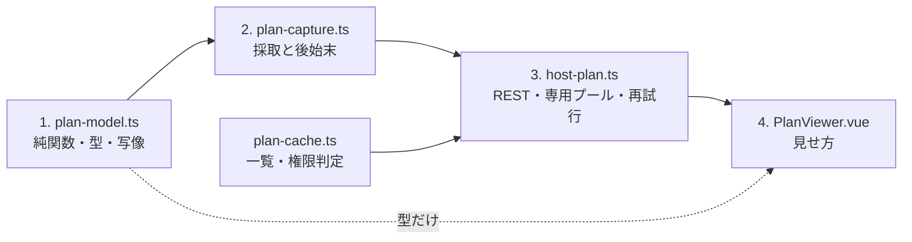
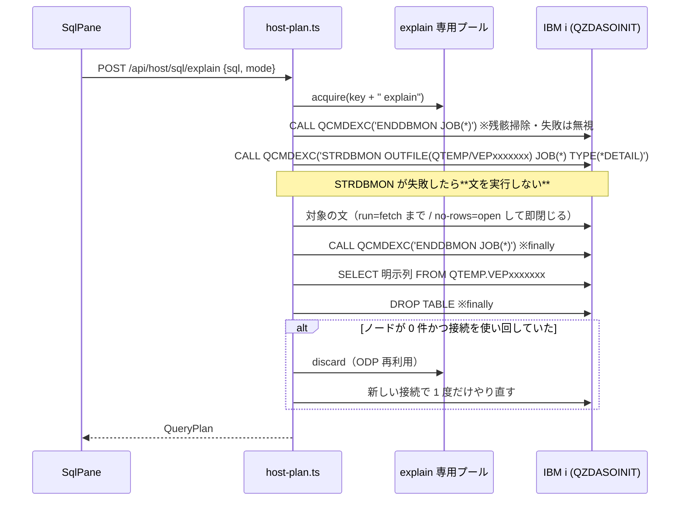

# レビューガイド: SQL 実行計画の可視化（ACS Visual Explain 相当）

**変更 14 ファイル / 新規 21 ファイル（うちテスト 9・スクリプト 7）。実装は約 2,470 行。**
どこから読むと速いかと、**実測に基づく非自明な判断**を並べる。

## 30 秒で分かる要約

SQL の実行計画を採って見せる。ACS の Visual Explain と Performance Center に当たる。

- **採取は「自ジョブの DB モニター」**（`STRDBMON JOB(*)`）。**特権が要らない**——
  特殊権限を持たない PUB400 のユーザーで通ることを実測した。
- **プランキャッシュの一覧だけ特権が要る**。無い場合は `-443/38501` を掴んで**理由を出して無効化**する。
- **`explain only`（文を実行しない）は提供できない。** IBM i に経路が無いことを実測で確かめ、
  要件を「行を返さない」モードに改訂した。**UI で「実行しない」と書いていない。**

## 読む順番（おすすめ）



1. **`packages/hostserver/src/db/plan-model.ts`**（純関数）——ここが分かれば全体が分かる
2. **`packages/hostserver/src/db/plan-capture.ts`**（実機に触る唯一の層）
3. **`packages/server/src/host-plan.ts`**（REST・接続の扱い）
4. **`packages/web-ui/src/components/PlanViewer.vue`**（見せ方）

## 処理の流れ



## レビューで見てほしい 6 点

### 1. なぜ「文 → クエリブロック → ノード」の 3 層で、木ではないのか

`plan-model.ts` の冒頭。**DB モニターの記録は演算子の親子を持たない。**

design 工程で結合・集約・副問合せ・UNION を実機に流して調べた結果:

- `QQQDTN` は**クエリブロックの番号**（UNION で `1`/`2` に割れ、集合演算の記録 `3026` が後続に付いた）
- `QQQDTL` は階層に使えない（ほぼ全て `1`、`3019` だけ `0`）
- 副問合せは平坦化されてブロックが増えなかった

→ **推定で木を組まない**。誤った依存関係を見せるほうが、階層が浅いことより害が大きい（`design.md` A1）。
グラフの縦線は「同じブロックに属する」ことだけを示し、**凡例でそう明記している**。

### 2. なぜ記録種別に 3 つしか名前が無いのか

`plan-model.ts` の `kindOf`。**中身を実測した種別だけ**が名前を持つ:

| QQRID | 実測した中身 | 種別 |
|---|---|---|
| `3000` | 対象表・総行数・推定行数・理由コード。**表ごとに 1 件** | `table-access` |
| `3001` | 対象表＋**使った索引**・総行数・推定行数 | `access-method` |
| `3020` | `QQIDXA='Y'` と助言キー列 `QQIDXD` | `advice` |

残り（`3003`/`3006`/`3007`/`3015`/`3021`/`3023`/`3026`/`3028`/`5002`/`5005` …）は
**`other` として「記録 nnnn」＋生の属性**で見せる。出所の無いラベルは、そのまま利用者の判断材料に
なってしまう（`design.md` A2）。**出現条件までは実測済み**（`3026` は UNION のみ、`3015` は 7.5 のみ）。

### 3. 「未対応の記録種別」の数え方（ノイズと信号）

`plan-model.ts` の `CONSUMED_RECORDS`。**`1000` と `3019` は数えない**——
こちらが意図して使っている記録（文テキストの在りか / 文レベルの要約）だから。

数えると**毎回「未対応の記録種別があります」と出る**ことになり、
**7.5 だけに出る `3015` という本来見せたい信号がノイズに埋もれる**。実機の疎通で気づいた。

### 4. ODP 再利用——**この PR で一番地味に効いている修正**

`plan-capture.ts` の末尾と `host-plan.ts` の `withExplainConn`。

実機で測った挙動:

```
1 回目: nodes=12    2 回目: nodes=12
3 回目以降: nodes=0      ← 最適化記録が出ない
別の文にすると: nodes=13  ← また出る
```

**同じ接続で同じ文を 2 回完全オープンすると、以降 IBM i はオープン済みデータパス（ODP）を
再利用して完全オープンを避ける。** そのとき最適化記録が出ない。

しかも **`QQ1000` を持つ記録は引けてしまう**ので、件数だけ見ていた実装は
**0 ノードの空の計画を「成功」として返していた**。

対応は 2 段:
- **ノード数 0 も失敗として弾く**（理由に「オープン済みデータパスを再利用」と書く）
- **使い回した接続なら、新しい接続で 1 度だけやり直す**（新しいジョブに ODP のキャッシュは無い）

既存 SQL 経路の「切れていたら 1 度だけ張り直す」（`host-sql.ts`）と同じ作法にしてある。

**単体テストでは出なかった欠陥**——偽の接続では ODP 再利用が起きない。実機で REST を通して出た。

### 5. 権限の分かれ方（FR-9）

`plan-cache.ts` の `isAuthorizationFailure`。**`SQLCODE -443` かつ `SQLSTATE 38501` だけ**を
権限不足と判定する。他の SQLCODE を権限と決めつけると、利用者が無駄に権限を探しに行く。

PUB400（特殊権限なし）で実測した拒否がこの組み合わせ。理由の文言に **`*JOBCTL` と書いて**、
何が要るかまで伝える。画面（`PlanListPane`）は**履歴側へ逃がすボタン**を出す。

### 6. 依存を足していない

グラフは**自前 SVG**（`PlanGraph.vue` ＋ 座標計算は `planLayout.ts` の純関数）。
`package.json` は無変更。web-ui が使う型は **`import type` のみ**で、
ビルド後のバンドル（409KB）に `STRDBMON` / `QCMDEXC` / `node:net` が**いずれも 0 件**であることを実測した。

AGENTS.md に `@ts5250/scs` のバレル参照で 359,853 → 1,458,480 バイトにした実例が残っているので、
ここは実測で裏を取った。

## 安全側に倒したところ

| 箇所 | 判断 |
|---|---|
| MCP `host_sql_explain` の既定 | **`no-rows`**。`run` を既定にすると「この DELETE を explain して」で**本当に削除が走る** |
| `STRDBMON` が失敗したとき | **対象の文を実行しない**（計画が採れないのに副作用だけ起こさない） |
| `ENDDBMON` / `DROP TABLE` | **`finally` で必ず通す**＋開始前にも残骸掃除。不変条件をテストで固定 |
| 索引の作成 | **文を見せて確認を取ってから**、既存 `/api/host/sql` へ（**新しい権限を増やさない**） |
| `no-rows` に非クエリ文 | **黙って `run` に落とさない**。断る |

## 実機で確かめたこと

| 機 | 結果 |
|---|---|
| 実機（7.3・全特権） | REST 統合 **22/22** |
| PUB400（7.5・特権なし） | REST 統合 **21/21**。`3015` が可視化され、一覧は理由付きで無効化 |
| 索引の作成（QTEMP 上で 1 回） | 助言 → 作成 → **作成後の計画で新しい索引が使われる**ところまで確認。後始末済み |

## 確かめていないこと（PR で判断してほしい点）

- **実ブラウザでの画面確認をしていない**（Playwright 未実施）。グラフの見た目・操作感は未確認。
- **MCP ツール 2 本を実際に叩いていない**（REST と同じ関数を呼ぶが未実測）。
- 記録種別の意味付けが 3 種だけ。増やすには実測が要る。

いずれも「できた」と書いていないので、**このまま出して follow-up にするか、
先に埋めるか**を判断してほしい。
