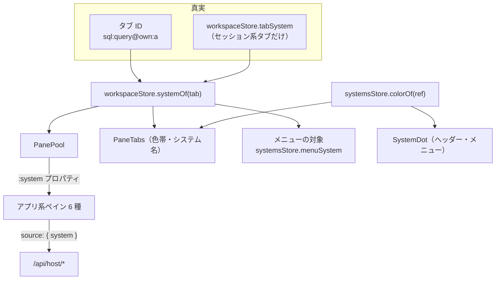
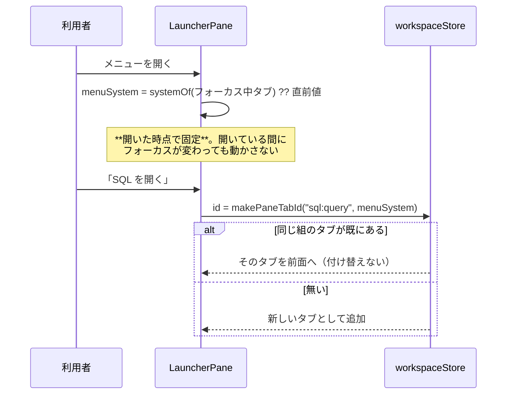
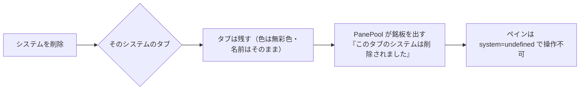

# 設計: タブがシステムを持つ

## アーキテクチャ概要

**タブ ID を真実の源にし、システム ref を 1 本の経路で配る。**



要点は **ペインが自分でシステムを引かないこと**。引き方が 6 か所に散ると、
1 か所直し忘れただけで「画面に出ているシステムと要求の宛先が違う」状態に戻る。
`PanePool` が `tabId` と一緒に `system` を渡し、ペインは受け取るだけにする。

## コンポーネント / モジュール

| 名称 | 責務 | 依存 |
|---|---|---|
| `paneLabels.ts` | タブ ID の**組み立てと分解**（`makePaneTabId` / `splitPaneTabId`）、機能の判定・ラベル引き | なし |
| `stores/workspace.ts` | `systemOf(tab)`。アプリ系は ID から、セッション系は `tabSystem` から。絞り込み撤去 | `paneLabels` |
| `stores/systems.ts` | `menuSystem`（旧 `selected`）、`colorOf(ref)`（設定値 ?? ref から自動） | — |
| `PanePool.vue` | 実体の保持に加え、**`system` を配る**。システムが消えたタブには銘板を出す | 上記 |
| `PaneTabs.vue` | 色帯・システム名（2 システム以上のときだけ） | `systems` |
| `SystemDot.vue`（新規） | **点＋名前**の 1 部品。ヘッダーのパンくずとメニューで使い回す | `systems` |
| `LauncherPane.vue` | メニューの対象を**開いた時点で固定**。作成ボタンの文言。開き直しで付け替えない | `systems` |
| `ConfigCard.vue` | システム設定に**色の選択**（パレット） | `systems` |
| server | `color` をスキーマ・`PublicSystem`・`publicSystem()` の白名簿に 1 項目だけ | — |

## インターフェース / データモデル

### タブ ID

```ts
// paneLabels.ts
const TAB_SYS_SEP = "@";                       // 機能 ID にもシステム ref にも `:` が入るため
export function makePaneTabId(feature: string, system: string): string;   // "sql:query@own:a"
export function splitPaneTabId(id: string): { feature: string; system?: string };
export function paneLabelOf(id: string): string | undefined;              // `@` の手前で引く
```

`isPaneTab` / `PANE_PREFIXES` は**先頭一致のまま**——`@` は後ろに付くので判定は変わらない。
`openedPanes` / `paneSlotEls` / `PanePool` のキーもタブ ID のままでよい。

### システム

```ts
// server: システム設定（サーバー・個人の両方）
color?: number;      // 1..8。未設定＝自動。範囲外・未知は自動に倒す
// PublicSystem / SystemForm にも同名で 1 項目だけ足す（白名簿に色以外を増やさない）

// web-ui
systemsStore.menuSystem: string | undefined;
systemsStore.colorOf(ref: string): number;   // 設定値 ?? hash(ref) % 8 + 1
```

### ペインへの受け渡し

```ts
// アプリ系ペイン 6 種の props（既存の tabId / active に 1 つ足す）
defineProps<{ tabId: string; active?: boolean; system?: string }>();
```

`system` が `undefined` になるのは**そのシステムが設定から消えたとき**だけ。

### パレット

`styles.css` に **1 組だけ**定義する。スキンごとには定義しない
——スキンは 10 種以上あり、そのたびに 8 色を用意するのは維持できない。

```css
:root {
  --sys-1: #2f80ed; /* 青   */  --sys-2: #2aa198; /* 青緑 */
  --sys-3: #2e9e4f; /* 緑   */  --sys-4: #8b5cf6; /* 紫   */
  --sys-5: #d4568a; /* 桃   */  --sys-6: #c2761c; /* 橙   */
  --sys-7: #a3603f; /* 茶   */  --sys-8: #6b7a8f; /* 灰青 */
}
:root[data-theme="dark"] { /* 明度だけ 1 段上げる（暗い地の上で沈まないように） */ }
```

- **赤（純粋な赤）と黄は入れない**。このアプリでは赤＝エラー・黄＝注意で、印の意味が濁る。
- 使うのは 3px の帯と小さな点だけなので、要求するコントラストは**文字ほど厳しくない**。
  それでも地色に対して 3:1 を目安に、コーディング時に実地で詰める。

## 処理フロー / シーケンス

### メニューから機能を開く



**`assignSystem` の呼び出しをやめる**のがこの流れの肝。いまは開き直すたびに既存タブを
今のシステムへ付け替えており、実行済みの結果が別システムのものに化ける。
`assignSystem` 自体はセッション系タブの所属付けに残す（`addSession` から使う）。

### タブのシステムが設定から消えた



**銘板は `PanePool` が Teleport の中に出す**——ペイン 6 種を個別に直さずに済み、
文言も 1 か所になる。ペイン側は「`system` が無ければ操作させない」だけを守る。

黙って閉じない理由: 閉じると**書きかけの内容ごと消える**。消えたことに気づく前に
別システムへ要求が飛ぶよりは、止まって理由が出るほうが安全。

## 設計判断

**D1. タブ ID の区切りは `@`。** 機能 ID（`sql:query`）にもシステム ref（`own:a`）にも
`:` が入るので、`:` では分解できない。`@` は両方に現れない。

**D2. システム ref は `PanePool` が配る。** ペインが自分で引く形にすると、引き方が 6 か所に
散り、1 か所の直し忘れが「宛先違い」に直結する。配る場所を 1 か所にすれば、
そこを見れば全部が分かる。

**D3. 消えたシステムの銘板はプールが出す。** 代替案はペイン 6 種にそれぞれ出させることだが、
文言が 6 か所に散る。既存の「システムを選んでください。」は**もう選べない**ので文言としても
誤り——共通の定数へ寄せる。

**D4. パレットは 1 組だけ定義し、スキンごとに用意しない。** スキンは 10 種以上ある。
色の役割（システムの識別）はスキンに依らないので、地色に対する明度差だけを
ダークで 1 段調整する。

**D5. `selected` → `menuSystem` に改名する。** 意味だけ変えて名前を残すと、
「選択中システム＝絞り込み」の記憶で読み違える。参照箇所はペインから撤去した後は
ランチャー・パンくず・タブ帯だけになるので、改名の costs は小さい。

**D6. 絞り込みの撤去に伴い `lastActiveBySystem` を消す。** 切り替えても表示が変わらない以上、
「切替後に戻す先」を覚える意味が無い。残すと**使われない状態が育つ**。

**D7. タブのシステム名は「2 システム以上」で出す。** 判定はワークスペース全体で行う
——ペイン単位にすると、タブを別ペインへ移しただけでラベルが伸び縮みする。
表示は `A｜SQL` の形で、**システム名側に独自の省略**（`max-width` ＋ 省略記号）を付け、
長いシステム名がタブ名を押し出さないようにする。

## plan への申し送り

**順序**（前が崩れると後ろが意味を失うので、この順で刻む）:

1. **タブ ID の組み立て・分解**（`paneLabels`）と `workspaceStore.systemOf` — 土台
2. **ペインの束ね直し**（`PanePool` が `system` を配る／6 種から `systemsStore.selected` を撤去）
   — **ここが安全の要**。1 種ずつ潰し、各種にテストを付ける
3. **開き直しで付け替えない**（`assignSystem` の呼び出し撤去・(機能, システム) で判定）
4. **絞り込みの撤去**（`visibleTabs` / `lastActiveBySystem` / `activeTabFor`）
   — ここで初めて複数システムのタブが並ぶ
5. **見分け**（`color` のスキーマ → `colorOf` → `SystemDot` → タブの色帯とシステム名）
   — 4 と 5 の間は「並ぶが見分けが付かない」状態なので、**まとめて出す**
6. **メニューの対象**（追従＋開いた時点で固定・作成ボタンの文言）
7. **確認文言にシステム名**

**注意**:

- 2 は**テストで宛先を固定する**（`fetch` の body に載るシステム ref を検査）。
  画面の見た目ではなく**送信内容**を見ないと、この作業の目的は守れない。
- 4 と 5 を別 PR に割らない（割ると途中の版が今より使いにくい）。
- 実機検証は「A と B のタブを並べ、それぞれが**自分のシステムの結果**を出す」ところまで。
