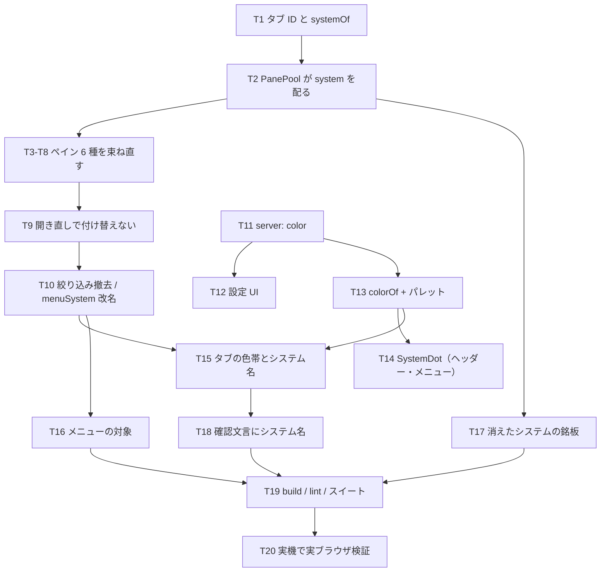

# 計画: タブがシステムを持つ

## 分割の判定（subtask に割るか）

**割らない。1 つの work のまま tasks に刻む。**

判定の基準は「そのピースは単独で検証・デリバリ可能か」。この作業は**どの切り口でも単独で
成立しない**:

- 束ね直し（ペインを自分のタブのシステムへ）だけ入れても、**絞り込みが残っていれば
  並べられない**ので、利用者から見て何も変わらない。
- 絞り込みを外すと**並ぶが見分けが付かない**——色と名前が同時に要る。
- 色だけ先に入れても、絞り込みがあるうちは 1 システムしか出ないので効果が見えない。

＝ 相互依存が強く、**共同でしか検証できない**。よって単一の tasks.md で刻み、
危険な段（ペインの束ね直し）を 1 種ずつに割って漸進的に潰す。

## 実装方針

design の「plan への申し送り」の順に積む。**前が崩れると後ろが意味を失う**ので順序は固定。

土台（ID とシステムの引き方）→ 束ね直し（宛先）→ 開き直しの付け替え撤去 →
絞り込み撤去 → 見分け（色・名前）→ メニューの対象 → 取り違え防止。

**絞り込み撤去（T10）より前に、6 ペインの束ね直しを全部終える。** 逆順にすると、
複数システムのタブが並んでいるのにペインは全体の選択値を見ている状態が生まれる
——**画面と宛先が食い違う**、いちばん避けたい状態そのもの。

## 作業順序と依存関係

色まわり（T11-T14）は束ね直しと独立に進められるが、**T10 と T15 は同じ PR に載せる**
——分けると「並ぶが見分けが付かない」版が中間に生まれる。

## リスク / 留意点

- **宛先の取り違えが最大の危険**。一覧にはジョブの終了、IFS には削除がある。
  T3-T8 は 1 種ずつ、**送信内容（`fetch` の body に載るシステム ref）を検査する**テストを
  付けてから次へ進む。見た目のテストでは守れない。
- **撤去漏れ**。`systemsStore.selected` の参照がペインに 1 つでも残ると、そこだけ
  全体の選択値を見続ける。**参照が 0 件であること**をテストで固定する
  （ソースを読む形。`grid-overlay-offset.test.ts` と同じ手）。
- **`@` 区切りの取りこぼし**。`PANE_LABELS` の引き当てなど、タブ ID を**完全一致**で
  使っている箇所を洗う（現状は `PaneTabs` の 1 か所）。
- **パレットの見え方**はテーマ・スキンで変わる。jsdom では判定できないので実ブラウザで見る。
- 実機は共有機。**A と B は同じホストを指す 2 つの設定**で足りる（接続は増やさない）。

## テスト方針

- **宛先（最重要）**: 各ペインについて、タブのシステムが `own:a` のとき要求の body に
  `own:a` が載ることを固定する。`systemsStore.menuSystem` に別の値を入れた状態で検査し、
  **全体の選択値に引きずられない**ことまで見る。
- **撤去の完了**: アプリ系ペインのソースに `systemsStore.selected` が現れないことを検査。
- **タブ ID**: 組み立て・分解の往復と、`isPaneTab` / ラベル引きが `@` 付きでも効くこと。
- **開き直し**: 同じ (機能, システム) は前面化、別システムは新しいタブ。付け替えないこと。
- **絞り込み撤去**: システムを切り替えてもタブが 1 枚も消えない／増えないこと。
- **見分け**: 2 システム以上でだけシステム名が出る。1 システムなら出ない。
  色は未設定のシステムでも付く（`colorOf` が 1..8 を返す）。
- **消えたシステム**: 銘板が出て、ペインが要求を出さないこと。
- **実機（実ブラウザ）**: A と B のタブを並べ、**それぞれが自分のシステムの結果**を出すこと。
  色帯とシステム名が出ていること。既存の `verify-pane-state.mjs` の隣に新規で置く。
