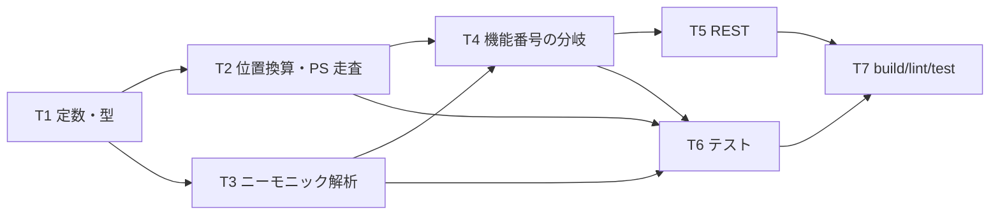

# 計画: 01-server（HLLAPI のロジック / TypeScript）

親の `spec.md` を継承する。**scope は親 plan が凍結済み。**

## この subtask の役割

**HLLAPI の意味づけを全部ここに置く。** `02-bridge` の Rust は
「C ABI ↔ HTTP」だけを担うので、機能番号・PS の走査・`rc` の決定はここが唯一の真実。

## 既存 API との突き合わせ（実装前に確かめた）

| 必要なもの | 既存 |
|---|---|
| AID キー | `Enter` / `F1`〜`F24` / `PageUp` / `PageDown` / `Clear` / `Help` / `Print` / `SysReq` / `Attn`（`mcp-tools.ts:37`） |
| キー送信 | `entry.session.sendAid(key, { cursor })` |
| 欄への書き込み | `entry.session.setField({index} \| {row,col}, value)` |
| 画面 | `ScreenSnapshot`（`rows`/`cols`/`cursor`/`cells`/`fields`/`keyboardLocked`） |
| 欄 | `Field`（`index`/`row`/`col`/`length`/`protected`/`hidden`/`numeric`） |

**5250 に PA1〜PA3 は無い**（3270 のキー）。`@x`/`@y`/`@z` は写せないので `rc=20` で断る
——黙って無視すると「送ったつもりで送られていない」になる。

## カーソルは HLLAPI 接続ごとに TypeScript 側で持つ

HLLAPI は `Set Cursor (40)` → `Send Key (3)` のように**カーソルを跨いで使う**。
ホストのカーソル（`snapshot.cursor`）とは別に、**接続ごとの論理カーソル**が要る。
これは要件の「Rust に状態を持たせない」と整合する（状態は TypeScript 側）。

- `Connect` で `snapshot.cursor` から初期化
- `Set Cursor` / カーソル移動ニーモニック / 文字入力で進む
- `Tab` / `BackTab` は `snapshot.fields` から次／前の入力欄へ

## 作業順序

## リスク / 留意点

| リスク | 対応 |
|---|---|
| 機能番号の足し忘れが黙って成功になる | 分岐の既定を **`rc=10`** にする。テストで固定 |
| 秘密（サインオンの入力）がログに出る | `data` の中身をログに出さない。**テストで固定** |
| 位置換算の境界（1 起点・範囲外） | 純関数に切って境界値をテスト |
| 写せないキーを黙って捨てる | `rc=20` で断る。テストで固定 |

## テスト方針

**実機不要**。純関数は直接、機能分岐は**偽の SessionManager** で。

- 位置換算（1 起点・範囲外・24x80 と 27x132）
- ニーモニック解析（文字・AID・カーソル・`@@`・未対応）
- 機能分岐（未実装が `rc=10` / ロック中の書き込みが `rc=5` / 短縮名なしが `rc=1`）
- PS 走査（`Copy PS` の連結・検索・欄の位置と長さ）
