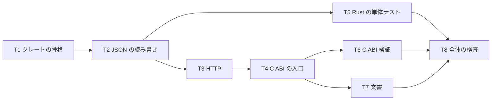

# 計画: 02-bridge（Rust の薄い接続層）

親の `spec.md` を継承する。依存: `01-server`（`POST /api/hllapi` の契約）。

## この subtask の役割

**C ABI ↔ HTTP だけ。** 機能番号の意味を Rust に 1 つも書かない
——これを**テストで固定する**（ソースに機能番号が現れないことを検査する）。

## この環境の制約（research F7 / F9）

- `cargo` は rustup で導入した（1.97.1）。**C コンパイラは無く `sudo` も無い。**
- `rust-lld` をリンカに、実行時ライブラリへのシンボリックリンクを `-L` で通して
  **cdylib のリンクに成功済み**。
- **この回避策はリポジトリに焼き込まない**（他の環境では不要で、むしろ邪魔）。
  `docs/HLLAPI.md` に「この環境では」と書く。
- **Windows ではビルドも検証もできない。** OS 非依存に書き、**未検証と明示**する。

## 検証の手立て

C コンパイラが無いので C のテストクライアントは書けない。代わりに
**Python の `ctypes`** で `.so` を読み込む——これは **C ABI をそのまま叩く**ので、
HLLAPI クライアントと同じ呼び出し規約を再現できる（research F8 で実証済み）。

## 作業順序

## リスク / 留意点

| リスク | 対応 |
|---|---|
| **手書き JSON の誤り**（依存を足さない代償） | エスケープの往復を単体テストで固める。`\uXXXX`・制御文字・日本語 |
| ヌルポインタ・長さ 0 | **落とさずに `rc=2`**。テストで固定 |
| バッファあふれ | `length` を超えて書かない。超えたら `rc=6` |
| Rust に状態が漏れる | `static` を置かない。**ソース検査のテスト**で固定 |
| Windows 未検証 | 文書に明記。クレートは OS 非依存 |

## テスト方針

- **Rust の単体テスト**: JSON のエスケープ／アンエスケープ往復、要求の組み立て、
  応答の解析、HTTP 応答からの本文取り出し。
- **C ABI の検証**（Python `ctypes`）: ヌルポインタ・サーバー不在時の `rc=9`・
  実際の往復（`01-server` を起動して Connect → Copy PS）。
- **ソース検査**: `src/` に機能番号（`HRC` / 数値の分岐）が現れないこと。
