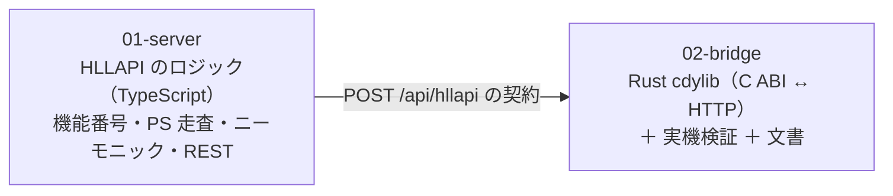

# 計画: HLLAPI / EHLLAPI 対応（メタ plan / subtask 分割）

前提: `spec.md`（design は挟まなかった。理由は下記）。

## design を挟まなかった理由

protocol「4.5」の検知条件に照らして判断した。

- 複数コンポーネントにまたがる → **該当する**（Rust + server）
- アーキ判断が必要 → **spec で決着済み**（1 呼び出し = HTTP 1 往復、Rust に状態を置かない、
  ロジックは TypeScript、依存を足さない）
- インターフェース / データモデルが複雑 → **spec に C ABI・交換形・機能表・写像表まで書いた**
- plan で分解するには粗い → **該当しない**

残る未確定（Wait の待ち方、`Copy PS` の行連結、DBCS のセル幅の影響）は
**実装しながら決まる細部**で、構造設計を要しない。よって plan へ直行する。

## split 判定

判定軸は「そのピースは単独で検証・デリバリ可能か」。

- **単独でデリバリ可能ではない**——TypeScript 側だけでは HLLAPI 資産から呼べず、
  Rust 側だけでは何もできない。**HTTP の契約を共有する 1 つの機能**。
- **規模は中〜大**——新しい言語のクレート＋ TS 4 モジュール＋検証スクリプト＋文書。
- **割れ目が明確**——`POST /api/hllapi` の契約。しかも**言語が違う**ので、
  レビューの観点も道具も別物。

→ **2 つに分割する**（過剰分割はしない。3 つ目に切り出すほどの独立性は無い）。

## 割れ目（seam）

**`POST /api/hllapi` の要求／応答の形が唯一の seam。**
`01` でこれを凍結すれば、`02` は TypeScript を触らずに進められる。

## subtask と順序

| # | subtask | 内容 | dependsOn |
|---|---|---|---|
| 01 | `server` | `hllapi-keys.ts` / `hllapi-ps.ts`（純関数）、`hllapi.ts`（機能番号の分岐）、`hllapi-routes.ts`、単体テスト | — |
| 02 | `bridge` | `crates/hllapi`（cdylib・`std` のみ）、C ABI 検証、実機検証、`docs/HLLAPI.md` | `01-server` |

## 実装方針

1. **`01` は純関数を厚く作る。** ニーモニックの写像と PS の走査・位置換算は
   セッション不要でテストできる。ここが固ければ `02` は薄い。
2. **機能番号の分岐は 1 か所**（`hllapi.ts`）。未実装は `rc=10` に落ちる形にして、
   **足し忘れが黙って成功にならない**ようにする。
3. **`02` は「C ABI ↔ HTTP」以外を書かない。** 機能番号の意味を Rust に 1 つも置かない
   ——これを**テストで固定する**（Rust のソースに機能番号が現れないことを検査する）。
4. **検証は本物の C ABI で。** Python `ctypes` で `.so` を読み込む（research F8 で実証済み）。

## リスク / 留意点

| リスク | 対応 |
|---|---|
| 手書き JSON の誤り（Rust に依存を足さない代償） | エスケープの往復を Rust の単体テストで固める |
| **Windows で検証できない**（research F9） | OS 非依存に書き、**未検証と明示**。手順だけ文書に残す |
| この環境固有のリンク回避策 | **リポジトリに焼き込まない**。`docs/HLLAPI.md` に「この環境では」と書く |
| HLLAPI の位置は 1 起点・DBCS はセル単位 | 換算を純関数に切り、境界値をテスト。差は文書に明記 |
| 秘密（サインオンの入力）がログに出る | `data` の中身をログに出さない。**テストで固定** |
| 既存の非退行 | ルート登録 1 行のみ。全テストを通す |

## テスト方針

**子 subtask（単独検証）**

- `01`: 純関数（ニーモニック写像・位置換算・PS 走査）の単体テスト。
  機能番号の分岐は**偽の `SessionManager`** で検証（未実装が `rc=10` になること、
  ロック中の書き込みが `rc=5` になること等）。
- `02`: Rust の単体テスト（JSON エスケープ・HTTP 組み立て・ヌルポインタ）。
  **`.so` を Python `ctypes` で叩く**検証。

**親（統合 test）**

- サーバーを起動し、**C ABI から実機のセッション**を駆動する
  （Connect → Send Key → Copy PS → Disconnect）。
- **日本語（DBCS）を含む画面**の読み出し。
- 未実装の機能番号が `rc=10` で返る。
- **Rust に状態が無い**こと（同じ `.so` を別プロセスから叩いても破綻しない）。
- 既存の MCP / WebSocket / 画面の非退行。
