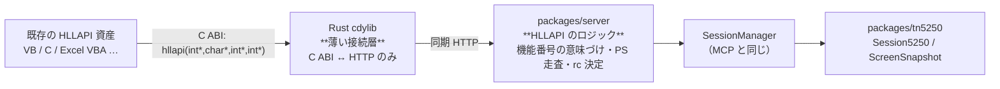

# 調査: HLLAPI / EHLLAPI 対応

実施 2026-08-03（UTC）。

## 調査の問い

- **Q1** HLLAPI / EHLLAPI の正確な仕様（エントリポイント・機能番号・戻り値・ニーモニック）は。
- **Q2** ts5250 側に写す先（セッション操作）は何が既にあるか。
- **Q3** Rust ↔ TypeScript の橋渡しをどうするか。**同期 API を非同期のサーバーへどう写すか**。
- **Q4** この環境で Rust の共有ライブラリを作り、**本物の C ABI で呼べるか**。
- **Q5** プラットフォーム（Windows DLL が本命）とどこまで検証できるか。
- **Q6** セッションの同定（HLLAPI の 1 文字の短縮名 ↔ ts5250 のセッション ID）。

## 判明した事実

### F1: エントリポイントの署名（一次資料）

出典: **SunLink SNA 3270 9.1 EHLLAPI Programmer's Manual**（Sun Microsystems, 1997。
Part No. 802-2668-12）の「3.4 Function Parameters」。PDF を取得して直読みした。

```c
hllc(function, data_string, length, return_code)
int  *function;
char *data_string;
int  *length;
int  *return_code;
```

**4 引数すべてポインタ。** 実装ごとに名前が違う（Sun は `hllc`、IBM PCOMM の Windows 版は
`hllapi` / `WinHLLAPI`）が、**署名は共通**。

- `function` — 機能番号
- `data_string` — 入出力の共有バッファ
- `length` — バッファ長（機能により意味が変わる）
- `return_code` — **入力では PS 上の位置を指すことがあり**、出力では結果コード

### F2: 機能番号（一次資料の目次より）

| # | 機能 | # | 機能 |
|---|---|---|---|
| 1 | Connect Presentation Space | 22 | Query Session Status |
| 2 | Disconnect Presentation Space | 24 | Query Host Update |
| 3 | Send Key | 25 | Stop Host Notification |
| 4 | Wait | 30 | Search Field |
| 5 | Copy Presentation Space | 31 | Find Field Position |
| 6 | Search Presentation Space | 32 | Find Field Length |
| 7 | Query Cursor Location | 33 | Copy String to Field |
| 8 | Copy Presentation Space to String | 34 | Copy Field to String |
| 9 | Set Session Parameters | 40 | Set Cursor |
| 10 | Query Sessions | 50 | Start Keystroke Intercept |
| 11 | Reserve | 51 | Get Key |
| 12 | Release | 52 | Post Intercept Status |
| 13 | Copy OIA | 53 | Stop Keystroke Intercept |
| 14 | Query Field Attribute | 90 | Send File |
| 15 | Copy String to Presentation Space | 91 | Receive File |
| 18 | Pause | 99 | Convert Position or RowCol |
| 20 | Query System | | |
| 21 | Reset System | | |

> ⚠ **この目次には誤植がある。** `4.31 Start Host Notification` が `\32\` と書かれているが、
> `4.10 Find Field Length` も `\32\` で衝突する。IBM の正典では **Start Host Notification は 23**
> （`23`/`24`/`25` が Start/Query/Stop の三つ組）。
> **本作業の中核に入らない機能なので、番号は確定させずに未実装として扱う**
> （実装するときに改めて一次資料で確かめること）。

### F3: 戻り値（一次資料 3.6）

| コード | 名前 | 意味 |
|---|---|---|
| 0 | `HRC_SUCCESSFUL` | 成功／更新なし |
| 1 | `HRC_PS_ID_INVALID` | 指定された PS が無効 |
| 2 | `HRC_PARAMETER_ERROR` | パラメータの誤り、または**無効な機能** |
| 4 | `HRC_PS_BUSY` | PS がビジー |
| 5 | `HRC_FUNCTION_INHIBITED` | PS がロックされている |
| 6 | `HRC_DATA_ERROR` | 警告。長さが合わず切り詰めた可能性 |
| 7 | `HRC_PS_POSITION_INVALID` | PS 上の位置が無効 |
| 8 | `HRC_PROCEDURE_ERROR` | 呼ぶ順序が違う |
| 9 | `HRC_SYSTEM_ERROR` | システムエラー |
| **10** | **`HRC_FUNCTION_UNAVAILABLE`** | **利用不可または未知の機能** |
| 11 | `HRC_RESOURCE_UNAVAILABLE` | 他のアプリが既に接続している |
| 20 | `HRC_UNDEFINED_COMBINATION` | 未定義のキー組み合わせ |
| 21 / 22 / 23 | `HRC_OIA_UPDATED` / `HRC_PS_ONLY_UPDATED` / `HRC_PS_OIA_UPDATED` | Wait の結果 |
| 24 | `HRC_PS_UNFORMATTED` | PS が欄で構成されていない |
| 26 | `HRC_PS_UPDATED` | Pause 中に更新があった |
| 28 | `HRC_FIELD_ZERO_LENGTH` | 欄の長さが 0 |

→ **FR-9（未実装を規約どおりに断る）は `10` を返せばよい。** 推測ではなく規約にある値。

### F4: キーのニーモニック（一次資料 3.5）

`@` を接頭辞にした ASCII ニーモニック。**Send Key / Get Key が使う。**

| | | | |
|---|---|---|---|
| `@E` Enter | `@T` Tab | `@B` Backtab | `@C` Clear |
| `@F` Erase EOF | `@N` New Line | `@R` Reset | `@D` Delete |
| `@I` Insert | `@U/@V/@L/@Z` カーソル 上/下/左/右 | `@0` Home | `@<` Back Erase |
| `@1`〜`@9` PF1〜PF9 | `@a`〜`@o` PF10〜PF24 | `@x/@y/@z` PA1〜PA3 | `@@` `@` そのもの |
| `@A@H` System Request | `@A@Q` Attention | `@A@F` Erase Input | `@S@x` Dup / `@S@y` Field Mark |

**普通の文字はそのまま**（ASCII 値）。つまり `"ABC@E"` は「ABC と打って Enter」。

### F5: 写す先は既にある（ts5250 側）

MCP ツールが**同じ操作を既に実装している**。HLLAPI は**新しい入口**であって新機能ではない。

| HLLAPI | ts5250 の既存 |
|---|---|
| Connect PS (1) / Disconnect PS (2) | `open_session` / `close_session` |
| Send Key (3) | `send_key` |
| Copy PS (5) / Copy PS to String (8) | `get_screen`（`ScreenSnapshot`） |
| Copy String to PS (15) / to Field (33) | `set_fields` |
| Query Sessions (10) / Session Status (22) | `list_sessions` |
| Query Cursor Location (7) | `snapshot.cursor` |
| Search PS (6) / Search Field (30) | `snapshot.cells` を走査 |
| Find Field Position (31) / Length (32) | `snapshot.fields` |

`ScreenSnapshot`（`packages/tn5250/src/screen/types.ts:272`）が **Presentation Space そのもの**:

```ts
{ sessionId, rows: 24|27, cols: 80|132, cursor: {row, col},
  keyboardLocked, cells: Cell[][], fields: Field[], systemMessage?, gui? }
```

→ **PS の位置（HLLAPI は 1 起点の通し番号）は `rows`/`cols` から機械的に変換できる。**

### F6: セッション操作の REST は無い——WebSocket だけ（設計の要点）

`/api/host/*` は SQL・IFS・スプール・DTAQ 等**ホストサーバー経由の機能**だけ。
**5250 セッションの操作（`open` / `key` / `display` / `close`）は WebSocket 専用**
（`ws-messages.ts`）。MCP ツールは WS を介さず `SessionManager` を**プロセス内で直接**叩いている。

→ **HLLAPI は同期 API なので、非同期・ストリーミングの WS に写すのは相性が悪い。**
MCP と同じく `SessionManager` を直接叩く**同期的な REST 入口を TypeScript 側に足す**のが素直。
Rust は「C ABI ↔ HTTP」だけを担い、**薄いまま**でいられる（要件どおり）。

### F7: この環境で cdylib が作れる（実測）

`cargo` が無かったので rustup で導入した（**1.97.1**）。ただし障害が 2 つあり、両方越えた。

1. **C コンパイラが無く `sudo` も無い**（`apt-get` はロックで失敗）。
   → Rust 同梱の **`rust-lld`** をリンカに指定。
2. **libc 等の開発用ファイル（`libc.so`）が無い**。実行時の `.so.6` しかない。
   → 書き込み可能な場所に `libc.so -> libc.so.6` 等のシンボリックリンクを作り `-L` で通した
   （`libc` / `libm` / `libdl` / `libpthread` / `librt` / `libutil` / **`libgcc_s`**）。

**結果: `cdylib` のリンクに成功**。

### F8: 本物の C ABI で呼べる（実測）

Python の `ctypes` で `.so` を読み込み、`hllapi(int*, char*, int*, int*)` を呼んで往復を確認した。

```
C ABI で呼べた: func=21 -> rc=42（期待 42）
```

→ **HLLAPI クライアントとまったく同じ呼び出し規約**で検証できる。C コンパイラが無くても
検証手段はある（`ctypes` は C ABI をそのまま叩く）。

### F9: 環境の制約——Windows では検証できない

- `x86_64-unknown-linux-musl` は **cdylib を作れない**（`does not support these crate types`）。
- Windows 向け（`*-pc-windows-gnu` / `-msvc`）は **mingw / MSVC が要る**ので、この環境では不可。
- HLLAPI の実利用者は**ほぼ Windows**（`EHLLAPI32.DLL` 等を動的リンクする）。

→ **Linux の `.so` として作り、C ABI で検証する。Windows 版はクロスコンパイルの設定を
用意するに留め、「未検証」と明示する。** クレート自体は OS 非依存に書けば
`cargo build --target x86_64-pc-windows-msvc` で作れる形になる。

## 影響範囲



- **新規**: Rust クレート（`crates/hllapi` 等）、TypeScript の HLLAPI ロジックと REST 入口。
- **変更**: 既存のセッション操作には触れない（`SessionManager` を読むだけ）。

## 実現性 / リスク

**実現できる見込みが立ったもの**

- C ABI のエントリポイント（F1・F7・F8 で実証済み）
- 中核の機能番号（F2・F3・F4 の一次資料と、F5 の既存実装がそろっている）
- Rust を薄く保つ設計（F6 の REST 入口を足す）

**リスク**

| リスク | 対応 |
|---|---|
| **Windows で検証できない**（F9） | Linux `.so` ＋ C ABI で検証し、**Windows は未検証と明示**。クレートは OS 非依存に書く |
| **この環境固有のリンク回避策**（F7）が CI や他の開発者の環境で通らない | 回避策は**リポジトリに焼き込まない**。`.cargo/config.toml` は置かず、手順を文書に残す |
| HLLAPI は同期・単一スレッド前提。並行呼び出し | Rust 側は状態を持たない。同時実行の安全性は TypeScript 側（`SessionManager`）に委ねる |
| 文字コード（DBCS） | 境界を **UTF-8** に置き、EBCDIC/CCSID の扱いは既存の TypeScript 側に閉じる |
| 短縮名（`A`〜`Z`）とセッション ID の対応 | TypeScript 側で持つ（Rust に状態を置かない要件と整合） |

## spec への申し送り

1. **Rust は「C ABI ↔ HTTP」だけ**にする。機能番号の意味づけ・PS の走査・`rc` の決定は
   **すべて TypeScript**（要件の「ロジックは TypeScript」を構造で担保する）。
2. **同期 HTTP で橋渡しする**（F6）。`POST /api/hllapi` に `{function, ps, data, length}` を送り、
   `{rc, data, length}` を受ける。**HLLAPI の 1 呼び出し = HTTP 1 往復**にすると、
   Rust 側に状態も相関も要らない。
3. **中核として実装するのは**: 1, 2, 3, 4, 5, 6, 7, 8, 10, 15, 18, 20, 22, 30, 31, 32, 33, 34, 40, 99。
   **それ以外は `rc=10`（`HRC_FUNCTION_UNAVAILABLE`）で断る**（F3。規約にある値）。
4. **短縮名は TypeScript 側の対応表**で持つ。`A` から順に、開いているセッションへ割り当てる。
5. **位置は 1 起点の通し番号**（`(row-1)*cols + col`）。`Convert Position or RowCol (99)` も同じ換算。
6. **Windows は未検証と明示**。クロスコンパイルの手順は文書に残すが、動作は主張しない。
7. **この環境のリンク回避策をリポジトリに焼き込まない**（F7 のリスク）。

## 測っていないこと

- **Windows での動作**（F9）。ビルドすらしていない。
- `Start Host Notification` の正しい機能番号（F2 の誤植。中核外なので未確定のまま）。
- 実際の HLLAPI 資産（VB 等）との突き合わせ。手元に資産が無い。
- ファイル転送（90/91）とキーストローク傍受（50〜53）の仕様は読んでいない（対象外）。
