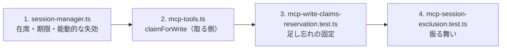

# レビューガイド: MCP の排他

**MCP が画面を書くとき、そのセッションをブラウザが見ていれば自動で予約する。**
利用者には「MCP が自動操作中です」と出て入力が止まり、放っておけば消える。

触ったのは 3 ファイル。**web-ui は 1 行も変えていない。**

## 30 秒で分かる要約

```
MCP の書き込み ──▶ hasViewer(id) ?
                     ├─ 見ている人が居る → 予約（label="MCP"、15 秒）→ 画面に覆い
                     └─ 居ない          → 何もしない（儀式にしない）
```

- **エージェントに囲わせない。** `reserve_session` のようなツールは作らない——囲い忘れる
- **セッションの出どころで判断しない。** 「ブラウザと疎通があるか」だけを見る
- **表示側は既存のまま。** `label` が画面へ流れる仕掛けは `20260803-hllapi-bridge` で入っている

## 読む順番



## 見てほしい 4 点

### 1. 判定を「疎通の有無」にした理由

**セッションの出どころで判断してはいけない。** いまブラウザは既存セッションへ後から
繋げないので「MCP が開いた＝誰も見ていない」が成り立つが、**それは偶然の性質**で、
attach（backlog にある）を入れた瞬間に崩れる。`hasViewer` は attach 後もそのまま正しい。

在席は**明示的に数える**。`onReservationChange` の有無で代用できるが、
**通知フックを在席の印にすると、通知が要らなくなった瞬間に判定が壊れる**。

### 2. 足し忘れを機械で固定した

書き込みの入口は **8 箇所**あり、共通のラッパが無い（この repo の作法）。
散らすのは構わないが、**忘れると黙って効かなくなる**——予約を取らないツールが 1 つあれば
そこだけ人の打ちかけを踏み潰し、しかも**動くので気づけない**。

`mcp-write-claims-reservation.test.ts` がソースを走査して、
すべての入口が `claimForWrite` を通り `mcpHolder` を渡すことを固定する。

> **書式に左右されない形で書くこと。** 最初これを行単位で書いて、prettier の折り返しで
> 8 箇所中 2 箇所しか拾えなかった。空白を潰してから走査している。

### 3. 期限を予約に持たせた

| | 誰が取るか | 期限 |
|---|---|---|
| HLLAPI | **利用者が明示的に**（`Reserve`） | 2 分 |
| MCP | **道具が勝手に** | **15 秒** |

用途が違うので定数 1 つでは両立しない。`touchReservation` は**その予約自身の長さ**で延ばす。

15 秒の根拠: 実測した 1 往復は 28ms（同一ホスト内）。`scripts/README.md` は実機で
1〜7 秒かかる場合があると記録しており、**最悪でも 2 倍の余裕**がある。

### 4. 期限切れを能動的に切る（**実機でしか出なかった欠陥**）

当初は遅延評価だった——`reservationOf` が読まれたときに刈る。
だが**誰も読まなければブラウザへ解除が通知されない**。サーバーは通す状態なのに、
画面には覆いが出たまま人が締め出される。

**30 秒放置して初めて出た。** 単体テストは偽の時計で `reservationOf` を明示的に
呼んでいたので通っていた——**「自分で読んでから確かめる」検査は、読まない経路の欠陥を隠す**。

いまは予約にタイマーを持たせ、期限が来たら自分で切って知らせる。
回帰検査は**実時間**で書いた（偽の時計だと同じ穴を見逃す）。

## 実機で確かめたこと（24/24）

```
OK  **ブラウザが見ている**（在席が数えられている）
OK  **MCP が自動で予約した**（囲えと言われずに） — label=MCP
OK  **1 往復（28ms）に対して期限（15000ms）が足りている** — 余裕 535.7 倍
OK  **画面に「MCP が自動操作中です」が出る**
OK  **放っておけば覆いが消える**（囲いを解く操作が要らない）
```

## 確かめていないこと

- **複数タブが同じセッションを見る場合**（いま起こらない。attach を入れるときに見直す）
- **遠隔ホストで 1 往復 7 秒**かかる場合の見え方（計算上は 2 倍の余裕があるが未測定）
