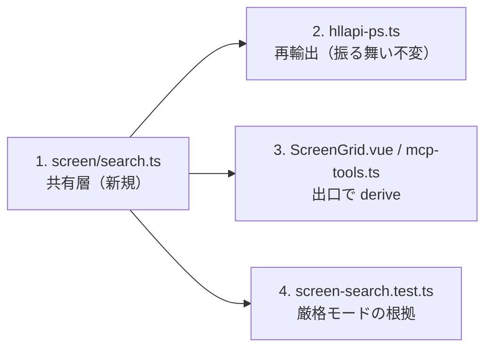

# レビューガイド: 欄の指し方

**スクリプト・MCP・HLLAPI・Playwright が同じ言葉で入力欄を指せるようにする。**

## 30 秒で分かる要約

5250 は**欄の名前を電文で運ばない**（GUI 構造体の `id` すら ts5250 が振っている）。
つまり**導出した識別子はどれもレイアウト変更に耐えない**——設計の巧拙ではなくプロトコルの性質。

そのうえで **2 層に分ける**:

| | 何に使うか | 壊れるとき |
|---|---|---|
| **`fieldId(f)`** = `f<row>c<col>` | DOM のセレクタ・重複検出・「いま見つけた欄をもう一度」 | その欄が動いたとき |
| **`fieldAfterLabel(snap, "ユーザー")`** | **スクリプトが使うべきはこちら** | 文言が変わったとき |

**連番にしない。** `Field.index` は手前の欄が 1 つ増減しただけで全部ずれる。
`(row,col)` なら**その欄が動いたときだけ**変わる——壊れ方が局所に留まる。

## 読む順番



## 見てほしい 4 点

### 1. `Field` に属性を足していない

当初は `Field.id` を必須で足す設計だったが、やると**テストの器が 123 箇所壊れる**
（`Partial<Field>` を混ぜる形が多く、`exactOptionalPropertyTypes` とも噛み合わない）。

**規則を 1 か所に置く目的は、共有関数が唯一の実装であることで達せられる。**
外へ出す口——DOM の属性と MCP の `structuredContent`——で derive する。ずれようがない点は同じ。

### 2. `hllapi-ps.ts` は再輸出にした（**HLLAPI を触っていない**）

桁位置と欄の走査は HLLAPI 固有ではなかったので共有層へ移し、あちらは再輸出だけにした。
**CP932 のバイト列を扱う部分だけが残る**（HLLAPI は 1 位置 = 1 バイトを要求する）。

呼び出し側は 1 行も変えていない。実機 33/33 で無傷を確認。

### 3. 曖昧なら断る（**実機の形が根拠**）

実機 `WRKSPLF`:

```
10|            OPT   出力        状況        ← 見出しは 1 つ
12| [入力]           QPDZDTALOG              ← 9 個の欄が並ぶ
13| [入力]           QPDZDTALOG              ← **行の内容まで重複する**
```

- **1 つの見出しが 9 個の欄を支配する**（ラベル → 欄が 1 対 1 ではない）
- **行の内容も重複する**（スプール名は正当に重複する）

**導出できる一意な鍵は存在しない**ので、曖昧さは利用者に返すしかない。
例外に**候補の行桁と近傍の文字**を添えて、そのまま絞り込めるようにしてある。

**`nth` は作らない**（順序依存で事故の元）。絞り込みは行の内容・列・領域で行う。

### 4. 実装中に見つけた欠陥

**`fieldAfterLabel` が一覧の見出しに対して先頭の欄を黙って返していた。**

上の `WRKSPLF` の形を検査に写して初めて出た。「ラベルの後ろの次の入力欄」を返す実装だと
9 個の先頭を選ぶ——**避けたかった挙動そのもの**。**同じ行に限る**ようにした。

> 合成した都合の良い画面だけを使っていたら通っていた。
> `20260803-hllapi-bridge` の「フィクスチャが実物より綺麗だった」と同じ轍。

## 実機で確かめたこと

```
OK  **欄の id が一意** — 5/5
OK  **Playwright が id で欄を掴める**（`[data-field="f6c53"]`）
OK  **掴んだ欄に書ける** — "ZZ"
```

**E2E で座標を使わずに欄を掴めた**——前回困っていた点が解けた。
一意性は別途 8 画面 49 欄で 0 件（サインオン / MAIN / WRKSPLF / WRKACTJOB /
DSPLIBL / WRKOBJ / GO CMDIFS / WRKUSRPRF）。

## 確かめていないこと

- **`fieldAfterLabel` / `fieldInRowWith` を実機の画面に当てていない**（検査は実機の形を写した合成画面）
- 一意性は 8 画面。**窓（WINDOW）を含む画面を見ていない**
