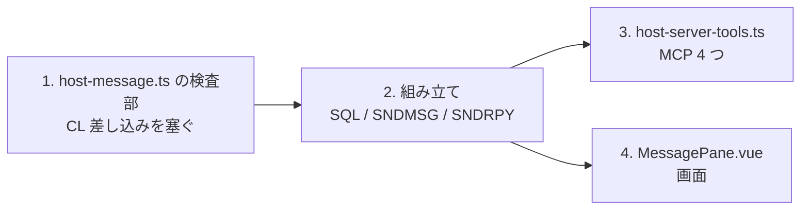

# レビューガイド: メッセージ待ち行列

**照会メッセージに応答できるようにする。** 応答しないとジョブが止まったままになるのに、
いままで `DSPMSG` の画面を操作するしか手が無かった。

## 30 秒で分かる要約

| 操作 | 使う層 | 備考 |
|---|---|---|
| 一覧 | SQL（`QSYS2.MESSAGE_QUEUE_INFO`） | `onlyInquiry` で応答待ちだけ |
| 送信・応答・全消し | CL（`SNDMSG` / `SNDRPY` / `CLRMSGQ`） | |
| **キー指定の削除** | **プログラム呼び出し**（`QMHRMVM`） | `RMVMSG` は CL 内でしか使えない |

**新しい配管はゼロ。** 既存の 3 層に載せただけ。

## 読む順番



## 見てほしい 4 点

### 1. CL への差し込みを塞ぐ（**この作業で一番危ういところ**）

**利用者の入力がそのまま CL コマンド文字列に入る。**

待ち行列名に `X) DLTLIB LIB(PROD` が通ると、組み立てた
`CLRMSGQ MSGQ(X) DLTLIB LIB(PROD)` が**別の命令として動く**。

- **名前は書式で縛る**（`A-Z0-9#$@_` の 10 文字以内）。括弧・空白・引用符を含む名前は
  IBM i にも無いので、書式で縛るのが正しい
- **本文の `'` は `''` に**（早じまいさせない）
- **改行・制御文字は拒否**（コマンドが途中で切れる）
- **キーは 16 進 8 桁だけ**

実機でも 400 で断ることを確認してある。

### 2. `RMVMSG` が使えない

```
RMVMSG … → CPD0031「Command RMVMSG not allowed in this setting.」
```

**CL プログラム内でしか呼べない命令**なので、`QSYS/QMHRMVM` を直接呼ぶ。
**`20260804-program-call` が無ければ、キー指定の削除は実現できなかった。**

修飾名は **20 バイト**（名前 10 ＋ ライブラリー 10）。10 バイトだと `CPF2403`。

### 3. SQL に 2 つ落とし穴がある

- **`SELECT *` は通らない**——`MESSAGE_KEY` が BINARY 型で、DB 層が
  `unsupported type BINARY (912)` で断る。**`HEX()` で取る**
- **本文は VARGRAPHIC**——`CAST(… AS VARCHAR(n) CCSID …)` を通さないと読めない

### 4. 消すのは明示的な操作

一覧を読んだだけでは消えない（`RCVMSG` 的な「読んだら消える」動作にしない）。
画面でも確認を挟む——**戻せない**ため。

> **応答つきのメッセージは対で消える**（`REPLY` を消すと `SENDER` も）。IBM i の仕様。
> 検査でも通知（1 件減る）と応答つき（2 件減る）を分けて固定してある。

## 実機で確かめたこと（18/18）

**`QSYSOPR` は触っていない。** 専用の待ち行列を作って使い、最後に消した。

```
OK  **照会に応答できる** → **INQUIRY が REPLY に変わった**
OK  **照会だけに絞れる**（応答すべきものが分かる）
OK  **キー指定で消せる**（RMVMSG は使えないので QMHRMVM）
OK  **画面から応答できた**（照会が残っていない）
OK  **CL の差し込みを断る** — status=400
```

## `QSYSOPR`（共有の本番資源）でも通した

**自分が作ったメッセージだけを触る**形で往復させた——全消しは一切していない。

```
OK  **QSYSOPR を読める** — 365 件
OK  **QSYSOPR の照会に応答できる**（利用者 USER）
OK  **自分が作った分を消し切った** — 残り 0
OK  **他人のメッセージが減っていない** — 365 → 365
```

**他人のものに触れないことを検査で担保した**のが要点——開始時のキー集合を控え、
`fromUser` が自分のものだけを対象にし、最後に他人の件数が変わっていないことを確かめる。
共有資源を触る検証は、これを書かないと安心して回せない。

## 確かめていないこと

- **待ち受け**（届いたら通知）——**未実装**。`WatchPane` の系統で別作業
