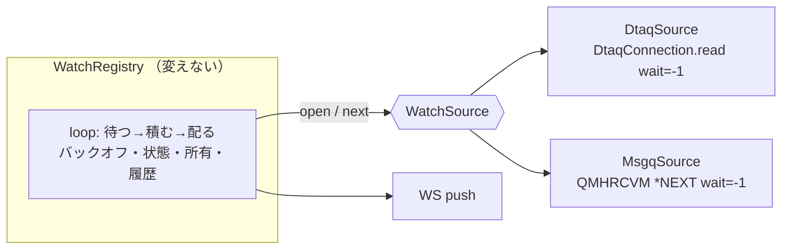
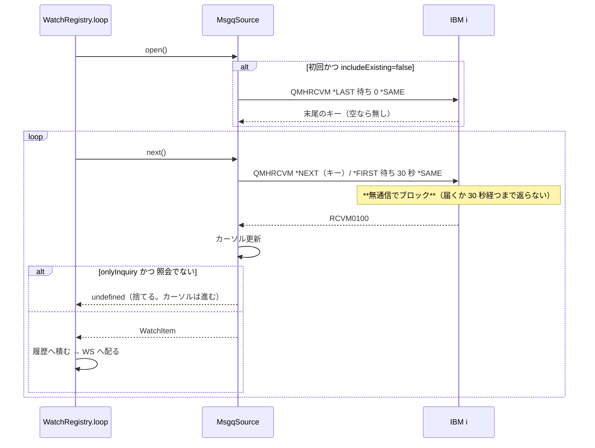

# 設計: メッセージ待ち行列の待ち受け

## アーキテクチャ概要

**骨格はそのまま、待ち方だけ差し替える。**



`loop()` は**何を待っているか知らない**。知っているのは「次の 1 件が来るまで待つ」だけ。

## コンポーネント / モジュール

| 名称 | 責務 |
| --- | --- |
| `WatchSource` / `WatchLink` | **待ち方の抽象**。開く / 次の 1 件 / 閉じる |
| `DtaqSource` | いまの `openDtaq` ＋ `read` をこの形に包む（**挙動は変えない**） |
| `MsgqSource` | `openCommand` ＋ `QMHRCVM`。カーソルと絞り込みを持つ |
| `message-receive.ts`（hostserver） | `QMHRCVM` の引数組み立てと `RCVM0100` の読み取り。**純粋ロジック** |
| `WatchRegistry` | 変更は「`spec` を種類ごとの union にする」「`kind` を広げる」だけ |

## インターフェース / データモデル

```ts
/** 種類ごとに違うのはここだけ */
export interface WatchSource {
  readonly kind: WatchKind;              // "dtaq" | "msgq"
  open(): Promise<WatchLink>;
}
export interface WatchLink {
  /** 次の 1 件が来るまでブロックする。**空で戻ってもよい**（呼び直される） */
  next(): Promise<WatchItem | undefined>;
  close(): void;
}
export interface WatchItem {
  text: string;
  bytes: number;
  sender?: string;
  message?: WatchMessageInfo;            // msgq のときだけ
}
```

**`next()` が空を返せる**のは要点——`onlyInquiry` で捨てたときに使う。
捨てたことを `loop` に知らせる必要は無く、`loop` は黙って呼び直す
（既存の「空で戻るのは想定外だが読み直す」分岐が**そのまま正しい意味を持つ**）。

### `MsgqLink` の状態

```ts
class MsgqLink {
  private cursor?: Uint8Array;  // 最後に見たキー（4 バイト）
}
```

**カーソルは接続に属する**（`WatchLink` に持たせる）。張り直したら取り直す——
切れている間に届いたぶんは、**`*LAST` からやり直すと落ちる**が、
**キーを持ち越すと二重になる**。取りこぼしより二重の方が実害が小さいので**持ち越す**。
`WatchRegistry` 側に持たせず `MsgqSource` に持たせて、張り直しをまたいで生き残らせる。

## 処理フロー / シーケンス



## 設計判断

### D1: 種類の増設は「設定の種別」で行う（`sessionType: "msgwatch"`）

既存の待ち行列監視は**セッション定義の種別**として表現されている
（`config-store` / `boot-autostart` / `service-reconcile` / `ConfigCard` が全部それで分岐する）。
**同じ形に乗せる**と、自動開始・停止/再開・定義変更の反映・所有・一覧が**全部ただで付いてくる**。

別の設定体系を作ると、これらを全部作り直すことになる。

### D2: **カーソルは持ち越す**（張り直しで取り直さない）

- 取り直す（`*LAST`）→ 切れている間に届いたぶんが**消える**（通知の取りこぼし）
- 持ち越す → 切れている間のぶんが**まとめて流れる**（正しい。二重にはならない）

**通知の取りこぼしは、この機能の存在意義を壊す。**

ただしキーが消されていた場合（`CPF2551`）は取り直すしかない。
そのときは**欠測をログに残す**（黙って飛ばさない）。

### D3: `RCVM0200` を使う（`RCVM0100` では本文が返らない）

当初は「送信元は一覧で見られるから `0100` で足りる」と考えたが、**実機で覆った**——
`0100` が返すのは**置換データ**であって読める本文ではない（research F6）。

`0200` の固定部は 176 バイト、長さは `152 / 160 / 168`。実機 5 件で
`176 ＋ 3 つの長さ ＝ 返り` が成り立つことを確認してある。
**送信元の欄は使わない**（位置を確認していないものに依存しない）。

### D3b: **1 回の待ちは 30 秒で区切る**（無限に待たない）

無限に待つと、**ホスト側のジョブが待ち行列を掴んだままになり `DLTMSGQ` が通らない**
（research F8。実機で踏んで、1 通投げるまで解放されなかった）。

- 通知の速さ: **変わらない**（届いた瞬間に返る）
- ホストへの負荷: 何も来ないとき 1 分 2 往復だけ
- 引き換え: **止めてから待ち行列を消せるまで最大 30 秒**（実機で 30 秒を計測）

待ち行列の保守が、誰かが待ち受けているだけで止まる方が困る。

### D4: **消さない**ことを型で表さない

`*SAME` を固定値で埋め込み、**設定で変えられるようにしない**。
「待ち受けたら消える」を選べるようにすると、**取り違えたときに戻せない**
（`MessagePane` で消す操作に確認を出しているのと同じ理由）。

### D5: read タイムアウトの無効化は**その 1 往復だけ**

`host-connection.ts` に既にある仕組み（`readTimeoutMs`、dtaq のために入れた）を
`CommandConnection.call()` から使えるようにする。**接続既定は触らない**——
触ると同じ接続の他の呼び出しまで永久に待つようになる。

## plan への申し送り

1. **先に `WatchSource` の切り出しだけを行い、既存のテストが全部通ることを確かめる**
   （振る舞い不変。ここで落ちたら切り出しを間違えている）
2. そのあとメッセージ側を足す
3. 実機検証は**専用の待ち行列**で行い、`QSYSOPR` は**件数が変わらないこと**の確認に使う
