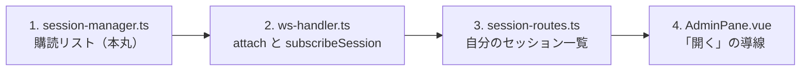

# レビューガイド: 既存セッションへの attach

**MCP や HLLAPI が開いた画面を、あとからブラウザで見られるようにする。**

## 30 秒で分かる要約

```
「セッション管理」→ 開く  ──▶  { type: "open", sessionId }  ──▶  既存のセッションへ繋ぐ
                                                                （新規に開かない）
```

- **自分のものだけ**（`sessions.get(id, user)` の所有者検査）
- **状態を変えない**（プリンターの `20260801-printer-attach-by-ref` と同じ判断）
- 2 つのタブが**同じ画面を見られる**——画面も予約の覆いも両方に届く

## 読む順番



## 見てほしい 4 点

### 1. 通知を購読リストにした（**これが本丸**）

以前は 1 枠で上書きしていた:

```ts
entry.onPcCommandEvent = fn;     // 2 つ目のタブが 1 つ目を消す
delete entry.onPcCommandEvent;   // 片方が閉じると残った方も消える
```

`screen` は `EventEmitter` なので画面更新だけは両方に届く。つまり
**「画面は同期するのに覆いは片方にしか出ない」**という気づきにくい壊れ方をしていた。

いまは `subscribeReservation(id, fn)` が**解除の関数を返す**。呼び出し側は自分の分だけ外す
——`delete entry.onX` で他人の購読まで消す事故が構造的に起きない。

### 2. 繋いだだけのタブはセッションを閉じない（**実装中に見つけた欠陥**）

`dispose` は表示セッションを閉じる（タブがセッションを所有する設計）。
そのままだと**見に来ただけのタブが去ったときに、開いた人や MCP の作業を殺す**。

「このタブが開いたのか、繋いだだけか」を持たせた。併せて、自分が開いたタブでも
**他に見ている人が残っていれば閉じない**（後から繋いだタブが残っているのに画面が消える、を避ける）。

### 3. 一覧は `/api/sessions`（自分の分）

`/api/admin/sessions` は `listAll()` で**全利用者**を返すので使わない
——admin が既定で他人の画面を開く導線は作らない（`20260803-hllapi-bridge` の判断と同じ）。

**もう 1 つ理由がある**（実装中に判明）: `registerAdminRoutes` は**監査の設定があるときだけ**
登録される。あちらに依存すると、設定の無い環境で一覧が空になる。

### 4. 在席（`viewers`）は触っていない

`20260803-mcp-session-exclusion` で**「疎通の有無で判断する」を選んでいた**おかげで、
attach を入れてもそのまま正しい。出どころ（MCP が開いたか）で判断していたら、
ここで作り直しになっていた。

## 実機で確かめたこと（35/35）

```
OK  **2 つ目のタブが既存セッションを開けた**
OK  **新しい接続を作っていない** — 1 件
OK  **在席が 2** — 2 人
OK  **覆いが 1 つ目のタブに出る**
OK  **覆いが 2 つ目のタブにも出る**
OK  **2 つ目を閉じてもセッションは残る**／**在席が 1 に戻る**
```

## 確かめていないこと

- **認証を有効にした状態での attach**（他人のものが開けないことは単体で確認済み）
- 3 つ以上のタブ
