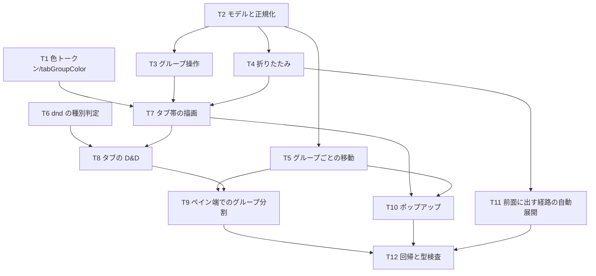

# 計画: タブグループ

## split 判定（subtask 分割の要否）

**分割しない**（単一 tasks.md ＋ 1 PR）。

- 変更は `packages/web-ui` 内の 8 ファイルに収まり、中心はストア 1 本とタブ帯コンポーネント 1 本。
- ストア（モデル・正規化）と UI（描画・D&D）は**相互依存で、単独ではデリバリできない**
  （ストアだけ入れても利用者に何も起きず、UI だけでは動かない）。かといって漸進レビューが要る規模でもない。
- → `DESIGN.md`「5.」の決定木で「不可分」に該当。通常の plan で進める。

## 実装方針

**内側から外側へ**組み立てる。ストアの不変条件を先に固め、そのうえに描画・D&D・ポップアップを載せる。
各段でテストを足し、**既存テスト（`pane-tabs` / `tab-dnd` / `tab-visibility` / `tabs-own-system` /
`pane-maximize` / `pane-state-keep` / `file-drag`）を緑のまま**進める。

1. **色**（依存なし・純関数）——`--tg-*` トークンと `tabGroupColor.ts`。他から参照されるので最初に置く。
2. **モデルと正規化**——`TabGroup` 型・`tabGroups` / `tabGroupOf`・`normalizeTabGroups()`。
   既存の変更経路（`dropTabInto` / `moveTab` / `split` / `closeSession`）から呼ぶ。
   **この段で不変条件（連続化・1 枚で解除・迷子の掃除）を完成させる**——後段の操作はすべてこれに乗る。
3. **グループ操作**——`groupTabs` / `ungroupTabGroup` / 着地点の両隣による所属判定。
4. **折りたたみ**——`collapsed` と `visibleTabs` の絞り込み。`tabs` / `activeTab` には触らない。
5. **グループごとの移動**——`moveTabGroupInto` / `splitWithTabGroup` / `tabGroupTabs`。
6. **D&D の種別判定**——`dnd.ts` に MIME 定数と `isTabGroupDrag`。UI の前に置く（UI が参照する）。
7. **タブ帯の描画**——`StripItem` でチップとタブを一列に組み、メンバーへ背景と inset 下線。
   **高さが変わらないことをテストで固定**する。
8. **タブの D&D**——中央ゾーン（`zoneOfTab`）・`drop-into` 予告・チップのドラッグ・畳んだチップへのドロップ。
9. **ペイン端でのグループ分割**——`WorkspaceNode`。
10. **ポップアップ**——`TabGroupMenu.vue`＋`opMessages` の確認文言＋`openPopover` への一本化。
11. **既存タブを前面に出す経路の自動展開**——`LauncherPane` / `openConfigured`。
12. **回帰と型検査**——テスト全通し＋`vue-tsc`。

## 作業順序と依存関係

## リスク / 留意点

- **最大の地雷: 折りたたみで `tabs` から外すこと**（research F4）。ペインの実体が落ちて
  書きかけの SQL が消える。T4 では `visibleTabs` だけを触り、`PanePool` / `openedPanes` には
  一切手を入れない。`pane-state-keep.test.ts` が緑であることを毎回確認する。
- **中央ゾーンで既存 D&D テストが落ちる**（research F2）。`edge = width * 0.3` と非厳密比較を守る。
  T8 の最初に既存 2 件を走らせて確認する。
- **`visibleTabs` の意味が増える**。「システムで絞り込まない」という既存の約束
  （`tab-visibility.test.ts`）は維持したまま、折りたたみという別軸を足す。**両方の軸を
  テスト名とコメントで書き分ける**——さもないと「絞り込みが復活した」と誤読される。
- **命名の混線**。`group` はペインの語（research F3）。レビューで `group` 単独の新規使用を弾く。
- **高さの回帰**。`box-shadow: inset` と背景以外の装飾（border / padding / outline）をメンバータブへ
  足さない。T7 でタブ帯の高さを固定するテストを書く。
- **正規化の呼び忘れ**。新しい変更経路を足したら必ず末尾で `normalizeTabGroups()` を呼ぶ。
  T2 で「呼び出し元の一覧」をコメントに残す。

## テスト方針

**ストア（純ロジック）を厚く、UI は継ぎ目だけ**を見る。実行は `cd packages/web-ui && npx vitest run`
（ルートからは偽陽性。`AGENTS.md`）、型は `npm run build -w @ts5250/web-ui`。

- `test/tab-groups.test.ts`（新規・ストア）
  - グループ化 / 参加 / 離脱 / 1 枚での自動解除（離脱・クローズ・別ペイン移動の 3 経路）
  - 連続化（グループの途中に他タブが割り込まない）
  - 折りたたみで `visibleTabs` から消えるが `tabs` と `activeTab` は不変
  - グループごとの移動（合流・分割）で名前・色・折りたたみ・並びが保たれる
  - INV-TG1（グループが 2 ペインに跨らない）
- `test/tab-group-ui.test.ts`（新規・コンポーネント）
  - チップの表示（名前あり／なし・折りたたみ中の印・アクティブの印）
  - 中央ドロップでグループ化・左右端は従来どおり並べ替え
  - 畳んだチップへのドロップで参加（畳んだまま）
  - ポップアップの 4 項目と外側クリックでの閉じ
  - 一括クローズの確認（`confirm` をスタブし、キャンセルで 1 枚も閉じないこと）
  - **タブ帯の高さがグループ有無で変わらない**
- 回帰: 既存 7 ファイルをそのまま通す（変更しない。落ちたら実装側を直す）。
- 人が触る観点（test 工程）: ドラッグの手触り（中央 40% の当たり判定）・折り返し時の見え方・
  ライト/ダーク両テーマでの色の見分け。
