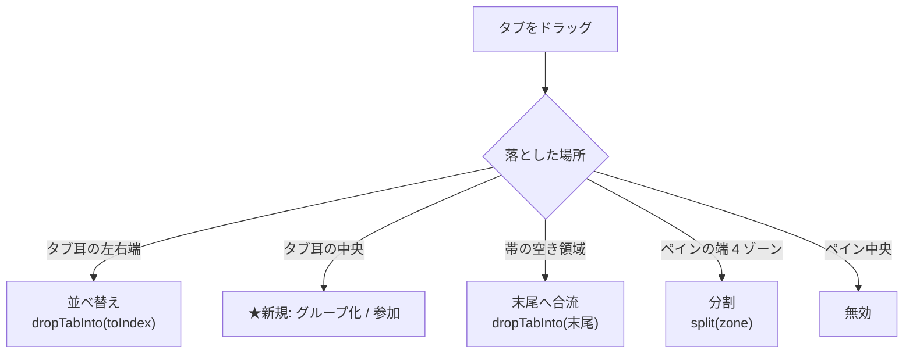
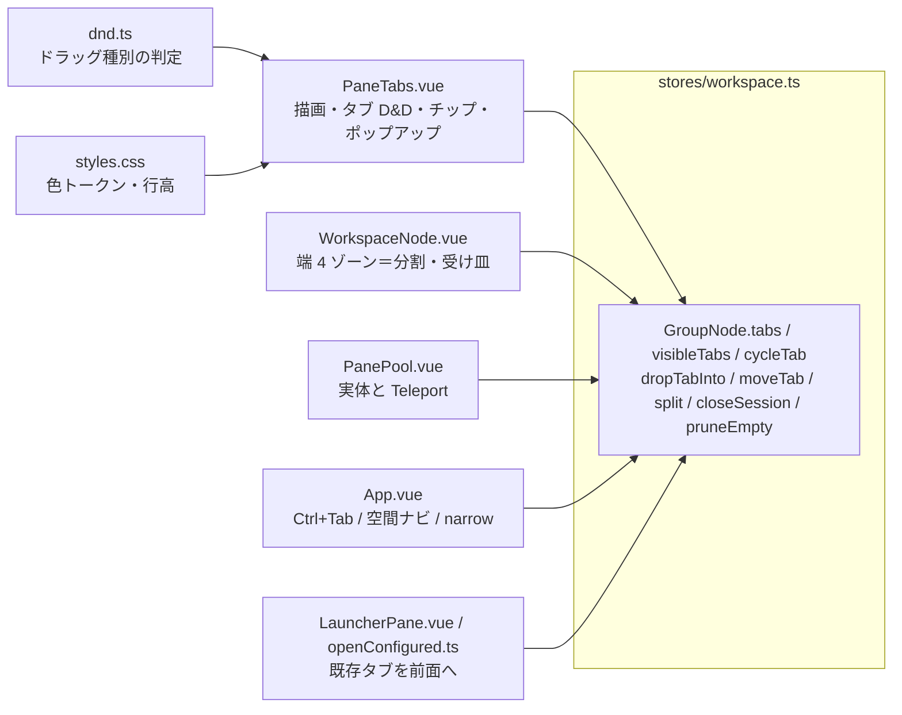

# 調査: タブグループ（既存タブ／ペイン機構の実地確認）

requirement の「未確定事項」のうち**調査で潰せるもの**を、実コードを直読して事実で埋める。
設計判断（how）は spec に回す。

## 調査の問い

- **Q1**: 既存のタブ D&D はどこで何を分岐しているか。「重ねる（中央）」を第 3 のゾーンとして足せるか。
- **Q2**: グループの所属をどこに持てるか。既存モデル（`GroupNode.tabs`）の形と、命名の衝突は。
- **Q3**: タブがグループへ出入りしても**ペインの状態が壊れない**のは何の仕組みか。折りたたみで隠す場合は。
- **Q4**: タブ帯の高さは何で決まるか。行を増やさずにチップと囲いを置けるか。折り返しの影響は。
- **Q5**: 色パレットの既存資産（`--sys-N`）はグループ色に流用してよいか。
- **Q6**: タブがグループから外れる経路は何本あるか（自動解除を挟む位置）。
- **Q7**: 折りたたみで「隠れたタブ」ができたとき、既存のどの経路がそれを踏むか。
- **Q8**: グループごとのドラッグは既存 D&D とどう共存するか。
- **Q9**: テストはどう書かれているか。jsdom 由来の制約は。
- **Q10**: ポップアップの既存規約と再利用できる部品は。

## 判明した事実

### F1 (Q1) ドロップ位置の判定は 2 か所に閉じており、第 3 ゾーンは局所変更で足せる

- タブ耳の上: `onTabDragOver` が `after = ev.clientX > r.left + r.width / 2` で**前／後ろの 2 分岐**を決め、
  `reorder` に持つ。`onTabDrop` がそれを見て挿入位置を計算する（`PaneTabs.vue:142-167`）。
- 帯の空き領域: `onStripDragOver` / `onStripDrop` が**末尾へ合流**（`PaneTabs.vue:178-191`）。
- ペインの端 4 ゾーン: `WorkspaceNode.zoneFrom` が矩形比 25% で判定し**分割**（`WorkspaceNode.vue:42-71`）。
  **中央は `undefined` を返して既に無効**（同 55 行）——合流はタブ帯が受けるため。

タブ耳の `dragover` / `drop` は `stopPropagation()` する（`PaneTabs.vue:145,152`）ので、
**タブの上にいる間は端ゾーン判定へ伝播しない**。よって「重ねる」を足す影響は上記 2 関数に閉じる。

### F2 (Q1/Q9) jsdom の矩形は全て 0。中央帯は**幅に比例**させないと既存テストが落ちる

`pane-tabs.test.ts` は jsdom の `getBoundingClientRect()` が全 0 を返す前提で書かれている
——テスト内のコメントが明示している: 「`s3` の後ろ（**clientX>中点=0**）へドロップ」（`pane-tabs.test.ts:23`）。
前へ挿入するケースは 「`clientX=0` は中点 0 より大きくない＝before」として `clientX: 0` を使う（同 35-38 行）。

したがって中央帯の定義次第で既存 2 件が落ちる。幅 0 のとき:

| 定義 | `clientX=0` | `clientX=10` | 既存テスト |
|---|---|---|---|
| `rel <= w*k` → 前 / `rel >= w*(1-k)` → 後ろ / それ以外 → 中央 | 前 ✅ | 後ろ ✅ | **通る**（中央帯が幅 0 に潰れる） |
| `rel < w*k` → 前 / …（不等号が厳密） | 中央 ❌ | 後ろ | 落ちる |
| 端から**絶対 px** の帯（`rel < 12px` → 前 等） | 前 | **前** ❌ | 落ちる |

→ **中央帯は要素幅に比例させ、前後の比較は非厳密（`<=` / `>=`）にする**と、幅 0 で中央帯が消えて
現行の中点判定に一致する。別解として、中央ゾーンのテストだけ `getBoundingClientRect` を差し替える。

### F3 (Q2) タブは文字列 ID の配列。所属は「別表」で持つ前例がある。ただし **`group` は既にペインの名前**

- `GroupNode = { type:"group", id, tabs: string[], activeTab }`（`stores/workspace.ts:12-17`）。
  タブは**素の文字列 ID**で、自分の所属を何も持たない。
- 同じ問題（タブ ID から所属を辿れない）を、システムでは**別表**で解いている:
  `tabSystem: Record<string, string>`（`workspace.ts:62-67`。理由がコメントに明記されている）。
- **命名の衝突は実在する**。`GroupNode`／`groups()`／`focusedGroupId`／`maximizedGroupId`／
  `dropTabInto(targetGroupId, …)` はすべて**ペイン**を指す。DOM にも出ている——
  `.group[data-group-id]`（`WorkspaceNode.vue:147`）を `App.vue:190` の空間ペインナビが
  `document.querySelectorAll` で拾う。**新概念に `group` を使うと、コードも DOM も読めなくなる。**

### F4 (Q3) ペインの実体は 1 か所（PanePool）にあり、`tabs` に居る限り作り直されない

- 実体は `PanePool` が持ち、`<Teleport>` で `WorkspaceNode` の `.pane-slot` へ差し込む
  （`PanePool.vue:1-20,105-142`）。行き先は**実要素**を `paneSlotEls` に登録して渡す
  （`openedPanes.ts:24-45`）——セレクタ文字列だと組み替え時に古い要素へぶら下がる。
- 母集合は「一度でも開いた」∩「**どこかのペインが持っている**」（`PanePool.vue:105-111`）。
  → **同一ペイン内でグループに出入りするだけなら、`tabs` の並びが変わるだけで実体は無傷**。
    グループごと別ペインへ移す場合も、今のタブ 1 枚の移動と同じ経路（受け皿が変わる＝Teleport が DOM を移す）。
- 折りたたみ側も安全: 受け皿を出す `liveTabs` は **`group.tabs` を見ており `visibleTabs` ではない**
  （`WorkspaceNode.vue:98`）。受け皿は `v-show="t === group.activeTab"` で既に非表示分を隠している（同 170 行）。
  → **折りたたみは「タブ帯の描画から隠す」だけにし、`tabs` からは絶対に外さない**。外すと実体が落ちて状態が消える。

### F5 (Q4) 高さは 28px 固定で、ヘッダーと共有。囲いを回すと必ず背が伸びる

- `.tabs { min-height: var(--chrome-row-h); … min-height: 28px; }`（`PaneTabs.vue:265-277`。
  **同じプロパティが 2 回書かれており後者が勝つ**——値は今どちらも 28px）。
- `--chrome-row-h: 28px` は `styles.css:59`。**ヘッダーも同じ変数を見る**（`App.vue:491-493`。
  「両方がここを見る（利用者の指摘: 揃えてほしい）」）。
- タブ本体は `padding: 4px 8px` ＋ 上左右 1px ボーダー ＋ `font-size:12px`（`PaneTabs.vue:285-299`）で 28px に収まる。
  → **グループを枠で囲む＝上下に border/padding が増える＝帯が高くなる**。requirement の「高さを変えない」と直接ぶつかる。
- `.tabs` は `flex-wrap: wrap; align-content: flex-start`（同 273,276）。**グループは折り返しで分断されうる**。
  外周を 1 本の枠で描く表現は折り返すと破綻し、**チップ＋タブごとの背景**なら破綻しない。
  Edge のスクリーンショットも同じ形（同じ行に色の塊＋タブ、下線でまとまりを示す）。

### F6 (Q5) `--sys-1…8` は「システムの識別」専用として設計されている。流用は意味が濁る

- 定義は `styles.css:46-53`（ライト）／`114-121`（ダーク＝明度だけ 1 段上げる）。
- 設計意図がコメントで明記されている（`styles.css:30-45`）:
  **1 組だけ定義しスキンごとには作らない** / **純粋な赤と黄は入れない**（赤＝エラー・黄＝注意と衝突するため） /
  設定は**番号だけ**を持つ（hex を設定ファイルに書かない）。
- `systemColor.ts` が `ref → 番号` を決定的に導き（`autoSystemColor`）、`systemColorVar(n)` で `var(--sys-N)` を返す。
- → **同じ 8 色を両方に使うと「同じ色＝同じシステム」の読みが壊れる**。グループ色は同じ設計方針
  （番号だけ持つ・1 組・赤黄を避ける・ダークで明度を上げる）に従った**別トークン**を起こすのが低リスク。
  Edge のパレットは 9 色（ピンク／紫／薄紫／青／青緑／橙／黄土／灰）。

### F7 (Q6) タブが `tabs` から外れる経路は 4 本。すべて `pruneEmpty()` を呼ぶ前例がある

| 経路 | 位置 |
|---|---|
| `closeSession(id)` | `workspace.ts:273-283`（`tabSystem` からも削除 → `pruneEmpty()`） |
| `dropTabInto(...)` | `workspace.ts:198-214`（別ペインへ移った場合のみ `pruneEmpty()`） |
| `moveTab(...)` | `workspace.ts:226-235` |
| `split(...)` | `workspace.ts:238-271` |

- セッション側の切断経路も最後は `workspaceStore.closeSession` に合流する（`session-controller.ts:514-529`）。
  タブの ✕ は種別で振り分けるだけ（`PaneTabs.vue:98-101`）。
- → **「1 枚になったら解除」は、`pruneEmpty()` と同じ位置に正規化処理を 1 つ置けば全経路を覆える。**
  逆に UI 側（`PaneTabs`）に書くと、`split` 経由の離脱などを取りこぼす。

### F8 (Q7) 隠れたタブを踏みうる経路の棚卸し

| 経路 | 位置 | 折りたたみ時の扱い |
|---|---|---|
| タブ帯の描画 | `PaneTabs.vue:37` → `visibleTabs(g)` | **唯一の描画の継ぎ目**。ここで隠す |
| `visibleTabs` の現仕様 | `workspace.ts:179-181`（**今は全件返すだけ**） | 折りたたみ分を除く実装に変わる |
| `cycleTab(±1)` | `workspace.ts:217-223`（`g.tabs` を巡回）。呼び出しは `App.vue:234,239` | **隠れたタブを選んでしまう**→ 除外が要る |
| 受け皿 `liveTabs` | `WorkspaceNode.vue:98`（`group.tabs`） | **変えない**（状態保持のため。F4） |
| ペインの activeness | `PanePool.vue:117`（`g.activeTab === tab`） | requirement 16（アクティブを外へ移す）で解消 |
| フォーカス移動 | `App.vue:207-215`（`[data-hidden]` を飛ばす） | 既に隠れた受け皿を避けている |
| システム名の出し分け | `PaneTabs.vue:56-69`（全ペインの `tabs` を走査） | 隠しても意図どおり（全体で判定する設計） |
| 既存タブを開き直す | `LauncherPane.vue:114,149` / `openConfigured.ts:37,134` | **折りたたみ中のタブを指名しうる**→ 展開が要る |

### F9 (Q8) D&D の識別は「MIME＋ストアの写し」の二段構え

- タブ: `dataTransfer.setData("text/session", id)`（`PaneTabs.vue:117`）＋ `workspaceStore.draggingSession`（`workspace.ts:82`）。
  **写しが要るのは `dragover` で `getData` が読めないから**——実際 `WorkspaceNode` は `drop` でだけ
  `getData("text/session")` を読む（`WorkspaceNode.vue:68`）。
- ファイル: `isFileDrag(ev)`（`dnd.ts`）。**判定を 1 か所に置く**方針が明記され、`file-drag.test.ts:16` が固定している。
- → グループのドラッグにも**専用 MIME ＋ ストアの写し**が要る（タブ用の `draggingSession` に
  グループ ID を混ぜると、既存の「自ペイン内か」判定 `PaneTabs.vue:184` が誤作動する）。

### F10 (Q10) ポップオーバーの型は決まっている。タブ内に出す前例もある

- 規約: バックドロップ（`position:fixed; inset:0`）＋本体（`position:absolute; top:100%`）、
  外側クリックと再クリックで閉じる、本体は `@click.stop`／`@mousedown.stop`（`docs/UI-DESIGN.md:51-58`）。
  共通実装 `InfoPopover.vue` は `rows`（ラベル/値）＋ slot——**メニュー用ではない**。
- タブの中に出す前例: `SessionInfo` を `.tab` 内にマウントし `infoFor` で開閉（`PaneTabs.vue:245-250`）。
  アンカーの `.tab` は `position: relative`（同 286）。
- `headerMenu.ts` の「同時に 1 つだけ」は**ヘッダーのメニュー限定**の共有状態で、タブ内の
  `SessionInfo` は参加していない。

### F11 (Q9) テストの実行と型検査の落とし穴

- **web-ui のテストはパッケージ dir から実行する**（`cd packages/web-ui && npx vitest run`）。
  ルートから実行すると Vite の vue plugin とフィクスチャの相対パスが解決されず**偽陽性が出る**（`AGENTS.md:142-144`）。
- **root の `npm run build` は web-ui を検査しない**。`npm run build -w @ts5250/web-ui`（`vue-tsc -b && vite build`）が要る。
  web-ui は `tsconfig.test.json` を持ち **`test/` も型検査対象**（`AGENTS.md:136-141`）。
- 既存テストの型: コンポーネントは `mount(PaneTabs, { props: { group } })` で直接マウントし
  `dragstart`/`dragover`/`drop` を trigger（`pane-tabs.test.ts`）。ストア単体のテストも機能ごとに独立
  （`tab-visibility.test.ts` / `tab-dnd.test.ts` / `tabs-own-system.test.ts` / `pane-maximize.test.ts` /
  `pane-state-keep.test.ts`）。

## 影響範囲

- **変更が要る**: `stores/workspace.ts`（モデル＋操作）、`PaneTabs.vue`（描画・D&D・チップ・ポップアップ）、
  `WorkspaceNode.vue`（グループの端ドロップ）、`dnd.ts`（種別判定）、`styles.css`（色トークン）、
  `App.vue`（`cycleTab` の隠しタブ回避）。
- **触らないほうがよい**: `PanePool.vue` / `openedPanes.ts`（状態保持の要。F4）。
- **確認が要る**: `LauncherPane.vue` / `openConfigured.ts`（折りたたみ中のタブを指名する経路。F8）。
- **回帰テストが既にある領域**: `pane-tabs` / `tab-dnd` / `tab-visibility` / `tabs-own-system` /
  `pane-maximize` / `pane-state-keep` / `file-drag`。

## 実現性 / リスク

- **高さを変えずに表現できる**（F5）。チップをタブと同じ行に並べ、まとまりはタブごとの背景・
  グループ両端の丸め・下線で示せば `min-height: 28px` の中に収まる。**外周の枠は不可**。
- **折り返しでグループが分断される**（F5）。requirement は「折り返しても壊れないこと」を求めており、
  タブごとの背景方式なら満たせるが、**分断された 2 行目がグループの続きだと分かる表現**は spec で決める。
- **状態保持は既存機構に乗る**（F4）。ただし「折りたたみ＝ `tabs` から外す」実装にすると
  **ペインの実体が落ちて書きかけの SQL が消える**——この作業で最も踏みやすい地雷。
- **既存テストとの衝突リスク**は 2 点:
  1. 中央ゾーンの定義（F2）。幅に比例させないと `pane-tabs.test.ts` の 2 件が落ちる。
  2. `visibleTabs` の意味（F8）。今は「**絞り込まない**」ことがテストで固定されている
     （`tab-visibility.test.ts` の表題そのもの）。折りたたみは**システムによる絞り込みとは別軸**なので、
     テストと注記で軸を書き分けないと「絞り込みが復活した」と誤読される。
- **`narrow` / 最大化中**は `split()` が既に `moveTab` へフォールバックする（`workspace.ts:241-248`）。
  グループの端ドロップも同じ分岐に合わせれば新しい破綻は生まれない。
- **連続性の強制**（requirement 5）と既存 API の相性: `dropTabInto` の `toIndex` は
  「**ドラッグ中タブを除いた配列**での位置」という約束（`workspace.ts:194-197`）。グループ制約を足すと
  位置の補正が要る。約束を変えるのではなく、補正を店内（store 側）で完結させるのが安全。
- サーバー・API・設定スキーマへの波及は**無い**（すべて web-ui 内で完結する）。

## spec への申し送り

1. **命名**（F3 必須）。`group` はペインの語なので、新概念には別語を割り当てる
   （型・ストアのキー・CSS クラス・`data-*` 属性まで一貫させる）。`.group[data-group-id]` を
   `App.vue` の空間ナビが拾っている点に注意。
2. **モデルの持ち方**。`tabSystem` 方式（タブ ID → グループ ID の別表）＋グループ定義の表（名前・色・折りたたみ）
   が既存の形に最も近い。`tabs` 配列の要素型は**変えない**（`liveTabs` ほか多数が文字列前提）。
3. **中央ゾーンの定義**は幅に比例させ、前後の比較を非厳密にする（F2 の表）。ドロップ予告の見せ方も決める。
4. **折りたたみは描画だけ**。`visibleTabs` を継ぎ目にし、`tabs` からは外さない（F4）。
   併せて `cycleTab` の隠しタブ回避、既存タブを前面に出す経路での自動展開（F8）を決める。
5. **自動解除は store の正規化に置く**（F7）。`pruneEmpty` と同じ位置で、4 経路すべてを覆う。
6. **色トークン**は `--sys-*` とは別に起こし、同じ設計方針（1 組・番号だけ持つ・赤黄を避ける・
   ダークは明度のみ）に従う（F6）。パレットの色数も決める。
7. **グループ D&D の識別子**は専用 MIME ＋ ストアの写し。`draggingSession` に混ぜない（F9）。
8. **ポップアップ**は `InfoPopover` の構造規約に従いつつ、メニュー用に別部品を起こす（F10）。
   `SessionInfo` と同時に開けてよいかも決める。
9. **文言**は `composables/opMessages.ts` に定数で置く（`AGENTS.md` UI デザインガイド）。
10. **検証**は `cd packages/web-ui && npx vitest run` と `npm run build -w @ts5250/web-ui` の両方
    （root の build では web-ui を検査しない。F11）。

### 未解決（spec で決める。調査では答えが出ない設計判断）

- 折りたたみの操作割り当て（チップ内トグル ∨ / ダブルクリック）と、28px に収まるか。
- 折りたたみでそのペインに見えるタブが 1 枚も無くなったときの表示（既存の「セッションなし」は
  閉じたと誤読される）。
- 折りたたんだチップの上へタブを落として参加させるか。
- 「グループ内のタブをすべて閉じる」に確認を挟むか。
