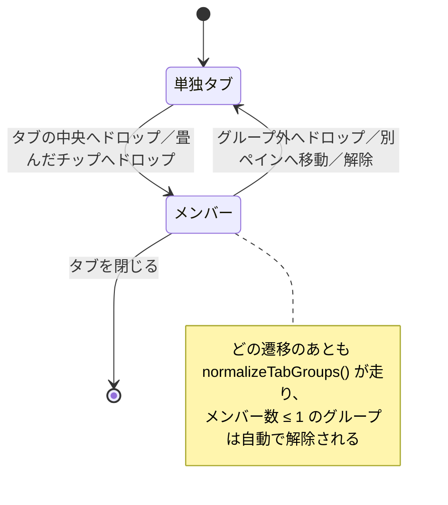

# 仕様: タブグループ

## 概要

`GroupNode`（＝ペイン）の `tabs: string[]` はそのままに、**タブ ID → グループ ID の別表**と
**グループ定義の表**をワークスペースストアへ足す。タブ帯の描画・D&D・チップ・ポップアップは
`PaneTabs.vue` に閉じ、グループごとのペイン分割だけ `WorkspaceNode.vue` が受ける。

不変条件（連続配置・1 枚での自動解除・グループは 1 ペインに属する）は**ストア側の正規化 1 か所**で
守り、UI からは呼ばない。`pruneEmpty()` が全経路から呼ばれている前例（research F7）に倣う。

## 設計方針

### D1. `tabs: string[]` の要素型を変えない（別表方式）

`tabs` を「タブまたはグループ」の配列にすると、`liveTabs`（`WorkspaceNode.vue:98`）・
`PanePool.entries`（`PanePool.vue:105-111`）・`cycleTab`・`LauncherPane` など**文字列前提の消費者すべて**に
波及する（research F3・F8）。所属は `tabSystem`（`workspace.ts:62-67`）と同じ**別表**で持つ。
これは既にこのコードベースが選んでいる形で、理由もコメントに残っている。

### D2. `group` はペインの語なので使わない（命名）

`GroupNode` / `groups()` / `focusedGroupId` / `maximizedGroupId` / `.group[data-group-id]` は
すべてペインを指し、DOM セレクタは `App.vue:190` の空間ペインナビが依存している（research F3）。
新概念は **`TabGroup` / `tabGroup*` / `tg-*`** で通し、単独の `group` は一切使わない。

| 層 | 名前 |
|---|---|
| 型 | `TabGroup` |
| ストア | `tabGroups` / `tabGroupOf` / `draggingTabGroup` |
| 操作 | `groupTabs` / `joinTabGroup` / `leaveTabGroup` / `ungroupTabGroup` / `toggleTabGroupCollapsed` / `moveTabGroupInto` / `splitWithTabGroup` / `closeTabGroup` |
| CSS / DOM | `.tg-chip` / `.tab.tg-member` / `data-tab-group` |
| 色 | `--tg-1` … `--tg-8` / `tabGroupColor.ts` |

### D3. グループは**ちょうど 1 つのペイン**にしか存在しない（INV-TG1）

タブ 1 枚だけを別ペインへ移したら、そのタブは**グループから抜ける**。グループごと移すときは
全メンバーが一緒に動く。この不変条件のおかげで「同じグループが 2 つのペインに跨る」状態を
考えなくて済み、チップの置き場所も一意に決まる。

### D4. 折りたたみは**タブ帯の描画だけ**（`tabs` に触らない）

`tabs` から外すと `PanePool` の母集合から落ち、ペインの実体がアンマウントされて
**書きかけの SQL が消える**（research F4）。継ぎ目は既にある `visibleTabs(g)`
（`workspace.ts:179-181`。`PaneTabs.vue:37` が唯一の描画元）を使う。

**`activeTab` にも触らない**（利用者の判断）。畳んだグループの中のタブがアクティブなら、
中身は出続ける。したがって「見えるタブが 0 枚のペイン」という状態は**起きない**
（アクティブタブの中身が常に出る）。代わりに、チップへ**アクティブの印**を出して
「いま見ているものが、この畳んだグループの中にある」ことを示す。

同じ理由で **`cycleTab` は変更しない**。畳んだタブも巡回対象のまま残す——折りたたみを
「表示専用」と定義した以上、キー操作の対象から外すのは別の軸の話になる（Chrome は外すが、
こちらはアクティブタブを動かさない設計なので、外すと畳んだグループへ戻れなくなる）。

### D5. 中央ゾーンは**幅に比例**させ、前後の比較を非厳密にする

jsdom の矩形は全 0 で、既存テストがそれに依存している（research F2）。
`edge = width * 0.3` とし `rel <= edge → 前` / `rel >= width - edge → 後ろ` / それ以外を中央とすると、
幅 0 のとき中央帯が潰れて現行の中点判定に一致する（`clientX:0 → 前`、`clientX:10 → 後ろ`）。

### D6. グループの D&D は専用 MIME ＋ ストアの写し

`draggingSession` にグループ ID を混ぜると `PaneTabs.vue:184` の「自ペイン内か」判定が誤作動する
（research F9）。`text/tabgroup` と `draggingTabGroup` を別に持ち、種別判定は `dnd.ts` へ集約する
（「判定を 1 か所に置く」という既存方針）。

### D7. 色は `--sys-*` を流用せず別トークンを起こす

`--sys-*` は「システムの識別」専用として設計され、`systemColor.ts` が ref から決定的に導く
（research F6）。同じ 8 色を使うと「同じ色＝同じシステム」の読みが壊れる。設計方針
（1 組だけ・番号だけ持つ・純粋な赤と黄は避ける・ダークは明度だけ上げる）は踏襲する。

### D8. 枠で囲わない（高さを増やさない）

タブ帯は `min-height: 28px`（`--chrome-row-h`。ヘッダーと共有）で、タブ本体がちょうど収まる
（research F5）。まとまりは **チップ（同じ行）＋メンバータブの薄い背景＋`box-shadow: inset` の下線**で示す。
`box-shadow` はレイアウトに影響しないので高さが変わらない。`flex-wrap` で折り返しても、
メンバーごとの装飾なので途切れない。

## 対象範囲

| ファイル | 変更 |
|---|---|
| `packages/web-ui/src/stores/workspace.ts` | 型・状態・操作・正規化を追加（既存操作にも正規化呼び出しを足す） |
| `packages/web-ui/src/components/PaneTabs.vue` | チップの描画・中央ゾーン・チップの D&D・ポップアップの開閉 |
| `packages/web-ui/src/components/TabGroupMenu.vue` | **新規**。名前・色・解除・一括クローズ |
| `packages/web-ui/src/composables/tabGroupColor.ts` | **新規**。パレット番号 → CSS 変数、自動採番 |
| `packages/web-ui/src/components/WorkspaceNode.vue` | 端 4 ゾーンでグループのドロップを受ける |
| `packages/web-ui/src/dnd.ts` | `TAB_GROUP_MIME` と `isTabGroupDrag` |
| `packages/web-ui/src/styles.css` | `--tg-1` … `--tg-8`（ライト／ダーク） |
| `packages/web-ui/src/composables/opMessages.ts` | 一括クローズの確認文言 |
| `packages/web-ui/test/tab-group*.test.ts` | **新規**（ストア／UI） |

`PanePool.vue` と `openedPanes.ts` は**触らない**（状態保持の要）。

## インターフェース / データ構造

### 型と状態（`stores/workspace.ts`）

```ts
/** タブグループ（タブ帯の中のまとまり。ペイン＝GroupNode とは別物） */
export interface TabGroup {
  id: string;        // "tg1", "tg2", …
  name: string;      // "" = 未設定（チップは色だけ）
  color: number;     // 1..TAB_GROUP_COLOR_COUNT
  collapsed: boolean;
}

// workspaceStore へ追加
tabGroups: {} as Record<string, TabGroup>,   // id → 定義
tabGroupOf: {} as Record<string, string>,    // タブ ID → グループ id（tabSystem と同じ形）
draggingTabGroup: undefined as string | undefined,
```

### 操作（すべて末尾で `normalizeTabGroups()` を呼ぶ）

```ts
/** 2 枚を重ねてグループ化。target が既にグループなら dragged がそこへ参加する */
groupTabs(paneId: string, targetTab: string, draggedTab: string): void

/** そのグループを解除（タブは残す・並びも保つ） */
ungroupTabGroup(tgId: string): void

/** 折りたたみ / 展開 */
toggleTabGroupCollapsed(tgId: string): void

/** 名前・色 */
renameTabGroup(tgId: string, name: string): void
setTabGroupColor(tgId: string, color: number): void

/** グループごと別ペインのタブ帯へ（末尾へ合流） */
moveTabGroupInto(toPaneId: string, tgId: string): void

/** グループごとペインを分割して移す（narrow / 最大化中は moveTabGroupInto へフォールバック） */
splitWithTabGroup(paneId: string, zone: Exclude<DropZone,"center">, tgId: string): void

/** そのグループのタブ ID を並び順で返す（呼び出し側が閉じるのに使う） */
tabGroupTabs(tgId: string): string[]

/** そのタブのグループ（無ければ undefined）。tabSystem に対する systemOf と同じ位置づけ */
tabGroupOfTab(tab: string | undefined): TabGroup | undefined
```

### 色（`composables/tabGroupColor.ts`）

```ts
export const TAB_GROUP_COLOR_COUNT = 8;
/** その番号の CSS 変数（チップ・背景・下線に使う） */
export function tabGroupColorVar(index: number): string;   // `var(--tg-N)`
/** 新規グループの色。使用中でない最小番号 → 全部埋まっていたら通番の剰余（決定的） */
export function nextTabGroupColor(used: number[]): number;
```

`styles.css` に `--tg-1` … `--tg-8` をライト／ダークで定義する（`--sys-*` の直後）。

### D&D の種別（`dnd.ts`）

```ts
export const TAB_MIME = "text/session";        // 既存（文字列を定数化する）
export const TAB_GROUP_MIME = "text/tabgroup"; // 追加
export function isFileDrag(ev: DragEvent): boolean;      // 既存
export function isTabGroupDrag(ev: DragEvent): boolean;  // types に TAB_GROUP_MIME を含むか
```

## 振る舞いの詳細

### 1. 正規化（不変条件の単一の置き場）

```ts
function normalizeTabGroups(): void
```

1. **迷子の所属を捨てる**——どのペインの `tabs` にも居ないタブの `tabGroupOf` を削除。
2. **1 枚以下のグループを解除**——メンバー数 ≤ 1 のグループは所属ごと削除（requirement 4）。
3. **参照の無いグループ定義を削除**。
4. **連続化**——各ペインで、あるグループの最初のメンバーの位置に、同じグループの残りを
   現在の相対順のまま引き寄せる（安定・前寄せ）。

呼び出し元は `groupTabs` / `ungroupTabGroup` / `dropTabInto` / `moveTab` / `split` /
`closeSession` / `moveTabGroupInto` / `splitWithTabGroup`。**`pruneEmpty()` と同じ位置**に置く。



### 2. ドロップ位置の判定（`PaneTabs`）

```ts
type TabZone = "before" | "center" | "after";
const CENTER_EDGE = 0.3;            // 左右 30% が並べ替え、中央 40% がグループ化
function zoneOfTab(ev: DragEvent, el: HTMLElement): TabZone {
  const r = el.getBoundingClientRect();
  const rel = ev.clientX - r.left;
  const edge = r.width * CENTER_EDGE;
  if (rel <= edge) return "before";
  if (rel >= r.width - edge) return "after";
  return "center";
}
```

- 幅 0（jsdom）では `edge = 0` となり `before` / `after` の 2 分岐に潰れる（D5）。
- 予告表示: `before` / `after` は既存の縦線（`.drop-before` / `.drop-after`）。
  `center` は対象タブに `.drop-into`（グループ色 or アクセント色の枠）を出す。
- `center` に落としたら `groupTabs(paneId, targetTab, draggedTab)`。
  別ペインからのドラッグなら、先に対象ペインへ移してから参加させる。

### 3. 並べ替え時の所属判定（グループ外へ出す／中へ入れる）

`dropTabInto` の**着地点の両隣**で決める（Chrome と同じ考え方）。ドラッグ中タブを除いた配列で
挿入位置 `i` の左右を見て:

| 左隣 | 右隣 | 結果 |
|---|---|---|
| G のメンバー | G のメンバー | **G に所属**（グループの内側へ落ちた） |
| それ以外の組み合わせ | | **所属なし**（グループ外へ出た） |

これで「グループの途中へ落とす＝参加」「端や外へ落とす＝離脱」が 1 つの規則で決まり、
requirement 3（離脱）と 5（連続性）を同時に満たす。**別ペインへの移動は無条件に離脱**（D3）。

### 4. タブ帯の描画

`visibleTabs(g)` を「折りたたまれたグループのメンバーを除いた配列」に変える。
`PaneTabs` は**チップとタブが混ざった一列**を組み立てる:

```ts
type StripItem = { kind: "chip"; tg: TabGroup } | { kind: "tab"; id: string };
```

- あるグループの**最初のメンバーの直前**にチップを差す。折りたたみ中はメンバーが出ないので
  チップだけが残る。
- チップ: `● 名前 ∨`（名前が空なら `● ∨`）。本体クリック＝ポップアップ、`∨`＝折りたたみ、
  折りたたみ中は `›`。`draggable="true"` でグループごとのドラッグ。
- メンバータブ: `.tg-member` を付け、`--tg` にグループ色を流す。背景は
  `color-mix(in srgb, var(--tg) 14%, var(--crt))`、下線は `box-shadow: inset 0 -2px 0 var(--tg)`
  （**レイアウトに影響しない＝高さが変わらない**。D8）。先頭／末尾のメンバーだけ外側の角を丸める。
- **システムカラーの帯は従来どおり残す**（`.tab[style*="--tab-sys"]::before`。requirement 8）。
- 畳んだグループにアクティブタブが含まれるとき、チップに `.on` を付ける（D4）。

### 5. グループごとの移動

- `dragstart`（チップ）: `dataTransfer.setData(TAB_GROUP_MIME, tgId)` ＋ `draggingTabGroup = tgId`。
- 別ペインのタブ帯へ `drop`: `moveTabGroupInto(paneId, tgId)`。名前・色・**折りたたみ状態**・
  メンバーの並びを保ったまま末尾へ。移動元が空になれば `pruneEmpty()`。
- ペインの端 4 ゾーンへ `drop`: `WorkspaceNode.onDrop` が `TAB_GROUP_MIME` を先に読み、
  あれば `splitWithTabGroup`。`narrow` / 最大化中は `split()` と同じく合流へフォールバック
  （`workspace.ts:241-248` の既存分岐に合わせる）。
- **畳んだチップの上へタブをドロップ**＝そのグループへ参加（畳んだまま。展開しない）。
- チップのドラッグ中は `isTabDrag()`（`draggingSession` を見る）が false のままなので、
  タブの並べ替え予告は出ない。

### 6. ポップアップ（`TabGroupMenu.vue`）

構造は `docs/UI-DESIGN.md`「情報ポップオーバー」に従う（バックドロップ `position:fixed; inset:0` ＋
本体 `position:absolute; top:100%`、本体は `@click.stop` / `@mousedown.stop`、外側クリックと
トリガ再クリックで閉じる）。`InfoPopover` はラベル/値の行専用なので**別部品**にする（research F10）。

```
╭───────────────────────────╮
│ [ このグループに名前を付ける ] │  ← input（v-model → renameTabGroup）
│ ◉ ● ● ● ● ● ● ●           │  ← 色 8 個。選択中は輪で示す
├───────────────────────────┤
│ ⌧  グループ化を解除           │
│ ⊗  グループ内のタブをすべて閉じる │
╰───────────────────────────╯
```

- 名前は入力のたび反映（確定操作を要らなくする）。空文字に戻せる。
- **`SessionInfo` と同時には開かない**。`PaneTabs` のローカル状態を
  `openPopover: { kind: "info" | "tabgroup"; id: string } | undefined` に一本化する
  （`infoFor` を置き換え）。ヘッダーの `headerMenu` 共有状態には参加しない（あちらはヘッダー限定）。

### 7. 一括クローズ

`window.confirm` で枚数を示して確認する（`IfsPane` / `MacroMenu` / `ConfigCard` と同じ作法）。
文言は `opMessages.ts` に定数として置く（`AGENTS.md`「利用者に見えるメッセージ」）。

```ts
export const MSG_CLOSE_TAB_GROUP = (n: number): string =>
  `${n} 枚のタブを閉じます。接続中のセッションは切断されます`;
```

閉じ方は**タブごとに既存の経路へ流す**（`isPaneTab` ならワークスペースから外すだけ、
そうでなければ `session-controller.closeSession` ＝切断を伴う。`PaneTabs.vue:98-101` と同じ分岐）。
結果としてグループは空になり、正規化で消える——Edge の「グループの削除」に相当する操作は別立てにしない。

### 8. エッジケース

| 状況 | 挙動 |
|---|---|
| グループ内のタブを同じグループ内で並べ替え | 所属は変わらない（両隣が同じ G） |
| グループの端の外側へ落とす | 離脱 → 残り 1 枚なら解除 |
| メンバー 2 枚のうち 1 枚を閉じる | 残り 1 枚 → 解除（requirement 4） |
| メンバーを別ペインへ移動して元が 1 枚 | 解除。移動したタブも所属なし |
| 畳んだグループのメンバーが 1 枚になる | 解除され、タブは（折りたたみと無関係に）現れる |
| 畳んだグループごと別ペインへ移動 | 畳んだまま移る |
| 最大化中／狭幅でグループを端へ落とす | 分割せず、そのペインへ合流 |
| 折りたたみ中のタブを `LauncherPane` / `openConfigured` が前面に出す | **そのグループを展開してから**アクティブにする（開いているのに出てこない、を防ぐ） |
| ファイルのドラッグ | 従来どおり `isFileDrag` で除外（グループ化もしない） |
| 消えたシステムのタブ（`gone`） | グループとは独立。従来どおり銘板を出す |

## ドメイン固有の考慮

- **ペインの実体を作り直さない**（`AGENTS.md` の retro 由来の設計）。グループ操作は `tabs` の
  並びと別表だけを触り、`PanePool` / `openedPanes` には手を入れない。
- **タブ帯の高さは `--chrome-row-h` でヘッダーと共有**（利用者の明示要求）。`box-shadow` と
  背景色だけで表現し、border / padding を足さない。
- **色は番号だけを持つ**（`--sys-*` と同じ設計）。設定ファイルにも state にも hex を書かない。
  純粋な赤・黄は使わない（赤＝エラー・黄＝注意と衝突するため）。
- **メッセージは日本語・です／ます調・句点なし**、定数は `opMessages.ts`。テストは文言リテラルではなく
  定数を参照する。
- **`log` / `console` は使わない**（この変更はブラウザ内の状態操作のみで、ログ出力を足さない）。
- サーバー API・設定スキーマ・永続化には一切触らない（タブグループはブラウザ内の表示状態）。

## エラー処理 / 異常系

- 存在しない `tgId` / タブ ID を受けた操作は**黙って何もしない**（既存の `setActiveTab` /
  `moveTab` と同じ作法。`findGroup` が undefined を返したら return）。
- 色番号が範囲外なら自動採番へ倒す（`systemColorIndex` と同じ「壊れた値で色が消えるより何か付く」方針）。
- ドロップ中にドラッグ元が消えた（タブが閉じられた）場合、正規化が迷子の所属を掃除するので
  不整合は残らない。
- `window.confirm` が使えない環境（テスト等）では `globalThis.confirm` の有無を見て、
  無ければ確認なしで進む（`ConfigCard.vue:595` と同じ書き方に合わせる）。

## 受け入れ基準との対応

| requirement の完了条件 | 実現方法 |
|---|---|
| 中央ドロップでグループ化・左右端は並べ替え | `zoneOfTab`（D5・§2） |
| 参加と離脱 | `groupTabs`（§2）／着地点の両隣で判定（§3） |
| 残り 1 枚で自動解除（離脱・クローズ両方） | `normalizeTabGroups` を全変更経路から呼ぶ（§1） |
| グループ内タブが連続する | 正規化の 4.（§1） |
| カラーチップと名前 | `StripItem` でチップを差し込む（§4） |
| ポップアップ 4 項目・外側クリックで閉じる | `TabGroupMenu.vue`（§6） |
| 折りたたみ／展開・タブは閉じない | `visibleTabs` で隠すだけ（D4・§4） |
| 折りたたんでもアクティブタブが変わらない・チップに印 | `activeTab` に触らない＋チップの `.on`（D4・§4） |
| チップのドラッグで別ペインへ合流 | `moveTabGroupInto`（§5） |
| チップのドラッグでペイン分割 | `splitWithTabGroup`（§5） |
| ペインの内部状態が失われない | `tabs` から外さない・`PanePool` を触らない（D1・D4） |
| システムカラー帯が残る | `.tab::before` を変更しない（§4） |
| 1 ペインに複数グループ | 別表方式で自然に成立（D1） |
| 既存のタブ操作の回帰なし | 既存 API のシグネチャを変えず正規化を足すだけ。既存テスト（`pane-tabs` / `tab-dnd` / `tab-visibility` / `tabs-own-system` / `pane-maximize` / `pane-state-keep` / `file-drag`）を緑のまま維持 |
| タブ帯の高さが変わらない | 枠を使わず `box-shadow: inset` と背景のみ（D8）。テストで `.tabs` の高さ指定を固定 |
| テストが追加されている | `tab-groups.test.ts`（ストア）／`tab-group-ui.test.ts`（チップ・ポップアップ・D&D）。実行は `cd packages/web-ui && npx vitest run`、型は `npm run build -w @ts5250/web-ui` |
