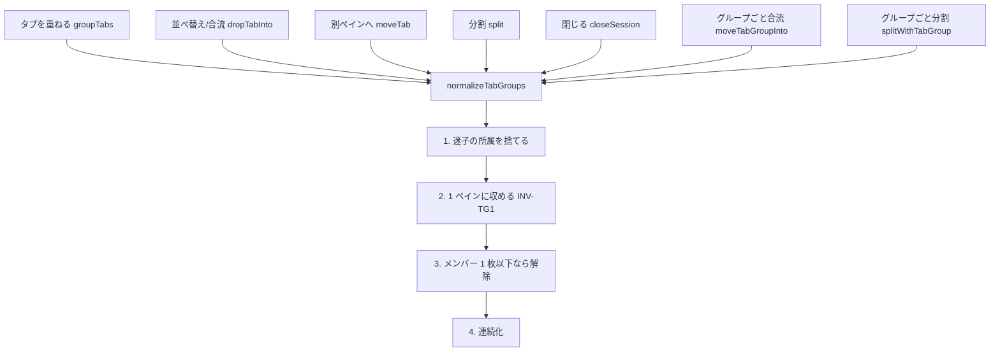
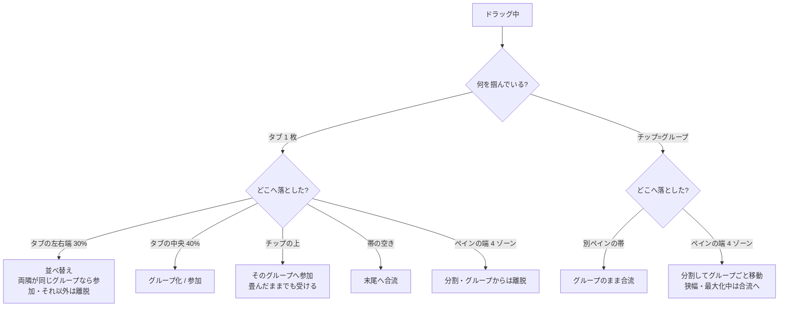

# レビューガイド: タブグループ

## 変更概要 / 目的

タブ帯は平坦な並びしか持たず、**1 つの作業に複数タブが関わる**とき（5250 ＋ SQL ＋ IFS を行き来する等）
まとまりを表す手段が無かった。ペイン分割で代用すると画面が削れる。
システムカラー帯（`20260802-tabs-own-system`）は「**接続先**の軸」で、「**作業**の軸」は区別しない。

→ **タブを重ねてグループ化**できるようにした。名前と色を付けられ、折りたたみ・グループごとの移動・
一括クローズができる。**タブ帯の高さは 1px も増やさない**（Edge のタブグループと同じ形）。

変更は `packages/web-ui` に閉じる。**サーバー API・設定スキーマ・永続化には触れていない**
（タブグループはブラウザ内の表示状態。そもそもワークスペースのレイアウト自体が非永続）。

## 重要ポイント（特に見てほしい所）

### 1. なぜ `tabs: string[]` を変えなかったか

`GroupNode.tabs` に「タブまたはグループ」を入れる案は採らず、**別表**（`tabGroupOf`）にした。
`tabs` の要素型を変えると `liveTabs`（`WorkspaceNode.vue:98`）・`PanePool.entries`（`PanePool.vue:105`）・
`cycleTab` など**文字列前提の消費者すべて**に波及する。同じ問題を `tabSystem` が同じ形で解いている
（`stores/workspace.ts:62-67`）。

### 2. 命名が `group` ではなく `TabGroup` な理由

この木では歴史的に **`group` がペインを指す**（`groups()` / `focusedGroupId` / `.group[data-group-id]`）。
DOM セレクタは `App.vue:190` の空間ペインナビが `querySelectorAll` で拾っており、名前を重ねると
コードも DOM も読めなくなる。型・ストア・CSS・`data-*` まで `TabGroup` / `tabGroup*` / `tg-*` で通した。

### 3. 折りたたみは**描画だけ**（ここが最大の地雷）

`tabs` から外して隠すと `PanePool` の母集合から落ち、**ペインの実体がアンマウントされて
書きかけの SQL が消える**（`20260802-keep-pane-state-move` で一度踏んだ道）。
隠すのは `visibleTabs`（`stores/workspace.ts:256`）だけ。受け皿を出す `liveTabs` は `group.tabs` を
見たままにしてある。**`activeTab` にも触らない**（利用者の判断: 畳んでも見ているものは変えない）ので、
「見えるタブが 0 枚のペイン」は発生しない。

### 4. 中央ゾーンの式が**比例**な理由（既存テストを壊さないため）

jsdom の `getBoundingClientRect()` は全て 0 を返し、既存の並べ替えテストがそれに依存している
（`pane-tabs.test.ts:23` のコメント「clientX>中点=0」）。中央帯を**幅に比例**させ、前後の比較を
**非厳密**にすると、幅 0 のとき中央帯が潰れて従来の中点判定に一致する。絶対 px の帯や厳密比較にすると
既存 2 件が落ちる（`components/PaneTabs.vue:252-266`）。

### 5. 高さを増やさないための CSS 制約

タブ帯は `min-height: 28px`（`--chrome-row-h`。**ヘッダーと共有**）で、タブ本体がちょうど収まる。
まとまりは**背景と `box-shadow: inset` の下線**だけで表す——border / padding / outline を足すと
レイアウトが押し広がって 1 行ぶん背が伸びる。`flex-wrap` で折り返してもタブごとの装飾なので途切れない。
`packages/web-ui/test/tab-group-ui.test.ts` の末尾がこの規約を**CSS 走査で固定**し、
`scripts/verify-browser-tab-groups.mjs` が**実ブラウザで実測**している（28.00px → 28.00px）。

## 処理フロー

### 不変条件の回復（すべての変更経路が同じ出口を通る）

`pruneEmpty()` が全経路から呼ばれているのと同じ形。**UI 側に散らさない**のが要点で、
散らすと「`split` 経由の離脱だけ解除されない」類が必ず出る。

### ドロップ位置と結果

**参加/離脱は「着地点の両隣」だけで決まる**（`stores/workspace.ts:519` 付近）。
両隣が同じグループなら参加、それ以外は離脱。別ペインへ移ると必ず抜けるのも、これで自然に導かれる
（移り先の隣人が元のグループであることは INV-TG1 によりありえない）。

## 主要な変更箇所

| 位置 | 要点 |
|---|---|
| `packages/web-ui/src/stores/workspace.ts:24-47` | `TabGroup` 型。`GroupNode`（ペイン）と別物であることを型の注記で明示 |
| `packages/web-ui/src/stores/workspace.ts:82` | `contiguousTabs` — 連続化。**最初のメンバーの位置**へ残りを引き寄せる |
| `packages/web-ui/src/stores/workspace.ts:256` | `visibleTabs` — 折りたたみの**唯一の継ぎ目**。システム絞り込みは戻していない |
| `packages/web-ui/src/stores/workspace.ts:285` | `normalizeTabGroups` — 不変条件 4 つの単一の置き場 |
| `packages/web-ui/src/stores/workspace.ts:350` | `groupTabs` — 新規作成 / 参加。畳んだ先では `activeTab` を動かさない（review R1 の指摘） |
| `packages/web-ui/src/stores/workspace.ts:419` | `moveTabGroupInto` — 名前・色・折りたたみ・並びを保って合流 |
| `packages/web-ui/src/stores/workspace.ts:441` | `splitWithTabGroup` — 狭幅・最大化中は `split()` 同様に合流へフォールバック |
| `packages/web-ui/src/stores/workspace.ts:483` | `setActiveTab` に `revealTab` を集約（`decisions.md` D1。呼び出し側 4 か所は無変更） |
| `packages/web-ui/src/components/PaneTabs.vue:59` | `stripItems` — チップとタブを混ぜた一列。畳んだグループはチップだけが残る |
| `packages/web-ui/src/components/PaneTabs.vue:259` | `zoneOfTab` — 中央帯は幅に比例（上記 4.） |
| `packages/web-ui/src/components/PaneTabs.vue:317` | `onChipDrop` — **末尾メンバーの隣**へ付ける（先頭起点だと割り込んで並びが崩れた） |
| `packages/web-ui/src/components/TabGroupMenu.vue` | 新規。`InfoPopover` の構造規約に倣う（バックドロップ＋本体）。`draggable="false"` で親チップのドラッグから外す |
| `packages/web-ui/src/composables/tabGroupColor.ts` | 新規。番号だけ持つ・使われていない最小番号を採番 |
| `packages/web-ui/src/styles.css:55-76` | `--tg-1`…`--tg-8`（ライト／ダーク）。**`--sys-*` を流用しない**理由をコメントに記載 |
| `packages/web-ui/src/dnd.ts` | `TAB_MIME` / `TAB_GROUP_MIME` / `isTabGroupDrag`。種別判定を 1 か所に集約する既存方針の踏襲 |
| `scripts/verify-browser-tab-groups.mjs` | 新規。**ホスト接続不要**の実ブラウザ実測（他の `verify-browser-*` と違い IBM i が要らない） |

## リスク / 確認してほしい点

- **D&D の手触りは自動検証できていない。** HTML5 の D&D は Playwright での自動化が難しく、
  実ブラウザ検証は**寸法の実測に限った**。中央 40% の当たり判定・ドラッグ中の予告表示・
  折り返し時の見た目は、実際に触っての確認をお願いしたい。
- **ライト／システムテーマの色**は目視未確認（ダークのスクリーンショットのみ）。
  `--tg-*` はライト側も定義済みで、`--sys-*` と同じ「暗い地では明度を上げる」規則に従っている。
- **畳んだグループの中のタブがアクティブになりうる**（利用者の明示判断）。
  タブ帯から消えているのに中身が出ている状態で、チップの `.on` がその印。
  実際に使ってみて分かりにくければ、印の強さは調整の余地がある。
- **`cycleTab`（Ctrl+Tab）は畳んだタブも巡る。** Chrome は畳んだグループを飛ばすが、
  こちらは「アクティブタブを動かさない」設計なので、飛ばすと**畳んだグループへ戻れなくなる**。
  意図的に変えていない。
- **nit（未対応）**: `PaneTabs.tgEdge` はタブ 1 枚ごとに全タブを走査する（O(n²)）。
  同関数内の `manySystems` は既に全ペインを走査しており、現実的なタブ数では問題にならないと判断した。
