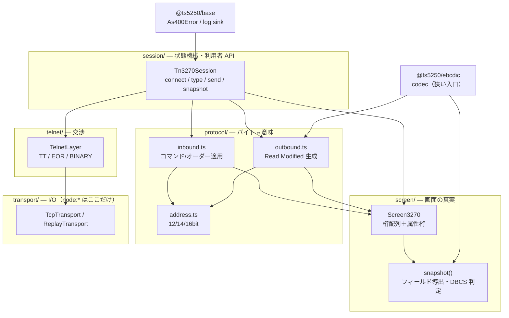
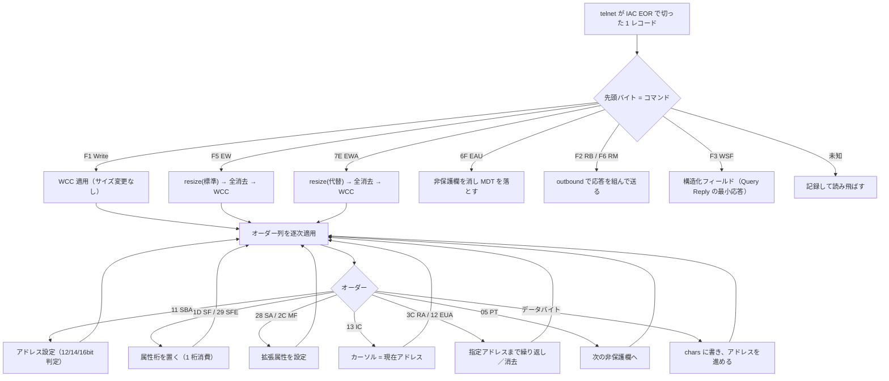
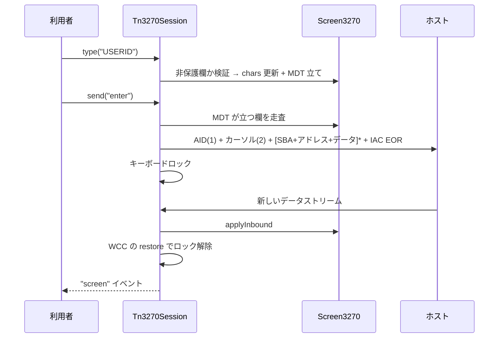
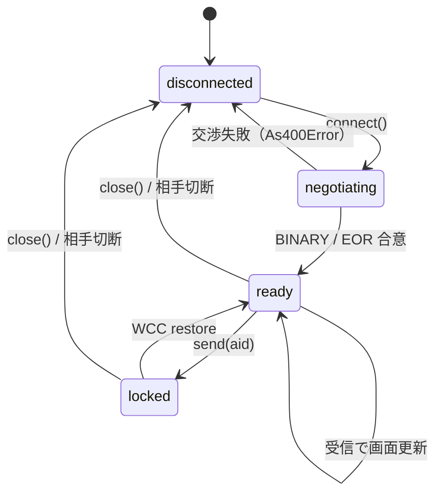

# 設計: 3270 エミュレータ（TN3270 表示セッション・ライブラリ層）

`spec.md` の D1〜D6 を前提に、**plan で作業分解できる粒度**まで構造を具体化する。

## アーキテクチャ概要



**データの流れは一方向**: バイト → `inbound` → `Screen3270`（唯一の真実）→ `snapshot()` → 利用者。
入力は `Screen3270` を更新し、`outbound` がそこからバイトを組む。**画面の真実は `Screen3270` 一箇所**。

## コンポーネント / モジュール

| モジュール | 責務 | 依存 |
|---|---|---|
| `transport/types.ts` | `Transport` インターフェース（send/close/onData/onClose/onError/start?） | — |
| `transport/tcp.ts` | `node:net` / `node:tls`。**`node:*` を書いてよい唯一の場所** | node |
| `protocol/bytes.ts` | `ByteReader` / `ByteWriter`（D7 で複製と決定） | base |
| `protocol/constants.ts` | コマンド・オーダー・AID・WCC・属性ビットの定数と意味 | — |
| `protocol/address.ts` | バッファアドレスの符号化・復号（12/14/16bit）。**純関数** | base |
| `protocol/inbound.ts` | 受信データストリームを `Screen3270` に適用 | bytes, constants, address, screen |
| `protocol/outbound.ts` | Read Modified / Read Buffer 応答の生成 | bytes, constants, address, screen |
| `telnet/constants.ts` | telnet の定数 | — |
| `telnet/telnet.ts` | 基本 TN3270 の交渉・IAC 二重化・EOR でのレコード切り出し | transport, constants |
| `telnet/terminal-type.ts` | モデル → 端末タイプ名・`@装置` の付与・代替サイズの表 | — |
| `screen/types.ts` | `Cell` / `CellKind` / `Field` / `ScreenSnapshot`（公開型） | — |
| `screen/buffer.ts` | `Screen3270`。桁配列・属性桁・カーソル・サイズ切替 | base, types |
| `screen/attributes.ts` | 基本属性バイト・拡張属性の解釈と合成 | constants, types |
| `session/aid-keys.ts` | AID コード ⇔ キー名 | constants |
| `session/emitter.ts` | 最小のイベント発火 | — |
| `session/session.ts` | 接続・状態機械・入力検証・AID 送信 | 全部 |
| `trace/trace.ts` `replay.ts` | 送受信バイトの記録・再生 | transport |
| `test/harness/mini3270.ts` | 検証用の最小 TN3270 サーバ（**DBCS 回帰の要**） | node（テスト専用） |
| `test/harness/s3270.ts` | s3270 を docker で起動し HTTP REST で問い合わせる補助 | node（テスト専用） |

## インターフェース / データモデル

### `Screen3270` の内部表現（設計の中核）

3270 は**属性が桁を占める**ため、桁ごとに「文字か属性か」を持つ必要がある。
**並列 typed array**で持つ（実機のコントローラと同じ形・走査が速い・GC 圧が無い）:

```ts
class Screen3270 {
  private chars: Uint8Array;      // 桁ごとの EBCDIC バイト（0x00 = 空）
  private isAttr: Uint8Array;     // 1 = その桁は属性桁
  private fieldAttr: Uint8Array;  // 属性桁の基本属性バイト（保護/数字/強度/MDT）
  private extColor: Uint8Array;   // 拡張属性（SFE / SA / MF が設定）
  private extHilite: Uint8Array;
  private extCharset: Uint8Array;
  private cursorPos = 0;
  private alt = false;            // 代替サイズで動作中か（D5）
  rows: number; cols: number;
}
```

**フィールドは保持しない。`snapshot()` のたびに属性桁を走査して導出する。**
1,920〜3,564 桁の線形走査は無視できる費用で、**増分更新のバグ（属性桁の移動・上書き・
`MF` による書き換え）を構造的に無くせる**。5250 側の `buffer.ts` が 1,047 行に膨らんだ
主因が増分管理なので、そこを踏まない。

**MDT は `fieldAttr` のビットに持つ**（実機と同じ）。`type()` はその欄の属性桁の MDT を立て、
`outbound` は属性桁を走査して MDT が立つ欄だけを返す。**MDT の真実は 1 か所**。

### DBCS の扱い（保持は生バイト・判定は導出）

`SO`(0x0E) / `SI`(0x0F) は**バッファにそのまま 1 桁として置く**（実測どおり）。
`snapshot()` で行ごとに左から走査し、`SO` を見たら `SI` まで 2 バイトずつ
`dbcs-lead` / `dbcs-tail` に割り当てる。

```
chars:  [attr][ C1 ][ C2 ][ 0E ][ 45 ][ 62 ][ 0F ][ C3 ]
kind:    attr  sbcs  sbcs   so   lead  tail   si   sbcs
char:    " "   "A"   "B"   " "   "日"  ""    " "   "C"
```

- **保持は生バイト、意味は導出**。これにより `RA`（繰り返し）や `EUA`（消去）が
  DBCS 区間をまたいでも整合が壊れない。
- `SI` が来ないまま行末／画面末に達したら、そこまでを DBCS 区間として扱い**記録する**
  （spec のエラー処理）。

### サイズ切り替え（D5）

```ts
/** EW は標準(24x80)・EWA は代替(モデル依存)。バッファを作り直し、内容は消える */
resize(alternate: boolean): void
```

`EW` / `EWA` はどちらも**消してから書く**コマンドなので、サイズ変更時に内容を移す必要はない。
`Write`(F1) はサイズを変えない。

### 受信の状態（`inbound.ts`）

`inbound` は**状態を持たない純関数**にする:

```ts
export function applyInbound(screen: Screen3270, record: Uint8Array, ctx: InboundCtx): InboundResult;

interface InboundResult {
  keyboardRestored: boolean;   // WCC の restore ビット
  resetMdt: boolean;           // WCC の reset MDT ビット
  alarm: boolean;
  unknown: UnknownItem[];      // 未知のコマンド/オーダー（落とさず記録・spec）
}
```

セッションが `Screen3270` を持ち、`inbound` はそれを受け取って書き換えるだけ。
**パーサに状態を持たせない**ことで、trace の replay がそのまま単体テストになる。

## 処理フロー / シーケンス

### 受信 1 レコードの適用



**アドレス形式の判定**（`address.ts`）: 先頭バイトの上位 2 ビットが `00` なら 14 ビット形式、
それ以外は 6 ビットコード表による 12 ビット形式。代替サイズが 4,096 桁を超えるモデルでは
16 ビット形式を使う。**この判定は 1 か所（`decodeAddress`）に閉じる。**

### AID 送信（`outbound.ts`）



**短形式**: `PA1`〜`PA3` と `Clear` は **AID とカーソルアドレスだけ**を送り、フィールドデータを含めない。
`Clear` はさらに画面を消してカーソルを 0 に戻す。

### セッション状態



**キーボードロック中の `type()` は拒否する**（`As400Error`）。実機と同じ挙動にすることで、
自動化スクリプトが「入ったつもりで入っていない」状態を作らない。

## 設計判断

### D7: `ByteReader` / `ByteWriter` は複製する（`base` へ移さない）

`packages/tn5250/src/protocol/bytes.ts` は `base` にしか依存しない純粋なユーティリティで、
AGENTS.md の「`base` に置く基準 2（複数パッケージが要るが、どれにも属さない）」に**当てはまり得る**。

しかし今回は**複製する**:

- `base` へ移すには `tn5250` の import を書き換える必要があり、requirement の
  「5250 側の既存挙動の変更はしない」に触れる。
- 3270 側は `address.ts` と絡む読み取り（6 ビットコード表・可変長アドレス）を足す見込みで、
  **2 つの写しが同じままとは限らない**。
- **括るのは「同じままだと分かってから」**（D2 と同じ判断基準）。

> **follow-up**: この work の deliver 後、2 つの写しが実際に同一なら `base` へ括る
> （retro で issue 化する）。

### D8: フィールドは保持せず `snapshot()` で導出する

増分管理をやめる。`MF` によるフィールド属性の書き換え・`RA` による属性桁の上書き・
`EW` による全消去が絡むと、増分更新は**組み合わせが爆発する**。
線形走査は 3,564 桁でも無視できる費用で、**正しさを構造で担保する**方を採る。

### D9: `inbound` は状態を持たない純関数にする

パーサが状態を持つと、trace の replay と実接続で挙動が分かれる余地ができる。
状態は `Screen3270` とセッションだけが持つ。**replay がそのまま単体テストになる**。

### D10: テストを 2 段に分ける（docker 必須テストを既定から外す）

s3270 / TK4- との照合は **docker が要る**。`npm test` が docker 無しの環境で落ちるのは避ける。

| 段 | 内容 | 実行条件 |
|---|---|---|
| **単体・replay** | アドレス符号化・inbound/outbound・バッファ・snapshot・fixture replay | **常に実行**（既定） |
| **照合（E2E）** | mini3270 × s3270、TK4- 実接続 | 環境変数（例 `TN3270_E2E=1`）で**明示的に有効化** |

照合段で得た結果は **fixture に落として単体段へ還元**する（1 回照合したら、以後は
docker 無しでも回帰が効く）。これは 5250 側の trace fixture と同じ考え方。

### D11: `mini3270` はテスト資産としてリポジトリに入れる

research で使い捨てに書いたものを `packages/tn3270/test/harness/mini3270.ts` に正式化する。
**DBCS の回帰は実ホストから取れない**（TK4- は英語 SBCS 専用）ため、
これが**唯一の DBCS 回帰経路**になる。使い捨てにしない。

- 交渉順は research で実測した Hercules の並びをそのまま再現する。
- 流すデータストリームは**テストから組み立てて渡す**（サーバ側に画面を埋め込まない）。

## plan への申し送り

### subtask 分割を推奨する（protocol §2.8）

1 PR に収めたまま内部で漸進的に進めるのが妥当な規模。**高結合で割れない**（同一パッケージの
層が相互に噛む）が、**順序は明確**。以下を提案する:

| # | subtask | 内容 | dependsOn |
|---|---|---|---|
| 01 | `package-skeleton` | package.json / tsconfig / vitest / eslint 対象追加 / 依存方向テスト 2 行 / `Transport` / `ByteReader` / browser 入口 | — |
| 02 | `telnet-negotiation` | telnet 交渉・端末タイプ・IAC 二重化・EOR 切り出し。**TK4- に実接続して交渉成立を確認** | 01 |
| 03 | `datastream-inbound` | 定数・アドレス符号化・`inbound`・`Screen3270`（SBCS）・`snapshot` | 01 |
| 04 | `input-outbound` | フィールド導出・MDT・AID・Read Modified 生成。**TK4- で往復** | 03, 02 |
| 05 | `dbcs` | DBCS 区間の導出・`mini3270` ハーネス・s3270 照合 | 03 |
| 06 | `trace-fixtures` | trace / replay・fixture 化・照合結果の還元 | 04, 05 |

- **02 と 03 は並行できる**（telnet とデータストリームは独立）。
- **最初に 01 を置く理由**: eslint と依存方向テストを先に効かせないと、
  後から `node:*` の混入や依存の逆流を掃除することになる。**ガードを先に立てる。**
- 各 subtask の test は**単独検証可能な範囲に限定**し、結合検証は親の統合 test に集約する
  （protocol §2.8）。

### 分解時に踏まえること

- **受け入れ基準のうち「s3270 と一致」系は 05 と 06 に集中する**。03/04 の時点では
  自前の期待値で固め、照合は後段でまとめて当てる（docker 依存を後ろに寄せる）。
- **decisions.md には D2 / D4 / D5 / D7 を書く**（spec と design の両方で挙げた判断）。
- `scripts/` に TK4- の起動・停止手順を落とすのは 02 の一部（実接続に要るため）。
