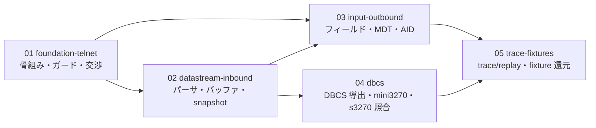

# 計画: 3270 エミュレータ（TN3270 表示セッション・ライブラリ層）

> **これはメタ plan である。** split 判定の結果 subtask 分割を採ったため、本ファイルは
> **割れ目（subslug 境界）と producer→consumer の順序**を定義する。
> 各 subtask の詳細 tasks.md は、その subtask の plan 工程で作る（protocol §2.8）。

## split 判定

`aidev-docs/DESIGN.md`「5.」の 3 層決定木に従い判定した。

**discriminator: そのピースは単独で検証・デリバリ可能か → NO（相互依存・共同検証のみ）**

- telnet 層だけ、データストリームパーサだけでは**何も動かない**。
  1 つのパッケージの層が相互に噛み合って初めて「画面が出る」。
- 単独でデリバリできないので**別 work / 別 PR には落とせない**。

**大きく、漸進レビューで負荷を割れるか → YES**

- 新規プロトコルスタック一式（telnet・データストリーム・画面バッファ・入力・DBCS・回帰資産）。
- 層ごとに**明確な seam** がある（別ファイル群・共有状態なし）。autonomous の安全則
  「明確に独立な seam がある時だけ分割、迷えば分けない」を満たす。

→ **subtask 分割**（1 PR を保ったまま内部で漸進実装・レビュー）。

> `design.md` は 6 分割を提案したが、`01 package-skeleton` と `02 telnet-negotiation` は
> 「接続が成立するまで」で一体に検証すべきなので**統合して 5 分割**とした。

## 実装方針

**「毎回、目に見える成果で終わる」**順に積む。各 subtask は単独で「何ができるようになったか」を
言える状態で終える——これが漸進レビューの価値そのものだから。

| # | subtask | この段階で**できるようになること** |
|---|---|---|
| 01 | `foundation-telnet` | TK4- と telnet 交渉が成立し、生のデータストリームが届く |
| 02 | `datastream-inbound` | TK4- のウェルカム画面が **s3270 と同じ内容**で読める（SBCS） |
| 03 | `input-outbound` | **TSO ログオン画面まで往復**できる（入力 → AID → 画面遷移） |
| 04 | `dbcs` | 日本語が **s3270 (cp930/cp939) と一致**する |
| 05 | `trace-fixtures` | **docker 無しで回帰が効く**（照合結果を fixture へ還元） |

**ガードを先に立てる。** 01 で eslint 対象追加と `dependency-direction.test.ts` の層宣言を
済ませる。後回しにすると `node:*` の混入や依存の逆流を後から掃除することになる。

**docker 依存を後ろへ寄せる。** 03 までは自前の期待値で固め、s3270 との照合は 04 / 05 に集める
（`design.md` D10 の 2 段テスト）。

## 作業順序と依存関係

1. **01 `foundation-telnet`**（依存: なし）
   package.json / tsconfig / vitest / browser 入口 / eslint 対象追加 /
   `dependency-direction.test.ts` の `LAYERS`・`SIBLINGS` / `Transport` / `TcpTransport` /
   `ByteReader`・`ByteWriter`（D7 で複製） / telnet 交渉 / 端末タイプ組み立て /
   `scripts/` に TK4- 起動手順。
2. **02 `datastream-inbound`**（依存: 01）
   `protocol/constants.ts` / `address.ts`（12/14/16bit） / `inbound.ts`（状態を持たない純関数・D9） /
   `screen/buffer.ts`（並列 typed array・D8） / `screen/attributes.ts` / `snapshot()`。
3. **03 `input-outbound`**（依存: 02, 01）
   フィールド導出 / MDT / `session/aid-keys.ts` / `outbound.ts`（Read Modified・短形式） /
   `session/session.ts` の状態機械・入力検証。
4. **04 `dbcs`**（依存: 02）
   DBCS 区間の導出（`SO`/`SI`・lead/tail） / `test/harness/mini3270.ts` /
   `test/harness/s3270.ts` / cp930・cp939 の照合。
5. **05 `trace-fixtures`**（依存: 03, 04）
   `trace/trace.ts`・`replay.ts` / `ReplayTransport` / fixture 化 / 照合結果の還元 /
   `decisions.md`（D2 / D4 / D5 / D7）。

**02 と 03 の間、02 と 04 の間は producer→consumer**。02 が `Screen3270` を産み、03 と 04 が消費する。
**03 と 04 は互いに独立**なので、どちらを先にしてもよい（依存は張らない）。

## リスク / 留意点

| リスク | 対応 |
|---|---|
| **属性ビットの割り当てが未確定** | 実測値（Hercules の `SF(c0=e0)` / `SF(c0=e8)`）と RFC 1576 を突き合わせて 02 で確定する。推測で進めない |
| **`s3270` は標準/代替サイズを区別しない**（D5） | 照合は代替サイズ側に揃える。「EW で標準に戻る」は自実装の内部状態で検証する |
| **s3270 のキーボードロック**（research のリスク） | `s3270.ts` ハーネスで `status` 行のロック状態を見て待つ。04 で作り込む |
| **docker 必須テストが CI を割る** | D10 の 2 段構成。既定は単体・replay のみ。照合は `TN3270_E2E=1` で有効化 |
| **GA23-0059 が入手できない** | RFC 1576 ＋ s3270 実挙動 ＋ 実ホストのバイト列で代替する（research F6 で見込みあり） |
| **subtask をまたぐ設計のブレ** | `spec.md` / `design.md` を単一の真実とする。子 plan は **scope を再決定しない**（protocol §2.8） |

## テスト方針

**単体（既定で常に実行）**

- `address.ts`: 12/14/16bit の往復・境界値（0、最終桁、4,096 超）。
- `inbound.ts`: 各コマンド・オーダーの適用結果を `Screen3270` の状態で検証。
- `outbound.ts`: MDT が立つ欄だけを返すこと、短形式（PA/Clear）の形。
- `screen/buffer.ts`: 属性桁が 1 桁を占めること、フィールド導出、`EW`/`EWA` のサイズ切替。
- `snapshot()`: DBCS の lead/tail・SO/SI の桁占有。
- replay: fixture を流して画面が一致すること。
- 依存方向: `dependency-direction.test.ts` が `tn3270` を含めて緑。
- browser 入口: `node:net` を引き込まないこと。

**照合（`TN3270_E2E=1` のときだけ）**

- TK4- 実接続: 交渉成立・ウェルカム画面・TSO ログオン到達・AID 往復。
- `mini3270` × `s3270`: `ReadBuffer(Ebcdic)` とのセル単位一致（SBCS / DBCS 両方）。
- 送信バイト: 同じ入力を与えたときの Read Modified が s3270 と一致すること。

**還元**: 照合で得た実バイト列は **fixture に落として単体段へ移す**（05）。
以後は docker 無しでも回帰が効く。

**統合 test / 統合 review は親で行う**（protocol §2.8）。子の test は
単独検証可能な範囲（unit・契約モック）に限定する。
