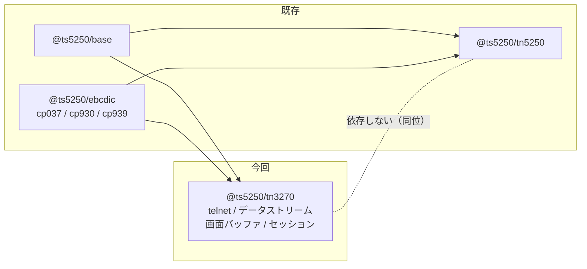

# 要件: 3270 エミュレータ（TN3270 表示セッション・ライブラリ層）

## 背景 / 課題

本プロジェクトは IBM i（AS/400）を相手にする 5250 エミュレータとして育ってきた。
TN5250・ホストサーバー・EBCDIC・SCS が層に分かれ、`@ts5250/tn5250` として
telnet / データストリーム / 画面モデル / セッションが一通り揃っている。

一方で **IBM メインフレーム（z/OS 系）の 3270 は未対応**である。リポジトリ全体を走査しても
3270 の実装は存在せず、`docs/PROTOCOL.md` に「5250 の SBA は 3270 のような 12/14 ビット
符号化ではない」という対比の言及があるだけ（`docs/PROTOCOL.md:174`）。

3270 に対応すると、同じ画面モデル・同じ EBCDIC 資産・同じ検証手法（trace fixture の replay）を
使ったまま、対象ホストが IBM i からメインフレームまで広がる。5250 で確立した層構造
（transport / telnet / protocol / screen / session）と DBCS 変換表（`ibm930` / `ibm939`）は
そのまま土台になる。

**3270 の開発は長期にわたる見込みのため、`main` へは直接統合せず `develop` に集約する**
（main → develop → feature のブランチ戦略。`main` は定期的に `develop` へマージして最新化する）。

## 目的 / ゴール

`@ts5250/tn3270` パッケージとして、**基本 TN3270 の表示セッション**を TypeScript で実装する。
ホストへ接続し、3270 データストリームを解釈して画面を組み立て、キー入力と AID を送り返せる
状態まで到達する。日本語 DBCS を含む。

## スコープ

### 対象

- **telnet ネゴシエーション（基本 TN3270 / RFC 1576 相当）**
  BINARY / EOR / TERMINAL-TYPE の合意、端末タイプ申告、IAC EOR によるレコード境界。
- **3270 データストリームの解釈と生成**
  - コマンド: Write / Erase-Write / Erase-Write-Alternate / Read-Buffer / Read-Modified /
    Read-Modified-All / Erase-All-Unprotected / Write-Structured-Field（必要な範囲）
  - オーダー: SF / SFE / SBA / SA / MF / IC / PT / RA / EUA / GE
  - WCC（Write Control Character）の解釈
  - バッファアドレス符号化（12 / 14 / 16 ビット）
- **画面バッファモデル**
  3270 は**フィールド属性がバッファ内の 1 桁を占める**方式（5250 と根本的に異なる）。
  フィールド境界・保護/非保護・数字専用・MDT（Modified Data Tag）を保持する。
- **拡張属性**: 色・ハイライト・文字セット属性（SFE / SA / MF 経由）。
- **入力とキー**: AID キー（Enter / PF1〜PF24 / PA1〜PA3 / Clear 等）と、
  Read Modified 応答（変更フィールドの回収とバイト列生成）。
- **文字コード**
  - SBCS: cp037（検証環境の既定）
  - **DBCS: cp930 / cp939**（SO(0x0E) / SI(0x0F)、全角の桁占有、文字セット属性）
- **検証環境の構築**
  - ホスト: docker の TK4-（MVS 3.8j ターンキー）
  - 参照クライアント: `s3270`（BSD-3-Clause。cp930 / cp939 を内蔵）
  - 言語非依存の trace fixture（5250 側と同じ replay 方式）

### 対象外

- **TN3270E（RFC 2355）**: DEVICE-TYPE / FUNCTIONS 交渉、LU 名指定、BIND-IMAGE、応答処理。
  後続 work とする（検証環境で交渉できるかが未確認なため。「未確定事項」参照）。
- **プリンターセッション**（3287 / LU type 3 / SCS 経路）。
- **web-ui への露出**（セッション種別・ペイン・描画）、**MCP ツール**、
  設定スキーマ（systems / sessions）の 3270 拡張。いずれも別 work。
- **IND$FILE ファイル転送**。
- グラフィックス（Programmed Symbols / GDDM 等）。
- 5250 側の既存挙動の変更（`@ts5250/tn5250` には手を入れない）。

## 機能要件

- ホスト（host / port / TLS）へ接続し、telnet ネゴシエーションを完了できる。
- ホストから届いた 3270 データストリームを解釈し、画面バッファ（文字・属性・フィールド）を構築できる。
- 画面の内容をスナップショットとして取り出せる（行×桁、属性つき）。
- カーソル位置（IC オーダー / 明示指定）を保持できる。
- 非保護フィールドへの文字入力を受け付け、MDT を立てられる。
- AID キー押下で Read Modified 応答を組み立てて送信できる。
- DBCS を含む画面で、全角文字が正しい桁を占め、SO/SI の位置が保たれる。
- 接続・切断・エラーをイベントとして通知できる。
- 送受信バイトを trace として記録し、再生（replay）できる。

## 非機能要件 / 制約

- **層規約（AGENTS.md）**: ピュアロジック層は Node API 非依存。`node:*` の import は
  `transport/` のみ許可（`eslint.config.js` の `no-restricted-imports` / `no-restricted-globals`）。
- **依存方向**: `@ts5250/tn3270` は `base` / `ebcdic` にのみ依存する。
  **`tn5250` と同位で、互いに依存しない**（`dependency-direction.test.ts` の層宣言に加える）。
- **ブラウザ入口**: `@ts5250/tn3270/browser` を持ち、root（`node:net` / `node:tls` を含む）を
  ブラウザから引き込ませない。EBCDIC は狭い入口（`…/codec` / `…/katakana`）を使う。
- **ログ**: `@ts5250/base` の sink 経由（既定 no-op）。`console.*` は lint で禁止。
- **原典主義（AGENTS.md「既存プロトコル実装の移植」）**: 3270 データストリームは
  一次資料（GA23-0059 系のデータストリーム仕様・RFC 1576）を**直読**して書き起こす。
  知識ベースや類推で書き始めない。未確認事項は「要確認」と明示して research へ送る。
- **参照実装の扱い**: `s3270`（x3270 suite）は **BSD-3-Clause**。GNU tn5250（GPL）と違い
  制約は緩いが、方針は同じく「**事実に基づいて書き起こす**」。原典ソースをリポジトリに取り込まない。
- **既存クライアントと同じ挙動を優先**する。規格解釈が割れる箇所は `s3270` の実挙動を基準にし、
  外れる場合は理由をコード/decisions に残す。
- ESM / Node ≥ 20。周辺コードのスタイル（逐次 ByteReader・型で分岐を閉じる）に合わせる。
- 秘密情報（実資格情報）を成果物・コメント・トレースに書かない。
- **ブランチ**: 作業は `feature/tn3270-emulator`、PR 宛先は **`develop`**（`main` ではない）。

## 完了条件 (受け入れ基準)

- [ ] docker で TK4-（MVS 3.8j）が起動し、`s3270` から TSO のログオン画面まで到達できる（手順が再現可能）
- [ ] 自実装が同じホストへ接続し、**`s3270` と同じ画面内容**（文字・フィールド境界・属性）を構築できる
- [ ] AID キー送信でホストが応答し、画面が遷移する（Enter / PF キーの往復が成立する）
- [ ] 非保護フィールドへの入力 → Read Modified 応答のバイト列が `s3270` の送信バイトと一致する
- [ ] **DBCS を含むデータストリーム**で、`s3270 -codepage cp930`（および cp939）と
      画面バッファの内容・桁配置が一致する
- [ ] バッファアドレス符号化（12 / 14 / 16 ビット）の相互変換が単体テストで固定されている
- [ ] 言語非依存の trace fixture が replay で回帰資産化されている
- [ ] `@ts5250/tn3270` が `@ts5250/tn5250` に依存しないことがテストで固定されている（宣言も含む）
- [ ] `npm run build` / `npm run lint` / 各パッケージの `npm test` が通る

## 未確定事項 / 確認したいこと

いずれも **research 工程で潰す**（実現性・既存挙動の未検証に該当）。

- **TK4- の docker イメージの選定と起動手順**。`mvslovers/tk4` 等の候補があるが、
  ポート公開・ライセンス・停止手順・データ永続化が未確認。
- **Hercules の 3270 サーバが何を交渉するか**。基本 TN3270 で通ることの確認が要る
  （TN3270E は今回対象外だが、交渉が E 前提だと接続自体が成立しないため先に確かめる）。
- **端末タイプ名と画面サイズ**の対応（IBM-3278-2 / -3 / -4 / -5、`-E` 付きの拡張属性版）。
  5250 側で PUB400 相手に総当たりしたのと同じ検証が要る（`docs/PROTOCOL.md` §2.1 の先例）。
- **DBCS 時に申告すべき端末タイプ**と、ホストが DBCS を送る条件。
  MVS 3.8j は英語専用のため、**実ホストからは DBCS が出てこない**。
  照合は「自作の DBCS データストリーム × `s3270 -codepage cp930/cp939`」で行う想定だが、
  s3270 から画面内容を機械的に取り出す手段（`ReadBuffer` / `Ascii` の出力形式）が未確認。
- **3270 の DBCS におけるフィールド/文字セット属性の具体**（SO/SI とフィールド属性の関係、
  全角が行末をまたぐ場合の扱い）。5250 側で同種の未解決課題が残っている（AGENTS.md「残課題」）ため、
  同じ罠を踏まないよう先に仕様を確定する。
- **一次資料の入手性**。3270 データストリーム仕様（GA23-0059 系）が参照可能な形で入手できるか。
  入手できない場合、RFC 1576 と `s3270` の実挙動をどこまで根拠にできるか。
