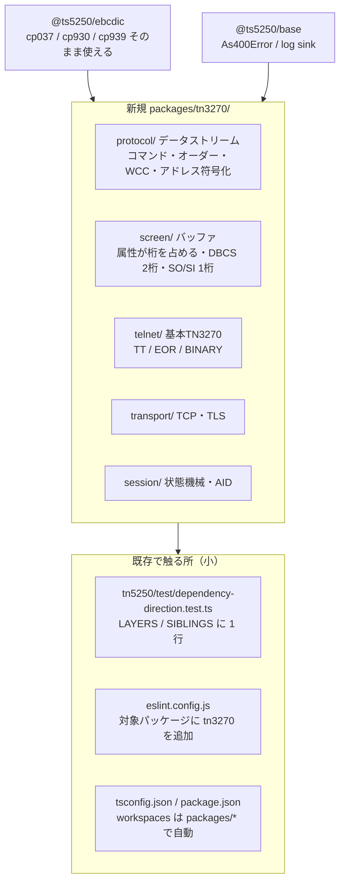

# 調査: 3270 エミュレータ（検証環境・プロトコル前提・DBCS 照合手段）

requirement.md の「未確定事項」6 件を実測で潰す。**すべて実行して確認した事実**であり、
知識ベースからの記述は含まない（未確認のものは「未確認」と明記する）。

環境: WSL2 / docker 29.4.0 / Node v24.15.0。sudo 不可（uid 1000）のためホストへの apt は使わず、
docker 経由で検証した。

## 調査の問い

- Q1: ローカル検証環境（TK4-）は実際に立つか。手順・装置構成はどうなるか。
- Q2: Hercules の 3270 サーバは何を交渉するか。**基本 TN3270 で通るか、TN3270E 前提か**。
- Q3: 端末タイプ名と画面サイズの対応。
- Q4: s3270 から画面内容を**機械的に**取り出す手段はあるか。
- Q5: 日本語 DBCS をどう検証するか。自前の CCSID 表と s3270 は一致するか。
- Q6: 一次資料は入手できるか。
- Q7: 新規パッケージを足すときの「出力先仕様」（既存の層規約・テストの形）。

---

## 判明した事実

### F1: TK4-（MVS 3.8j）は docker で立ち、TSO ログオンまで到達する 〔Q1〕

`rattydave/docker-ubuntu-hercules-mvs:latest`（267MB）を pull し、
`docker run -d -p 3270:3270 -p 8038:8038` で起動。コンテナ内で `hercules -d -f conf/tk4-.cnf` が走る。

**装置構成**（`/opt/hercules/tk4/conf/tk4-.cnf` を直読）:

| 装置番号 | 種別 | 用途 |
|---|---|---|
| `00C0`〜`00C6` | local 3270 devices (VTAM) | 既定で掴む。Hercules コンソール |
| `03C0`〜`03C7` | local 3270 terminals (TCAM) | **TSO 端末** |

装置を指定せず接続すると `00C0`（Hercules コンソール）に繋がる。Enter を送ると
`INPUT NOT RECOGNIZED` が返る（＝AID の往復自体は成立している）。

`03C0` を指定して接続し Enter を送ると **`IKJ54012A ENTER LOGON -00`**（MVS の TSO ログオン
プロンプト）に到達する。画面には `Device number : 0:03C0` も表示される。

> **装置選択の手段**: 基本 TN3270 には LU 指定の仕組みが無いが、x3270 は
> **端末タイプ文字列に `@<装置番号>` を付ける**ことで指定する（実測: `IBM-3279-2-E@03C0`）。
> 存在しない装置を指すと Hercules が `HHC01030I Connection rejected, device 0700 unavailable`
> と**明示的に拒否理由を返す**（黙って落とさない）。

### F2: Hercules は **基本 TN3270（RFC 1576）** で交渉する。TN3270E は出てこない 〔Q2〕★最重要

s3270 の `-trace` で採取した生バイト（`<` = ホスト→クライアント、`>` = 逆）:

```
< fffd18                            DO   TERMINAL-TYPE (0x18)
> fffb18                            WILL TERMINAL-TYPE
< fffa1801fff0                      SB   TERMINAL-TYPE SEND
> fffa1800 <型名 ASCII> fff0         SB   TERMINAL-TYPE IS
< fffd19 fffb19                     DO / WILL END-OF-RECORD (0x19)
> fffb19 / fffd19                   WILL / DO END-OF-RECORD
< fffd00 fffb00                     DO / WILL BINARY (0x00)
> fffb00 / fffd00                   WILL / DO BINARY
```

- **TN3270E（option 0x28 = 40）の交渉は一切発生しない。**
  requirement で選んだスコープ（基本 TN3270・TN3270E は対象外）が検証環境と正確に一致する。
- 合意するオプションは **TERMINAL-TYPE(24) / EOR(25) / BINARY(0)** の 3 つ。
  **SGA(3) は出てこない**——5250（`docs/PROTOCOL.md` §2）が SGA を含めるのと異なる。
- EOR と BINARY は**両方向**（DO/WILL の双方）で合意する。

交渉直後にホストが流したデータストリーム（先頭）:

```
f5 42 11 40 40 1d 60 c8 85 99 83 a4 93 85 a2 ...
EW WCC SBA(0)  SF attr  "H  e  r  c  u  l  e  s"
```

`F5`=Erase/Write、`11`=SBA、`1D`=Start Field。**12 ビットアドレス**（`40 40` → 0、
`c1 50` → 80＝2 行目 1 桁）で、6 ビットコード表による符号化を実測で確認した。

### F3: 端末タイプは `IBM-3279-<model>-E`。標準 24x80 と**代替サイズ**の 2 段を持つ 〔Q3〕

s3270 の `-model N` を 2〜5 で振り、申告される型名を実測:

| `-model` | 申告した端末タイプ | 代替サイズ | Hercules |
|---|---|---|---|
| 2 | `IBM-3279-2-E` | 24x80（標準と同じ） | 受理 |
| 3 | `IBM-3279-3-E` | 32x80 | 受理 |
| 4 | `IBM-3279-4-E` | 43x80 | 受理 |
| 5 | `IBM-3279-5-E` | 27x132 | 受理 |

**RFC 1576 を直読して確定した仕様**（`/tmp/rfc1576.txt` 233-244 行）:

> The -2 following 3278 designates the alternate screen size. 3270 terminals have the ability
> to switch between the standard (24x80) screen size and an alternate screen size.
> Model -2 is 24x80 which is the same as the standard size. Model -3 is 32x80,
> model -4 is 43x80 and model -5 is 27x132.
>
> Appending the two character string "-E" … signifies that the terminal is capable of handling
> 3270 extended data stream … structured fields … Some telnet server implementations also
> interpret this to mean that the terminal is capable of handling extended attributes
> (highlighting, field validation, character set, outlining, etc.).
>
> The 3279 series of terminals is capable of extended attributes while the 3278 series is not.

- **標準サイズは常に 24x80**。モデル番号は**代替サイズ**を指定する。
- **`-E` は拡張データストリーム（構造化フィールド）対応**の申告。拡張属性対応と解する実装もある。
- **`3279` 系は拡張属性対応、`3278` 系は非対応**。

さらに **RFC 1576 が載せる交渉手順は F2 の実測バイト列と完全に一致**しており、
Hercules は RFC どおりに振る舞っている（`DO EOR / WILL EOR` → `DO BINARY / WILL BINARY` →
`<3270 data stream> IAC EOR`）。

> **［訂正］** 当初「model 4 だけ 43x80 で接続したのは EWA を受けたため」と推定したが、**これは誤り**。
> 実測し直したところ、**s3270 は EW / EWA のどちらを受けてもモデルの代替サイズを報告する**
> （model 5 は EW でも `Ascii()` が 27 行 132 桁を返す）。当初の観測は 3270 モード確立前
> （status の `P`）の値を読んでいた。
> **s3270 は標準／代替の区別を報告バッファに反映しない**——常にモデル最大で見せる実装である。
> 自実装は RFC どおり標準 24x80 と代替を区別して持つが、**s3270 との桁単位照合では
> この差を吸収する必要がある**（照合は代替サイズ側に揃える）。

### F4: s3270 は HTTP REST で機械可読に画面を出す（照合オラクル確立）〔Q4〕

**stdin へのアクション投入は動かなかった**（`Wait()` が固まり、stdout に何も出ない。
3 通り試して再現）。代わりに **`-httpd <addr:port>`** が完全に機能する:

```
s3270 -httpd 127.0.0.1:6001 -model 2 <host>:3270
curl "http://127.0.0.1:6001/3270/rest/json/Ascii()"
curl "http://127.0.0.1:6001/3270/rest/json/ReadBuffer(Ebcdic)"
curl "http://127.0.0.1:6001/3270/rest/json/Query(ConnectionState)"   → "connected-3270"
curl "http://127.0.0.1:6001/3270/rest/json/Enter()"
```

いずれも JSON（`status` ＋ `result` 配列）で返る。**`ReadBuffer(Ebcdic)` が本命**で、
1 行 80 桁ぶんの**生 EBCDIC バイト列を、フィールド属性マーカー付き**で返す:

```
SF(c0=e0) c8 85 99 83 a4 93 85 a2 40 e5 85 99 a2 89 96 95 40 40 7a SF(c0=e8) f4 4b f0 f0 00 00 ...
```

`SF(c0=e0)` の `c0` が属性種別コード、`e0` が値。**セル単位で自実装のバッファと突き合わせられる。**
`status` 行にはモデル番号・行数・桁数・カーソル位置・キーボードロック状態が含まれる。

### F5: DBCS は日本語ホスト無しで検証できる。自前 CCSID 表と s3270 は一致する 〔Q5〕★

**最小の TN3270 サーバ（約 60 行）を書いて実証した。** F2 で実測した交渉順をそのまま再現し、
**自前の `@ts5250/ebcdic` で符号化した DBCS 入りデータストリーム**を 1 枚流す。

自前コーデックによる符号化（`codecForCcsid(930).encode("kanji : 日本語表示")`）:

```
73 62 76 72 71 40 7a 40 | 0e | 4562 4566 48e7 46c0 4853 | 0f     substituted=0
      SBCS "kanji : "     SO    日   本   語   表   示    SI
```

これを `s3270 -codepage cp930` に流した結果、**意図どおりの日本語が描かれた**:

```
 3270 DBCS TEST
 kanji :  日本語表示
 kana  :  カタカナ
 mixed : ABC あいう DEF
```

→ **本プロジェクトの ibm930 表と s3270 の cp930 は一致する。**
→ **日本語ホストは不要**。「自作の DBCS データストリーム × s3270」で照合が成立する。

**バッファ上の表現**（`ReadBuffer(Ebcdic)` で実測）:

```
0e | 45 62 | 45 66 | 48 e7 | 46 c0 | 48 53 | 0f
SO |  日   |  本   |  語   |  表   |  示   | SI

c1 c2 c3 | 0e | 44 81 | 44 82 | 44 83 | 0f | c4 c5 c6
 A  B  C | SO |  あ   |  い   |  う   | SI |  D  E  F
```

- **DBCS 1 文字はバッファ 2 桁を占める**（バイトごとに 1 桁）。
- **SO / SI もそれぞれ 1 桁を占める**（画面上も 1 桁ぶん空く）。
- 混在行では SO/SI が**行の内側**に入る（フィールド単位ではない）。

s3270 が内蔵する DBCS コードページ（`s3270 -v` で実測）:
`cp930 (japanese-kana)` / `cp935` / `cp937` / `cp939 (japanese-latin)` / `cp1388`。
**cp930 / cp939 は本 PJ が変換表を持つ CCSID そのもの。**

### F6: 一次資料は入手できる 〔Q6〕

| 資料 | 状態 |
|---|---|
| RFC 1576 “TN3270 Current Practices” | 取得可（24,477 バイト） |
| RFC 1646 “TN3270 Extensions for LUname and Printer Selection” | 取得可（27,564 バイト） |
| RFC 2355 “TN3270 Enhancements” | 取得可（89,394 バイト・今回は対象外だが参照可） |
| データストリーム仕様（GA23-0059 系） | **未確認**（入手可否を spec 着手時に確認する） |
| `s3270` v4.1ga10 ソース／挙動 | **BSD-3-Clause**（`/usr/share/doc/3270-common/copyright` を直読） |

x3270 スイートのライセンスは Paul Mattes 他による **3 条項 BSD**。
GNU tn5250（GPL・コード非移植）より制約が緩いが、方針は同じく「**事実に基づいて書き起こす**」
（AGENTS.md）。原典ソースはリポジトリに取り込まない。

**GA23-0059 が入手できなくても、RFC 1576 ＋ s3270 の実挙動 ＋ 実ホストのバイト列**で
今回のスコープは書き起こせる見込み（F2〜F5 で必要な要素はすべて実測できている）。

### F7: 出力先仕様——新パッケージは既存の層規約に「1 行足す」形で載る 〔Q7〕

- `packages/tn5250/package.json` の形（`exports` に `.` と `./browser`、`files: ["dist"]`、
  `build: tsc -b`、`test: vitest run --passWithNoTests`）をそのまま踏襲できる。
- `tsconfig.json` は `extends: ../../tsconfig.base.json` ＋ `composite` ＋ `references`。
- **`packages/tn5250/test/dependency-direction.test.ts` が全パッケージを走査する**。
  この 1 ファイルに
  - `LAYERS` へ `tn3270` を追加
  - `SIBLINGS` へ `["tn5250","tn3270"]`（と `["hostserver","tn3270"]`）を追加
  すれば、全組み合わせが自動で検査される。**個別にテストを書き足す必要はない。**
  同テストは `package.json` の宣言と実際の import の**双方向一致**も要求する
  （宣言だけ残る／宣言せず hoisting で動く、の両方を塞ぐ）。
- `eslint.config.js` の `no-restricted-imports`（`node:*`）と `no-restricted-globals`
  （`Buffer` / `process` / `__dirname` 等）は**対象パッケージを列挙する形**なので、
  `tn3270` を対象に加える必要がある。タイマーは禁止されていない。

---

## 影響範囲



- **既存コードへの変更はごく小さい**（依存方向テストの層宣言、eslint 対象、tsconfig 参照）。
  `@ts5250/tn5250` 本体には手を入れない。
- `@ts5250/ebcdic` は**変更不要**。cp930 の表は s3270 と一致することを実証済み（F5）。
- 検証資産（mini TN3270 サーバ・s3270 の docker イメージ・TK4- の起動手順）は
  新規に置き場が要る（`tools/` か `scripts/` か、`packages/tn3270/test/` か。spec で決める）。

## 実現性 / リスク

**実現性は高い。** 最大の不確実性だった 2 点が実測で解消した:
1. 検証環境が本当に立つか → **立つ。TSO ログオンまで到達**（F1）
2. DBCS をどう検証するか → **日本語ホスト不要で成立。自前表も一致**（F5）

残るリスク:

- **［中］標準サイズ / 代替サイズ（EW vs EWA）**。5250 に無い概念で、画面モデルの根幹に関わる。
  RFC 1576 で仕様は確定した（F3）が、**s3270 は両者を区別せず常にモデル最大で見せる**ため、
  s3270 を照合オラクルに使う限り「EW のとき 24x80 に戻る」ことは s3270 では検証できない。
  この 1 点だけは実ホスト（TK4-）か自作サーバ＋自実装の内部状態で確かめること。
- **［中］s3270 の駆動でキーボードロックに当たる**。`String()` が
  `Keyboard locked / Operator error` で弾かれた（TSO ログオン画面で再現）。
  照合の自動化には、ロック状態（`status` 行に出る）を見て待つ処理が要る。
  **自実装の問題ではなく、テストハーネス側の課題**。
- **［小］GA23-0059 の入手性が未確認**（F6）。入手できなくても進められる見込み。
- **［小］TK4- は英語 SBCS 専用**。実ホストからは DBCS が出てこないため、
  DBCS の回帰は**必ず自作データストリーム側**に置くことになる（実ホスト検証と二本立て）。

## spec への申し送り

1. **スコープは検証可能な範囲と一致している**。基本 TN3270 で通ることが実測で確定したので、
   TN3270E を対象外にした判断はそのままでよい（F2）。
2. **telnet 層は 5250 と別物として作る**。合意するオプションが違い（SGA なし）、
   NEW-ENVIRON も使わない。`@ts5250/tn5250` の `telnet/` を共有せず、tn3270 側に独自に持つ
   （AGENTS.md「片方しか使わないものは、使う側に置く」）。`transport/` は同型だが、
   共有すると base に降ろす話になるので**まず複製し、2 例目が揃ってから括る**判断を spec で行う。
3. **画面バッファは 3270 固有として設計する**。属性が桁を占める・DBCS が 2 桁・SO/SI が 1 桁
   （F5 で実測）。`@ts5250/tn5250` の `screen/buffer.ts` は流用せず、型だけ参考にする。
4. **標準 24x80 と代替サイズを最初からモデル化する**（F3）。モデル番号は代替サイズの指定であり、
   EW は標準・EWA は代替で書く。`-E` は構造化フィールド対応の申告、`3279` 系は拡張属性対応。
   s3270 はこの区別を報告に反映しないので、**照合は代替サイズ側に揃える**。
5. **照合の三層を仕様に組み込む**:
   - 実ホスト（TK4-）: 交渉・実データストリーム・AID 往復
   - s3270 `ReadBuffer(Ebcdic)`: セル単位の属性・文字の一致（DBCS 含む）
   - trace fixture の replay: 言語非依存の回帰資産（5250 と同じ方式）
6. **検証資産の置き場を決める**。mini TN3270 サーバは DBCS 回帰の要になるので、
   使い捨てにせずリポジトリに入れる（場所は spec で決定）。
7. **依存方向テストは 1 ファイルに 2 行足すだけ**（F7）。新しいテストを書き足さないこと。
8. 残った未確認: GA23-0059 の入手性、EW/EWA の実挙動、s3270 のキーボードロック待ち方。
   いずれも spec / coding の中で潰せる粒度で、着手を止めるものではない。
