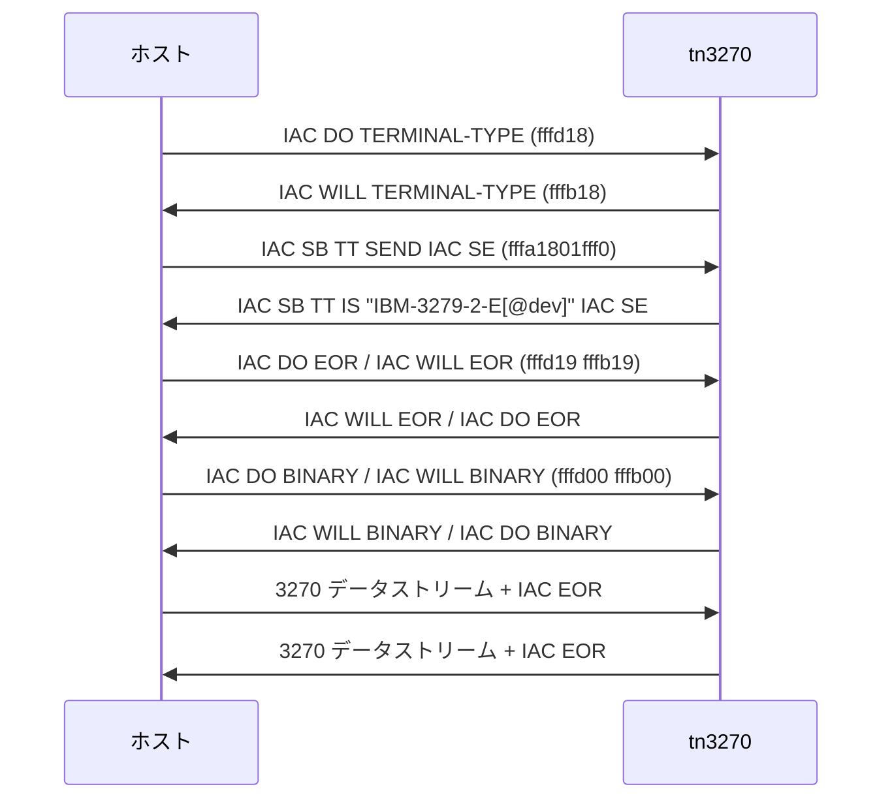
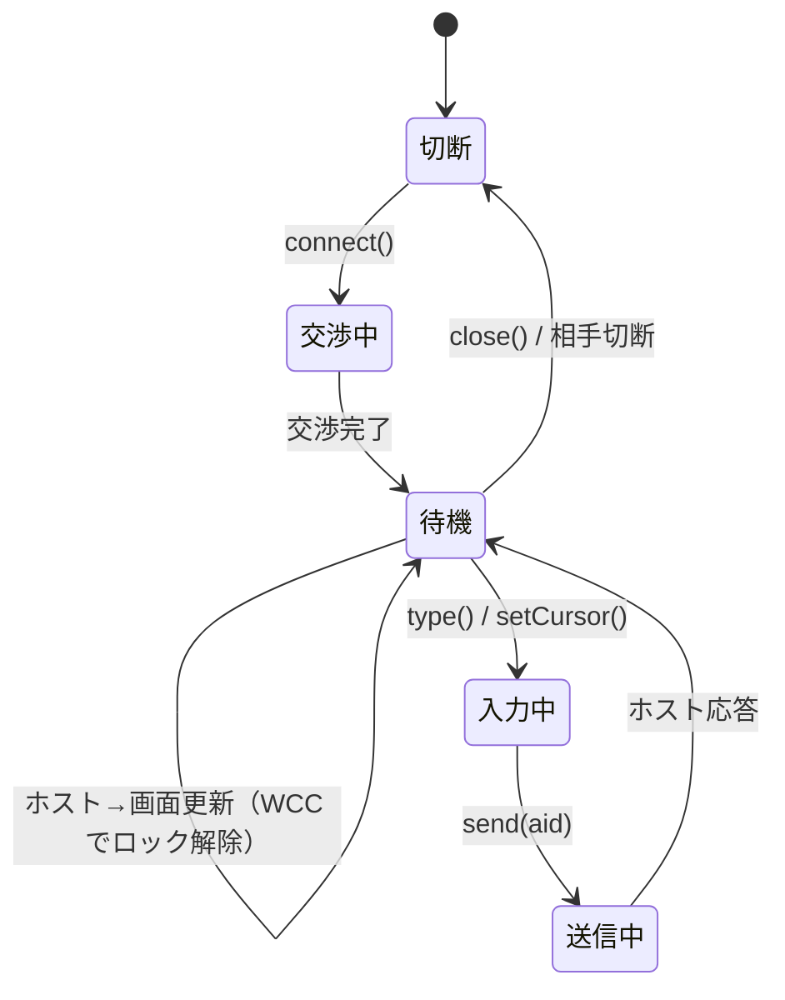

# 仕様: 3270 エミュレータ（TN3270 表示セッション・ライブラリ層）

## 概要

`@ts5250/tn3270` を新規パッケージとして起こし、**基本 TN3270（RFC 1576）の表示セッション**を実装する。
`research.md` で実測した事実（交渉バイト列・バッファ表現・DBCS の桁占有）を仕様の根拠とする。

構成は `@ts5250/tn5250` と同じ 5 層（transport / telnet / protocol / screen / session）に揃えるが、
**コードは共有しない**（依存方向の規約上 tn5250 と同位・相互非依存）。

## 設計方針

### D1: telnet 層は tn5250 と共有せず、tn3270 に独自に持つ

実測（`research.md` F2）で合意するオプションが違う:

| | 5250 | 3270 |
|---|---|---|
| TERMINAL-TYPE(24) | 使う | 使う |
| END-OF-RECORD(25) | 使う | 使う |
| BINARY(0) | 使う | 使う |
| **SGA(3)** | **使う** | **使わない** |
| **NEW-ENVIRON(39)** | **使う**（RFC 4777 自動サインオン） | **使わない** |
| レコードヘッダ | **GDS ヘッダあり**（LL/type=12A0/opcode） | **無し**（telnet の直下がデータストリーム） |

構造が似ているのは telnet の枠組みだけで、**中身は別物**。AGENTS.md の
「片方しか使わないものは、使う側に置く」に従い複製する。共通化するなら 2 例目が揃ってからにする。

### D2: `transport/` は複製する（base に降ろさない）

TCP / TLS の薄い抽象（`Transport` インターフェース）は tn5250 と同型になる見込みだが、
**今回は複製する**。`@ts5250/base` へ降ろすと `base` が `node:net` / `node:tls` を持つことになり、
「`base` は依存ゼロ」という現在の不変条件（`dependency-direction.test.ts` が
`base` / `ebcdic` の `dependencies` が空であることを検査）を壊す。

括るとしても `base` ではなく別パッケージ（例 `@ts5250/transport`）を起こす話になるため、
**この work のスコープ外**とし、decisions に「2 例目が揃った・実装が一致した」時点で
再検討する旨を残す。

### D3: 画面バッファは 3270 固有として新規に作る

3270 と 5250 でバッファの根本が違う:

- **3270**: フィールド属性が**バッファ内の 1 桁を占める**（`SF` オーダーが書いた位置がその桁）。
  フィールドは「次の属性桁の直前まで」で暗黙に終わる。
- **5250**: 属性は画面バッファとは別に管理される（`screen/attr-sentinel.ts` の仕組み）。

`packages/tn5250/src/screen/buffer.ts`（1,047 行）は流用しない。**型の形だけ揃える**（D4）。

### D4: スナップショット型は tn5250 と「同じ形」で新規定義する

`packages/tn5250/src/screen/types.ts` の `Cell` / `CellKind` は
`"sbcs" | "dbcs-lead" | "dbcs-tail" | "so" | "si" | "attr"` を持ち、
**実測した 3270 のバッファ表現とそのまま対応する**（`research.md` F5:
DBCS は 2 桁・SO/SI は各 1 桁・属性は 1 桁）。

しかし tn3270 は tn5250 に依存できないため、**同じ形の型を tn3270 に新規定義する**。
`base` へ移す案は、`tn5250` 側の既存型を動かすことになり requirement の
「5250 側の既存挙動の変更はしない」に反するので採らない。

> **意図的な重複**である。将来 web-ui が両方を描くときに `base` へ括る候補になるので、
> **形を意図的に一致させておく**（フィールド名・列挙値を揃える）。decisions に残す。

### D5: 標準サイズと代替サイズを最初からモデル化する

RFC 1576 の直読で確定（`research.md` F3）:

- **標準サイズは常に 24x80**。モデル番号は**代替サイズ**を指定する。
- モデル 2 = 24x80（標準と同じ）/ 3 = 32x80 / 4 = 43x80 / 5 = 27x132。
- `EW`（Erase/Write）は標準サイズ、`EWA`（Erase/Write Alternate）は代替サイズで書く。
- `-E` サフィックス＝拡張データストリーム（構造化フィールド）対応の申告。
- **`3279` 系は拡張属性対応、`3278` 系は非対応。**

**`s3270` はこの区別を報告に反映しない**（EW/EWA どちらでもモデル最大で見せる。実測）。
よって s3270 との桁単位照合は**代替サイズ側に揃えて**行い、
「EW で標準サイズに戻る」ことは自実装の内部状態と実ホストで確かめる。

### D6: 照合は三層で行う

| 層 | 手段 | 何を固定するか |
|---|---|---|
| 実ホスト | docker TK4-（MVS 3.8j） | 交渉・実データストリーム・AID 往復・TSO 到達 |
| 参照クライアント | `s3270 -httpd` の `ReadBuffer(Ebcdic)` | セル単位の文字・属性の一致（**DBCS 含む**） |
| 回帰資産 | trace fixture の replay | 言語非依存の固定（5250 と同じ方式） |

DBCS は実ホストから出てこない（TK4- は英語 SBCS 専用）ため、
**DBCS の回帰は必ず自作データストリーム側**に置く。

## 対象範囲

### 追加（新規パッケージ）

```
packages/tn3270/
  package.json          exports に "." と "./browser"、deps は base / ebcdic のみ
  tsconfig.json         composite / references: base, ebcdic
  vitest.config.ts
  src/
    index.ts            Node 向け入口（transport を含む）
    browser.ts          ブラウザ向け入口（node:* を含まない）
    transport/
      types.ts          Transport インターフェース（tn5250 と同型・D2）
      tcp.ts            node:net / node:tls（**node:* はこのディレクトリのみ**）
    telnet/
      constants.ts      IAC/DO/WILL/SB/SE/EOR、OPT_TT=0x18 / OPT_EOR=0x19 / OPT_BIN=0x00
      telnet.ts         基本 TN3270 の交渉（D1）。IAC 二重化のエスケープ処理
      terminal-type.ts  モデル→端末タイプ名、`@<装置番号>` の付与
    protocol/
      constants.ts      コマンド・オーダー・AID・WCC のコード
      address.ts        バッファアドレス 12/14/16 ビット符号化・復号
      inbound.ts        ホスト→端末のデータストリーム解釈
      outbound.ts       端末→ホスト（Read Modified / Read Buffer 応答）の生成
    screen/
      types.ts          Cell / CellKind / Field / ScreenSnapshot（D4）
      buffer.ts         3270 バッファ（属性が桁を占める・DBCS 2 桁・SO/SI 1 桁）
      attributes.ts     基本属性バイト・拡張属性（SFE/SA/MF）の解釈
    session/
      aid-keys.ts       AID コード ⇔ キー名
      emitter.ts        イベント
      session.ts        接続・状態機械・入力・AID 送信
    trace/
      trace.ts, replay.ts   送受信バイトの記録・再生
  test/
    ...                 単体テスト
    harness/
      mini3270.ts       検証用の最小 TN3270 サーバ（DBCS 回帰の要）
    fixtures/*.jsonl    言語非依存の trace
```

### 変更（既存・いずれも小さい）

- `packages/tn5250/test/dependency-direction.test.ts`
  - `LAYERS` に `"tn3270"` を追加
  - `SIBLINGS` に `["tn5250","tn3270"]` と `["hostserver","tn3270"]` を追加
- `eslint.config.js` — `no-restricted-imports` / `no-restricted-globals` の対象に `tn3270` を追加
- `tsconfig.json`（root）— project references に `packages/tn3270` を追加
- `scripts/` — TK4- の起動・停止・s3270 イメージ構築のスクリプト（`scripts/README.md` に追記）

> `package.json` の `workspaces` は `packages/*` なので**変更不要**。

## インターフェース / データ構造

### 接続オプション

```ts
export interface Connect3270Options {
  host: string;
  port?: number;            // 既定 23（TLS 時 992）
  tls?: boolean;            // 証明書検証は既定 ON
  /** 端末モデル。代替サイズを決める（D5） */
  model?: 2 | 3 | 4 | 5;    // 既定 2
  /** 拡張属性の有無。3279=対応 / 3278=非対応（RFC 1576） */
  terminalFamily?: "3278" | "3279";   // 既定 3279
  /** 拡張データストリーム（構造化フィールド）対応を申告する `-E` */
  extended?: boolean;       // 既定 true
  /** 装置指定。端末タイプ文字列に `@<値>` を付ける（実測: Hercules が受理） */
  deviceName?: string;      // 例 "03C0"
  /** 画面文字の CCSID。既定 37。930/939 で DBCS */
  ccsid?: number;
}
```

端末タイプ文字列は `IBM-<family>-<model>[-E][@<deviceName>]` で組み立てる
（実測値: `IBM-3279-2-E`、`IBM-3279-2-E@03C0`）。

### 画面スナップショット（D4）

```ts
export type CellKind = "sbcs" | "dbcs-lead" | "dbcs-tail" | "so" | "si" | "attr";

export interface Cell {
  char: string;          // attr / so / si は常に " "
  kind: CellKind;
  color: ScreenColor;
  intensified: boolean;
  reverse: boolean;
  underline: boolean;
  nonDisplay: boolean;
  rawByte?: number;      // SBCS セルの生 EBCDIC バイト
}

export interface Field {
  index: number;         // 1 始まり・画面順
  row: number; col: number;   // フィールド先頭（属性桁の次）。1 始まり
  length: number;
  protected: boolean;
  numeric: boolean;
  hidden: boolean;       // 非表示（パスワード等）
  modified: boolean;     // MDT
}

export interface ScreenSnapshot {
  rows: number; cols: number;      // 現在有効なサイズ（標準 or 代替。D5）
  alternate: boolean;              // 代替サイズで動作中か
  cursor: { row: number; col: number };
  cells: Cell[][];
  fields: Field[];
  keyboardLocked: boolean;
}
```

### セッション

```ts
export declare class Tn3270Session {
  connect(opts: Connect3270Options): Promise<void>;
  snapshot(): ScreenSnapshot;
  /** 非保護フィールドへ文字入力（MDT を立てる） */
  type(text: string): void;
  setCursor(row: number, col: number): void;
  /** AID キー送信。Read Modified 応答を組み立てて送る */
  send(aid: AidKey): Promise<void>;
  close(): void;
  on(event: "screen" | "close" | "error", fn: (...a: unknown[]) => void): void;
}

export type AidKey =
  | "enter" | "clear" | `pf${1|2|3|/*…*/24}` | "pa1" | "pa2" | "pa3" | "sysreq";
```

## 振る舞いの詳細

### 1. telnet ネゴシエーション（実測どおり・RFC 1576 と一致）



- **SGA / NEW-ENVIRON は扱わない**（来たら DONT/WONT で断る）。
- レコード境界は `IAC EOR`（`FF EF`）。**SB 本文中の `IAC`(FF) は二重化**して送り、受信時は戻す。
- 装置が使えない場合、ホストは 3270 データストリームで理由を返す
  （実測: `HHC01030I Connection rejected, device 0700 unavailable`）。**接続は成功扱いのまま
  画面にメッセージが出る**ので、telnet 層でエラーにしない。

### 2. データストリーム（ホスト→端末）

先頭 1 バイトがコマンド、続いて WCC（コマンドにより）、以降はオーダーとデータの並び。

| コマンド | 値 | 動作 |
|---|---|---|
| Write | `F1` | 消さずに書く |
| Erase/Write | `F5` | **標準サイズ**で消して書く（D5） |
| Erase/Write Alternate | `7E` | **代替サイズ**で消して書く（D5） |
| Erase All Unprotected | `6F` | 非保護欄を消し MDT を落とす |
| Read Buffer | `F2` | バッファ全体を返す |
| Read Modified | `F6` | 変更欄を返す |
| Read Modified All | `6E` | 変更欄を返す（全 AID 扱い） |
| Write Structured Field | `F3` | 構造化フィールド（**今回は最小限**。下記） |

| オーダー | 値 | 動作 |
|---|---|---|
| SF  | `1D` | フィールド開始。**属性が 1 桁を占める** |
| SFE | `29` | 拡張属性つきフィールド開始（属性対の並び） |
| SBA | `11` | バッファアドレス設定（12/14/16 ビット） |
| SA  | `28` | 以降の文字に拡張属性を適用 |
| MF  | `2C` | 既存フィールドの属性を変更 |
| IC  | `13` | カーソル位置を現在アドレスに |
| PT  | `05` | 次の非保護欄へ |
| RA  | `3C` | 指定アドレスまで文字を繰り返す |
| EUA | `12` | 指定アドレスまで非保護欄を消す |
| GE  | `08` | 次の 1 文字を拡張文字集合として扱う |

**バッファアドレス符号化**（実測で確認）: 12 ビット形式は 6 ビット値を
`40, C1..C9, 4A..4F, 50, D1..D9, 5A..5F, 60, 61, E2..E9, 6A..6F, F0..F9, 7A..7F`
の 64 要素表で符号化する（`11 40 40` → 0、`11 C1 50` → 80）。
先頭バイトの上位 2 ビットが `00` なら 14 ビット形式、それ以外は 12 ビット形式として復号する。
16 ビット形式は代替サイズが 4,096 桁を超える場合に用いる。

**〔訂正〕WSF は「読み飛ばす」ではなく実装した。** 当初はスコープ外に置いたが、
**IBM i は WSF Query に応答しないと画面を出さず、画面本体も `Outbound 3270DS` として
WSF に包んで送ってくる**（deliver 後の実測で判明）。したがって次を実装した:
`Read Partition Query` への Query Reply、`Outbound 3270DS` の展開、`Set Reply Mode` の受理。
グラフィックス・Programmed Symbols は引き続き対象外。

**〔追記〕コマンドコードは 2 系統ある。** EBCDIC 系（Hercules）と SNA 系（IBM i）。
`normalizeCommand()` で吸収する（decisions D11）。

### 3. バッファモデル（実測に基づく・D3）

```
桁:      0     1     2     3     4     5     6     7     8
       [attr][ A ][ B ][ C ][ SO ][日 ][日 ][ SI ][ D ]
kind:   attr  sbcs  sbcs  sbcs   so   lead  tail   si   sbcs
```

- **フィールド属性は 1 桁を占める**。その桁の文字は空白として描く。
- **DBCS 1 文字は 2 桁を占める**（`dbcs-lead` + `dbcs-tail`）。
- **SO(0x0E) / SI(0x0F) はそれぞれ 1 桁を占める**（実測: 画面上も 1 桁空く）。
- フィールドは属性桁の次から、**次の属性桁の直前**まで。
- 属性桁が 1 つも無い画面は「非フォーマット」で、全体が 1 つの非保護領域として扱う。

**基本フィールド属性バイト**（`SF` の引数・`SFE` の `c0` 種別）:
保護 / 数字 / 表示強度（通常・強調・非表示）/ MDT のビットを持つ。
ビット割り当ては実装時に RFC 1576 と `s3270` の `ReadBuffer` 出力で突き合わせて確定する
（実測値の例: Hercules が送る `SF(c0=e0)` / `SF(c0=e8)`）。

### 4. 入力と AID 送信



- `type()` は**非保護フィールドにのみ**書き、書いた欄の **MDT を立てる**。
  保護欄・キーボードロック中は拒否する（`As400Error`）。
- `send(aid)` は **Read Modified 応答**を組み立てる:
  `AID(1) + カーソルアドレス(2) + [SBA(11) + アドレス(2) + フィールドデータ] × MDT が立つ欄` + `IAC EOR`。
  SBA が指すのは**欄の中身の先頭**（属性桁の次）。**subtask 03 で s3270 の送信バイトと突き合わせて確認済み**
  （`7d 4b5d 1140c1 c1c2 114b5b e9e9`）。
- **〔訂正〕PA1〜PA3 と Clear は AID 1 バイトだけ**——当初「AID とカーソルアドレスのみ」と書いたが、
  実測ではカーソルアドレスすら送らない（`6c` / `6e` / `6b` / `6d`）。
- **〔追記〕非フォーマット画面（属性桁が 1 つも無い）では SBA を出さない**。
  `AID + カーソル + 画面の中身` になる（実測）。Clear の直後がこの状態。
- 送信後はキーボードをロックし、ホストの応答（WCC の restore ビット）で解除する。

### 5. DBCS（実測に基づく）

- ホストから届いた `SO` 以降 `SI` までを DBCS 区間として扱い、2 バイトずつ
  `@ts5250/ebcdic` の `codecForCcsid(ccsid).decodeDbcsPair()` で Unicode に変換する。
- **EBCDIC 変換は `@ts5250/ebcdic` をそのまま使う**（変更不要。cp930 が `s3270` と
  一致することを実測済み）。
- ブラウザ入口からは**狭い入口**（`@ts5250/ebcdic/codec`）を使い、バレル経由にしない
  （AGENTS.md: バレルは変換表 18,900 行を全部引き込む）。

## ドメイン固有の考慮

- **原典主義**: 各モジュール冒頭に対応する原典（RFC 1576 の該当節・実測トレースのファイル名）を
  参照コメントで残す。`s3270` は BSD-3-Clause だが**コードは移植せず事実として書き起こす**。
- **層規約**: `node:*` の import と `Buffer` / `process` 等のグローバル参照は `transport/` のみ。
  eslint の対象に `tn3270` を追加して機械的に強制する。
- **依存方向**: `tn3270` は `base` / `ebcdic` のみに依存。`dependency-direction.test.ts` の
  `LAYERS` / `SIBLINGS` に足すことで、**宣言と実 import の双方向一致**まで自動検査される。
- **ログ**: `@ts5250/base` の sink 経由（既定 no-op）。`console.*` は禁止。
- **ブラウザ入口**: `browser.ts` は `transport/tcp.ts` を含めない。
- **秘密**: トレース・fixture に実資格情報を残さない。TK4- の既定ユーザーは
  公開サンドボックスの既定値だが、**成果物には書かない**。

## エラー処理 / 異常系

| 事象 | 扱い |
|---|---|
| 交渉中に相手が切断 | `As400Error`（接続失敗）。理由を添える |
| 未知の telnet オプション | `DONT` / `WONT` で断る（落とさない） |
| 未知のコマンド / オーダー | **落とさず記録して読み飛ばす**。trace に残し、後から追える形にする |
| 不正なバッファアドレス（範囲外） | 画面サイズで丸めず**エラーとして記録**し、そのオーダーを無視する |
| 装置が使えない | telnet は成功。ホストが画面でメッセージを返す（実測）。**エラーにしない** |
| 保護欄への入力 / ロック中の入力 | `As400Error`。画面は変えない |
| DBCS の変換不能 | 5250 と同じ扱いに揃える（置換して記録。`substituted` を数える） |
| SO と SI の対応が壊れている | 記録して、SI が来るまで DBCS 区間として扱う |

## 受け入れ基準との対応

| requirement の完了条件 | 満たし方 |
|---|---|
| TK4- が起動し s3270 で TSO まで到達 | **research で実証済み**。`scripts/` に起動手順を落とす（装置 `03C0`） |
| 自実装が s3270 と同じ画面内容を構築 | `ReadBuffer(Ebcdic)` の出力と `snapshot()` をセル単位で比較するテスト（D6） |
| AID 送信でホストが応答し画面が遷移 | TK4- 相手に Enter / PF を送る結合テスト。**research で往復は確認済み** |
| Read Modified のバイト列が s3270 と一致 | s3270 と自実装に同じ入力を与え、送信バイトを trace で突き合わせる |
| DBCS が s3270（cp930/cp939）と一致 | `mini3270` で DBCS を流し、双方の `ReadBuffer` を比較。**research で経路実証済み** |
| アドレス符号化 12/14/16 の相互変換 | `protocol/address.ts` の単体テスト（境界値・往復） |
| trace fixture の replay で回帰資産化 | `trace/replay.ts` ＋ `test/fixtures/*.jsonl` |
| tn3270 が tn5250 に依存しない | `dependency-direction.test.ts` に 2 行追加（宣言と実 import の双方向一致まで検査） |
| build / lint / test が通る | root `npm run build` / `npm run lint` / 各パッケージ `npm test` |

## 残す判断（decisions.md に記録する）

- **D2**: `transport/` を複製した理由（`base` は依存ゼロを不変条件にしている）と、
  括るなら別パッケージという方針。
- **D4**: スナップショット型を意図的に重複させた理由と、形を揃えてある事実。
- **D5**: 標準／代替サイズを持つが、`s3270` は区別しないため照合を代替側に揃える判断。
