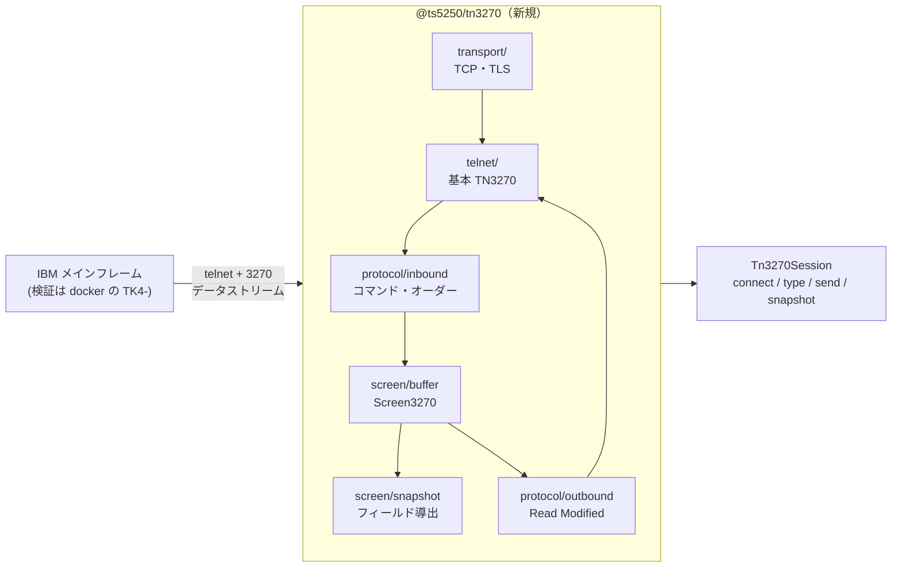
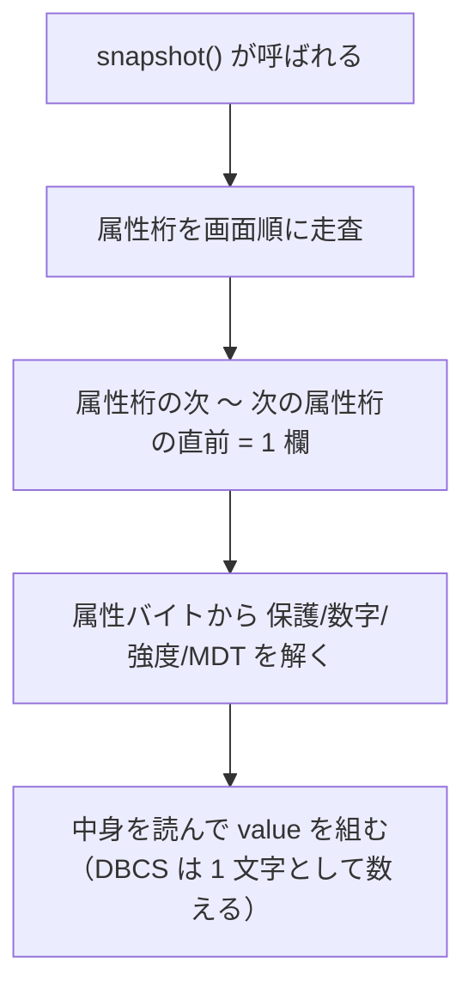
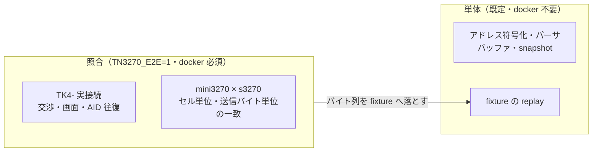

# レビューガイド: 3270 エミュレータ（TN3270 表示セッション）

PR を読む人向けの解説。**どこを重点的に見ればよいか**と、**なぜそう作ったか**を先に示す。

## この PR で何ができるようになったか

IBM メインフレームの **3270 端末**として接続し、画面を組み立て、キーを送れるようになった。
日本語 DBCS を含む。ライブラリ層（`@ts5250/tn3270`）までで、web-ui / MCP への露出は別 work。



## 重点的に見てほしい 4 点

### 1. 定数がすべて実測で決まっていること（`protocol/constants.ts`）

**この PR で最も特徴的な部分。** コマンド・オーダー・WCC・属性ビット・色・AID の値は
**推測でも記憶でもなく、`s3270` に実際に食わせて確定させた**。

手法: `s3270` の `-trace` は受信ストリームを `StartField(protected)` のように
**意味へ復号して残す**。そこで既知のバイトを流して復号結果を読んだ。

```
0x01 → modified      0x08 → intensified     0x20 → protected
0x04 → detectable    0x0C → nondisplay      0x10 → numeric
0xF0 → protected,skip   ← **保護＋数字＝自動スキップ**
0x02 / 0x40 / 0x80 → default   ← **意味を持たない埋めビット**
```

採取したトレースは `.aidev/works/20260815-tn3270-emulator/artifacts/` に残してある。
**レビューではコメントの根拠表と実装が食い違っていないか**を見てほしい。

### 2. 画面バッファの表現（`screen/buffer.ts`）— 5250 と根本的に違う

3270 は**フィールド属性がバッファの 1 桁を占める**。5250（属性を別管理）とは別物なので、
`@ts5250/tn5250` の `buffer.ts`（1,047 行）は流用していない。

```
桁:      1     2    3    4    5     6     7     8     9
       [attr][ A ][ B ][ C ][ SO ][ 日        ][ SI ][ D ]
kind:   attr  sbcs sbcs sbcs   so   lead  tail   si   sbcs
```

**フィールドは保持していない。** `snapshot()` のたびに属性桁を走査して導出する。



**なぜ増分管理にしないのか**: `MF`（属性の書き換え）・`RA`（属性桁の上書き）・`EW`（全消去）が
絡むと組み合わせが爆発する。3,564 桁の線形走査は無視できる費用で、**正しさを構造で担保できる**。
`decisions.md` D8 に背景。

**MDT も属性桁のビットに持つ**（実機と同じ）。別のフラグ配列は作っていない——真実を 1 箇所に閉じるため。

### 3. Read Modified の形（`protocol/outbound.ts`）— **一度間違えた箇所**

ここは**コメントを併せて読んでほしい**。

```
フォーマット画面:   7d 4b5d | 11 40c1 | c1c2 | 11 4b5b | e9e9
                   AID カーソル  SBA(1)   "AB"  SBA(731)  "ZZ"
非フォーマット画面: 7d 40c3 | c1c2                    ← SBA を出さない
PA1 / Clear:       6c / 6d                           ← **AID 1 バイトだけ**
```

**経緯**: 最初の探針でキーを総当たりした際、末尾で `Clear()` を押していた。Clear は画面を消すので
**以後は非フォーマット画面**になり、そこへの入力は確かに SBA 無しで送られる。
その状態を測って「s3270 は SBA を出さない」と結論し、そう実装してしまった。
入力を伴う照合テストを足して初めて発覚した。

> **教訓として `outbound.ts` のコメントと `decisions.md` に残してある**——
> 実測は「何を測ったか」まで確かめないと、数字が付いている分だけ**推測より危険**になる。

### 4. DBCS の桁勘定（`screen/snapshot.ts`）

**保持は生バイト、意味は導出**。`SO`(0x0E) 〜 `SI`(0x0F) を 2 バイトずつ畳んで 1 文字にする。

```
0e | 45 62 | 45 66 | 48 e7 | 46 c0 | 48 53 | 0f
SO |  日   |  本   |  語   |  表   |  示   | SI
```

**subtask 04 でバグを 2 件直した**（`protocol/inbound.ts`）:

1. `SO` / `SI` が「0x40 未満＝未知のオーダー」と判定されて**捨てられていた**
   → 日本語が SBCS のカタカナとして 1 桁ずつ描かれる（`日本語` が `､ｱ､ｲ､ｳ` になる）
2. **DBCS 区間の中でオーダー解釈していた** → DBCS のバイト対は 0x40 未満も取りうるので画面が壊れる

**レビューでは `inDbcs` の状態が 1 レコード内に閉じているか**を見てほしい
（パーサの無状態性＝`decisions.md` D9 を壊していないこと）。

## 検証の作り（レビューで信頼してよい根拠）



**一致を確認した中身**:

| 何を | 結果 |
|---|---|
| 画面の組み立て | 属性桁 **156 箇所**と表示 **24 行**が s3270 と完全一致 |
| 送信バイト | enter / pf1 / pa1 / **入力あり Enter** の 4 ケースで一致 |
| 日本語 | **cp930 と cp939 の両方**で表示 24 行が完全一致 |

**空振り対策**を各所に入れてある（比較前に「日本語が実際に描かれていること」「属性桁が 0 件でないこと」
「符号化の `substituted` が 0 であること」を確認）。照合テストが空同士を比べて緑になる事故を防いでいる。

## 既存コードへの影響（**+25 行 −6 行**）

| ファイル | 変更 |
|---|---|
| `tsconfig.json` | project references に 1 エントリ |
| `eslint.config.js` | `node:*` 禁止の対象に `tn3270` を追加。**あわせて `core` → `tn5250` の陳腐化を修正** |
| `dependency-direction.test.ts` | `LAYERS` に 1 語、`SIBLINGS` に 2 行 |
| `scripts/README.md` | 3270 の検証環境への参照 1 段落 |

> **`eslint.config.js` の修正は既存不具合の是正**。glob が `packages/core/src/**` を指したままで、
> `core → tn5250` の改名（`20260802-rename-ts5250`）に追随しておらず、
> **tn5250 への `node:*` 禁止ガードが効いていなかった**。違反は 0 件だったので lint は緑のまま直せた。

**`@ts5250/tn5250` の実装には触れていない。**

## 動かして確かめるには

```sh
sh packages/tn3270/test/harness/testenv.sh up   # TK4- 起動（IPL 完了まで待つ・約 45 秒）
cd packages/tn3270 && TN3270_E2E=1 npx vitest run
sh test/harness/testenv.sh down
```

`testenv.sh up` は**往復が成立するまで待つ**（接続 → 画面 → Enter → 応答）。
待機条件を 3 回外した経緯はスクリプトのコメントに書いてある。

## レビューで判断してほしいこと

1. **重複の許容**（`decisions.md` D2 / D7）: `ByteReader` / `Transport` / `Emitter` を
   tn5250 と重複させた。`base` へ括ると「`base` は依存ゼロ」の不変条件を壊すため。
   **deliver 後に同一なら括る**方針でよいか。
2. **実ホストでの入力往復が未達**: TK4- に入力を受け付ける画面が無い。
   送信バイトの正しさは s3270 との一致で担保しているが、**z/OS での確認が要る**。
   この状態で develop へ入れてよいか。
3. **スコープの区切り**: TN3270E・プリンター・web-ui 露出は次の work。この単位でよいか。
